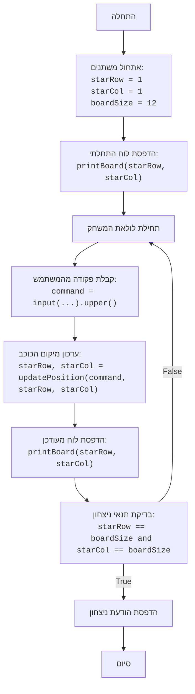

## <algorithm>

1. **אתחול משתנים:**
   - `starRow` = 1, `starCol` = 1: מיקום ההתחלתי של הכוכב בפינה השמאלית העליונה של הלוח (1,1).
   - `boardSize` = 12: גודל הלוח הוא 12x12.
   *דוגמה:*
   ```python
   starRow = 1
   starCol = 1
   boardSize = 12
   ```
2. **פונקציה `printBoard(starRow, starCol)`:**
   - הפונקציה מקבלת את מיקום הכוכב הנוכחי (`starRow`, `starCol`).
   - הפונקציה עוברת על כל השורות והעמודות של הלוח.
   - אם השורה והעמודה הנוכחית תואמות למיקום הכוכב, היא מדפיסה כוכב `*`, אחרת היא מדפיסה נקודה `.`.
   - הפונקציה מדפיסה את הלוח עם מיקום הכוכב הנוכחי.
    *דוגמה:*
     אם `starRow` הוא 1 ו-`starCol` הוא 1, הפלט יהיה:
     ```
     *...........
     ............
     ............
     ............
     ............
     ............
     ............
     ............
     ............
     ............
     ............
     ............
     ```
3. **פונקציה `updatePosition(command, starRow, starCol)`:**
   - הפונקציה מקבלת את הפקודה (`command`) ומיקום הכוכב הנוכחי (`starRow`, `starCol`).
   - היא מעדכנת את מיקום הכוכב בהתאם לפקודה:
        - אם הפקודה היא 'R' (ימין) והכוכב לא נמצא בקצה הימני של הלוח, מגדילה את `starCol` ב-1.
        - אם הפקודה היא 'L' (שמאל) והכוכב לא נמצא בקצה השמאלי של הלוח, מקטינה את `starCol` ב-1.
        - אם הפקודה היא 'U' (למעלה) והכוכב לא נמצא בקצה העליון של הלוח, מקטינה את `starRow` ב-1.
        - אם הפקודה היא 'D' (למטה) והכוכב לא נמצא בקצה התחתון של הלוח, מגדילה את `starRow` ב-1.
    - הפונקציה מחזירה את מיקום הכוכב החדש (`starRow`, `starCol`).
     *דוגמה:*
     אם `command` הוא 'R', `starRow` הוא 1 ו-`starCol` הוא 1, הפלט יהיה `(1, 2)`.
4. **הדפסת לוח התחלתי:**
    - קוראת לפונקציה `printBoard` להדפיס את הלוח עם המיקום ההתחלתי של הכוכב.
5. **לולאה ראשית:**
    - הלולאה מתחילה ורצה עד שהמשחק מסתיים.
    - מבקשת מהמשתמש להזין פקודה (R/L/U/D) וממירה אותה לאותיות גדולות.
     *דוגמה:* אם המשתמש מזין 'r', הפקודה תהיה 'R'.
    - מעדכנת את מיקום הכוכב על ידי קריאה לפונקציה `updatePosition` עם הפקודה והמיקום הנוכחי.
    - מדפיסה את הלוח המעודכן על ידי קריאה לפונקציה `printBoard` עם מיקום הכוכב המעודכן.
    - בודקת אם הכוכב הגיע לפינה הימנית התחתונה של הלוח (12,12).
        - אם כן, מודפסת הודעת ניצחון והלולאה מסתיימת.
        - אחרת, הלולאה ממשיכה לפעול.

## <mermaid>

## <explanation>
**ייבואים (Imports)**:
- אין ייבוא מיוחד בקוד הזה.

**משתנים (Variables)**:

*   `starRow`: משתנה מסוג `int` שמייצג את השורה הנוכחית של הכוכב בלוח. הוא מאותחל ל-1.
*   `starCol`: משתנה מסוג `int` שמייצג את העמודה הנוכחית של הכוכב בלוח. הוא מאותחל ל-1.
*   `boardSize`: משתנה מסוג `int` שמייצג את גודל הלוח. הוא מאותחל ל-12.
*   `command`: משתנה מסוג `str` שמכיל את הפקודה שהמשתמש הזין (R/L/U/D).

**פונקציות (Functions)**:

*   **`printBoard(starRow, starCol)`**:
    *   **פרמטרים**: `starRow` (int), `starCol` (int).
    *   **ערך מוחזר**: אין.
    *   **מטרה**: הפונקציה מדפיסה את הלוח למסך, כאשר הכוכב מסומן ב-* והשאר בנקודות.
    *   **דוגמה לשימוש**: `printBoard(1, 1)` תדפיס את הלוח עם הכוכב בפינה השמאלית העליונה.
*   **`updatePosition(command, starRow, starCol)`**:
    *   **פרמטרים**: `command` (str), `starRow` (int), `starCol` (int).
    *   **ערך מוחזר**: `tuple` של `(starRow, starCol)`.
    *   **מטרה**: הפונקציה מעדכנת את מיקום הכוכב בהתאם לפקודה שמתקבלת. היא מוודאת שהכוכב לא יוצא מגבולות הלוח.
    *   **דוגמה לשימוש**: `updatePosition('R', 1, 1)` תחזיר `(1, 2)`.

**מחלקות (Classes)**:
- אין מחלקות בקוד הזה.

**הסברים מפורטים**:

1.  **אתחול משתנים**: המשתנים `starRow`, `starCol` ו-`boardSize` מאותחלים בהתחלה כדי להגדיר את המצב ההתחלתי של המשחק.
2.  **פונקציה `printBoard`**: הפונקציה מקבלת את מיקום הכוכב הנוכחי ומדפיסה את הלוח. היא עוברת על כל השורות והעמודות של הלוח ומדפיסה כוכב במקום שבו הוא נמצא, ונקודות בשאר המקומות.
3.  **פונקציה `updatePosition`**: הפונקציה מקבלת את הפקודה מהמשתמש ומעדכנת את מיקום הכוכב בהתאם. היא בודקת שהכוכב לא יוצא מגבולות הלוח לפני עדכון המיקום.
4.  **לולאה ראשית**: הלולאה הראשית של המשחק רצה עד שהמשתמש מנצח. בכל איטרציה, היא מבקשת פקודה, מעדכנת את מיקום הכוכב, מדפיסה את הלוח המעודכן ובודקת אם הכוכב הגיע לפינה הימנית התחתונה של הלוח.
5. **סיום המשחק**: כאשר הכוכב מגיע לפינה הימנית התחתונה של הלוח, המשחק מסתיים ומודפסת הודעת ניצחון.

**בעיות אפשריות ותחומים לשיפור**:

*   **בדיקת קלט**: אין בדיקה תקינה לקלט מהמשתמש. אם המשתמש מזין פקודה לא חוקית (שאינה R, L, U, D), הפונקציה `updatePosition` לא תעשה כלום, אך תמשיך לפעול. צריך להוסיף בדיקת קלט כדי למנוע בעיות.
*   **משחקיות**: המשחק פשוט יחסית. ניתן להוסיף אלמנטים נוספים כדי להפוך אותו למעניין יותר, כמו מכשולים בלוח או מספר מהלכים מוגבל.

**שרשרת קשרים עם חלקים אחרים בפרויקט**:
- לקוד הזה אין תלות בקוד אחר בתוך הפרויקט. הוא עומד בפני עצמו ומבצע פעולות בסיסיות כמו קלט מהמשתמש, הדפסה ועדכון משתנים.

זהו ניתוח מפורט של הקוד, כולל כל הפרטים הנדרשים.