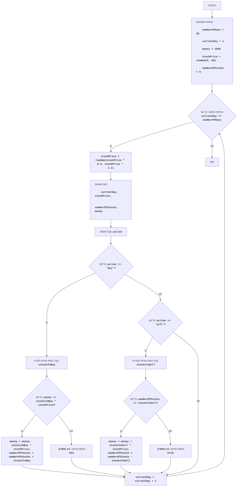

## ניתוח קוד: משחק מניות

### 1. <algorithm>
**תרשים זרימה של אלגוריתם המשחק "מניות":**

1.  **אתחול משתנים:**
    *   `numberOfDays` = 20 (מספר ימי המשחק).
    *   `currentDay` = 1 (היום הנוכחי).
    *   `money` = 1000 (סכום הכסף ההתחלתי).
    *   `stockPrice` = מספר אקראי בין 5 ל-50 (מחיר מניה התחלתי).
    *   `numberOfStocks` = 0 (מספר המניות שיש לשחקן).
    
2.  **הצגת הודעת פתיחה וסטטוס התחלתי:**
    *   הדפסת הודעת פתיחה למשחק.
    *   הדפסת סטטוס התחלתי: "יום 1, מחיר מניה: `stockPrice`, מניות: 0, כסף: 1000".
    
3.  **לולאת המשחק (לכל יום):**
    *   כל עוד `currentDay` קטן או שווה ל-`numberOfDays`:
        1.  **עדכון מחיר המניה:**
            *   `stockPrice` = מחיר אקראי בין 90% ל-110% מהמחיר הנוכחי (מעוגל ל-2 ספרות אחרי הנקודה).
            * לדוגמה: אם המחיר הנוכחי הוא 20, המחיר החדש יהיה בין 18 ל-22, למשל 20.56.
        2.  **הצגת סטטוס נוכחי:**
            *   הדפסת הסטטוס הנוכחי: "יום `currentDay`, מחיר מניה: `stockPrice`, מניות: `numberOfStocks`, כסף: `money`".
        3.  **קבלת פעולה מהמשתמש:**
            *   שאלה: "לקנות (buy) או למכור (sell) מניות? או לחץ Enter כדי לעבור ליום הבא:".
            *   הקלט נקלט לתוך משתנה `action`.
        4.  **עיבוד הפעולה:**
             * אם `action` שווה ל-`buy`:
                1.  **קלט מספר מניות לרכישה:**
                     * שאלה: "כמה מניות לקנות?".
                     * הקלט נקלט לתוך משתנה `stocksToBuy`.
                2.  **בדיקת יתרת כסף:**
                    *   אם `money` גדול או שווה ל- `stocksToBuy` \* `stockPrice`, עבור לשלב 3.5.
                    *   אחרת: הדפס "אין מספיק כסף לקנייה". ודלג לשלב 3.6
                3.  **ביצוע רכישה:**
                     *  `money` =  `money` - `stocksToBuy` \* `stockPrice` .
                     *  `numberOfStocks` =  `numberOfStocks` + `stocksToBuy`.
                     *   הדפס "הקנייה בוצעה".
             * אחרת, אם `action` שווה ל-`sell`:
                1.  **קלט מספר מניות למכירה:**
                     * שאלה: "כמה מניות למכור?".
                     * הקלט נקלט לתוך משתנה `stocksToSell`.
                2.  **בדיקת כמות מניות:**
                    *   אם `numberOfStocks` גדול או שווה ל- `stocksToSell`, עבור לשלב 3.5.
                    *   אחרת: הדפס "אין מספיק מניות למכירה". ודלג לשלב 3.6
                3.  **ביצוע מכירה:**
                     * `money` = `money` + `stocksToSell` \* `stockPrice`.
                     *  `numberOfStocks` =  `numberOfStocks` - `stocksToSell`.
                     *   הדפס "המכירה בוצעה".
            * אחרת (אם המשתמש לחץ enter או הכניס משהו אחר): הדפס "עוברים ליום הבא".
        5.  **מעבר ליום הבא:**
             *  `currentDay` = `currentDay` + 1.
             *   הדפסת קו מפריד: "-------------".
4.  **סיום המשחק:**
    *   הדפסת הודעת סיום: "המשחק הסתיים!".
    *   הדפסת סטטוס סופי: "יום `currentDay - 1`, מחיר מניה: `stockPrice`, מניות: `numberOfStocks`, כסף: `money`".

### 2. <mermaid>

**הסבר תרשים זרימה:**

* **התחלה (Start):** תחילת ריצת התוכנית.
*   **אתחול משתנים (InitializeVariables):** הגדרת ערכים התחלתיים למשתנים `numberOfDays` (מספר ימי משחק), `currentDay` (היום הנוכחי), `money` (סכום כסף התחלתי), `stockPrice` (מחיר מניה התחלתי), ו-`numberOfStocks` (מספר מניות התחלתי).
*   **תחילת לולאה (GameLoopStart):** התחלת לולאה שרצה כל עוד `currentDay` קטן או שווה ל-`numberOfDays`.
*   **עדכון מחיר מניה (UpdateStockPrice):** עדכון מחיר המניה באופן אקראי בטווח של 90% עד 110% מהמחיר הנוכחי.
*   **הצג סטטוס (DisplayStatus):** הצגת סטטוס המשחק הנוכחי: היום, מחיר מניה, כמות מניות וסכום כסף.
*   **קבל פעולה (InputAction):** קבלת קלט מהמשתמש - האם לקנות (`buy`), למכור (`sell`) או לדלג על היום.
*   **בדיקה - קנייה (CheckAction):** בדיקה האם הקלט שהתקבל מהמשתמש הוא "buy".
*  **קבל כמות מניות לקנייה (InputBuyStocks):** קבלת קלט מהמשתמש עבור מספר המניות אותן הוא מעוניין לקנות.
*   **בדיקה - מספיק כסף (CheckMoney):** בדיקה האם למשתמש יש מספיק כסף לקניית המניות.
*   **קניית מניות (BuyStocks):** אם יש מספיק כסף, רכישת המניות: הפחתת סכום הקנייה מהכסף שבידי המשתמש והוספת כמות המניות הנרכשת למלאי שלו.
*   **הדפס - אין מספיק כסף (OutputNotEnoughMoney):** אם אין מספיק כסף, הדפסת הודעה מתאימה.
*  **בדיקה - מכירה (CheckSell):** בדיקה האם הקלט שהתקבל מהמשתמש הוא "sell".
*  **קבל כמות מניות למכירה (InputSellStocks):** קבלת קלט מהמשתמש עבור מספר המניות אותן הוא מעוניין למכור.
*   **בדיקה - מספיק מניות (CheckStocks):** בדיקה האם יש למשתמש מספיק מניות למכירה.
*   **מכירת מניות (SellStocks):** אם יש מספיק מניות, ביצוע המכירה: הגדלת סכום הכסף של המשתמש והפחתת מלאי המניות שלו.
*   **הדפס - אין מספיק מניות (OutputNotEnoughStocks):** אם אין מספיק מניות, הדפסת הודעה מתאימה.
*   **הגדל יום (IncrementDay):** הגדלת מספר היום הנוכחי ב-1.
*   **סוף (End):** סיום המשחק.

**יבוא (imports):**

*   `import random`: הספרייה `random` משמשת ליצירת מספרים אקראיים, לצורך קביעת מחיר המניה בכל יום.

אין תלות בחבילות אחרות מתוך `src.`

### 3. <explanation>

**ייבואים (Imports):**
*   `import random`: מודול לייצור מספרים אקראיים, המשמש ליצירת ערך אקראי של מחיר המניה, ועדכונים יומיים של מחיר זה בטווח אקראי.

**משתנים (Variables):**
*   `numberOfDays` (int): מספר ימי המשחק (קבוע ל-20).
*   `currentDay` (int): היום הנוכחי במשחק, מתחיל ב-1 וגדל בכל יום.
*   `money` (int): סכום הכסף שיש לשחקן, מתחיל ב-1000 ומשתנה בהתאם לקניות ומכירות.
*   `stockPrice` (float): מחיר המניה הנוכחי, משתנה באופן אקראי בכל יום.
*   `numberOfStocks` (int): מספר המניות שברשות השחקן, מתחיל ב-0 ומשתנה בהתאם לקניות ומכירות.
*   `action` (str): פעולה שהשחקן בחר לבצע (קנייה, מכירה או דילוג על יום).
*  `stocksToBuy` (int): מספר המניות שהשחקן בוחר לקנות.
* `stocksToSell` (int): מספר המניות שהשחקן בוחר למכור.

**פונקציות (Functions):**

אין פונקציות מוגדרות מלבד השימוש בפונקציות המובנות של פייתון, כגון:
*   `random.randint(a, b)`: מחזירה מספר שלם אקראי בין a ל-b (כולל).
*   `random.uniform(a, b)`: מחזירה מספר עשרוני אקראי בין a ל-b (כולל).
*   `round(number, digits)`: מעגלת את המספר למספר מסוים של ספרות אחרי הנקודה.
*   `input(prompt)`: קולטת קלט מהמשתמש.
*   `print(message)`: מדפיסה הודעה למסך.
*   `int(x)`: ממירה מחרוזת למספר שלם.
*   `lower()`: ממירה מחרוזת לאותיות קטנות.

**הסבר מפורט:**

1.  **אתחול משתנים:**
    *   המשתנים המייצגים את מצב המשחק (מספר ימים, יום נוכחי, כסף, מחיר מניה ומספר מניות) מאותחלים.

2.  **לולאת המשחק:**
    *   המשחק מתנהל בלולאה, כאשר כל איטרציה מייצגת יום משחק.
    *   **עדכון מחיר המניה:** מחיר המניה משתנה באופן אקראי. שינוי המחיר נעשה בטווח של 90% עד 110% מהמחיר הקודם, המדמה תנודות בשוק המניות.
    *   **הצגת סטטוס:** מוצגים פרטי המשחק הנוכחיים למשתמש.
    *   **קבלת החלטה:** המשתמש מתבקש להזין החלטה: האם לקנות מניות, למכור מניות או להמשיך ליום הבא.
    *   **עיבוד ההחלטה:**
         * אם המשתמש בחר לקנות מניות:
            *   המשתמש מתבקש להזין מספר מניות לקנייה.
            *   אם לשחקן יש מספיק כסף, הכסף יופחת ממנו ומספר המניות יעודכן.
            *   אם אין מספיק כסף, תודפס הודעת שגיאה מתאימה.
         * אם המשתמש בחר למכור מניות:
             *   המשתמש מתבקש להזין מספר מניות למכירה.
             *   אם לשחקן יש מספיק מניות, הכסף יוגדל ומספר המניות יופחת.
             *   אם אין מספיק מניות, תודפס הודעת שגיאה מתאימה.
         * אם המשתמש לא בחר לקנות או למכור מניות: תודפס הודעה שמודיעה על מעבר ליום הבא.
    *   **קידום היום:** היום הנוכחי גדל ב-1.

3.  **סיום המשחק:**
    *   לאחר שהגיע היום האחרון, מוצגת הודעת סיום המשחק ומוצגים פרטי המשחק הסופיים.

**בעיות אפשריות ושיפורים:**
*   **טיפול שגיאות לקלט:** ישנה התייחסות לשגיאות מסוג `ValueError` כאשר המשתמש מכניס קלט שאינו מספר כאשר הוא נשאל כמה מניות לקנות או למכור. עם זאת, ניתן להרחיב את הטיפול בשגיאות ולהוסיף בדיקות נוספות, כגון בדיקה שהקלט הוא מספר חיובי.
*   **ממשק משתמש:** ממשק המשתמש הוא בסיסי, וניתן להוסיף לו תכונות כמו עיצוב טוב יותר, הודעות מפורטות יותר, וכן אפשרות לבחור אסטרטגיה או לראות היסטוריה של ביצועים.
*   **מודל שוק המניות:** מודל שינוי מחיר המניה הוא פשוט מאוד. ניתן להוסיף מודלים מורכבים יותר לשינוי מחיר המניה, שיתבססו על פרמטרים נוספים.
*   **הוספת אופציות משחק נוספות:** ניתן להוסיף אופציות למשחק, כמו אפשרות לקנות סוגים שונים של מניות, לבצע השקעות אחרות, וכן להוסיף סיכונים שונים.

**קשרים עם חלקים אחרים בפרויקט:**

אין תלות ישירה בקודים או מודולים אחרים מתוך הפרויקט הנוכחי, מלבד שימוש סטנדרטי בספריית `random`.