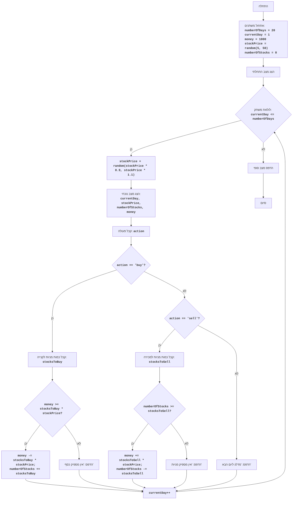

# ניתוח קוד: משחק מניות

## 1. <algorithm>

### תרשים זרימה של הקוד:
1.  **אתחול**:
    *   הגדרת משתנים התחלתיים:
        *   `numberOfDays` = 20 (מספר הימים במשחק).
        *   `currentDay` = 1 (היום הנוכחי, מתחיל ב-1).
        *   `money` = 1000 (סכום הכסף ההתחלתי).
        *   `stockPrice` = מספר אקראי בין 5 ל-50 (מחיר המניה ההתחלתי).
        *   `numberOfStocks` = 0 (מספר המניות ההתחלתי).
2.  **הצגת מצב התחלתי**:
    *   הדפסת הודעת פתיחה: "ברוכים הבאים למשחק STOCK!".
    *   הדפסת המצב ההתחלתי: היום, מחיר המניה, מספר המניות וסכום הכסף.
3.  **לולאת משחק (כל עוד `currentDay` קטן או שווה ל- `numberOfDays`)**:
    *   **עדכון מחיר המניה**:
        *   חישוב מחיר המניה החדש בצורה אקראית, בין 90% ל-110% מהמחיר הקודם.
        *   לדוגמה: אם המחיר הקודם היה 20, המחיר החדש יהיה בין 18 ל-22 (מספר אקראי).
    *   **הצגת מצב נוכחי**:
        *   הדפסת המצב הנוכחי: היום, מחיר המניה, מספר המניות וסכום הכסף.
    *   **קבלת פעולה מהמשתמש**:
        *   שאילת המשתמש האם לקנות (`buy`) או למכור (`sell`) מניות, או ללחוץ Enter כדי לדלג על היום.
    *   **ביצוע פעולה**:
        *   **אם המשתמש בחר לקנות**:
            *   קליטת מספר המניות לקנייה (`stocksToBuy`).
            *   **אם** יש מספיק כסף:
                *   חישוב סכום הקנייה והפחתתו מסכום הכסף.
                *   עדכון מספר המניות שברשות המשתמש.
                *   הדפסת הודעה שהקנייה בוצעה.
            *   **אחרת**:
                *   הדפסת הודעה שאין מספיק כסף.
        *   **אם המשתמש בחר למכור**:
            *   קליטת מספר המניות למכירה (`stocksToSell`).
            *   **אם** יש מספיק מניות:
                *   חישוב סכום המכירה והוספתו לסכום הכסף.
                *   עדכון מספר המניות שברשות המשתמש.
                *   הדפסת הודעה שהמכירה בוצעה.
            *   **אחרת**:
                *   הדפסת הודעה שאין מספיק מניות.
        *   **אחרת (המשתמש לא בחר פעולה)**:
                * הדפסת הודעה המציינת כי המשחק עובר ליום הבא.
    *   **עדכון היום הנוכחי**:
        *   הוספת 1 ליום הנוכחי (`currentDay`).
    *  **הדפסת קו מפריד**
         * הדפסת קו מפריד בין הימים
4.  **סיום המשחק**:
    *   הדפסת הודעת סיום: "המשחק הסתיים!".
    *   הדפסת מצב סופי: היום האחרון, מחיר המניה, מספר המניות וסכום הכסף.

### זרימת נתונים:
*   המשתנה `stockPrice` עובר עדכון בתוך הלולאה ומשמש לחישוב עלויות קנייה ומכירה.
*   המשתנים `money` ו-`numberOfStocks` מעודכנים בהתאם לפעולות הקנייה והמכירה של המשתמש.

## 2. <mermaid>

*   **הסבר על התלויות:**
    *   הקוד משתמש במודול `random` לצורך הפקת מחיר מניה אקראי.
    *   אין תלויות מחבילות אחרות בתוך הפרויקט `src.`.

## 3. <explanation>

### ייבוא (Imports):
*   `import random`: מייבא את מודול `random` של פייתון, המשמש ליצירת מספרים אקראיים. זה משמש כאן כדי ליצור את מחיר המניה ההתחלתי, וכדי לשנות את המחיר במהלך כל יום.

### משתנים (Variables):
*   `numberOfDays` (int): מספר הימים הכולל שהמשחק יתקיים (20).
*   `currentDay` (int): היום הנוכחי במשחק, מתחיל מ-1 ועולה בכל יום.
*   `money` (int): סכום הכסף של השחקן, מתחיל מ-1000 ומשתנה בהתאם לקניות ומכירות.
*   `stockPrice` (float): מחיר המניה הנוכחי, מתחיל במספר אקראי בין 5 ל-50 ומשתנה בכל יום.
*   `numberOfStocks` (int): מספר המניות שהשחקן מחזיק, מתחיל מ-0 ומשתנה בהתאם לקניות ומכירות.
*  `action` (str):  מחרוזת המייצגת את הפעולה שהמשתמש בחר: "buy" (לקנות), "sell" (למכור) או כל דבר אחר כדי לדלג ליום הבא.
*  `stocksToBuy` (int): מספר המניות שהמשתמש מבקש לקנות.
*  `stocksToSell` (int): מספר המניות שהמשתמש מבקש למכור.

### פונקציות (Functions):
*   **אין פונקציות מוגדרות משתמש** בקוד זה. הקוד כולו כתוב בפסאודו-פונקציה של סקריפט רגיל.

### הסברים מפורטים:
*   המשחק מדמה מסחר במניות, כאשר מחיר המניה משתנה בצורה אקראית בכל יום.
*   המשתמש יכול לקנות ולמכור מניות בכל יום, בהתאם לסכום הכסף והמניות שברשותו.
*   הקוד כולל טיפול בשגיאות קלט (למשל, אם המשתמש מזין קלט לא חוקי).

### בעיות אפשריות ותחומים לשיפור:
*   **הגבלות**:
    *   אין דרך לקצר את המשחק או לעצור אותו באמצע.
    *   המשחק פשוט, ואין לו מורכבות כלכלית נוספת.
*   **אינטראקציה**:
    *   האינטראקציה מבוססת על טקסט בלבד, ואין ממשק משתמש גרפי.
*   **התנהגות מחיר המניה**:
    *   השינוי במחיר המניה הוא אקראי בלבד, ואין בו תלות בנתונים כלכליים או מגמות.
* **שיפורים אפשריים**:
    * להוסיף לוגיקה ליצירת גרף שמדמה שינוי במחיר המניה
    * להוסיף תמיכה במסחר עם סכום משתנה, לדוגמה: 100$ מכל המניות שברשותי.
    * שיפור הממשק על ידי הוספת תפריט או אפשרויות נוספות.

### שרשרת קשרים עם חלקים אחרים בפרויקט:
*   הקוד הזה הוא משחק בודד, ואין לו קשר ישיר עם חלקים אחרים בפרויקט.
*   אפשרי להשתמש בקוד הזה כבסיס ליצירת משחקים כלכליים מורכבים יותר.