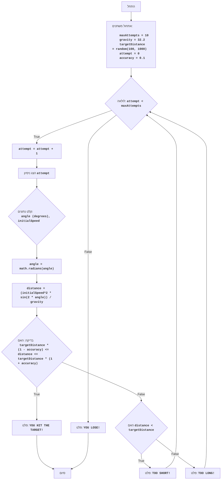

## ניתוח קוד: משחק ארטילריה

### <algorithm>
הקוד מיישם משחק ארטילריה פשוט, בו השחקן מנסה לפגוע במטרה על ידי כוונון זווית ומהירות הירי. המשחק כולל מספר ניסיונות, ולאחר מכן השחקן מפסיד.

1. **אתחול משתנים:**
   - `maxAttempts` = 10 (מספר מקסימלי של ניסיונות).
   - `gravity` = 32.2 (קבוע הכבידה).
   - `targetDistance` = מספר אקראי בין 100 ל-1000 (מרחק המטרה).
   - `attempt` = 0 (מונה הניסיונות).
   - `accuracy` = 0.1 (דיוק של 10%).

   *דוגמה:*
   ```
   maxAttempts = 10
   gravity = 32.2
   targetDistance = 345
   attempt = 0
   accuracy = 0.1
   ```
2. **לולאה ראשית (כל עוד מספר הניסיונות קטן ממספר הניסיונות המקסימלי):**
   - `attempt` גדל ב-1.
   - מוצג מספר הניסיון הנוכחי.

   *דוגמה:*
   ```
   attempt = 1
   פלט: "ניסיון 1 מתוך 10"
   ```

3. **לולאת קלט נתונים מהמשתמש:**
   - בקשת זווית ירי (במעלות).
   - בקשת מהירות התחלתית.
   - הלולאה מבטיחה קלט מספרי תקין.

   *דוגמה:*
   ```
   קלט: זווית ירי = 45
   קלט: מהירות התחלתית = 200
   ```

4. **המרת זווית:**
   - המרת הזווית ממעלות לרדיאנים באמצעות `math.radians()`.

   *דוגמה:*
   ```
   angle = math.radians(45)  # angle = 0.785
   ```

5. **חישוב מרחק:**
   - חישוב מרחק הפגיעה באמצעות הנוסחה: `distance = (initialSpeed ** 2 * math.sin(2 * angle)) / gravity`.

   *דוגמה:*
   ```
    distance = (200**2 * math.sin(2 * 0.785)) / 32.2 # distance = 1242.23
   ```

6. **בדיקת פגיעה:**
   - בדיקה האם המרחק נמצא בטווח של ±10% מהמרחק למטרה.
    - אם כן, מציג "YOU HIT THE TARGET!" ויוצא מהלולאה הראשית.

   *דוגמה:*
   ```
   מרחק מטרה = 345, טווח פגיעה = 310.5 - 379.5, מרחק = 350. פלט: "YOU HIT THE TARGET!"
   ```

7. **בדיקה אם קצר מדי:**
   - אם המרחק קצר מדי, מציג "TOO SHORT!" וחוזר ללולאה הראשית.
    *דוגמה:*
    ```
    מרחק מטרה=345, מרחק = 200. פלט: "TOO SHORT!"
    ```
8. **בדיקה אם ארוך מדי:**
    - אחרת, אם המרחק ארוך מדי, מציג "TOO LONG!" וחוזר ללולאה הראשית.
    *דוגמה:*
    ```
     מרחק מטרה=345, מרחק = 400. פלט: "TOO LONG!"
    ```

9. **בדיקה אם נגמרו הניסיונות:**
   - אם הלולאה הראשית מסתיימת עקב מיצוי הניסיונות, מציג "YOU LOSE!".

   *דוגמה:*
   ```
    attempt = 10. פלט: "YOU LOSE!"
   ```

### <mermaid>


**ניתוח תלויות:**

-   **`random`**: משמש לייצור מרחק מטרה אקראי.
-   **`math`**: משמש לחישובים טריגונומטריים (סינוס) ולהמרת מעלות לרדיאנים.

**הסבר שמות משתנים:**

-   `Start`: תחילת התוכנית.
-   `InitializeVariables`: אתחול משתנים המשמשים בתוכנית.
-   `LoopStart`: התחלת הלולאה הראשית.
-   `IncreaseAttempt`: העלאת מונה הניסיונות.
-    `DisplayAttempt`: הצגת מספר הניסיון הנוכחי.
-   `InputData`: קבלת נתוני קלט מהמשתמש (זווית ומהירות).
-   `ConvertAngle`: המרת זווית ממעלות לרדיאנים.
-   `CalculateDistance`: חישוב מרחק הפגיעה.
-   `CheckHit`: בדיקה אם הפגיעה מוצלחת.
-   `OutputWin`: הודעה על ניצחון.
-   `CheckShort`: בדיקה אם המרחק קצר מדי.
-   `OutputShort`: הודעה על מרחק קצר מדי.
-   `OutputLong`: הודעה על מרחק ארוך מדי.
-   `OutputLose`: הודעה על הפסד.
-   `End`: סוף התוכנית.
-   `maxAttempts`: מספר הניסיונות המקסימלי.
-   `gravity`: קבוע הגרביטציה.
-   `targetDistance`: מרחק המטרה.
-   `attempt`: מונה הניסיונות.
-  `accuracy`: רמת הדיוק הנדרשת לפגיעה.
-   `angle`: זווית הירי.
-   `initialSpeed`: מהירות ההתחלתית.
-   `distance`: מרחק הנפילה של הכדור.

### <explanation>
**ייבואים (Imports):**
-   `import random`: משמש ליצירת מספרים אקראיים, במקרה זה כדי ליצור את מרחק המטרה באופן אקראי.
-  `import math`: משמש לביצוע פעולות מתמטיות, כמו חישוב סינוס (`math.sin`) והמרת זווית מרדיאנים למעלות (`math.radians`).

**משתנים (Variables):**
- `maxAttempts`: משתנה קבוע המייצג את מספר הניסיונות המקסימלי שהשחקן יכול לבצע (10).
- `gravity`: משתנה קבוע המייצג את קבוע הכבידה (32.2), המשמש בחישוב מרחק הפגיעה.
- `targetDistance`: משתנה שמאחסן את מרחק המטרה האקראי, שנוצר על ידי `random.randint(100, 1000)`.
- `attempt`: משתנה המונה את מספר הניסיונות שהשחקן ביצע, מתחיל מ-0.
-  `accuracy`: משתנה המגדיר את הטווח (באחוזים) סביב מרחק המטרה שבו פגיעה נחשבת מוצלחת.

**לולאות (Loops):**
-   **לולאה ראשית `while attempt < maxAttempts`:**
    - מנהלת את מהלך המשחק, ומאפשרת לשחקן מספר ניסיונות שנקבע על ידי `maxAttempts`.
    - הלולאה ממשיכה כל עוד מספר הניסיונות שביצע השחקן קטן ממספר הניסיונות המקסימלי.
- **לולאת קלט `while True`:**
   - מבטיחה כי הקלט שנקלט מהמשתמש תקין.
   - הלולאה מבצעת ניסיון להמיר את קלט המשתמש למספר מסוג `float`.
   - אם ההמרה מצליחה הלולאה תסתיים ואם לא תוצג הודעת שגיאה ותידרש קלט חוזר.

**פונקציות (Functions):**
- אין פונקציות המוגדרות על ידי המשתמש בקוד זה, אבל נעשה שימוש במספר פונקציות מובנות ובפונקציות מודול:
    - `random.randint(a, b)`: יוצר מספר אקראי שלם בטווח שבין a ל-b כולל.
    - `input(prompt)`: מציג הודעה למשתמש ומחזיר את הקלט שלו כמחרוזת.
   - `float(value)`: ממירה מחרוזת או מספר למספר מסוג `float`.
    - `math.radians(degrees)`: ממירה זווית ממעלות לרדיאנים.
   -   `math.sin(radians)`: מחשבת את הסינוס של הזווית שניתנה ברדיאנים.

**הסברים מפורטים:**
-  המשחק מדמה ירי תותח.
- המרחק למטרה נקבע באופן אקראי בכל משחק.
- השחקן מזין זווית ומהירות, והמשחק מחשב את טווח הפגיעה.
- קיימת אפשרות לפגוע במטרה אם הפגיעה היא בטווח של 10% מסביב למרחק המטרה.
- המשחק נגמר אם השחקן מצליח לפגוע במטרה או כאשר נגמרים לו הניסיונות.

**בעיות אפשריות ושיפורים:**

-   **בדיקת קלט:** הקוד מטפל בשגיאות בסיסיות בקלט (שגיאות המרה ל-`float`). ניתן לשפר את בדיקות הקלט, למשל לוודא שהזווית והמהירות הן בטווח סביר.
-   **פלט משחק:** ניתן לשפר את הפלט למשתמש עם גרפיקה פשוטה או הודעות יותר מפורטות על מיקום הפגיעה.
-   **מורכבות:** המשחק פשוט מאוד. ניתן להוסיף לו מורכבות, כגון:
    -   הוספת רוח, שמשפיעה על טווח הפגיעה.
    -   מכשולים בדרך למטרה.
    -   רמות קושי שונות.
-  **ארגון הקוד:** ניתן לארגן את הקוד בצורה יותר מודולרית, להפריד בין הלוגיקה של המשחק לבין האינטראקציה עם המשתמש באמצעות פונקציות.

**שרשרת קשרים לפרויקט:**

-   הקוד הוא חלק ממשחקי AI ואינו משתמש בחלקים אחרים בפרויקט באופן ישיר, אלא רק בספריות סטנדרטיות של Python.