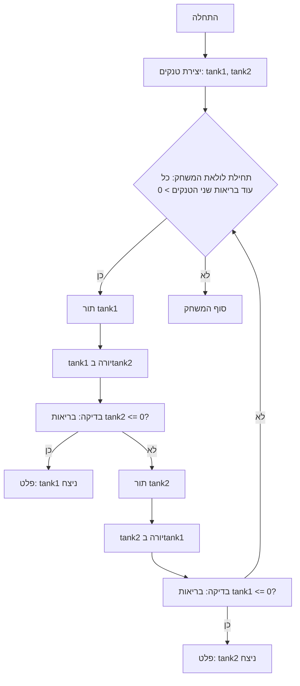

## ניתוח קוד משחק טנקים טקסטואלי

### 1. <algorithm>
   
   הקוד מתאר משחק טקסטואלי פשוט בו שני טנקים נלחמים זה בזה עד שאחד מהם מושמד. הנה תהליך העבודה של הקוד:

   1. **אתחול טנקים**:
      - שני טנקים נוצרים, כאשר לכל טנק יש מאפיינים כמו מודל, שריון, טווח נזק ובריאות. 
        - דוגמה: `tank1 = Tank(model="T-34", armor=50, min_damage=20, max_damage=30, health=100)`, `tank2 = SuperTank(model="Tiger", armor=80, min_damage=25, max_damage=35, health=150)`.
   2.  **לולאת משחק**:
        -  לולאה ראשית ממשיכה כל עוד הבריאות של שני הטנקים גדולה מאפס.
            - דוגמה: `while tank1.health > 0 and tank2.health > 0:`
   3. **תור טנק 1**:
        -  הטנק הראשון יורה לעבר הטנק השני.
           - דוגמה: `damage = tank1.calculate_damage()`.
           - דוגמה: `tank2.health_down(damage)`.
        - לאחר מכן נבדק האם בריאות הטנק השני שווה ל 0. אם כן, המשחק נגמר וטנק 1 ניצח.
            - דוגמה: `if tank2.health <= 0: print("Tank 1 wins!"); break;`
   4.  **תור טנק 2**:
       - הטנק השני יורה לעבר הטנק הראשון.
           - דוגמה: `damage = tank2.calculate_damage()`.
           - דוגמה: `tank1.health_down(damage)`.
       - לאחר מכן נבדק האם בריאות הטנק הראשון שווה ל 0. אם כן, המשחק נגמר וטנק 2 ניצח.
           - דוגמה: `if tank1.health <= 0: print("Tank 2 wins!"); break;`
   5. **סיום המשחק**:
        - ברגע שאחד הטנקים מגיע ל 0 בריאות, הלולאה מסתיימת ומוצגת הודעת ניצחון.
            - דוגמה: `print("Game Over")`

    **זרימת נתונים:**
    - יצירת טנקים: נתונים כמו מודל, שריון, טווח נזק ובריאות מועברים לפונקציה הבנאית של המחלקה `Tank` או `SuperTank`.
    - חישוב נזק: הפונקציה `calculate_damage` מחזירה ערך נזק אקראי.
    - הורדת בריאות: הפונקציה `health_down` מעדכנת את בריאות הטנק.
    - בדיקת בריאות: ערך הבריאות של הטנקים נבדק בלולאת המשחק.
   
### 2. <mermaid>
   

   
    - **`Start`**: תחילת המשחק.
    - **`CreateTanks`**: יצירת שני אובייקטים של טנקים, `tank1` ו-`tank2`, עם מאפיינים שונים כמו מודל, שריון, בריאות וטווח נזק.
    - **`GameLoopStart`**: התחלת לולאה שרצה כל עוד הבריאות של שני הטנקים גדולה מ-0.
    - **`Tank1Turn`**: תורו של טנק 1 לתקוף.
    - **`Tank1Shot`**: טנק 1 יורה לעבר טנק 2. מבוצע חישוב נזק והבריאות של טנק 2 מופחתת.
    - **`CheckTank2Health`**: בדיקה האם הבריאות של טנק 2 ירדה ל-0 או פחות.
    - **`OutputTank1Win`**: אם הבריאות של טנק 2 קטנה או שווה ל-0, מוצגת הודעה ש-tank1 ניצח.
    - **`Tank2Turn`**: תורו של טנק 2 לתקוף.
    - **`Tank2Shot`**: טנק 2 יורה לעבר טנק 1. מבוצע חישוב נזק והבריאות של טנק 1 מופחתת.
    - **`CheckTank1Health`**: בדיקה האם הבריאות של טנק 1 ירדה ל-0 או פחות.
    - **`OutputTank2Win`**: אם הבריאות של טנק 1 קטנה או שווה ל-0, מוצגת הודעה ש-tank2 ניצח.
    - **`End`**: סוף המשחק.
   
### 3. <explanation>
   
    - **מבנה הקוד**: הקוד עוסק בעיקרו במימוש משחק קרבות טנקים פשוט בטקסט.
    - **ייבוא (Imports)**: אין ייבוא קבצים.
    - **מחלקות (Classes)**:
        -  `Tank`: מחלקה בסיסית המייצגת טנק.
           -  מאפיינים: `model` (שם הדגם), `armor` (שריון), `min_damage` (נזק מינימלי), `max_damage` (נזק מקסימלי), `health` (בריאות).
           - שיטות:
               -  `__init__`: מאתחל את מאפייני הטנק.
               -  `health_down(damage)`: מפחית את הבריאות של הטנק על ידי הנזק שנגרם לו.
               - `calculate_damage()`: מחזיר נזק אקראי בטווח הנזק של הטנק.
        - `SuperTank`: מחלקה שנועדה לייצג טנק חזק יותר, יורשת ממחלקה `Tank`, משנה את ערכי הבריאות והשריון המוגדרים בערכי ברירת המחדל.
           - מאפיינים: זהים למחלקה `Tank`, אך מאותחלים עם בריאות ושריון גבוהים יותר.
    - **פונקציות (Functions)**:
        - `calculate_damage(self)`: מחשבת ומחזירה נזק אקראי בטווח הנזק שמוגדר לטנק, תוך שימוש בפונקציה `random.randint()`
        - `health_down(self, damage)`: מפחיתה את הבריאות של הטנק על ידי ערך הנזק שמתקבל כפרמטר.
    - **משתנים (Variables)**:
        - `tank1`, `tank2`: אובייקטים של טנקים, כאשר `tank1` יכול להיות מסוג `Tank` ו- `tank2` יכול להיות מסוג `SuperTank`.
        - `damage`: משתנה המכיל את הנזק האקראי שמחושב בזמן ההתקפה.
    - **שרשרת קשרים:** הקוד אינו כולל קבצים חיצוניים או חלקים אחרים בפרויקט.
    - **בעיות אפשריות או תחומים לשיפור**:
        - **משחק טקסטואלי בסיסי**: ממשק המשתמש הוא טקסטואלי בלבד, ללא אינטראקציה מורכבת עם המשתמש.
        - **מכניקת משחק פשוטה**: מכניקת המשחק פשוטה עם מספר מוגבל של מאפיינים.
        - **ללא אנימציה או ויזואליזציה**: חסרה הצגה ויזואלית של מהלך המשחק.
        - **ללא אפשרות בחירה של המשתמש**: אין למשתמש אפשרות לבחור טנקים או לבצע פעולות נוספות.