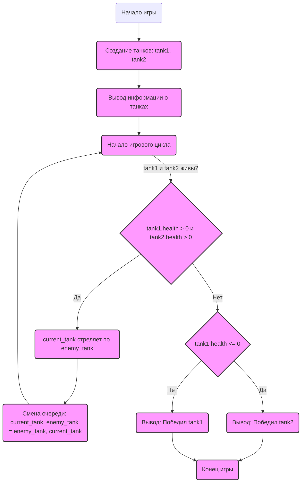

## <algorithm>

1. **הגדרת מחלקה `Tank`**:
   -   אתחול (`__init__`):
        -   מקבלת מודל, שריון, נזק מינימלי, נזק מקסימלי ובריאות.
        -   שומרת את הערכים במשתני המופע של האובייקט.
   -   חישוב נזק (`calculate_damage`):
        -   מייצרת מספר אקראי בין הנזק המינימלי למקסימלי.
        -   דוגמה: אם `min_damage` הוא 20 ו-`max_damage` הוא 30, הנזק יכול להיות כל ערך בין 20 ל-30.
   -   הדפסת מידע (`print_info`):
        -   מדפיסה מידע על הטנק (מודל, שריון, בריאות, טווח נזק).
        -   דוגמה: "T-34 имеет лобовую броню 50мм при 100ед. здоровья и урон в диапазоне от 20 до 30 единиц"
   -   הורדת בריאות (`health_down`):
        -   מקבלת את הנזק שהאויב גרם.
        -   מפחיתה את הנזק מבריאות הטנק.
        -   מדפיסה מידע על מצב הבריאות הנוכחי.
        -   דוגמה: אם `health` הוא 100 ו-`enemy_damage` הוא 25, ה-`health` יהפוך ל-75.
   -   ירי (`shot`):
        -   מקבלת את טנק האויב.
        -   מחשבת את הנזק שנגרם באמצעות `calculate_damage`.
        -   בודקת האם טנק האויב הרוס או אם הנזק גדול מבריאות האויב, ואם כן, הורסת אותו.
        -   אחרת, מורידה מבריאות האויב את הנזק.
        -   דוגמה: אם טנק 1 יורה על טנק 2, הוא מחשב נזק אקראי ומחיל אותו על טנק 2.

2.  **הגדרת מחלקה `SuperTank`**:
    -  יורשת מהמחלקה `Tank`.
    -  אתחול (`__init__`):
         -   קוראת לאתחול של מחלקת האב (`Tank.__init__`).
         -   מגדירה שריון חזק (`forceArmor` כ- `True`).
    -  הורדת בריאות (`health_down`):
        -   מקבלת נזק מהאויב.
        -   מחשבת נזק אפקטיבי בהתחשב בשריון המוגבר (`enemy_damage - self.armor // 2`).
        -   דוגמה: אם `enemy_damage` הוא 50 והשריון הוא 80, הנזק האפקטיבי יהיה 50 - 80 // 2 = 10.
        -   מפחיתה את הנזק האפקטיבי מבריאות הטנק.
        -   מדפיסה מידע על מצב הבריאות הנוכחי.

3.  **פונקציה `main`**:
    -   יוצרת שני אובייקטים של טנק:
         -   `tank1`: `Tank` רגיל עם מודל "T-34", שריון 50, נזק בין 20 ל-30 ובריאות 100.
         -   `tank2`: `SuperTank` עם מודל "Тигр", שריון 80, נזק בין 25 ל-35 ובריאות 150.
    -   מדפיסה את תחילת הקרב ומידע על כל טנק.
    -   מאפשרת סיבובים של ירי בין הטנקים:
          -   בכל סיבוב, טנק אחד יורה על השני.
          -   מחליפה את תפקידי הטנקים כדי שכל אחד יירה בתורו.
    -   ממשיכה את הקרב עד שאחד מהטנקים נהרס.
    -   מדפיסה את שם הטנק המנצח.

## <mermaid>



```mermaid
flowchart TD
    Start_Tank([Start: __init__]) --> SetModel(Установка model)
    SetModel --> SetArmor(Установка armor)
    SetArmor --> SetMinDamage(Установка min_damage)
    SetMinDamage --> SetMaxDamage(Установка max_damage)
    SetMaxDamage --> SetHealth(Установка health)
    SetHealth --> End_Tank([End: __init__])
    
    Start_calc_damage([Start: calculate_damage]) --> RandomDamage(Выбор случайного урона между min_damage и max_damage)
    RandomDamage --> ReturnDamage(Возврат случайного урона)
    ReturnDamage --> End_calc_damage([End: calculate_damage])

    Start_print_info([Start: print_info]) --> PrintTankInfo(Вывод информации о танке)
    PrintTankInfo --> End_print_info([End: print_info])

    Start_health_down([Start: health_down]) --> ReduceHealth(Уменьшение здоровья на enemy_damage)
    ReduceHealth --> PrintHealthInfo(Вывод информации о здоровье)
    PrintHealthInfo --> End_health_down([End: health_down])
    
    Start_shot([Start: shot]) --> CalcDamage(Расчет урона)
    CalcDamage --> CheckEnemyDestroyed{enemy.health <= 0}
     CheckEnemyDestroyed -- Да --> PrintEnemyDestroyed(Вывод сообщения об уничтожении)
    CheckEnemyDestroyed -- Нет --> CheckDamageGreater{damage >= enemy.health}
    CheckDamageGreater -- Да --> SetHealthZero(Установка enemy.health = 0)
    SetHealthZero --> PrintEnemyDestroyed2(Вывод сообщения об уничтожении)
    CheckDamageGreater -- Нет --> CallHealthDown(Вызов enemy.health_down(damage))
    CallHealthDown --> PrintDamageInfo(Вывод информации о уроне)
    PrintDamageInfo --> End_shot([End: shot])
    PrintEnemyDestroyed2 -->End_shot
    PrintEnemyDestroyed--> End_shot
    
    classDef method fill:#f9f,stroke:#333,stroke-width:2px
    class Start_Tank,SetModel,SetArmor,SetMinDamage,SetMaxDamage,SetHealth,End_Tank,Start_calc_damage,RandomDamage,ReturnDamage,End_calc_damage,Start_print_info,PrintTankInfo,End_print_info,Start_health_down,ReduceHealth,PrintHealthInfo,End_health_down,Start_shot,CalcDamage,CheckEnemyDestroyed,PrintEnemyDestroyed,CheckDamageGreater,SetHealthZero,PrintEnemyDestroyed2,CallHealthDown,PrintDamageInfo,End_shot method
```

```mermaid
flowchart TD
    Start_SuperTank([Start: __init__ (SuperTank)]) --> CallTankInit(Вызов Tank.__init__)
    CallTankInit --> SetForceArmor(Установка forceArmor = True)
    SetForceArmor --> End_SuperTank([End: __init__ (SuperTank)])

    Start_super_health_down([Start: health_down (SuperTank)]) --> CalcEffectiveDamage(Расчет эффективного урона)
    CalcEffectiveDamage --> ReduceHealth_super(Уменьшение здоровья на эффективный урон)
    ReduceHealth_super --> PrintHealthInfo_super(Вывод информации о здоровье)
     PrintHealthInfo_super --> End_super_health_down([End: health_down (SuperTank)])

    classDef method fill:#f9f,stroke:#333,stroke-width:2px
    class Start_SuperTank,CallTankInit,SetForceArmor,End_SuperTank,Start_super_health_down,CalcEffectiveDamage,ReduceHealth_super,PrintHealthInfo_super,End_super_health_down method
```

**הסבר על התלויות:**

הקוד משתמש ב `random` כדי ליצור נזק אקראי. אין תלויות בחבילות אחרות של `src`.

## <explanation>

**ייבואים (Imports):**

-   `import random`: משמש ליצירת מספרים אקראיים עבור חישוב הנזק של הטנק.

**מחלקות (Classes):**

1.  **`Tank`**:
    -   **תפקיד**: מחלקת בסיס לטנקים, המגדירה תכונות ופעולות משותפות.
    -   **מאפיינים**:
        -   `model` (str): מודל הטנק.
        -   `armor` (int): כמות השריון של הטנק.
        -   `min_damage` (int): הנזק המינימלי שהטנק יכול לגרום.
        -   `max_damage` (int): הנזק המקסימלי שהטנק יכול לגרום.
        -   `health` (int): כמות הבריאות הנוכחית של הטנק.
    -   **שיטות**:
        -   `__init__`: אתחול האובייקט עם מודל, שריון, נזק מינימלי, נזק מקסימלי ובריאות.
        -   `calculate_damage`: מחשבת ומחזירה נזק אקראי בין הנזק המינימלי למקסימלי.
        -   `print_info`: מדפיסה מידע על הטנק.
        -   `health_down`: מפחיתה את בריאות הטנק בהתאם לנזק שספג.
        -   `shot`: מבצעת ירי על טנק האויב, מחשבת את הנזק, ומעדכנת את בריאותו בהתאם.
    -   **אינטראקציה**: המחלקה משמשת ליצירת אובייקטים של טנקים ומשמשת בפונקציה `main` להדמיית קרבות.

2.  **`SuperTank`**:
    -   **תפקיד**: מחלקה שמתארת טנק מיוחד עם שריון חזק יותר. יורשת מהמחלקה `Tank`.
    -   **מאפיינים**:
        -   `forceArmor` (bool): מציין אם לטנק יש שריון חזק יותר (תמיד `True`).
    -   **שיטות**:
        -   `__init__`: מאתחלת את `SuperTank`, קוראת לאתחול של מחלקת האב וקובעת `forceArmor` ל-`True`.
        -   `health_down`: מורידה את בריאות הטנק, אך מחשבת את הנזק האפקטיבי על ידי הפחתת חלק מהנזק בהתאם לשריון (`enemy_damage - self.armor // 2`).
    -   **אינטראקציה**: משמשת ליצירת אובייקטים של טנקים חזקים יותר מהרגילים.

**פונקציות (Functions):**

-   `main()`:
    -   **פרמטרים**: אין.
    -   **ערך מוחזר**: אין.
    -   **מטרה**:
        -   יוצרת אובייקטים של `Tank` ו-`SuperTank`.
        -   מנהלת את מהלך המשחק, בו הטנקים יורים אחד על השני בתורות.
        -   מדפיסה את תוצאות המשחק והמנצח.
    -   **דוגמה לשימוש**: `main()` מופעלת כאשר הקובץ מורץ ומדמה משחק קרבות בין טנקים.

**משתנים (Variables):**

-   `tank1` (Tank): אובייקט של מחלקת `Tank`, מייצג טנק "T-34".
-   `tank2` (SuperTank): אובייקט של מחלקת `SuperTank`, מייצג טנק "Тигр".
-   `current_tank` (Tank): מצביע על הטנק הנוכחי בתור.
-   `enemy_tank` (Tank): מצביע על הטנק שאותו תוקפים כעת.
-   `damage` (int): משתנה שמחזיק את ערך הנזק שנגרם.
-   `effective_damage` (int): משתנה שמחזיק את ערך הנזק האפקטיבי שנגרם לטנק סופר.

**בעיות אפשריות או תחומים לשיפור:**

1.  **העדר בדיקות קלט**: הקוד אינו בודק את הערכים המתקבלים בעת יצירת הטנקים, מה שעלול לגרום לשגיאות אם יסופקו ערכים לא תקינים.
2.  **קוד חוזר**: יש חזרה מסוימת בקוד, כמו הדפסת מידע על מצב הבריאות, שאותה אפשר היה להעביר לפונקציה נפרדת.
3.  **מודולריות**: ניתן היה להפריד את לוגיקת המשחק והטנקים לקבצים שונים כדי לשפר את הקריאות והארגון.
4.  **הרחבה**: המשחק מאוד בסיסי. אפשר להרחיב אותו עם אפשרויות נוספות כמו סוגי תחמושת, מפות שונות, ואסטרטגיות.

**שרשרת קשרים עם חלקים אחרים בפרויקט:**

-   הקוד פועל כמשחק עצמאי ואינו תלוי בחלקים אחרים בפרויקט `hypotez`. הוא משתמש רק בספריית `random` מהספרייה הסטנדרטית של פייתון.