## <algorithm>

הקוד מציג שני יישומים של מחשבון טמפרטורה, האחד באמצעות פונקציות רגילות והשני באמצעות `dataclass`.

**`convertor_kcf.py` - גרסת הפונקציות:**

1.  **הגדרת פונקציות המרה:**
    *   `celsius_to_fahrenheit(celsius)`: מקבלת טמפרטורה בצלזיוס ומחזירה בפרנהייט.
        *   דוגמה: `celsius_to_fahrenheit(0)` מחזירה `32`.
    *   `fahrenheit_to_celsius(fahrenheit)`: מקבלת טמפרטורה בפרנהייט ומחזירה בצלזיוס.
        *   דוגמה: `fahrenheit_to_celsius(32)` מחזירה `0`.
    *   `celsius_to_kelvin(celsius)`: מקבלת טמפרטורה בצלזיוס ומחזירה בקלווין.
        *   דוגמה: `celsius_to_kelvin(0)` מחזירה `273.15`.
    *   `kelvin_to_celsius(kelvin)`: מקבלת טמפרטורה בקלווין ומחזירה בצלזיוס.
        *   דוגמה: `kelvin_to_celsius(273.15)` מחזירה `0`.
    *   `fahrenheit_to_kelvin(fahrenheit)`: מקבלת טמפרטורה בפרנהייט, ממירה לצלזיוס ואז לקלווין, ומחזירה בקלווין.
        *   דוגמה: `fahrenheit_to_kelvin(32)` מחזירה `273.15`.
    *   `kelvin_to_fahrenheit(kelvin)`: מקבלת טמפרטורה בקלווין, ממירה לצלזיוס ואז לפרנהייט, ומחזירה בפרנהייט.
        *   דוגמה: `kelvin_to_fahrenheit(273.15)` מחזירה `32`.

2.  **פונקציית המרה אוניברסלית:**
    *   `convert_temperature(value, from_unit, to_unit)`: מקבלת ערך טמפרטורה, יחידת מקור ויחידת יעד, ומשתמשת בפונקציות ההמרה המתאימות.
        *   דוגמה: `convert_temperature(0, 'C', 'F')` קוראת ל- `celsius_to_fahrenheit(0)` ומחזירה `32`.
        *   דוגמה: `convert_temperature(32, 'F', 'K')` קוראת ל- `fahrenheit_to_kelvin(32)` ומחזירה `273.15`.

3.  **פונקציית `main`:**
    *   לולאה אינסופית שמאפשרת למשתמש לבחור בין המרת טמפרטורה או יציאה.
    *   קבלת קלט מהמשתמש: ערך טמפרטורה, יחידת מקור ויחידת יעד.
    *   קריאה ל- `convert_temperature` והצגת התוצאה.
    *   טיפול בשגיאות קלט באמצעות `try-except`.

**`convertor_kcf_dataclass.py` - גרסת ה-`dataclass`:**

1.  **יצירת `dataclass`:**
    *   `TemperatureConverter` : מחלקה עם שיטות המרה, ומעוצבת בעזרת `dataclass` כדי ליצור אוטומטית מאפיינים ושיטות נוספות כמו `__init__`.

2.  **שיטות המרה:**
    *   אותן שיטות כמו בגרסת הפונקציות, אך הן כעת שיטות של המחלקה `TemperatureConverter`.
        *   דוגמה: יצירת מופע `converter = TemperatureConverter()`, ואז קריאה ל- `converter.celsius_to_fahrenheit(0)` מחזירה `32`.

3.  **פונקציית המרה אוניברסלית:**
    *   `convert_temperature(value, from_unit, to_unit)`: דומה לפונקציה בגרסת הפונקציות, אך כעת קוראת לשיטות של המחלקה `TemperatureConverter`.
        *   דוגמה: `converter.convert_temperature(0, 'C', 'F')` קוראת ל- `self.celsius_to_fahrenheit(0)` ומחזירה `32`.

4.  **פונקציית `main`:**
    *   יצירת מופע של `TemperatureConverter`.
    *   לולאה אינסופית דומה לגרסת הפונקציות, אך קוראת לשיטות המרה דרך מופע המחלקה.

```mermaid
flowchart TD
    subgraph convertor_kcf.py
        A[Start main] --> B{Choice: Convert or Exit?};
        B -- 1. Convert --> C[Input: Value, from_unit, to_unit];
        C --> D[Call convert_temperature];
        D --> E{from_unit and to_unit?};
        E -- C to F --> F[Call celsius_to_fahrenheit];
        F --> I[Return result];
         E -- C to K --> G[Call celsius_to_kelvin];
        G --> I
         E -- F to C --> H[Call fahrenheit_to_celsius];
        H --> I
         E -- F to K --> J[Call fahrenheit_to_kelvin];
        J --> K[Call celsius_to_kelvin];
         K --> I;
          E -- K to C --> L[Call kelvin_to_celsius];
        L --> I
         E -- K to F --> M[Call kelvin_to_fahrenheit];
         M --> N[Call celsius_to_fahrenheit];
         N-->I
         E -- Same units--> I[Return original Value];
        I --> O[Print result];
         O -->B
        B -- 2. Exit --> P[Exit];

    end
      subgraph convertor_kcf_dataclass.py
        AA[Start main] --> AB[Create TemperatureConverter instance];
        AB --> AC{Choice: Convert or Exit?};
        AC -- 1. Convert --> AD[Input: Value, from_unit, to_unit];
         AD --> AE[Call convert_temperature];
          AE --> AF{from_unit and to_unit?};
        AF -- C to F --> AG[Call celsius_to_fahrenheit method];
        AG --> AI[Return result];
         AF -- C to K --> AH[Call celsius_to_kelvin method];
        AH --> AI
          AF -- F to C --> AJ[Call fahrenheit_to_celsius method];
        AJ --> AI
         AF -- F to K --> AK[Call fahrenheit_to_kelvin method];
        AK --> AL[Call celsius_to_kelvin method];
         AL --> AI;
           AF -- K to C --> AM[Call kelvin_to_celsius method];
         AM --> AI
          AF -- K to F --> AN[Call kelvin_to_fahrenheit method];
        AN --> AO[Call celsius_to_fahrenheit method];
         AO-->AI
        AF -- Same units--> AI[Return original Value];
         AI --> AP[Print result];
        AP --> AC
        AC -- 2. Exit --> AQ[Exit];
    end


```

## <mermaid>

**הסבר תרשים `mermaid`:**

*   התרשים מציג את זרימת הפעולה של שתי גרסאות הקוד: `convertor_kcf.py` ו-`convertor_kcf_dataclass.py`.
*   **`convertor_kcf.py`:**
    *   הזרימה מתחילה בפונקציה `main`, המציגה תפריט למשתמש.
    *   בהתאם לבחירת המשתמש, אם הוא בוחר להמיר טמפרטורה, הקוד מקבל קלט (ערך, יחידת מקור ויעד) וקורא לפונקציה `convert_temperature`.
    *   `convert_temperature` בודקת את היחידות וקוראת לפונקציות המרה המתאימות: `celsius_to_fahrenheit`, `fahrenheit_to_celsius`, `celsius_to_kelvin`, `kelvin_to_celsius`, `fahrenheit_to_kelvin` או `kelvin_to_fahrenheit`.
    *   התוצאה מוחזרת ומודפסת למשתמש.
    *   הלולאה חוזרת עד שהמשתמש בוחר לצאת.
*   **`convertor_kcf_dataclass.py`:**
    *   הזרימה מתחילה בפונקציה `main`, כאשר נוצר מופע של המחלקה `TemperatureConverter`.
    *   בדומה לגרסה הקודמת, הקוד מציג תפריט למשתמש.
    *   אם המשתמש בוחר להמיר טמפרטורה, הקוד מקבל קלט וקורא לשיטה `convert_temperature` של המופע.
    *   `convert_temperature` של המחלקה קוראת לשיטות המרה המתאימות: `celsius_to_fahrenheit`, `fahrenheit_to_celsius`, `celsius_to_kelvin`, `kelvin_to_celsius`, `fahrenheit_to_kelvin` או `kelvin_to_fahrenheit`, הפעם כשיטות של האובייקט.
    *   התוצאה מוחזרת ומודפסת למשתמש.
    *   הלולאה חוזרת עד שהמשתמש בוחר לצאת.
*   התרשים מראה בבירור את זרימת הנתונים והקריאות בין פונקציות/שיטות.
*   כל שמות המשתנים בתרשים הם בעלי משמעות (למשל, `Value`, `from_unit`, `to_unit`, במקום שמות כמו `A`, `B`, `C`).

## <explanation>

**ייבוא (Imports):**

*   `from dataclasses import dataclass`: מייבא את הדקורטור `dataclass` מהמודול `dataclasses`. דקורטור זה משמש ב-`convertor_kcf_dataclass.py` כדי להפוך את המחלקה `TemperatureConverter` ל-`dataclass`, מה שמספק פונקציונליות אוטומטית כמו יצירת `__init__`  וממשק נוח.
    *  אין ייבוא ספציפי של `src` מכיוון שמדובר בפרויקט קטן ועצמאי.

**מחלקות (Classes):**

*   `TemperatureConverter` (ב-`convertor_kcf_dataclass.py`):
    *   תפקיד: מחלקה המאגדת את כל פונקציות ההמרה של הטמפרטורה.
    *   מאפיינים: אין מאפיינים מוגדרים באופן מפורש, אך ה-`dataclass` יוצר באופן אוטומטי מאפיינים לכל משתנה שמועבר לפונקציית `__init__` באופן מרומז על ידי שיטות המחלקה.
    *   שיטות:
        *   `celsius_to_fahrenheit`, `fahrenheit_to_celsius`, `celsius_to_kelvin`, `kelvin_to_celsius`, `fahrenheit_to_kelvin`, `kelvin_to_fahrenheit`: כל אחת מהן ממירה טמפרטורה מיחידה אחת לאחרת. כולן מקבלות את `self` כארגומנט הראשון, מה שמאפשר להן לגשת לנתונים של האובייקט ולשמש כחלק מהמחלקה.
        *   `convert_temperature`: שיטה אוניברסלית שמנתבת את הקריאה לשיטת ההמרה הנכונה על בסיס יחידות הקלט.

**פונקציות (Functions):**

*   **פונקציות ב-`convertor_kcf.py`:**
    *   `celsius_to_fahrenheit(celsius)`, `fahrenheit_to_celsius(fahrenheit)`, `celsius_to_kelvin(celsius)`, `kelvin_to_celsius(kelvin)`, `fahrenheit_to_kelvin(fahrenheit)`, `kelvin_to_fahrenheit(kelvin)`: אלו פונקציות המרה עצמאיות.
        *   פרמטרים: כל אחת מקבלת כארגומנט טמפרטורה בערך מספרי מסוג `float` ביחידה ספציפית.
        *   ערך מוחזר: כל אחת מהן מחזירה את הטמפרטורה המומרת כערך מספרי מסוג `float`.
        *   מטרה: כל אחת מבצעת המרה בין שתי יחידות טמפרטורה שונות לפי נוסחה מתמטית.
    *   `convert_temperature(value, from_unit, to_unit)`: פונקציה אוניברסלית לביצוע המרות.
        *   פרמטרים:
            *   `value`: הטמפרטורה ל המרה כערך מספרי מסוג `float`.
            *   `from_unit`: יחידת המקור (מחרוזת 'C', 'F', 'K').
            *   `to_unit`: יחידת היעד (מחרוזת 'C', 'F', 'K').
        *   ערך מוחזר: הטמפרטורה המומרת כערך מספרי מסוג `float`.
        *   מטרה: בוחרת את פונקציית ההמרה המתאימה על פי יחידות הקלט, ומבצעת את ההמרה.
    *   `main()`: הפונקציה הראשית של התוכנית.
        *   פרמטרים: אין.
        *   ערך מוחזר: אין.
        *   מטרה: מציגה תפריט למשתמש, מקבלת קלט ומבצעת את ההמרה באמצעות `convert_temperature` וכן מדפיסה את התוצאה.

*   **פונקציות ב-`convertor_kcf_dataclass.py`:**
    *   הפונקציות זהות לגרסה הראשונה, אך הן מוגדרות כשיטות של המחלקה `TemperatureConverter`.
    *   `main()`: בגרסה זו יוצרת מופע של `TemperatureConverter` ומשתמשת בשיטות ההמרה של המופע.

**משתנים (Variables):**

*   `value`: משתנה מסוג `float` המייצג את הערך הטמפרטורה.
*   `from_unit`: משתנה מסוג `str` המייצג את יחידת המקור ('C', 'F', 'K').
*   `to_unit`: משתנה מסוג `str` המייצג את יחידת היעד ('C', 'F', 'K').
*   `choice`: משתנה מסוג `str` המייצג את בחירת המשתמש בתפריט.
*    `converter` :  משתנה מסוג `TemperatureConverter` המכיל מופע של המחלקה.
*   `result`: משתנה מסוג `float` המכיל את תוצאת ההמרה.

**בעיות אפשריות או תחומים לשיפור:**

*   **טיפול בשגיאות:** ב-`convertor_kcf.py`, טיפול השגיאות מוגבל ל-`ValueError` במקרה של קלט לא תקין של יחידות המידה ו-`Exception` לכל שאר המקרים. ניתן להוסיף טיפול ממוקד יותר בסוגי שגיאות שונים.
*   **קוד כפול:** יש מעט כפילות בקוד בין שתי הגרסאות.
*   **חוסר גמישות:** הקוד לא מאפשר להוסיף יחידות מידה חדשות בקלות. ניתן להשתמש במבנה נתונים כמו מילון או להגדיר מחלקה נוספת לכל סוג יחידה.
*   **בדיקות (Tests):** חסרות בדיקות יחידה (Unit Tests) שיבטיחו את נכונות הפונקציות.

**שרשרת קשרים עם חלקים אחרים בפרויקט:**

*   הפרויקט קטן ועצמאי, ואין לו קשרים ישירים עם חלקים אחרים בפרויקט `hypotez`, פרט לכך ששניהם חלק מאותה ספריית משחקי מחשב AI.
*   הקוד ממחיש שימוש בפונקציות, קריאות לפונקציות והעברת פרמטרים. הוא גם מציג שימוש ב-`dataclass`  ועקרונות תכנות מונחה עצמים.

בסך הכל, הקוד מציג שני פתרונות לבעיה פשוטה. גרסת ה-`dataclass` מאורגנת יותר ומציגה שימוש מודרני במחלקות, אך שתי הגרסאות סובלות מאותן בעיות אפשריות, בעיקר טיפול שגיאות והגבלת גמישות.