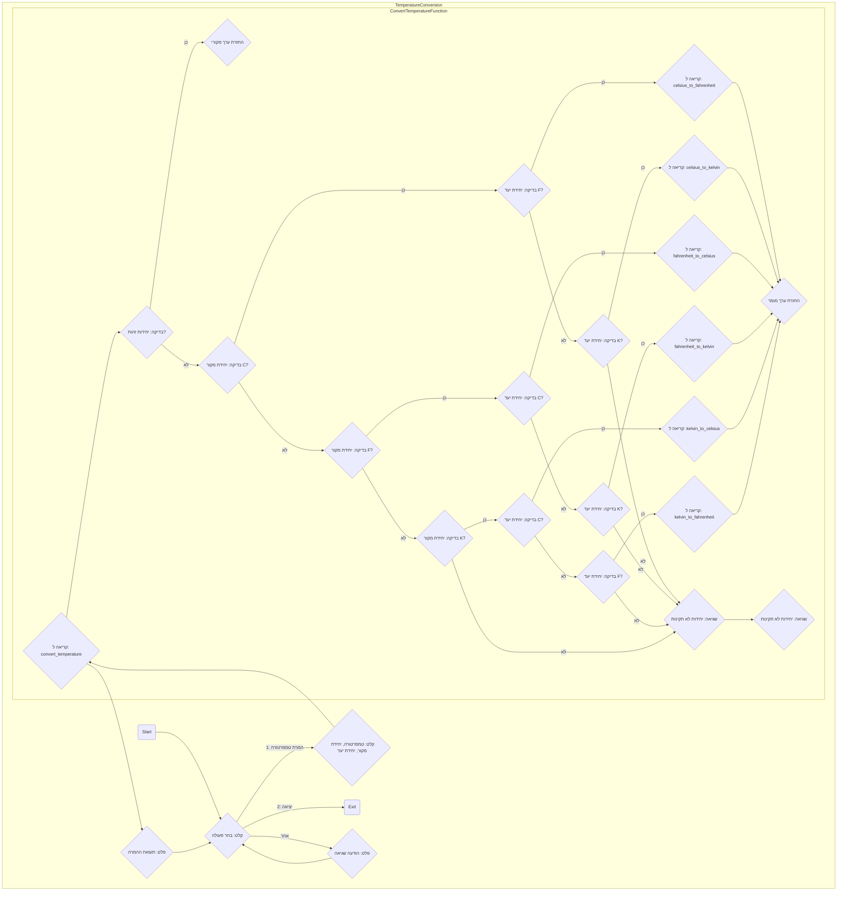

## <algorithm>

1. **`celsius_to_fahrenheit(celsius)`**:
   - מקבלת טמפרטורה במעלות צלזיוס (`celsius` מסוג `float`).
   - מחשבת את הטמפרטורה במעלות פרנהייט באמצעות הנוסחה `(celsius * 9/5) + 32`.
     - לדוגמה: אם `celsius` הוא 0, התוצאה תהיה 32.
     - אם `celsius` הוא 100, התוצאה תהיה 212.
   - מחזירה את הטמפרטורה בפרנהייט (`float`).

2.  **`fahrenheit_to_celsius(fahrenheit)`**:
    - מקבלת טמפרטורה במעלות פרנהייט (`fahrenheit` מסוג `float`).
    - מחשבת את הטמפרטורה במעלות צלזיוס באמצעות הנוסחה `(fahrenheit - 32) * 5/9`.
      - לדוגמה: אם `fahrenheit` הוא 32, התוצאה תהיה 0.
      - אם `fahrenheit` הוא 212, התוצאה תהיה 100.
    - מחזירה את הטמפרטורה בצלזיוס (`float`).

3.  **`celsius_to_kelvin(celsius)`**:
    - מקבלת טמפרטורה במעלות צלזיוס (`celsius` מסוג `float`).
    - מחשבת את הטמפרטורה בקלווין באמצעות הנוסחה `celsius + 273.15`.
      - לדוגמה: אם `celsius` הוא 0, התוצאה תהיה 273.15.
      - אם `celsius` הוא 100, התוצאה תהיה 373.15.
    - מחזירה את הטמפרטורה בקלווין (`float`).

4. **`kelvin_to_celsius(kelvin)`**:
   - מקבלת טמפרטורה בקלווין (`kelvin` מסוג `float`).
   - מחשבת את הטמפרטורה במעלות צלזיוס באמצעות הנוסחה `kelvin - 273.15`.
     - לדוגמה: אם `kelvin` הוא 273.15, התוצאה תהיה 0.
     - אם `kelvin` הוא 373.15, התוצאה תהיה 100.
   - מחזירה את הטמפרטורה בצלזיוס (`float`).

5. **`fahrenheit_to_kelvin(fahrenheit)`**:
    - מקבלת טמפרטורה בפרנהייט (`fahrenheit` מסוג `float`).
    - ממירה את הטמפרטורה לצלזיוס באמצעות `fahrenheit_to_celsius(fahrenheit)`.
    - ממירה את הטמפרטורה מצלזיוס לקלווין באמצעות `celsius_to_kelvin(celsius)`.
    - מחזירה את הטמפרטורה בקלווין (`float`).

6. **`kelvin_to_fahrenheit(kelvin)`**:
    - מקבלת טמפרטורה בקלווין (`kelvin` מסוג `float`).
    - ממירה את הטמפרטורה לצלזיוס באמצעות `kelvin_to_celsius(kelvin)`.
    - ממירה את הטמפרטורה מצלזיוס לפרנהייט באמצעות `celsius_to_fahrenheit(celsius)`.
    - מחזירה את הטמפרטורה בפרנהייט (`float`).

7. **`convert_temperature(value, from_unit, to_unit)`**:
    - מקבלת ערך טמפרטורה (`value` מסוג `float`), יחידת המקור (`from_unit` מסוג `str`) ויחידת היעד (`to_unit` מסוג `str`).
    - אם יחידות המקור והיעד זהות, מחזירה את הערך המקורי.
    - אם יחידת המקור היא 'C':
        - אם יחידת היעד היא 'F', ממירה מצלזיוס לפרנהייט באמצעות `celsius_to_fahrenheit(value)`.
        - אם יחידת היעד היא 'K', ממירה מצלזיוס לקלווין באמצעות `celsius_to_kelvin(value)`.
    - אם יחידת המקור היא 'F':
        - אם יחידת היעד היא 'C', ממירה מפרנהייט לצלזיוס באמצעות `fahrenheit_to_celsius(value)`.
        - אם יחידת היעד היא 'K', ממירה מפרנהייט לקלווין באמצעות `fahrenheit_to_kelvin(value)`.
    - אם יחידת המקור היא 'K':
        - אם יחידת היעד היא 'C', ממירה מקלווין לצלזיוס באמצעות `kelvin_to_celsius(value)`.
        - אם יחידת היעד היא 'F', ממירה מקלווין לפרנהייט באמצעות `kelvin_to_fahrenheit(value)`.
    - אם היחידות לא תואמות או לא חוקיות, זורקת `ValueError`.
    - מחזירה את הטמפרטורה המומרת (`float`).

8.  **`main()`**:
    - פונקציה ראשית לאינטראקציה עם המשתמש.
    - לולאה אינסופית להצגת תפריט:
        - אפשרות 1: המרת טמפרטורה.
            - קולטת טמפרטורה, יחידת מקור ויחידת יעד מהמשתמש.
            - קוראת לפונקציה `convert_temperature` להמרה.
            - מדפיסה את התוצאה עם עיגול לשני מקומות אחרי הנקודה.
            - מטפלת בשגיאות `ValueError` ושגיאות אחרות.
        - אפשרות 2: יציאה.
            - מדפיסה "להתראות!" ויוצאת מהלולאה.
        - אחרת: הודעה על קלט לא תקין.

## <mermaid>

## <explanation>

**ייבואים (Imports)**:

אין ייבואים בקוד זה. הקוד מכיל רק פונקציות ופונקציית `main` ראשית, ללא תלות בחבילות חיצוניות.

**מחלקות (Classes)**:

אין מחלקות בקוד זה.

**פונקציות (Functions)**:

1.  **`celsius_to_fahrenheit(celsius: float) -> float`**:
    -   **פרמטרים**: `celsius` - טמפרטורה במעלות צלזיוס מסוג `float`.
    -   **ערך מוחזר**: טמפרטורה במעלות פרנהייט מסוג `float`.
    -   **מטרה**: המרת טמפרטורה ממעלות צלזיוס למעלות פרנהייט.
    -   **דוגמה**: `celsius_to_fahrenheit(0)` תחזיר `32.0`.
2.  **`fahrenheit_to_celsius(fahrenheit: float) -> float`**:
    -   **פרמטרים**: `fahrenheit` - טמפרטורה במעלות פרנהייט מסוג `float`.
    -   **ערך מוחזר**: טמפרטורה במעלות צלזיוס מסוג `float`.
    -   **מטרה**: המרת טמפרטורה ממעלות פרנהייט למעלות צלזיוס.
    -   **דוגמה**: `fahrenheit_to_celsius(32)` תחזיר `0.0`.
3.  **`celsius_to_kelvin(celsius: float) -> float`**:
    -   **פרמטרים**: `celsius` - טמפרטורה במעלות צלזיוס מסוג `float`.
    -   **ערך מוחזר**: טמפרטורה בקלווין מסוג `float`.
    -   **מטרה**: המרת טמפרטורה ממעלות צלזיוס לקלווין.
    -   **דוגמה**: `celsius_to_kelvin(0)` תחזיר `273.15`.
4.  **`kelvin_to_celsius(kelvin: float) -> float`**:
    -   **פרמטרים**: `kelvin` - טמפרטורה בקלווין מסוג `float`.
    -   **ערך מוחזר**: טמפרטורה במעלות צלזיוס מסוג `float`.
    -   **מטרה**: המרת טמפרטורה מקלווין למעלות צלזיוס.
    -   **דוגמה**: `kelvin_to_celsius(273.15)` תחזיר `0.0`.
5. **`fahrenheit_to_kelvin(fahrenheit: float) -> float`**:
   -   **פרמטרים**: `fahrenheit` - טמפרטורה במעלות פרנהייט מסוג `float`.
   -   **ערך מוחזר**: טמפרטורה בקלווין מסוג `float`.
   -   **מטרה**: המרת טמפרטורה ממעלות פרנהייט לקלווין.
   -   **דוגמה**: `fahrenheit_to_kelvin(32)` תחזיר `273.15`.
6.  **`kelvin_to_fahrenheit(kelvin: float) -> float`**:
    -   **פרמטרים**: `kelvin` - טמפרטורה בקלווין מסוג `float`.
    -   **ערך מוחזר**: טמפרטורה במעלות פרנהייט מסוג `float`.
    -   **מטרה**: המרת טמפרטורה מקלווין למעלות פרנהייט.
    -   **דוגמה**: `kelvin_to_fahrenheit(273.15)` תחזיר `32.0`.
7.  **`convert_temperature(value: float, from_unit: str, to_unit: str) -> float`**:
    -   **פרמטרים**:
        -   `value` - טמפרטורה להמרה מסוג `float`.
        -   `from_unit` - יחידת המקור ('C', 'F', 'K') מסוג `str`.
        -   `to_unit` - יחידת היעד ('C', 'F', 'K') מסוג `str`.
    -   **ערך מוחזר**: טמפרטורה מומרת מסוג `float`.
    -   **מטרה**: המרת טמפרטורה מיחידה ליחידה אחרת, בהתבסס על יחידות הקלט.
    -   **דוגמה**:
        -   `convert_temperature(0, 'C', 'F')` תחזיר `32.0`.
        -   `convert_temperature(212, 'F', 'K')` תחזיר `373.15`.
        -   `convert_temperature(273.15, 'K', 'C')` תחזיר `0.0`.
    -   **שגיאות**: זורקת `ValueError` אם יחידות הקלט אינן תקינות.
8. **`main()`**:
    - **פרמטרים**: אין.
    - **ערך מוחזר**: אין.
    - **מטרה**: פונקציה ראשית לניהול האינטראקציה עם המשתמש.
    - **תהליך**:
        - מדפיסה תפריט עם אפשרויות להמרה או יציאה.
        - קולטת בחירה מהמשתמש.
        - אם הבחירה היא 1, קולטת טמפרטורה, יחידת מקור ויחידת יעד ומבצעת את ההמרה באמצעות `convert_temperature`. מדפיסה את התוצאה.
        - אם הבחירה היא 2, יוצאת מהתוכנית.
        - אם הבחירה לא תקינה, מדפיסה הודעת שגיאה.
        - לוכדת שגיאות `ValueError` או שגיאות אחרות במהלך ההמרה ומדפיסה הודעות שגיאה בהתאם.

**משתנים (Variables)**:

-   משתנים מקומיים בתוך פונקציות משמשים לאחסון זמני של טמפרטורות מומרות (`fahrenheit`, `celsius`, `kelvin`) ונתוני קלט מהמשתמש (`value`, `from_unit`, `to_unit`, `choice`, `result`).
-   המשתנים הם מסוג `float` או `str` בהתאם לנתונים שהם מייצגים.

**בעיות אפשריות או תחומים לשיפור**:

-   **טיפול בשגיאות**: הקוד מטפל בשגיאות `ValueError` ושגיאות כלליות בבלוק `try...except` אבל אפשר להוסיף טיפול שגיאות ספציפיות נוספות.
-   **אימות קלט**: הקוד מקבל קלט מהמשתמש אבל לא מבצע אימות מעמיק של הקלט (לדוגמה, בדיקה אם היחידות הן באמת 'C', 'F' או 'K' בלבד) מעבר להמרה לאותיות גדולות (`upper()`). ניתן להוסיף אימות נוסף לקלט כדי להבטיח שהוא תקין.
-   **קוד ניתן להרחבה**: הקוד כתוב בצורה מודולרית. אפשר להוסיף פונקציות נוספות להמרת יחידות טמפרטורה אחרות בעתיד.

**שרשרת קשרים עם חלקים אחרים בפרויקט**:

בגלל שהקוד הוא עצמאי, הוא אינו מקיים קשרים ישירים עם חלקים אחרים בפרויקט, כלומר, לא מייבא ולא מיוצא מודולים. הפונקציות משמשות לביצוע המרות טמפרטורה באופן עצמאי, כאשר פונקציית ה- `main()` מספקת את ממשק המשתמש לפעולת התוכנית.