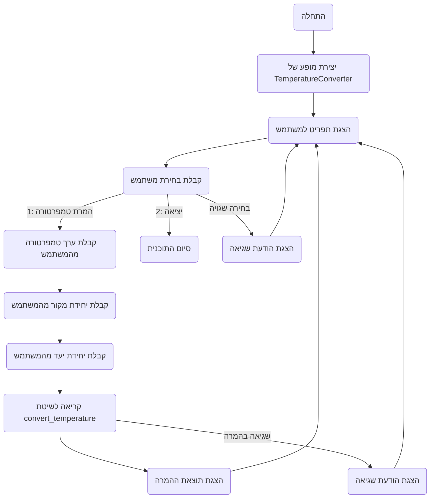

## <algorithm>

1. **הגדרה של מחלקה `TemperatureConverter`**:
   - המחלקה משתמשת ב `@dataclass` לקיצור הגדרת המאפיינים (אין כאן מאפיינים, אבל זה מראה כוונה לעתיד).
   - היא מכילה שיטות להמרת טמפרטורות בין צלזיוס, פרנהייט וקלווין.
   - לדוגמה, הפונקציה `celsius_to_fahrenheit` מקבלת טמפרטורה בצלזיוס ומחזירה את הערך המקביל בפרנהייט.
   ```python
    def celsius_to_fahrenheit(self, celsius: float) -> float:
        fahrenheit = (celsius * 9/5) + 32
        return fahrenheit
    ```
   - השיטות האחרות עובדות בצורה דומה, כל אחת מבצעת המרה מסוימת.

2. **פונקציה `convert_temperature`**:
   - מקבלת ערך טמפרטורה, יחידת מקור ויחידת יעד.
   - אם יחידות המקור והיעד זהות, היא מחזירה את הערך המקורי ללא המרה.
   - אחרת, היא קובעת איזו המרה לבצע על סמך יחידות המקור והיעד וקוראת לשיטה המתאימה.
   - לדוגמה, אם יחידת המקור היא `C` ויחידת היעד היא `F`, היא קוראת לשיטה `celsius_to_fahrenheit`.
   ```python
    if from_unit == 'C':
        if to_unit == 'F':
            return self.celsius_to_fahrenheit(value)
    ```
   - אם יחידות המקור והיעד לא מוכרות, היא זורקת `ValueError`.
3.  **פונקציה `main`**:
    - יוצרת מופע של `TemperatureConverter`.
    - מציגה תפריט למשתמש עם האפשרויות: המרת טמפרטורה או יציאה.
    - אם המשתמש בוחר להמיר טמפרטורה, היא מבקשת מהמשתמש את הטמפרטורה, יחידת המקור ויחידת היעד.
    - היא קוראת לשיטה `convert_temperature` ומדפיסה את התוצאה.
    - אם המשתמש בוחר לצאת, היא מסיימת את התוכנית.
    - אם יש קלט שגוי, היא מטפלת בשגיאה ומציגה הודעה מתאימה.
4. **הפעלה של `main`**:
    - הקוד מפעיל את פונקציית `main` כאשר הקובץ מופעל ישירות.

## <mermaid>


## <explanation>

**ייבואים (Imports):**
- `from dataclasses import dataclass`: מייבא את הדקורטור `dataclass` מהמודול `dataclasses`. הדקורטור הזה משמש ליצירת מחלקות עם מאפיינים (variables) בצורה אוטומטית יותר, אך במקרה הזה, המחלקה `TemperatureConverter` אין בה מאפיינים מלבד שיטות. הדקורטור בעיקר נועד לאפשר יצירה קלה של מחלקות אשר בעיקר נועדו לשאת מידע.

**מחלקות (Classes):**
- `TemperatureConverter`:
  - זוהי מחלקה שמטרתה להמיר טמפרטורות בין יחידות מידה שונות: צלזיוס, פרנהייט וקלווין.
  - אין לה מאפיינים, אך יש לה מספר שיטות המבצעות את ההמרות:
    - `celsius_to_fahrenheit`: ממירה מצלזיוס לפרנהייט.
    - `fahrenheit_to_celsius`: ממירה מפרנהייט לצלזיוס.
    - `celsius_to_kelvin`: ממירה מצלזיוס לקלווין.
    - `kelvin_to_celsius`: ממירה מקלווין לצלזיוס.
    - `fahrenheit_to_kelvin`: ממירה מפרנהייט לקלווין (באמצעות שתי שיטות אחרות).
    - `kelvin_to_fahrenheit`: ממירה מקלווין לפרנהייט (באמצעות שתי שיטות אחרות).
    - `convert_temperature`: מקבלת ערך טמפרטורה, יחידת מקור ויחידת יעד, ומבצעת את ההמרה המתאימה.
  - האינטראקציה של המחלקה עם שאר הקוד מתבטאת בפונקציה `main` שיוצרת מופע של המחלקה ומשתמשת בשיטות שלה.
  - אין שרשרת תלות עם חלקים אחרים בפרויקט, היא פועלת באופן עצמאי.

**פונקציות (Functions):**
- `celsius_to_fahrenheit(self, celsius: float) -> float`:
  - פרמטר: `celsius` (טמפרטורה בצלזיוס).
  - ערך מוחזר: טמפרטורה בפרנהייט.
  - מטרה: המרת טמפרטורה מצלזיוס לפרנהייט.
  - דוגמה: `celsius_to_fahrenheit(25)` מחזירה `77.0`.
- `fahrenheit_to_celsius(self, fahrenheit: float) -> float`:
    - פרמטר: `fahrenheit` (טמפרטורה בפרנהייט).
    - ערך מוחזר: טמפרטורה בצלזיוס.
    - מטרה: המרת טמפרטורה מפרנהייט לצלזיוס.
    - דוגמה: `fahrenheit_to_celsius(68)` מחזירה `20.0`.
- `celsius_to_kelvin(self, celsius: float) -> float`:
    - פרמטר: `celsius` (טמפרטורה בצלזיוס).
    - ערך מוחזר: טמפרטורה בקלווין.
    - מטרה: המרת טמפרטורה מצלזיוס לקלווין.
    - דוגמה: `celsius_to_kelvin(0)` מחזירה `273.15`.
- `kelvin_to_celsius(self, kelvin: float) -> float`:
    - פרמטר: `kelvin` (טמפרטורה בקלווין).
    - ערך מוחזר: טמפרטורה בצלזיוס.
    - מטרה: המרת טמפרטורה מקלווין לצלזיוס.
    - דוגמה: `kelvin_to_celsius(273.15)` מחזירה `0.0`.
- `fahrenheit_to_kelvin(self, fahrenheit: float) -> float`:
   - פרמטר: `fahrenheit` (טמפרטורה בפרנהייט).
   - ערך מוחזר: טמפרטורה בקלווין.
   - מטרה: המרת טמפרטורה מפרנהייט לקלווין.
   - דוגמה: `fahrenheit_to_kelvin(32)` מחזירה `273.15`.
- `kelvin_to_fahrenheit(self, kelvin: float) -> float`:
  - פרמטר: `kelvin` (טמפרטורה בקלווין).
  - ערך מוחזר: טמפרטורה בפרנהייט.
  - מטרה: המרת טמפרטורה מקלווין לפרנהייט.
  - דוגמה: `kelvin_to_fahrenheit(273.15)` מחזירה `32.0`.
- `convert_temperature(self, value: float, from_unit: str, to_unit: str) -> float`:
  - פרמטרים: `value` (טמפרטורה), `from_unit` (יחידת מקור), `to_unit` (יחידת יעד).
  - ערך מוחזר: טמפרטורה מומרת.
  - מטרה: המרת טמפרטורה מיחידה אחת לאחרת.
  - דוגמה: `convert_temperature(25, 'C', 'F')` מחזירה `77.0`.
- `main()`:
  - פרמטרים: אין.
  - ערך מוחזר: אין.
  - מטרה: אינטראקציה עם משתמש, קבלת קלט וביצוע המרות טמפרטורה.
  - דוגמה: הפונקציה מתחילה לרוץ עם הפעלת התוכנית, ומציגה תפריט למשתמש.

**משתנים (Variables):**
- משתנים מקומיים בתוך הפונקציות, כגון `celsius`, `fahrenheit`, `kelvin`, `value`, `from_unit`, `to_unit` – כולם משמשים לאחסון ערכים זמניים במהלך החישוב או הקלט מהמשתמש.
- `converter` בתוך הפונקציה `main` – הוא מופע של המחלקה `TemperatureConverter`, משמש לקריאה לשיטות ההמרה.

**בעיות אפשריות או תחומים לשיפור:**
- הטיפול בשגיאות בהמרה יכול להיות יותר מפורט.
- ניתן להוסיף בדיקת קלט נוספת כדי לוודא שיחידות המידה שהמשתמש מזין אכן חוקיות (אולי להשתמש ב-enum או במשתנה קבוע).
- ניתן להוסיף תיעוד טוב יותר לכל הפונקציות והמחלקה.
- ניתן להוסיף בדיקות יחידה (unit tests) כדי לוודא שההמרה מתבצעת כראוי.

**שרשרת קשרים:**
הקוד הנוכחי הוא עצמאי ולא תלוי בחלקים אחרים בפרויקט.