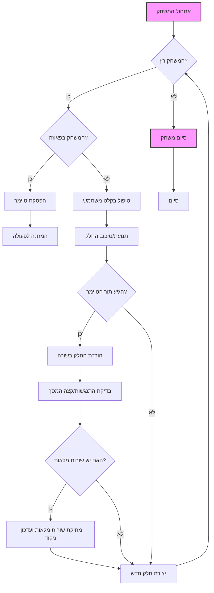

## ניתוח קוד משחק הטטריס

### 1. <algorithm>

**תרשים זרימה צעד-אחר-צעד:**

1.  **אתחול המשחק (A):**
    *   המשחק מתחיל ויוצר אובייקט `Tetris` המייצג את החלון הראשי.
    *   מוגדרים משתני משחק התחלתיים:
        *   `isStarted = False`
        *   `isPaused = False`
        *   לוח המשחק ריק (`board` - רשימה המכילה ערכים השווים ל-`Tetrominoe.NoShape`).

2.  **לולאת משחק ראשית (B):**
    *   בדיקה האם המשחק `isStarted`.
        *   **דוגמא**: בהתחלה, `isStarted` יהיה `False` והמשחק לא יתחיל.

3.  **טיפול בפעולות משתמש (F):**
    *   אם המשחק רץ, בדיקה האם המשתמש לחץ על מקש כלשהו.
        *   **דוגמא**: אם המשתמש לוחץ על מקש "P", המשחק עובר למצב "פאוזה".
        *   **דוגמא**: אם המשתמש לוחץ על חץ שמאלה, הפונקציה `tryMove` תנסה להזיז את החלק שמאלה.

4.  **תנועה וסיבוב של החלק (G):**
    *   ניסיון הזזה/סיבוב של החלק על ידי קריאה לפונקציה `tryMove`.
        *   **דוגמא**: אם המשתמש לחץ על חץ שמאלה, החלק מנסה לזוז שמאלה.
        *   **דוגמא**: אם המשתמש לחץ על חץ למטה, החלק מנסה להסתובב ימינה.
    *   אם התנועה אפשרית, החלק זז/מסתובב. אם לא, החלק נשאר במקומו.

5.  **תנועת החלק באופן אוטומטי (H):**
    *   האם הגיע זמן של הטיימר?
        *   אם כן, מעבר לשלב הורדת החלק.
        *   אם לא, חזרה ללולאת המשחק.
        
6.  **הורדת החלק באופן אוטומטי (I):**
    *   הורדה של החלק בשורה אחת למטה, באמצעות קריאה לפונקציה `oneLineDown()`.
        *   **דוגמא**: החלק זז שורה אחת למטה.
    *    אם החלק לא יכול לזוז למטה, עוברים לטיפול בנפילת החלק.

7.  **טיפול בנפילת החלק (J):**
    *   הפונקציה `pieceDropped()` נקראת.
        *   **דוגמא**: אם החלק נפל למטה או על חלק אחר, החלק מקובע במקום.
    *   החלק מקובע בלוח המשחק.
    *   הפונקציה `removeFullLines()` נקראת כדי לבדוק האם יש שורות מלאות, ואם כן, למחוק אותן.
     *   אם נוצרו שורות מלאות, הטיימר ישהה את המשחק עד להופעת החלק הבא.

8. **בדיקת שורות מלאות (K):**
   *   אם קיימות שורות מלאות (הפונקציה `removeFullLines()`), הן יוסרו.
   *   עדכון הניקוד, עידכון סטטוס.
   
9.  **יצירת חלק חדש (M):**
    *   בדיקה האם המשחק נגמר. אם כן, מסתיים המשחק (N).
    *   אם המשחק לא נגמר, נוצר חלק חדש (פונקציה `newPiece()`), והמשחק חוזר ללולאה הראשית (B).

10. **סיום המשחק (N):**
    *   אם אין מקום לחלק החדש המשחק מסתיים, והודעת `Game Over` תופיע.

### 2. <mermaid>

**ניתוח תלויות יבוא:**

הקוד מייבא את המודולים הבאים:

*   `sys`: מודול זה מספק גישה לפרמטרים ופונקציות ספציפיות למערכת. משמש כאן כדי לסיים את האפליקציה עם `sys.exit(app.exec_())`.
*   `random`: מודול ליצירת מספרים אקראיים, משמש כאן ליצירת צורות אקראיות של החלקים (`Shape.setRandomShape()`).
*   `PyQt5.QtWidgets`: מודול המכיל ווידג'טים גרפיים כמו `QMainWindow`, `QFrame`, `QDesktopWidget`, ו-`QApplication`.
*   `PyQt5.QtCore`: מודול המכיל פונקציונליות ליבה כמו `Qt`, `QBasicTimer` ו `pyqtSignal` המשמשים עבור האותות והתזמון.
*   `PyQt5.QtGui`: מודול המכיל אובייקטים גרפיים כמו `QPainter` ו- `QColor` עבור ציור על המסך.

### 3. <explanation>

**ייבוא (Imports):**

*   `import sys, random`: ייבוא מודולים בסיסיים של פייתון עבור פעולות מערכת (יציאה מהאפליקציה) ויצירת מספרים אקראיים.
*   `from PyQt5.QtWidgets import QMainWindow, QFrame, QDesktopWidget, QApplication`: ייבוא מחלקות ספציפיות מ-PyQt5 לניהול חלונות, ווידג'טים ומסך.
*   `from PyQt5.QtCore import Qt, QBasicTimer, pyqtSignal`: ייבוא מחלקות PyQt5 לניהול אותות, טיימרים וקבועים.
*   `from PyQt5.QtGui import QPainter, QColor`: ייבוא מחלקות PyQt5 לציור גרפיקה וצבעים.

**מחלקות (Classes):**

*   **`Tetris(QMainWindow)`**:
    *   **תפקיד:** מחלקה המייצגת את החלון הראשי של המשחק.
    *   **מאפיינים:** אין מאפיינים משמעותיים.
    *   **שיטות:**
        *   `__init__(self)`: מאתחלת את החלון, קוראת ל- `initUI`.
        *   `initUI(self)`: יוצרת את לוח המשחק (`Board`) ומוסיפה אותו לחלון, מגדירה את הסרגל סטטוס, ומפעילה את המשחק.
        *   `center(self)`: ממקמת את החלון במרכז המסך.
    *   **אינטראקציה:** יוצרת את אובייקט `Board` ומנהלת את חלון המשחק הראשי.

*   **`Board(QFrame)`**:
    *   **תפקיד:** מחלקה המייצגת את לוח המשחק של הטטריס.
    *   **מאפיינים:**
        *   `msg2Statusbar`: אות (Signal) המשמש להעברת הודעות לסרגל הסטטוס.
        *   `BoardWidth`: רוחב הלוח בבלוקים (קבוע).
        *   `BoardHeight`: גובה הלוח בבלוקים (קבוע).
        *   `Speed`: מהירות נפילת החלקים (קבוע).
    *   **שיטות:**
        *   `__init__(self, parent)`: מאתחלת את הלוח ומשתני המשחק.
        *    `initBoard(self)`: מאתחלת את לוח המשחק ומשתנים נוספים כגון טיימר, מיקום החלק הנוכחי ועוד.
        *   `shapeAt(self, x, y)`: מחזירה את צורת החלק במיקום (x,y) בלוח.
        *   `setShapeAt(self, x, y, shape)`: מגדירה את צורת החלק במיקום (x,y) בלוח.
        *   `squareWidth(self)`: מחזירה את רוחב בלוק בודד בפיקסלים.
        *   `squareHeight(self)`: מחזירה את גובה בלוק בודד בפיקסלים.
        *   `start(self)`: מתחילה את המשחק.
        *   `pause(self)`: משהה או מחדשת את המשחק.
        *   `paintEvent(self, event)`: מציירת את לוח המשחק ואת החלק הנוכחי.
        *   `keyPressEvent(self, event)`: מטפלת בלחיצות מקלדת (למשל, הזזת חלקים).
        *   `timerEvent(self, event)`: מטפלת באירועי טיימר (למשל, הורדת החלק באופן אוטומטי).
        *   `clearBoard(self)`: מנקה את לוח המשחק.
        *   `dropDown(self)`: מורידה את החלק עד הסוף.
        *   `oneLineDown(self)`: מורידה את החלק שורה אחת למטה.
        *   `pieceDropped(self)`: מקבעת את החלק בלוח.
        *   `removeFullLines(self)`: מסירה שורות מלאות בלוח.
        *   `newPiece(self)`: יוצרת חלק חדש ומוסיפה אותו ללוח.
        *   `tryMove(self, newPiece, newX, newY)`: מנסה להזיז או לסובב את החלק.
        *   `drawSquare(self, painter, x, y, shape)`: מציירת בלוק בודד בלוח.
    *   **אינטראקציה:** חלק מרכזי במשחק, מטפל בכל הפעולות על לוח המשחק, כולל הזזה, ציור, ועדכון. שולח אותות לסטטוס בר.

*   **`Tetrominoe`**:
    *   **תפקיד:** מחלקה המגדירה את סוגי הצורות השונות בטטריס.
    *   **מאפיינים:** מחלקה עם משתנים קבועים המייצגים סוגים שונים של צורות.
        * `NoShape`, `ZShape`, `SShape`, `LineShape`, `TShape`, `SquareShape`, `LShape`, `MirroredLShape`
    *  **שיטות:** אין שיטות, משמשת כאוסף של קבועים בלבד.
    *  **אינטראקציה:** משמשת את `Shape` ו `Board` להגדרת ולטיפול בסוגי הצורות השונים.

*   **`Shape`**:
    *   **תפקיד:** מחלקה המייצגת צורה בטטריס.
    *   **מאפיינים:**
        *   `coords`: רשימה של קואורדינטות המגדירות את מיקום החלק.
        *   `pieceShape`: סוג הצורה (מ-`Tetrominoe`).
    *   **שיטות:**
        *   `__init__(self)`: מאתחלת את הצורה עם צורה ריקה.
        *   `shape(self)`: מחזירה את סוג הצורה.
        *   `setShape(self, shape)`: מגדירה את סוג הצורה.
        *   `setRandomShape(self)`: מגדירה צורה אקראית.
        *   `x(self, index)`: מחזירה את קואורדינטת ה-x של בלוק מסוים בצורה.
        *   `y(self, index)`: מחזירה את קואורדינטת ה-y של בלוק מסוים בצורה.
        *    `setX(self, index, x)`: מגדירה את קואורדינטת ה-x של בלוק מסוים בצורה.
        *    `setY(self, index, y)`: מגדירה את קואורדינטת ה-y של בלוק מסוים בצורה.
        *   `minX(self)`: מחזירה את ערך ה-x המינימלי של הצורה.
        *   `maxX(self)`: מחזירה את ערך ה-x המקסימלי של הצורה.
        *   `minY(self)`: מחזירה את ערך ה-y המינימלי של הצורה.
        *   `maxY(self)`: מחזירה את ערך ה-y המקסימלי של הצורה.
        *   `rotateLeft(self)`: מסובבת את הצורה שמאלה.
        *   `rotateRight(self)`: מסובבת את הצורה ימינה.
    *   **אינטראקציה:** אחראית לניהול צורות וסיבוב שלהן.

**פונקציות (Functions):**

*   **פונקציות בתוך מחלקות:**
    *   כל השיטות בתוך המחלקות (כפי שתואר לעיל) הן פונקציות.
    *   **דוגמאות**:
        *   `Board.start()`: ללא פרמטרים, מתחילה את המשחק, לא מחזירה ערך.
        *   `Shape.rotateLeft()`: ללא פרמטרים, מחזירה אובייקט `Shape` חדש מסובב.
*   **`if __name__ == '__main__':`**
    *   יוצרת אובייקט `QApplication` שהוא האובייקט המרכזי של PyQt, ויוצרת את חלון המשחק הראשי.
    *   מפעילה את המשחק על ידי `sys.exit(app.exec_())`.

**משתנים (Variables):**

*   משתנים כמו `Board.BoardWidth`, `Board.BoardHeight`, `Board.Speed` הם קבועים המגדירים את מידות ומהירות המשחק.
*   `self.board` הוא רשימה המייצגת את לוח המשחק, שומרת את סוג הצורה בכל משבצת.
*   `self.curPiece` הוא אובייקט `Shape` שמייצג את החלק הנופל הנוכחי.
*   `self.curX` ו-`self.curY` הם קואורדינטות של החלק הנופל.
*   `self.timer` הוא אובייקט `QBasicTimer` שמנהל את הזמנים של המשחק.

**בעיות אפשריות ושיפורים:**

*   **מבנה קוד**: הקוד בעיקרו פונקציונלי אבל יכול להיות מודולרי יותר, לדוגמה, להפריד את הציור של המסך למחלקה נפרדת.
*   **יעילות**: ניתן לבצע אופטימיזציה לאלגוריתם הסרת השורות.
*   **בדיקות**: חסרות בדיקות קצה, כמו בדיקה אם אפשר לסובב חלק לפני סיבוב.
*   **הפרדה בין הלוגיקה לתצוגה**: כדאי להפריד בין הלוגיקה של המשחק (למשל, איך להזיז חלק) לבין האופן שבו זה מוצג על המסך.
*   **קלות שימוש**: אפשר להוסיף תפריטים והגדרות משחק.

**שרשרת קשרים עם חלקים אחרים בפרויקט:**

במקרה הזה, מדובר במשחק עצמאי ולכן אין קשרים עם חלקים אחרים בפרויקט. עם זאת, אם היה מדובר בחלק של פרויקט גדול יותר, המחלקות של המשחק היו יכולות לתקשר עם מחלקות אחרות, למשל, מחלקה לניהול משתמשים או לניהול נתונים.