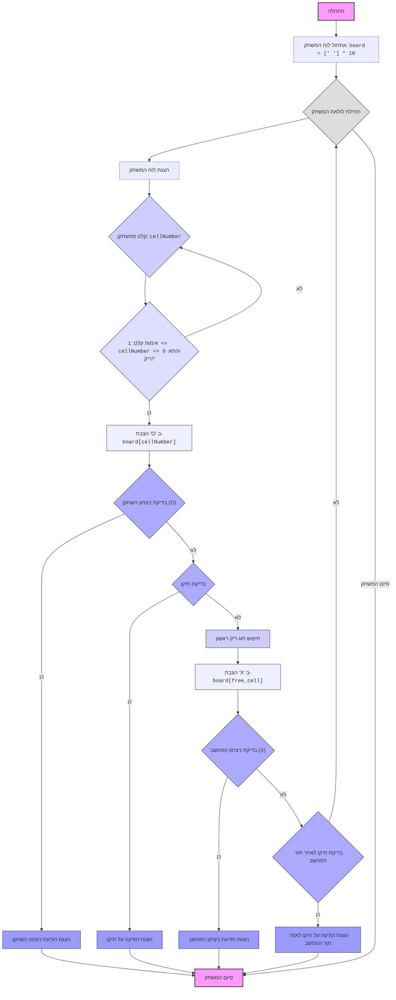

## ניתוח קוד: משחק איקס עיגול (Tic Tac Toe)

### <algorithm>
1. **אתחול הלוח:**
   - יוצרים רשימה `board` בגודל 10, כאשר האינדקסים 1-9 מייצגים את תאי המשחק ואינדקס 0 אינו בשימוש.
   - כל התאים מאותחלים לתו רווח (' ') כדי לציין תאים ריקים.
   - *דוגמה:* `board = [' ', ' ', ' ', ' ', ' ', ' ', ' ', ' ', ' ', ' ']`

2. **לולאת משחק:**
   - מתחילים לולאה אינסופית `while True:` שרצה עד שהמשחק מסתיים (ניצחון או תיקו).
   - בכל איטרציה, מציגים את הלוח הנוכחי באמצעות `print_board(board)`.
   - מתחילים לולאת קלט לשחקן `while True:`.
     - מבקשים מהשחקן להזין מספר תא בין 1 ל-9.
     - קולטים את הקלט וממירים אותו למספר שלם.
     - בודקים אם הקלט תקין: האם המספר בין 1 ל-9 והאם התא ריק?
     - אם הקלט תקין, מציבים 'O' בתא המתאים ומפסיקים את לולאת הקלט.
     - אם הקלט לא תקין, מציגים הודעת שגיאה ומבקשים מהשחקן לנסות שוב.
   - בודקים אם השחקן ניצח באמצעות `check_win(board, 'O')`.
     - אם השחקן ניצח, מציגים הודעת ניצחון ומסיימים את המשחק (הלולאה האינסופית).
   - בודקים אם המשחק הסתיים בתיקו באמצעות `check_draw(board)`.
     - אם המשחק בתיקו, מציגים הודעה על תיקו ומסיימים את המשחק.
   - מגיע תור המחשב.
   - מחפשים את התא הריק הראשון בלוח באמצעות לולאה.
   - מציבים 'X' בתא הריק הראשון שנמצא.
   - בודקים אם המחשב ניצח באמצעות `check_win(board, 'X')`.
     - אם המחשב ניצח, מציגים הודעת ניצחון ומסיימים את המשחק.
   - בודקים אם המשחק הסתיים בתיקו לאחר תור המחשב.
     - אם המשחק בתיקו, מציגים הודעה על תיקו ומסיימים את המשחק.
   - אם אף אחד לא ניצח והמשחק לא הסתיים בתיקו, חוזרים לתחילת הלולאה הראשית להצגת הלוח ומתן תור לשחקן.

3. **סיום המשחק:**
   - המשחק מסתיים כאשר אחד השחקנים ניצח או כאשר המשחק הסתיים בתיקו.

### <mermaid>


### <explanation>

**ייבואים (Imports):**
- אין ייבוא בחלק הזה של הקוד.

**מחלקות (Classes):**
- אין מחלקות בקוד הזה.

**פונקציות (Functions):**
1.  **`print_board(board)`:**
    -   **פרמטרים:** `board` - רשימה המייצגת את לוח המשחק.
    -   **ערך מוחזר:** אין.
    -   **מטרה:** להציג את לוח המשחק הנוכחי בפורמט קריא למשתמש.
    -   **דוגמה:** אם `board = [' ', 'X', 'O', ' ', 'O', 'X', ' ', ' ', 'X', ' ']`, הפלט יהיה:

       ```
        X | O |
       ---+---+---
        O | X |
       ---+---+---
        |  | X
       ```
2.  **`check_win(board, player)`:**
    -   **פרמטרים:** `board` - רשימת לוח המשחק, `player` - התו של השחקן ('X' או 'O').
    -   **ערך מוחזר:** `True` אם השחקן ניצח, אחרת `False`.
    -   **מטרה:** לבדוק אם יש רצף של שלושה תווים זהים (אופקי, אנכי או אלכסוני) עבור השחקן הנוכחי.
    -   **דוגמה:** אם `board = [' ', 'X', 'X', 'X', ' ', 'O', 'O', ' ', ' ', ' ']`, ו-`player = 'X'`, הפונקציה תחזיר `True`.
3.  **`check_draw(board)`:**
    -   **פרמטרים:** `board` - רשימת לוח המשחק.
    -   **ערך מוחזר:** `True` אם המשחק בתיקו (כל התאים מלאים), אחרת `False`.
    -   **מטרה:** לבדוק האם כל התאים בלוח מלאים ואין יותר מהלכים אפשריים.
    -   **דוגמה:** אם `board = [' ', 'X', 'O', 'X', 'O', 'X', 'X', 'O', 'X', 'O']`, הפונקציה תחזיר `True`.
4.  **`play_tic_tac_toe()`:**
    -   **פרמטרים:** אין.
    -   **ערך מוחזר:** אין.
    -   **מטרה:** לנהל את המשחק כולו: אתחול, קלט, תורות, בדיקות ניצחון/תיקו.
    -   **דוגמה:** הפונקציה קוראת לפונקציות אחרות להצגת הלוח, קבלת קלט מהמשתמש ובדיקות ניצחון/תיקו עד סיום המשחק.

**משתנים (Variables):**
-   `board`: רשימה המייצגת את לוח המשחק. גודל הרשימה הוא 10, אך רק אינדקסים 1 עד 9 משמשים לתאים בלוח. אינדקס 0 אינו בשימוש.
-   `cellNumber`: מספר שלם שמייצג את התא בלוח שהשחקן בחר.
-   `player`: תו שמייצג את השחקן ('X' או 'O').
-   `winning_combinations`: רשימה של רשימות, המייצגת את כל הצירופים המנצחים האפשריים.

**בעיות אפשריות או תחומים לשיפור:**
1. **בחירת מהלכי מחשב:** המחשב תמיד בוחר את התא הריק הראשון, מה שהופך את המשחק לפשוט מאוד. ניתן ליישם אלגוריתם יותר מתוחכם למהלכי המחשב, כמו אלגוריתם מינימקס.
2. **קלט משתמש:** אין טיפול בשגיאות קלט מתקדם. ניתן להוסיף בדיקות נוספות לאימות הקלט.
3. **יכולת הרחבה:** קשה להרחיב את המשחק לגודל לוח שונה בלי לשנות חלק משמעותי מהקוד.

**שרשרת קשרים עם חלקים אחרים בפרויקט:**
-   הקוד הזה עצמאי ואינו תלוי בחלקים אחרים של הפרויקט.