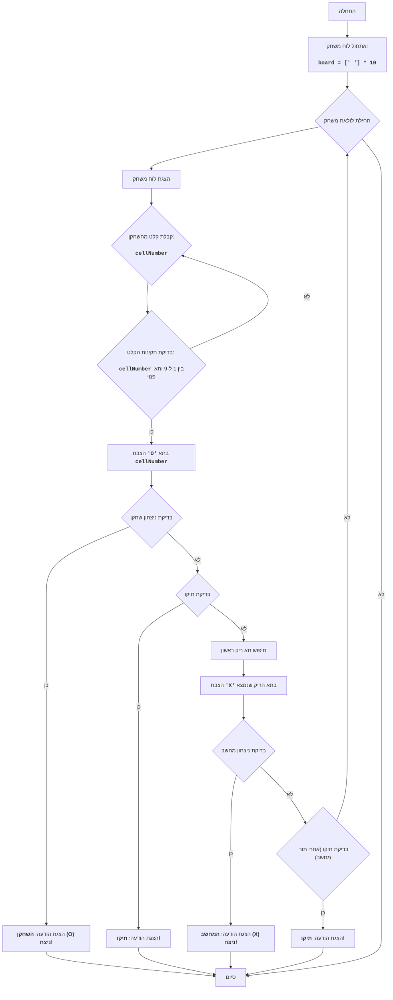

## ניתוח קוד: משחק איקס עיגול

### 1. <algorithm>

**תיאור תהליך העבודה של הקוד:**

1.  **אתחול לוח המשחק:**
    *   יוצר רשימה `board` באורך 10, כאשר האינדקסים 1-9 מייצגים את תאי המשחק ואינדקס 0 לא בשימוש.
    *   כל התאים מאותחלים לתו רווח ` ` (ריק).
    *   דוגמה: `board = [' ', ' ', ' ', ' ', ' ', ' ', ' ', ' ', ' ', ' ']`
2.  **לולאת משחק ראשית:**
    *   הלולאה ממשיכה עד שמוכרז מנצח או שהמשחק מסתיים בתיקו.
    *   בכל איטרציה, לוח המשחק הנוכחי מוצג לשחקן.
3.  **תור השחקן (אדם):**
    *   לולאה פנימית ממשיכה עד שהשחקן מכניס קלט תקין.
    *   השחקן מתבקש להכניס את מספר התא (1-9) שבו הוא רוצה לשים את עיגול 'O'.
    *   הקלט נבדק:
        *   האם המספר הוא בין 1 ל-9.
        *   האם התא שבחר השחקן פנוי.
        *   אם הקלט תקין, 'O' מוצב בתא המתאים.
        *   אחרת, מוצגת הודעת שגיאה.
    *   דוגמה: השחקן מכניס 5, התא החמישי בלוח משתנה ל-'O'.
4.  **בדיקת ניצחון שחקן:**
    *   הפונקציה `check_win` בודקת האם השחקן ניצח.
    *   אם כן, לוח המשחק מוצג, מוצגת הודעת ניצחון והמשחק מסתיים.
5.  **בדיקת תיקו:**
    *   הפונקציה `check_draw` בודקת האם המשחק הסתיים בתיקו.
    *   אם כן, לוח המשחק מוצג, מוצגת הודעת תיקו והמשחק מסתיים.
6.  **תור המחשב:**
    *   המחשב מוצא את התא הראשון הפנוי בלוח.
    *   הוא מסמן את התא ב-'X'.
    *   דוגמה: אם התא הראשון הפנוי הוא 2, אז המחשב ישים 'X' בתא 2.
7.  **בדיקת ניצחון מחשב:**
    *   הפונקציה `check_win` בודקת האם המחשב ניצח.
    *   אם כן, לוח המשחק מוצג, מוצגת הודעת ניצחון והמשחק מסתיים.
8.  **בדיקת תיקו (אחרי תור המחשב):**
    *   הפונקציה `check_draw` בודקת האם המשחק הסתיים בתיקו.
    *   אם כן, לוח המשחק מוצג, מוצגת הודעת תיקו והמשחק מסתיים.
9.  **חזרה ללולאה הראשית:**
    *   אם לא הוכרז מנצח ואין תיקו, המשחק ממשיך לסיבוב הבא (חזרה ל-2).

**זרימת נתונים:**

*   המשתנה `board` משמש להעברת נתונים בין הפונקציות: `print_board`, `check_win`, `check_draw` וכן בתוך `play_tic_tac_toe`.
*   המשתנה `player` (או 'X' / 'O') מועבר לפונקציה `check_win`.
*   `cellNumber` קלט מהמשתמש ומשמש כאינדקס לגישה לתוך `board`.

### 2. <mermaid>

**ניתוח התלויות והייבוא:**

*   אין ייבוא מיוחד, כל הקוד נמצא בקובץ אחד.
*   התלויות הן בין הפונקציות השונות בקובץ:
    *   `play_tic_tac_toe` משתמשת ב-`print_board`, `check_win` ו-`check_draw`.
    *   `check_win` משתמשת ב-`board` וב-`player` כדי לבדוק תנאי ניצחון.
    *   `check_draw` משתמשת ב-`board` כדי לבדוק תנאי תיקו.
    *   `print_board` משתמשת ב-`board` כדי להציג את לוח המשחק.

### 3. <explanation>

**ייבוא (Imports):**

*   אין ייבוא (imports) בקוד זה, כל הפונקציות והלוגיקה נמצאים בקובץ אחד.

**מחלקות (Classes):**

*   אין מחלקות בקוד זה.

**פונקציות (Functions):**

*   **`print_board(board)`:**
    *   **פרמטרים:** `board` - רשימה המייצגת את לוח המשחק.
    *   **ערך מוחזר:** אין.
    *   **מטרה:** להדפיס את לוח המשחק הנוכחי למסך בצורה קריאה.
    *   **דוגמה:** אם `board` הוא `[' ', 'X', ' ', 'O', ' ', ' ', 'X', 'O', ' ', ' ']`, הפונקציה תדפיס את לוח המשחק כאשר 'X' במיקום 1 ו-6, ו-'O' במיקום 3 ו-7.
*   **`check_win(board, player)`:**
    *   **פרמטרים:** `board` - לוח המשחק, `player` - סימן השחקן ('X' או 'O').
    *   **ערך מוחזר:** `True` אם השחקן ניצח, אחרת `False`.
    *   **מטרה:** לבדוק אם השחקן הנוכחי (או המחשב) ניצח.
    *   **דוגמה:** אם `board` הוא `[' ', 'X', 'X', 'X', 'O', ' ', ' ', ' ', ' ', ' ']` ו-`player` הוא 'X', הפונקציה תחזיר `True`.
*   **`check_draw(board)`:**
    *   **פרמטרים:** `board` - לוח המשחק.
    *   **ערך מוחזר:** `True` אם המשחק בתיקו, אחרת `False`.
    *   **מטרה:** לבדוק אם המשחק הסתיים בתיקו (כל התאים מלאים ואין מנצח).
    *   **דוגמה:** אם `board` הוא `[' ', 'X', 'O', 'X', 'O', 'X', 'O', 'X', 'O', 'X']`, הפונקציה תחזיר `True`.
*   **`play_tic_tac_toe()`:**
    *   **פרמטרים:** אין.
    *   **ערך מוחזר:** אין.
    *   **מטרה:** לנהל את כל מהלך המשחק.
    *   **דוגמה:** כל התהליך של משחק איקס עיגול, כולל הצגת הלוח, קבלת קלט מהמשתמש, מהלכי המחשב, בדיקת ניצחון וכו'.

**משתנים (Variables):**

*   **`board`:** רשימה המייצגת את לוח המשחק.
    *   **סוג:** רשימה (list).
    *   **שימוש:** אחסון מצב המשחק ועדכון המיקומים שבהם 'X' ו-'O' מוצבים.
*   **`cellNumber`:** מספר התא שהמשתמש בחר.
    *   **סוג:** שלם (int).
    *   **שימוש:** אחסון קלט השחקן ושימוש כאינדקס כדי לעדכן את המיקום בלוח.
*   **`winning_combinations`:** רשימה המכילה את כל שילובי הניצחון האפשריים.
    *   **סוג:** רשימה של רשימות (list of lists).
    *   **שימוש:** משמשת לגישה ואימות ניצחון בתוך הפונקציה `check_win`.
*   **`player`:** סימן השחקן ('X' או 'O').
    *  **סוג:** מחרוזת (str)
    *   **שימוש:** בתוך הפונקציה `check_win`, משמש כדי להבדיל בין סימני השחקנים כאשר בודקים ניצחון.

**בעיות אפשריות או תחומים לשיפור:**

*   **אסטרטגיית מחשב פשוטה:** המחשב בוחר תמיד את התא הפנוי הראשון. ניתן לשפר את האסטרטגיה כדי שהמחשב יהיה יותר מאתגר.
*   **קלט לא תקין:** הקוד מטפל רק בשגיאות מסוג `ValueError` כאשר השחקן מכניס קלט שאינו מספר. ניתן להוסיף טיפול בשגיאות נוספות, כמו קלט שאינו בטווח 1-9.
*   **קריאות קוד:** ניתן לשפר את קריאות הקוד על ידי הוספת הערות נוספות, בעיקר בתוך הלולאה של `play_tic_tac_toe`, ושימוש ב-`constants` עבור 'X' ו-'O'.
*   **הפרדת לוגיקה:** ניתן להפריד בין הלוגיקה של המשחק (עדכון לוח, בדיקת ניצחון) מהלוגיקה של ממשק המשתמש (הדפסת לוח, קבלת קלט) כדי שהקוד יהיה יותר מודולרי.

**קשריות עם חלקים אחרים בפרויקט:**

*   כיוון שהקוד עומד בפני עצמו, אין לו קשר ישיר עם חלקים אחרים בפרויקט. עם זאת, ניתן להשתמש בקוד הזה כחלק ממודול משחקים גדול יותר, לדוגמה משחק איקס עיגול בתוך אפליקציית משחקים.