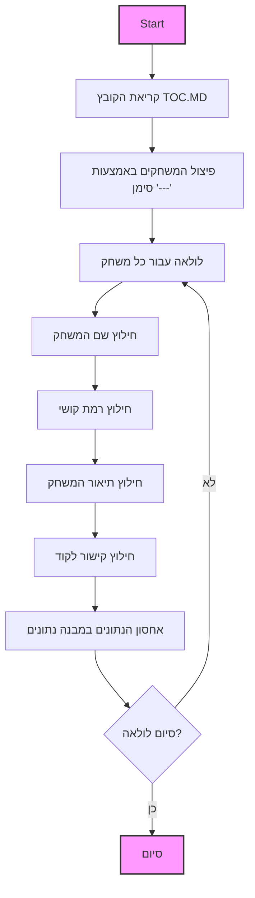

# ניתוח קוד: TOC.MD

## <algorithm>
קובץ זה אינו קוד Python אלא קובץ markdown (`.md`). הוא משמש כתוכן עניינים למשחקי מחשב, ומתאר כל משחק בנפרד.
האלגוריתם של ניתוח הקובץ הזה יכלול את השלבים הבאים:

1.  **קריאת הקובץ:** לקרוא את תוכן הקובץ `.md` כמחרוזת.
2.  **פיצול המשחקים:** לחלק את המחרוזת למקטעים נפרדים, כאשר כל מקטע מייצג משחק אחד. ניתן לעשות זאת באמצעות שימוש בסימן `---` המפריד בין משחק למשחק.
3.  **ניתוח כל משחק:** עבור כל משחק, לחלץ את המידע הבא:
    -   **שם המשחק:** מופיע בשורה הראשונה של כל בלוק.
        *   דוגמה: `ACEDU`
    -   **רמת קושי:** מופיעה בשורה לאחר שם המשחק, בעלת תבנית `Сложность X` כאשר X הוא מספר.
        *   דוגמה: `Сложность 3`
    -   **תיאור המשחק:** מופיע כטקסט אחרי רמת הקושי.
        *   דוגמה: `Карточная игра, в которой игрок делает ставку на то, будет ли следующая карта между двумя открытыми картами.`
    -   **קישור לקוד:** מופיע בשורה עם הכיתוב `[Перейти к коду]`, ומכיל קישור לגיטהאב.
        *   דוגמה: `https://github.com/hypo69/101_python_computer_games_ru/blob/master/GAMES/ACEDU`
4.  **ארגון הנתונים:** לארגן את המידע שנאסף בצורה נוחה, לדוגמה, מבנה נתונים כמו רשימה של מילונים.
    *   דוגמה:
    ```python
    [
        {
            "name": "ACEDU",
            "difficulty": 3,
            "description": "Карточная игра, в которой игрок делает ставку на то, будет ли следующая карта между двумя открытыми картами.",
            "code_link": "https://github.com/hypo69/101_python_computer_games_ru/blob/master/GAMES/ACEDU"
        },
        ...
    ]
    ```
5.  **הצגת הנתונים:** להציג את הנתונים המנותחים בצורה מובנית, למשל בטבלה או בצורה אחרת שתהיה קריאה ונוחה.

**זרימת נתונים:**

1.  **קלט:** הקובץ `TOC.MD`.
2.  **עיבוד:** קריאת הקובץ, פיצול המשחקים, ניתוח כל משחק, ואחסון הנתונים.
3.  **פלט:** מבנה נתונים מאורגן שמכיל את פרטי כל משחק.

## <mermaid>



התרשים מתאר את תהליך ניתוח הקובץ. לא נעשה שימוש בייבוא, ולכן אין תלויות מיובאות.

## <explanation>

**תיאור כללי:**
קובץ ה-`TOC.MD` הוא קובץ Markdown המשמש כתוכן עניינים (TOC) לפרויקט של 101 משחקי מחשב ברוסית. הוא אינו מכיל קוד Python אלא טקסט המסודר בצורה המאפשרת לסרוק בקלות את רשימת המשחקים, קושי המשחק, תיאור קצר וקישור לקוד המקור של כל משחק. קובץ זה מספק סקירה כללית של המשחקים הקיימים בפרויקט, ומאפשר למשתמשים לנווט בקלות בין המשחקים השונים.

**מבנה הקובץ:**
הקובץ מחולק למקטעים, כאשר כל מקטע מתאר משחק אחד. כל מקטע כולל:

1.  **שם המשחק:** שם המשחק באותיות גדולות.
2.  **רמת קושי:** הערכה מספרית של רמת הקושי של המשחק.
3.  **תיאור המשחק:** תיאור קצר של המשחק והכללים שלו.
4.  **קישור לקוד:** קישור לקובץ הקוד של המשחק ב-GitHub.

**ניתוח מפורט:**

-   **מבנה נתונים:**
    -   הנתונים מורכבים מרשימה של משחקים, כאשר כל משחק מתואר על ידי מילון המכיל את שם המשחק, רמת הקושי, תיאור וקישור לקוד.
-   **אין ייבוא (Imports):**
    -   מכיוון שזהו קובץ טקסטואלי, אין בו ייבוא של ספריות או מודולים.

-   **משתנים (Variables):**
    -   אין משתנים בקובץ עצמו, אך נשתמש במשתנים כאשר נעבד את המידע שבו בעזרת סקריפט (כמו סקריפט פייתון לדוגמה).
        -   לדוגמה: `game_name`, `difficulty_level`, `game_description`, `code_url` ישמשו לאחסון זמני של הנתונים.
        -   מבנה נתונים כמו `games_list` ישמש לאחסון רשימה של כל המשחקים לאחר הניתוח.

-   **פונקציות (Functions):**
    -   בעיקרון, אין פונקציות בקובץ עצמו. עם זאת, אם נכתוב קוד כדי לנתח את הקובץ, נשתמש בפונקציות כמו:
        -   פונקציה לקריאת הקובץ.
        -   פונקציה לפיצול הקובץ למקטעי משחק.
        -   פונקציה לחילוץ הנתונים מכל מקטע.
        -   פונקציה לארגון הנתונים במבנה נתונים רצוי.

**שרשרת קשרים עם חלקים אחרים בפרויקט:**

-   **קישור לקוד:** כל משחק מקושר לקובץ קוד ב-GitHub, מה שמצביע על קשר ישיר בין קובץ זה לבין קבצי הקוד של המשחקים.
-   **תוכן עניינים:** הקובץ משמש כנקודת התחלה למשתמשים המעוניינים לחקור את הפרויקט, ומהווה אינדקס לקבצי הקוד של כל משחק.
-   **חלק מהתיעוד:** קובץ זה הוא חלק מהתיעוד של הפרויקט ומספק סקירה נוחה וברורה של כל המשחקים.

**בעיות אפשריות ותחומים לשיפור:**
-   **פורמט לא אחיד:** ישנם מספר משחקים שמופיעים ללא כל תיאור או רמת קושי, דבר הפוגע באחידות הקובץ.
-   **שגיאות בקישורים:** יש לשים לב שכל הקישורים לקוד תקינים ומפנים לקבצים הנכונים.
-   **עדכון ידני:** יש לעדכן את הקובץ ידנית בכל פעם שמשחק חדש מתווסף או שמשחק קיים משתנה.

**סיכום:**
הקובץ `TOC.MD` הוא קובץ תיאור טקסטואלי חשוב בפרויקט זה, שכן הוא מספק סקירה מקיפה ונוחה של כל המשחקים הקיימים בפרויקט, מקל על הניווט בין המשחקים ומספק מידע בסיסי על כל אחד מהם.