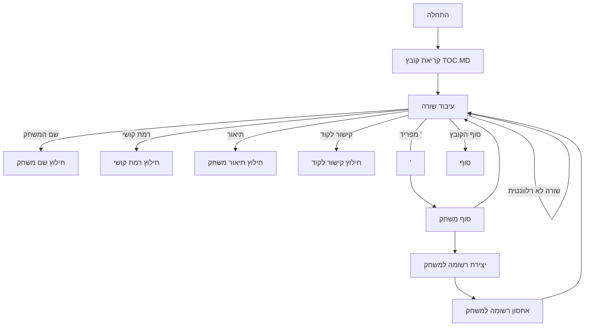

## <algorithm>

הקוד שסופק הוא קובץ markdown (`TOC.MD`) המתפקד כתוכן עניינים (Table of Contents) עבור אוסף של משחקי מחשב בסיסיים. כל רשומה בקובץ מתארת משחק בודד וכוללת את הפרטים הבאים:

1. **שם המשחק (Name)**: הכותרת של המשחק, לדוגמה, `ACEDU`.
2. **רמת קושי (Complexity)**: מספר המציין את רמת הקושי של המשחק, לדוגמה, `3`.
3. **תיאור המשחק (Description)**: תיאור קצר של עקרונות המשחק, לדוגמה, "משחק קלפים שבו השחקן מהמר אם הקלף הבא יהיה בין שני קלפים גלויים".
4. **קישור לקוד (Code Link)**: קישור למיקום הקוד של המשחק במאגר GitHub, לדוגמה, `https://github.com/hypo69/101_python_computer_games_ru/blob/master/GAMES/ACEDU`.

**תרשים זרימה צעד-אחר-צעד:**

1.  **התחלה:** הקובץ `TOC.MD` נקרא כקובץ טקסט.
2.  **עיבוד שורה אחר שורה:** הקובץ נסרק שורה אחר שורה.
    *   **זיהוי כותרת משחק:** שורה המכילה שם משחק, כמו `ACEDU`.
    *   **זיהוי רמת קושי:** שורה המכילה את המילה "Сложность" (קושי) ולאחריה מספר. לדוגמה, `Сложность 3`.
    *   **זיהוי תיאור:** שורות המכילות תיאור של המשחק. לדוגמה,  "&nbsp;&nbsp;&nbsp;&nbsp;&nbsp;משחק קלפים...".
    *   **זיהוי קישור:** שורה המתחילה ב-`* [Перейти к коду]`  ומכילה קישור למיקום הקוד. לדוגמה: `* [Перейти к коду](https://github.com/hypo69/101_python_computer_games_ru/blob/master/GAMES/ACEDU)`.
    *   **זיהוי מפריד:** שורה המכילה `---`, המסמנת את סוף תיאור המשחק הנוכחי והתחלה של משחק חדש.
3.  **יצירת מבנה נתונים:** כל מידע שנאסף על משחק (שם, קושי, תיאור, קישור) נשמר במבנה נתונים, לדוגמה, רשימה של מילונים.
    *   דוגמה למבנה הנתונים:
        ```python
        [
            {
                "name": "ACEDU",
                "complexity": 3,
                "description": "משחק קלפים...",
                "code_link": "https://github.com/hypo69/101_python_computer_games_ru/blob/master/GAMES/ACEDU"
            },
           {
                "name": "AMAZIN",
                "complexity": 6,
                "description": "משחק מבוך...",
                "code_link": "https://github.com/hypo69/101_python_computer_games_ru/blob/master/GAMES/AMAZIN"
            },
            ...
        ]
        ```
4.  **סיום:** עיבוד הקובץ מסתיים כאשר כל השורות נקראו.
    *  אם הקובץ מעובד על ידי תוכנית, ניתן להשתמש במבנה הנתונים ליצירת תפריט, הצגת מידע על המשחקים או ליצירת קישורים לדפים שלהם.

**זרימת נתונים:**
קובץ ה-`TOC.MD` מספק נתונים למערכת שיכולה להציג רשימה של משחקים. אין זרימה ישירה בין פונקציות, מחלקות או שיטות בתוך הקובץ עצמו, מכיוון שהוא קובץ נתונים ולא קוד הפעלה.

## <mermaid>


**ניתוח התלויות:**

*   אין תלויות מיובאות (imports) בקובץ מכיוון שהוא קובץ Markdown.
*   התרשים מציג את הלוגיקה של עיבוד הקובץ עצמו, לא תלויות בקוד.

## <explanation>

**הסבר מפורט:**

*   **ייבואים (Imports):** אין ייבואים מכיוון שזהו קובץ markdown ולא קוד Python. הוא אינו מתקשר ישירות עם חבילות אחרות.
*   **מחלקות (Classes):** אין מחלקות מכיוון שזהו קובץ markdown.
*   **פונקציות (Functions):** הקובץ עצמו אינו כולל פונקציות. התרשים מתאר את תהליך העיבוד שתוכנה יכולה לבצע על קובץ זה.
*   **משתנים (Variables):** אין משתנים במובן הרגיל של שפות תכנות. המידע בתוך הקובץ יכול להיחשב כמשתנים (לדוגמה, שם המשחק, רמת הקושי, התיאור והקישור), אך הם לא משתנים של תוכנה אלא נתוני קונפיגורציה.

**הסברים נוספים:**

*   **מבנה הקובץ:** הקובץ בנוי בצורה מובנית המאפשרת לקרוא ולנתח אותו בקלות. כל רשומה של משחק מופרדת על ידי מפריד (`---`), מה שמקל על עיבוד אוטומטי.
*   **מטרת הקובץ:** מטרת הקובץ היא לספק סקירה של כל משחקי המחשב הזמינים, כולל מידע בסיסי וקישורים לקוד שלהם. הוא משמש כאינדקס או תוכן עניינים לפרויקט.
*   **קשרים עם חלקים אחרים בפרויקט:** הקובץ הזה מתקשר באופן עקיף עם קבצי הקוד של המשחקים עצמם (הקבצים המקושרים במאגר ה-GitHub). תוכנה שמעבדת את הקובץ הזה יכולה להשתמש בקישורים כדי לגשת לקוד המקור של המשחקים. הקשר עם חלקים אחרים בפרויקט הוא דרך קישורים לקבצי הקוד האחרים, לכן הקובץ הזה מהווה נקודת כניסה למשחקים ומאפשר למשתמש לנווט אליהם בקלות.

**בעיות אפשריות ותחומים לשיפור:**

*   **אחידות:** הקובץ הנוכחי בנוי בפורמט markdown ידני. ניתן לשקול להשתמש בפורמט נתונים כמו JSON או YAML, אשר יותר קלים לעיבוד אוטומטי ופחות רגישים לטעויות הקלדה.
*   **סקיילביליות:** אם מספר המשחקים יגדל משמעותית, יהיה קשה לנהל את רשימת המשחקים באמצעות קובץ markdown אחד. במקרה זה, יהיה צורך במנגנון יעיל יותר לארגון וניהול המידע.
*   **עדכון:** עדכון פרטי המשחקים (לדוגמה, שם, תיאור, רמת קושי) כרוך בעריכת הקובץ באופן ידני. ניתן לייעל תהליך זה על ידי יצירת כלי אוטומטי לעדכון המידע.
*   **שפה:** הקובץ כתוב ברוסית. עבור קהל יעד בינלאומי, מומלץ לשקול תרגום או שימוש בשפה אנגלית או שפה ניטרלית אחרת.

בסופו של דבר, קובץ ה- `TOC.MD` הוא רשימה סטטית של משחקים עם קישורים לקוד שלהם. אין בו לוגיקה פנימית, אלא נתונים שמיועדים לעיבוד חיצוני על ידי תוכנה או משתמש.