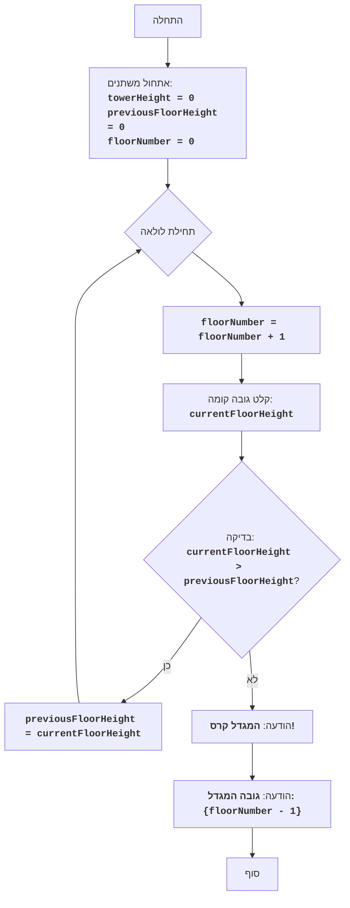

## <algorithm>

הקוד מיישם משחק פשוט בשם "מגדל", בו השחקן בונה מגדל על ידי הזנת גובה כל קומה. המגדל ממשיך לגדול כל עוד גובה הקומה הנוכחית גדול מהגובה של הקומה הקודמת. אם גובה הקומה הנוכחית שווה או קטן מהגובה של הקומה הקודמת, המגדל קורס והמשחק מסתיים.

1.  **אתחול משתנים:**
    *   `towerHeight` - גובה המגדל (לא בשימוש במימוש הנוכחי, אבל נשמר במפרט כמשתנה שקיים במשחק), מוגדר כ-0.
    *   `previousFloorHeight` - גובה הקומה הקודמת, מוגדר כ-0.
    *   `floorNumber` - מספר הקומה הנוכחית, מוגדר כ-0.
    *   דוגמה: `towerHeight = 0`, `previousFloorHeight = 0`, `floorNumber = 0`.

2.  **לולאה ראשית (while True):**
    *   הלולאה רצה עד שמתקיימת פקודת `break`.
    *   **הגדלת מספר הקומה:** `floorNumber` גדל ב-1.
        *   דוגמה: `floorNumber` הופך מ-0 ל-1.

    *   **קלט גובה קומה:**
        *   מוצגת הודעה למשתמש להזין את גובה הקומה הנוכחית, בהתאם למספר הקומה הנוכחית.
        *   הקלט נשמר כ-`currentFloorHeight` (מסוג שלם).
        *   דוגמה: השחקן מזין 5 ו-`currentFloorHeight` מקבל את הערך 5.
    *   **בדיקת תנאי קריסת המגדל:**
        *   `if currentFloorHeight > previousFloorHeight`: אם גובה הקומה הנוכחית גדול מגובה הקומה הקודמת.
            *   אם התנאי מתקיים:
                *   עדכון גובה הקומה הקודמת: `previousFloorHeight = currentFloorHeight`.
                *   דוגמה: אם `previousFloorHeight` היה 0 ו-`currentFloorHeight` הוא 5, אז `previousFloorHeight` הופך ל-5.
                *   הלולאה ממשיכה לסיבוב הבא.
        *   `else`: אם התנאי לא מתקיים (גובה הקומה הנוכחית קטן או שווה לגובה הקומה הקודמת).
            *   הדפסת הודעה שהמגדל קרס: "БАШНЯ РУХНУЛА!".
            *   הדפסת גובה המגדל: "Высота башни: {floorNumber - 1}" (מספר הקומה הנוכחית פחות 1).
            *   דוגמה: אם מספר הקומה הוא 4, אז גובה המגדל המוצג יהיה 3.
            *   יציאה מהלולאה עם `break`, והמשחק מסתיים.

## <mermaid>

**הסבר על התרשים ב-Mermaid:**

*   **Start (התחלה):** נקודת הכניסה לתוכנית.
*   **InitializeVariables (אתחול משתנים):**
    *   מאפס את `towerHeight` ל-0.
    *   מאפס את `previousFloorHeight` ל-0.
    *   מאפס את `floorNumber` ל-0.
*   **LoopStart (תחילת לולאה):** תחילת הלולאה הראשית.
*   **IncreaseFloorNumber (הגדלת מספר הקומה):** מגדיל את `floorNumber` ב-1.
*   **InputFloorHeight (קלט גובה קומה):** קולט את גובה הקומה הנוכחית מהמשתמש ומאחסן אותו ב-`currentFloorHeight`.
*   **CheckFloorHeight (בדיקה):**
    *   בודק אם `currentFloorHeight` גדול מ-`previousFloorHeight`.
    *   אם התנאי נכון (כן), ממשיך לעדכון גובה הקומה הקודמת.
    *   אם התנאי לא נכון (לא), ממשיך למסך סיום המשחק.
*   **UpdatePreviousFloorHeight (עדכון גובה הקומה הקודמת):** מעדכן את `previousFloorHeight` לערך של `currentFloorHeight`.
*   **OutputGameOver (הודעה שהמגדל קרס):** מדפיס הודעה שהמגדל קרס.
*   **OutputTowerHeight (הודעה על גובה המגדל):** מדפיס את גובה המגדל (מספר הקומות).
*   **End (סוף):** נקודת סיום התוכנית.

**הערות נוספות:**

*   אין תלות בספריות חיצוניות, ולכן אין ייבוא.
*   כל שמות המשתנים ב-Mermaid מובנים ומשקפים את מטרתם.

## <explanation>

**ייבואים (Imports):**

*   אין ייבוא של ספריות חיצוניות בקוד זה. הקוד פשוט ואינו תלוי בחבילות חיצוניות.

**מחלקות (Classes):**

*   אין מחלקות בקוד זה. הקוד מורכב רק מפונקציות, משתנים, ולולאות.

**פונקציות (Functions):**

*   אין הגדרות פונקציות מפורשות בקוד. הלוגיקה ממומשת ישירות בלולאה הראשית (`while True`).

**משתנים (Variables):**

*   **`towerHeight`**:
    *   סוג: `int` (מספר שלם).
    *   שימוש: אמור לייצג את גובה המגדל הכולל, אבל כרגע לא נעשה בו שימוש בפועל בקוד.
    *   דוגמה: `towerHeight = 0`.

*   **`previousFloorHeight`**:
    *   סוג: `int` (מספר שלם).
    *   שימוש: שומר את גובה הקומה הקודמת כדי להשוות לגובה הקומה הנוכחית.
    *   דוגמה: `previousFloorHeight = 5`.

*   **`floorNumber`**:
    *   סוג: `int` (מספר שלם).
    *   שימוש: שומר את מספר הקומה הנוכחית.
    *   דוגמה: `floorNumber = 3`.

*   **`currentFloorHeight`**:
    *   סוג: `int` (מספר שלם).
    *   שימוש: שומר את גובה הקומה הנוכחית שהמשתמש הזין.
    *   דוגמה: `currentFloorHeight = 7`.

**בעיות אפשריות ושיפורים:**

1.  **שימוש לא מספיק ב-`towerHeight`**:
    *   המשתנה `towerHeight` לא משמש לשום דבר בקוד הנוכחי. ניתן להשתמש בו כדי לחשב את גובה המגדל בפועל (סכום גבהי כל הקומות), אבל במקום זאת הוא מאותחל ואינו משתנה.
    *   **שיפור:** ניתן להשתמש בו כדי לסכום את גבהי כל הקומות שנוספו למגדל.
2.  **טיפול שגיאות**:
    *   הטיפול בשגיאות הקלט (ValueError) מתמקד רק בבעיה של אי קלט של מספר שלם.
    *  **שיפור**: ניתן להוסיף טיפול לערכים שליליים או ערכי אפס.
3.  **עיצוב קוד**:
    *   הקוד כולו כתוב ברמה אחת.
    *   **שיפור:** ניתן לשקול ארגון הקוד לפונקציות כדי להגביר את הקריאות והתחזוקה.
4.  **לוגיקה**:
    *   הלוגיקה של המשחק פשוטה, אבל ניתן לשקול הוספת מנגנונים נוספים (למשל, ניקוד, קומות בונוס, וכו).
    *  **שיפור**: ניתן להוסיף אפשרויות משחק מתקדמות יותר.

**שרשרת קשרים עם חלקים אחרים בפרויקט:**

*   הקוד הזה הוא משחק עצמאי ואינו תלוי בחלקים אחרים בפרויקט (לפי המידע שסופק). עם זאת, הוא יכול להיות חלק מספריית משחקים רחבה יותר, או להשתמש במנגנוני קלט/פלט אחרים אם הקוד היה משתלב בפרויקט גדול יותר.