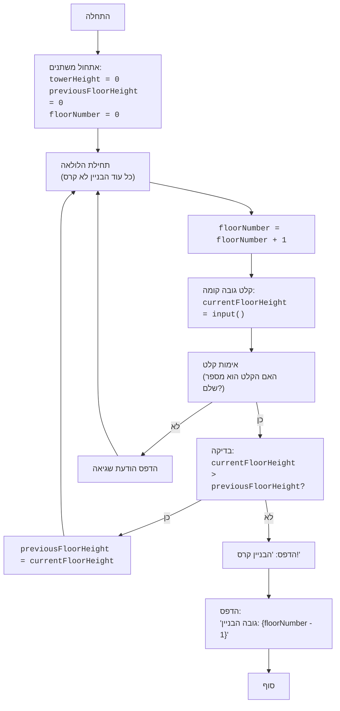

## <algorithm>

1.  **אתחול משתנים:**
    *   `towerHeight` = 0 (גובה הבניין)
    *   `previousFloorHeight` = 0 (גובה הקומה הקודמת)
    *   `floorNumber` = 0 (מספר הקומה הנוכחית)

    *דוגמה: בהתחלה, הבניין ריק, לא הייתה קומה קודמת ואנחנו בקומה 0.*

2.  **לולאה ראשית:**
    *   הלולאה ממשיכה כל עוד לא קרס הבניין.
    *   בכל איטרציה, `floorNumber` גדל ב-1.

    *דוגמה: `floorNumber` יהיה 1 באיטרציה הראשונה, 2 בשנייה, וכן הלאה.*

3.  **קלט גובה קומה:**
    *   המשתמש מתבקש להזין את גובה הקומה הנוכחית, הערך נשמר ב `currentFloorHeight`.
    *   נעשה טיפול בשגיאה כדי לוודא שהקלט הוא מספר שלם. אם הקלט לא תקין, מודפסת הודעת שגיאה והלולאה ממשיכה לאיטרציה הבאה.

    *דוגמה: אם המשתמש יזין 5 כגובה קומה 1, `currentFloorHeight` יהיה 5.*

4.  **בדיקת גובה:**
    *   אם `currentFloorHeight` גדול מ- `previousFloorHeight`:
        *   `previousFloorHeight` מעודכן ל- `currentFloorHeight`.
        *   הלולאה ממשיכה לקומה הבאה.
       *דוגמה: אם קומה 1 הייתה 5 וקומה 2 היא 8, אז `previousFloorHeight` יהפוך ל-8.*
    *   אחרת (אם `currentFloorHeight` קטן או שווה ל- `previousFloorHeight`):
        *   הודעה "הבניין קרס!" מודפסת.
        *   מודפס גובה הבניין (`floorNumber` - 1).
        *   הלולאה מסתיימת (המשחק נגמר).
       *דוגמה: אם קומה 1 הייתה 5 וקומה 2 היא 2, אז הבניין יקרוס, והגובה יהיה 1.*

## <mermaid>

## <explanation>

*   **ייבואים (Imports):**
    *   אין ייבוא בסקריפט זה. הקוד פשוט ואינו תלוי בספריות חיצוניות.
*   **משתנים (Variables):**
    *   `towerHeight`: משתנה שלם, המייצג את גובה הבניין (כמות הקומות). לא בשימוש ישיר בקוד, אלא מיוצג על ידי `floorNumber`.
    *   `previousFloorHeight`: משתנה שלם, המייצג את גובה הקומה הקודמת. מאותחל ל-0.
    *   `floorNumber`: משתנה שלם, המייצג את מספר הקומה הנוכחית. מאותחל ל-0 וגדל ב-1 בכל איטרציה של הלולאה.
    *   `currentFloorHeight`: משתנה שלם, המייצג את גובה הקומה הנוכחית שהמשתמש הזין.

*   **פונקציות (Functions):**
    *   אין פונקציות מוגדרות בסקריפט זה. כל הלוגיקה נמצאת בתוך לולאת `while`.
*   **לולאת `while True`:**
    *   הלולאה הראשית של המשחק. ממשיכה לפעול עד שהבניין קורס.
    *   בכל איטרציה:
        *   מספר הקומה גדל.
        *   מתקבל קלט מהמשתמש לגבי גובה הקומה הנוכחית.
        *   מתבצעת בדיקה האם גובה הקומה הנוכחית גדול מהקודמת.
            *   אם כן, גובה הקומה הקודמת מתעדכן.
            *   אם לא, המשחק נגמר ומוצג גובה הבניין.
*  **טיפול בשגיאות:**
     *   בלוק ה `try...except` מטפל במקרה בו המשתמש לא הכניס מספר שלם. במקרה כזה מודפסת הודעת שגיאה והלולאה ממשיכה לאיטרציה הבאה.
*   **בעיות אפשריות:**
    *   הקוד תלוי לחלוטין בקלט המשתמש. קלט לא תקין (למשל, אותיות במקום מספרים) עלול לגרום לשגיאות.
    *   אין הגבלה על גודל הקלט. קלט גדול מאוד (מספר עצום) עלול להוביל לבעיות בזיכרון או בביצועים.

*   **שיפורים אפשריים:**
    *   ניתן להוסיף פונקציות עבור חלקים שונים של הלוגיקה, כמו קבלת קלט, בדיקת קריסה, והדפסה.
    *   ניתן להוסיף הגבלות קלט, למשל להגביל את גובה הקומה לטווח מסוים.
    *   ניתן להוסיף אפשרות למשחק מרובה שחקנים או אפשרויות התאמה אישית נוספות.

**שרשרת קשרים עם חלקים אחרים בפרויקט:**

*   הקוד הזה הוא משחק עצמאי ואין לו קשרים ישירים לחלקים אחרים בפרויקט. הוא מייצג משחק בסיסי בתוך הקטגוריה של "101 basic computer games" בתוך הפרויקט.