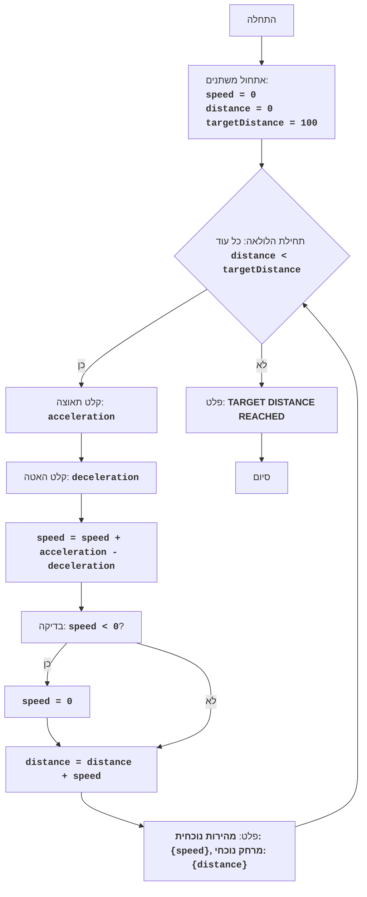

## ניתוח קוד: משחק רכבת

### 1. <algorithm>

**תיאור תהליך העבודה של הקוד:**

1.  **אתחול משתנים:**
    *   `speed` (מהירות): מתחיל מ-0.
    *   `distance` (מרחק): מתחיל מ-0.
    *   `targetDistance` (מרחק מטרה): מוגדר ל-100.
2.  **לולאה ראשית:** מתבצעת כל עוד `distance < targetDistance`.
    *   **קלט משתמש:**
        *   מבקש מהמשתמש להזין `acceleration` (תאוצה) וממיר אותו למספר עשרוני.
            *   **דוגמה:** משתמש מזין `5`.
        *   מבקש מהמשתמש להזין `deceleration` (האטה) וממיר אותו למספר עשרוני.
            *   **דוגמה:** משתמש מזין `2`.
        *   **טיפול בשגיאות:** בודק אם הקלט של המשתמש הוא מספר חוקי. אם לא, מדפיס הודעה וממשיך לאיטרציה הבאה של הלולאה.
    *   **חישוב מהירות חדשה:** `speed = speed + acceleration - deceleration`.
        *   **דוגמה:** אם `speed` הוא 10, `acceleration` הוא 5 ו-`deceleration` הוא 2, אז `speed` יהיה 10 + 5 - 2 = 13.
    *   **בדיקת מהירות:** אם `speed < 0`, אז `speed` = 0.
        *   **דוגמה:** אם `speed` הגיע ל- -2, הוא יהפוך ל-0.
    *   **חישוב מרחק חדש:** `distance = distance + speed`.
        *   **דוגמה:** אם `distance` הוא 50 ו-`speed` הוא 13, אז `distance` יהיה 50 + 13 = 63.
    *   **פלט:** מדפיס את המהירות הנוכחית ואת המרחק הנוכחי.
        *   **דוגמה:** "המהירות הנוכחית: 13, המרחק הנוכחי: 63".
    * הלולאה ממשיכה עד ש `distance` שווה או גדול מ `targetDistance`.
3.  **הודעה על סיום:** מדפיס "TARGET DISTANCE REACHED".

**זרימת נתונים:**

*   המשתמש מספק ערכי תאוצה והאטה.
*   הערכים הללו משמשים לחישוב המהירות החדשה.
*   המהירות החדשה משמשת לחישוב המרחק החדש.
*   המהירות והמרחק הנוכחיים מוצגים למשתמש.
*   הלולאה ממשיכה עד להשגת המרחק המטרה.

### 2. <mermaid>

**ניתוח תלויות:**

*   אין תלויות מיובאות בקוד זה. הקוד עומד בפני עצמו.

### 3. <explanation>

**ייבוא (Imports):**

*   אין ייבוא בקוד הזה. הקוד לא תלוי בספריות חיצוניות או מודולים אחרים בפרויקט.

**משתנים (Variables):**

*   `speed` (int): משתנה המייצג את המהירות הנוכחית של הרכבת. מתחיל מ-0 ועשוי להשתנות במהלך המשחק.
*   `distance` (int): משתנה המייצג את המרחק הכולל שהרכבת עברה. מתחיל מ-0 וגדל בכל איטרציה של הלולאה.
*   `targetDistance` (int): משתנה המייצג את המרחק הכולל שהרכבת צריכה להגיע אליו על מנת לנצח במשחק. מוגדר ל-100 בתחילת המשחק.
*   `acceleration` (float): משתנה זמני המייצג את התאוצה שהמשתמש מזין.
*   `deceleration` (float): משתנה זמני המייצג את ההאטה שהמשתמש מזין.

**פונקציות (Functions):**

*   אין פונקציות בקוד הזה. הלוגיקה ממוקמת ישירות בתוך לולאת ה-`while`.

**בעיות אפשריות ושיפורים:**

*   **טיפול שגיאות לקלט לא תקין**: הקוד כולל בלוק `try-except` לטיפול בשגיאות המרות מספרים. זה חשוב כדי למנוע קריסת תוכנית.
*   **משוב משתמש:** המשחק מציג את התאוצה וההאטה שהמשתמש הכניס. ניתן להוסיף עוד משוב כדי לעשות את המשחק יותר מעניין.
*   **סיום אלגנטי יותר:** המשחק מסתיים לאחר שהמרחק המטרה מושג. ניתן להוסיף תנאי נוסף לסיום, כגון הגעה למהירות מטרה בנוסף למרחק המטרה, או אפשרות להגדיר את מרחק המטרה.
*   **הוספת ממשק משתמש (UI)**: כרגע, המשחק מבוסס על קלט ופלט טקסטואלי. ניתן להוסיף ממשק משתמש גרפי או ליישם את המשחק באפליקציה אחרת.
*   **אפשרויות משחק מתקדמות:** להוסיף אפשרויות שונות כמו רמות קושי, או סוגים שונים של רכבות עם תכונות שונות.
*   **תיעוד:** ניתן להוסיף הערות לכל פונקציה כדי לשפר את הקריאות וההבנה של הקוד.

**שרשרת קשרים עם חלקים אחרים בפרויקט:**

*   הקוד הזה עומד בפני עצמו ואין לו קשרים ישירים עם חלקים אחרים בפרויקט `hypotez`.
*   הוא יכול לשמש כבסיס ליצירת משחקי סימולציה מורכבים יותר בעתיד.
*   הקוד הזה מתאים לתרגול פשוט של לולאות, משתנים, קלט ופלט, ובדיקות תנאים.