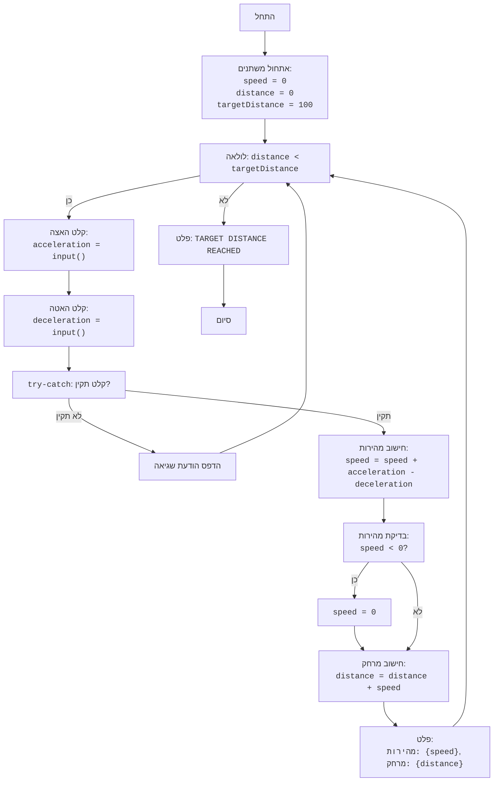

## <algorithm>

הקוד מדמה משחק רכבת פשוט, שבו המשתמש מזין ערכי האצה והאטה, והמשחק מחשב את המהירות והמרחק שהרכבת עברה עד שהיא מגיעה למרחק יעד.

1.  **אתחול משתנים:**
    *   `speed` מוגדר ל-0 (מהירות התחלתית).
    *   `distance` מוגדר ל-0 (מרחק התחלתי).
    *   `targetDistance` מוגדר ל-100 (מרחק יעד).
    *דוגמא:speed =0, distance = 0, targetDistance = 100

2.  **לולאה ראשית:**
    *   הלולאה ממשיכה כל עוד `distance` קטן מ-`targetDistance`.
        *דוגמא:distance = 0 , targetDistance = 100 לכן הלולאה רצה
   

3.  **קבלת קלט מהמשתמש:**
    *   המשחק מבקש מהמשתמש להזין ערך `acceleration` (האצה).
        *דוגמא:acceleration = 5
    *   המשחק מבקש מהמשתמש להזין ערך `deceleration` (האטה).
        *דוגמא:deceleration = 2
    *   הקלט מומר למספר עשרוני (float).
    *   במקרה של קלט לא חוקי (למשל, טקסט במקום מספר), תודפס הודעת שגיאה והלולאה תחזור להתחלה.
        *דוגמא:אם המשתמש מזין 'abc' עבור `acceleration`, תוצג הודעה והקלט הבא יתבקש שוב.

4.  **חישוב מהירות חדשה:**
    *   המהירות החדשה מחושבת: `speed = speed + acceleration - deceleration`.
        *דוגמא:speed = 0 + 5 -2 = 3

5.  **בדיקת מהירות:**
    *   אם `speed` שלילי, `speed` מוגדר ל-0.
        *דוגמא:אם לאחר חישוב מתקבל speed = -2 אז speed = 0

6.  **חישוב מרחק חדש:**
    *   המרחק החדש מחושב: `distance = distance + speed`.
        *דוגמא:distance = 0 + 3 = 3

7.  **הצגת נתונים:**
    *   המשחק מדפיס את המהירות הנוכחית (`speed`) ואת המרחק שעברה הרכבת (`distance`).
        *דוגמא: "המהירות הנוכחית: 3, המרחק שעברה הרכבת: 3"

8.  **חזרה ללולאה:**
    *   המשחק חוזר לראש הלולאה (שלב 2) וחוזר על הפעולות כל עוד `distance` קטן מ-`targetDistance`.
    
9.  **סיום המשחק:**
    *   כאשר `distance` גדול או שווה ל-`targetDistance`, הלולאה מסתיימת.
    *   המשחק מדפיס את ההודעה "TARGET DISTANCE REACHED".
         *דוגמא:בסיום המשחק, יודפס "TARGET DISTANCE REACHED"

## <mermaid>

## <explanation>

**ייבוא (Imports):**

*   אין ייבוא בחלק זה של הקוד, כל הפונקציונליות בנויה ישירות בקובץ.

**מחלקות (Classes):**

*   אין מחלקות בקוד זה.

**פונקציות (Functions):**

*   אין פונקציות מוגדרות בקוד זה, הפעולה מתבצעת ברצף.

**משתנים (Variables):**

*   `speed` (int): משתנה המשמש לאחסון המהירות הנוכחית של הרכבת. הוא מתחיל ב-0 ומשתנה בהתאם להאצה והאטה שהמשתמש מזין.
*   `distance` (int): משתנה המשמש לאחסון המרחק הכולל שהרכבת עברה. הוא מתחיל ב-0 וגדל בכל איטרציה של הלולאה.
*   `targetDistance` (int): משתנה המשמש לאחסון מרחק היעד שהרכבת צריכה להגיע אליו. ערכו קבוע 100.
*   `acceleration` (float): משתנה זמני המשמש לאחסון קלט ההאצה מהמשתמש.
*   `deceleration` (float): משתנה זמני המשמש לאחסון קלט ההאטה מהמשתמש.

**הסברים מפורטים:**

*   **אתחול:** הקוד מתחיל באתחול שלושה משתנים: `speed` ו-`distance` ל-0, ו-`targetDistance` ל-100. אלו הם הערכים ההתחלתיים למשחק.
*   **לולאה ראשית:** לולאת ה-`while` פועלת כל עוד המרחק הנוכחי (`distance`) קטן ממרחק היעד (`targetDistance`). זהו לב המשחק, והוא מאפשר למשתמש להזין ערכי האצה והאטה ולראות כיצד הם משפיעים על התקדמות הרכבת.
*   **קלט משתמש:** בתוך הלולאה, הקוד משתמש ב-`input()` כדי לבקש מהמשתמש להזין ערכי האצה והאטה. נעשה שימוש בבלוק `try-except` כדי לטפל בשגיאות פוטנציאליות אם המשתמש יזין קלט לא חוקי (למשל, אותיות במקום מספרים).
*   **חישוב מהירות ומרחק:** הקוד מחשב את המהירות החדשה על ידי הוספת האצה וחיסור האטה מהמהירות הקודמת. לאחר מכן, הוא בודק אם המהירות שלילית, ואם כן, הוא מאפס אותה. לבסוף, המרחק החדש מחושב על ידי הוספת המהירות למרחק הקודם.
*   **פלט:** בכל איטרציה של הלולאה, הקוד מדפיס את המהירות הנוכחית והמרחק שעברה הרכבת למסך המשתמש.
*   **סיום:** כאשר הלולאה מסיימת את פעולתה (כלומר, המרחק הנוכחי גדול או שווה למרחק היעד), הקוד מדפיס את ההודעה "TARGET DISTANCE REACHED", המסמנת את סיום המשחק.

**בעיות אפשריות או תחומים לשיפור:**

*   **קלט לא תקין:** למרות שנעשה שימוש ב-`try-except` לטיפול ב-`ValueError`, הקוד אינו מטפל באופן מלא בכל סוגי הקלט הלא תקין. למשל, אם המשתמש יזין מספר עם רווחים או תווים נוספים, הדבר עלול להוביל לשגיאה.
*   **חוסר ולידציה של קלט:** הקוד לא מבצע ולידציה על ערכי ההאצה וההאטה. למשל, אם המשתמש יזין ערכים שליליים עבור האצה או האטה, הדבר עלול להוביל לתוצאות בלתי צפויות.
*   **משוב משתמש:** ניתן לשפר את המשוב למשתמש, לדוגמה, לספק חיווי נוסף כאשר המהירות מאופסת עקב היותה שלילית.
*   **העדר פונקציות:** הקוד בנוי בצורה לינארית ואינו משתמש בפונקציות. יצירת פונקציות יכולה להפוך את הקוד למאורגן יותר ולקריא יותר.
*   **משחק סימולציה פשוט:** הקוד מדמה משחק פשוט, וניתן להרחיב אותו למשחק מורכב יותר עם רמות שונות, גרפיקה, וכדומה.

**שרשרת קשרים עם חלקים אחרים בפרויקט:**

*   קוד זה אינו תלוי בחלקים אחרים בפרויקט, והוא עומד בפני עצמו.
*   בפרויקט גדול יותר, ניתן להרחיב את הקוד וליצור אינטראקציה עם רכיבים אחרים כמו ממשק משתמש גרפי (GUI) או מערכת ניהול משחקים.