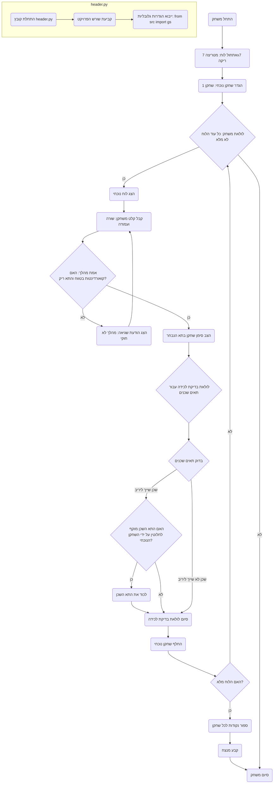

## ניתוח קוד המשחק "מלכודת" (TRAP)

### <algorithm>
1. **אתחול המשחק**:
   - יצירת לוח משחק ריק בגודל 7x7 (ייצוג של מטריצה דו-ממדית המכילה 0 עבור תאים ריקים). לדוגמה: `board = [[0 for _ in range(7)] for _ in range(7)]`.
   - הגדרת השחקן הנוכחי כשחקן 1. `current_player = 1`.

2. **לולאת משחק ראשית**:
   - כל עוד הלוח לא מלא:
     - הצגת הלוח הנוכחי למסך.
     - קבלת קלט מהשחקן הנוכחי (קואורדינטות שורה ועמודה).
       - דוגמה לקלט: "שחקן 1, הזן מספר שורה (0-6): 2", "שחקן 1, הזן מספר עמודה (0-6): 3".
     - **אימות תקינות מהלך**:
       - בדיקה שהקואורדינטות שהוזנו נמצאות בתוך גבולות הלוח (בין 0 ל-6).
       - בדיקה שהתא שנבחר ריק (ערכו 0).
       - אם אחד מהתנאים לא מתקיים, להציג הודעת שגיאה ולבקש קלט מחדש.
     - **ביצוע מהלך**:
       - הצבת סימן השחקן הנוכחי בתא הנבחר. לדוגמה: `board[row][col] = current_player`.
       - **בדיקת אפשרות ללכידת תאים**:
         - עבור כל תא שכן לתא שבו הוצב הסימן:
           - בדיקה אם התא השכן שייך לשחקן היריב.
           - בדיקה אם התא השכן מוקף לחלוטין על ידי סימני השחקן הנוכחי.
             - אם כן, החלפת הסימן בתא השכן לסימן השחקן הנוכחי.
     - **החלפת שחקן**: שינוי השחקן הנוכחי לשחקן השני. לדוגמה: אם `current_player` הוא 1, הוא הופך ל-2 ולהיפך.

3. **סיום המשחק**:
   - לאחר שהלוח מלא:
     - הצגת הלוח הסופי.
     - ספירת הסימנים של כל שחקן.
     - קביעת המנצח (השחקן עם הכי הרבה סימנים).
     - הצגת תוצאות המשחק והמנצח.

### <mermaid>

התרשים מתאר את זרימת המשחק, החל מאתחול הלוח ועד לסיום המשחק והכרזת המנצח.
הלולאה הראשית של המשחק נמשכת כל עוד הלוח לא מלא, ובתוכה מתבצעים המהלכים של השחקנים ובדיקת האפשרות ללכידת תאים.

### <explanation>

**ייבוא (Imports)**:
- `import copy`: מיועד ליצירת עותקים עמוקים של אובייקטים, אבל לא נעשה בו שימוש בפועל בקוד הזה. זה יכול להיות שימושי אם נרצה להעתיק את לוח המשחק בצורה בטוחה בלי לשנות את המקור.

**קבועים (Constants)**:
- `BOARD_SIZE = 7`: מגדיר את גודל הלוח (7x7).

**פונקציות (Functions)**:
1. `create_board()`:
    - יוצרת לוח משחק ריק (רשימה דו-ממדית) בגודל `BOARD_SIZE` על `BOARD_SIZE`.
    - מחזירה את לוח המשחק המאותחל.
    - דוגמה: `board = create_board()` תיצור לוח ריק בגודל 7x7.
2.  `display_board(board)`:
    - מקבלת את לוח המשחק ומדפיסה אותו למסך.
    - משתמשת ב-'\.' עבור תאים ריקים, '1' עבור סימון של שחקן 1, ו-'2' עבור סימון של שחקן 2.
    - דוגמה: `display_board(board)` תדפיס את הלוח בצורה ויזואלית.
3. `is_valid_move(row, col)`:
    - בודקת אם הקואורדינטות `row` ו-`col` נמצאות בתוך גבולות הלוח.
    - מחזירה `True` אם הקואורדינטות תקינות, אחרת `False`.
    - דוגמה: `is_valid_move(3, 4)` תחזיר `True`, `is_valid_move(7, 0)` תחזיר `False`.
4. `is_cell_empty(board, row, col)`:
   - בודקת אם התא בלוח במיקום `(row, col)` ריק (ערכו 0).
   - מחזירה `True` אם התא ריק, אחרת `False`.
   - דוגמה: `is_cell_empty(board, 2, 2)` תחזיר `True` אם התא במיקום זה ריק.
5. `get_neighbors(row, col)`:
    - מחזירה רשימה של קואורדינטות של תאים שכנים לתא הנתון `(row, col)` (למעלה, למטה, שמאלה, ימינה).
    - לא כוללת קואורדינטות מחוץ לגבולות הלוח.
    - דוגמה: `get_neighbors(3, 3)` תחזיר רשימה של קואורדינטות תאים שכנים.
6. `can_capture(board, row, col, current_player)`:
   - בודקת האם תא של שחקן יריב `(row, col)` יכול להילכד על ידי השחקן הנוכחי.
   - תא יכול להילכד אם הוא שייך לשחקן היריב ומוקף לחלוטין בתאים ששייכים לשחקן הנוכחי.
   - מחזירה `True` אם התא יכול להילכד, אחרת `False`.
7. `capture_cell(board, row, col, current_player)`:
    - תופסת תא של שחקן יריב על ידי שינוי ערכו לערך של השחקן הנוכחי.
    - משנה את התוכן של התא בלוח.
    - דוגמה: `capture_cell(board, 2, 3, 1)` תשנה את התא `(2,3)` לערך 1.
8.  `make_move(board, row, col, current_player)`:
    - מבצעת מהלך של שחקן - מציבה את סימן השחקן בתא הנתון.
    - בודקת האם ניתן ללכוד תאים שכנים של היריב ולוכדת אותם אם אפשר.
    - משנה את לוח המשחק בהתאם.
9. `switch_player(current_player)`:
   - משנה את השחקן הנוכחי לשחקן השני (מ-1 ל-2 ולהיפך).
   - מחזירה את מספר השחקן הבא.
10. `is_board_full(board)`:
     - בודקת אם כל התאים בלוח מלאים (אין יותר תאים ריקים).
     - מחזירה `True` אם הלוח מלא, אחרת `False`.
11.  `calculate_scores(board)`:
     - סופרת את מספר הסימנים של כל שחקן על הלוח.
     - מחזירה את הניקוד של שני השחקנים.
12.  `determine_winner(player1_score, player2_score)`:
     - קובעת את המנצח על פי הניקוד של שני השחקנים.
     - מחזירה הודעת ניצחון או הודעת שוויון.
13.  `play_trap_game()`:
     - הפונקציה הראשית של המשחק.
     - מאתחלת את לוח המשחק, מנהלת את מהלכי השחקנים, בודקת מהלכים, מבצעת לכידות, מחליפה שחקנים, ומציגה את תוצאות המשחק.

**משתנים (Variables)**:
- `board`: רשימה דו-ממדית המייצגת את לוח המשחק.
- `current_player`: מספר השחקן הנוכחי (1 או 2).
- `row`, `col`: קואורדינטות התא בלוח.
- `player1_score`, `player2_score`: ניקוד השחקנים.
- `winner`: הודעת המנצח.

**בעיות אפשריות/תחומים לשיפור**:
- **יעילות**: ניתן לייעל את בדיקת הלכידות על ידי מעקב אחר תאים שנכבשו במקום לבדוק כל פעם את כל התאים השכנים.
- **ממשק משתמש**: ממשק המשתמש פשוט וטקסטואלי; ניתן להוסיף ממשק גרפי.
- **אימות קלט**: בדיקת הקלט מהמשתמש עשויה להיות מעט יותר מפורטת כדי לטפל במקרים קצה.

**קשרים עם חלקים אחרים בפרויקט**:
- הקוד הזה עצמאי, ואין לו תלות ישירה בקודים אחרים בפרויקט, אבל הוא משתמש במוסכמות של שם הקובץ (`trap.py`) ובגישה ישירה של משחקים כמו `play_trap_game()`.