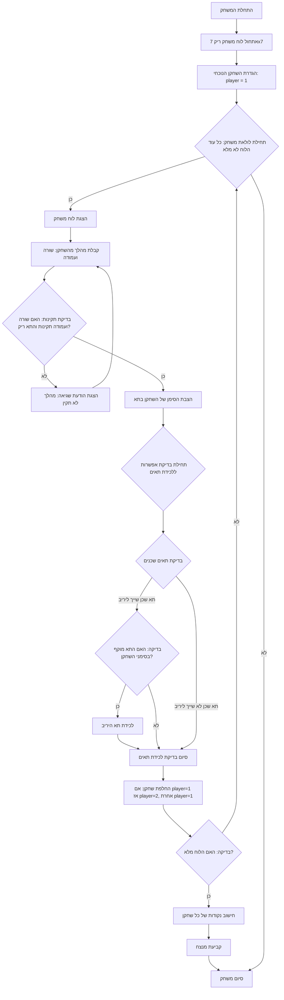

## ניתוח קוד: משחק "מלכודת"

### 1. **<algorithm>**
הקוד מיישם משחק לוח בשם "מלכודת" לשני שחקנים. להלן תיאור שלבי האלגוריתם:

1. **אתחול המשחק:**
   - יוצר לוח משחק ריק בגודל 7x7, בו כל התאים מאותחלים ל-0 (תאים ריקים).
   - מגדיר את השחקן הנוכחי כשחקן 1.
   * דוגמה: `board = [[0, 0, 0, 0, 0, 0, 0], [0, 0, 0, 0, 0, 0, 0], ..., [0, 0, 0, 0, 0, 0, 0]], current_player = 1`

2. **לולאת משחק:**
   - כל עוד הלוח לא מלא:
     - מציג את הלוח לשחקנים.
     - מבקש מהשחקן הנוכחי להזין את קואורדינטות התא (שורה ועמודה) בהם הוא רוצה להציב את הסימן שלו (1 או 2).
     - בודק האם הקואורדינטות תקינות והתא ריק.
       - אם הקואורדינטות לא תקינות או התא לא ריק, מוצגת הודעת שגיאה והשחקן מתבקש להזין שוב.
       - דוגמה: אם השחקן מזין שורה 10 ועמודה 20 או שורה 1 ועמודה 1 כאשר התא כבר תפוס - הודעת שגיאה תוצג והוא יתבקש להזין קלט מחדש.
     - מציב את הסימן של השחקן הנוכחי בתא שנבחר.
     - בודק האם יש תאים של היריב שניתן ללכוד.
       - עבור כל תא של היריב סביב התא שבו הוצב הסימן, בודק האם התא של היריב מוקף מכל הכיוונים על ידי הסימנים של השחקן הנוכחי.
         - אם התא של היריב מוקף - מחליף אותו בסימן של השחקן הנוכחי.
         - דוגמה: אם התא של שחקן 2 מוקף בתאים של שחקן 1, הוא ישונה ל-1.
     - מחליף את השחקן הנוכחי (אם הנוכחי הוא 1 הופך ל-2, ואם הוא 2 הופך ל-1).
    
3. **סיום המשחק:**
   - לאחר שהלוח מלא:
     - סופר את כמות הסימנים של כל שחקן.
     - מכריז על המנצח (השחקן עם מספר הסימנים הגבוה יותר).
     - מוצגות תוצאות המשחק.

**זרימת נתונים:**

*   **`create_board()`**: יוצר לוח משחק (רשימה דו-ממדית של אפסים) ומוחזר כפלט.
*   **`display_board(board)`**: מקבל את לוח המשחק ומציג אותו כפלט מודפס.
*   **`is_valid_move(row, col)`**: מקבל קואורדינטות, מחזיר `True` אם הקואורדינטות בתוך הטווח, אחרת `False`.
*   **`is_cell_empty(board, row, col)`**: מקבל לוח וקואורדינטות, מחזיר `True` אם התא ריק (0), אחרת `False`.
*   **`get_neighbors(row, col)`**: מקבל קואורדינטות ומחזיר רשימה של קואורדינטות של תאים שכנים.
*   **`can_capture(board, row, col, current_player)`**: מקבל לוח, קואורדינטות ותור שחקן, מחזיר `True` אם התא של היריב יכול להילכד, אחרת `False`.
*   **`capture_cell(board, row, col, current_player)`**: מקבל לוח, קואורדינטות ותור שחקן, משנה את התא לסימן השחקן הנוכחי.
*   **`make_move(board, row, col, current_player)`**: מקבל לוח, קואורדינטות ותור שחקן, מציב סימן בתא ובודק אם יש תאים לכיבוש.
*   **`switch_player(current_player)`**: מקבל תור שחקן ומחזיר את התור של השחקן הבא.
*   **`is_board_full(board)`**: מקבל לוח ומחזיר `True` אם כל התאים מלאים, אחרת `False`.
*   **`calculate_scores(board)`**: מקבל לוח ומחזיר את מספר הנקודות של שני השחקנים.
*   **`determine_winner(player1_score, player2_score)`**: מקבל את הנקודות של שני השחקנים ומחזיר הודעת ניצחון או תיקו.
*   **`play_trap_game()`**: הפונקציה הראשית של המשחק, מנהלת את כל התהליך.
   
   
### 2. **<mermaid>**

הקוד לא כולל את השורה `import header`.

**ניתוח תלויות:**

*   הקוד משתמש בספריית `copy` אך לא לצרכי התרשים.

### 3. **<explanation>**
**ייבוא (Imports):**

*   `import copy`: ספריית `copy` משמשת לביצוע פעולות העתקה עמוקה של אובייקטים, מה שמונע בעיות שנוצרות בעקבות הפניות. היא אינה בשימוש ישיר בקוד זה, אך סביר להניח שהיא שימשה או נועדה לשימוש בפיתוח.

**קבועים (Constants):**

*   `BOARD_SIZE = 7`: קבוע המגדיר את גודל לוח המשחק כ-7x7.

**פונקציות (Functions):**

*   **`create_board()`**:
    *   מטרה: יצירת לוח משחק ריק.
    *   פרמטרים: אין.
    *   ערך החזרה: רשימה דו-ממדית המייצגת את לוח המשחק, כאשר כל תא מאותחל ל-0.
    *   שימוש: `board = create_board()` יוצר לוח משחק חדש.
*   **`display_board(board)`**:
    *   מטרה: הצגת לוח המשחק למשתמש.
    *   פרמטרים: `board` - רשימה דו-ממדית המייצגת את לוח המשחק.
    *   ערך החזרה: אין.
    *   שימוש: `display_board(board)` מציג את הלוח במסוף, כאשר תאים ריקים מסומנים ב-`.`, ותאים של השחקנים ב-`1` או `2`.
*   **`is_valid_move(row, col)`**:
    *   מטרה: בדיקה האם קואורדינטות (שורה ועמודה) נמצאות בתוך גבולות לוח המשחק.
    *   פרמטרים: `row`, `col` - קואורדינטות השורה והעמודה.
    *   ערך החזרה: `True` אם הקואורדינטות תקינות, אחרת `False`.
    *   שימוש: `if is_valid_move(row, col): ...` בודק האם המהלך חוקי.
*   **`is_cell_empty(board, row, col)`**:
    *   מטרה: בדיקה האם תא מסוים בלוח ריק.
    *   פרמטרים: `board` - לוח המשחק, `row`, `col` - קואורדינטות התא.
    *   ערך החזרה: `True` אם התא ריק, אחרת `False`.
    *   שימוש: `if is_cell_empty(board, row, col): ...` בודק האם ניתן להציב סימן בתא.
*   **`get_neighbors(row, col)`**:
    *   מטרה: קבלת רשימה של קואורדינטות של התאים השכנים לתא נתון (למעלה, למטה, ימינה, שמאלה).
    *   פרמטרים: `row`, `col` - קואורדינטות התא.
    *   ערך החזרה: רשימה של קואורדינטות התאים השכנים.
    *   שימוש: `neighbors = get_neighbors(row, col)` מקבל את רשימת השכנים.
*   **`can_capture(board, row, col, current_player)`**:
    *   מטרה: בדיקה האם תא של השחקן היריב יכול להילכד על ידי השחקן הנוכחי.
    *   פרמטרים: `board` - לוח המשחק, `row`, `col` - קואורדינטות התא של היריב, `current_player` - השחקן הנוכחי.
    *   ערך החזרה: `True` אם ניתן ללכוד את התא, אחרת `False`.
    *   שימוש: `if can_capture(board, row, col, current_player): ...` בודק אם אפשר ללכוד את היריב.
*  **`capture_cell(board, row, col, current_player)`**:
    *   מטרה: לכידת תא של היריב על ידי שינוי הערך שלו בלוח לערך השחקן הנוכחי.
    *  פרמטרים: `board` - לוח המשחק, `row`, `col` - קואורדינטות התא של היריב, `current_player` - השחקן הנוכחי.
    *   ערך החזרה: אין.
    *   שימוש: `capture_cell(board, row, col, current_player)` משנה את התא של היריב לסימן של השחקן הנוכחי.
*   **`make_move(board, row, col, current_player)`**:
    *   מטרה: ביצוע מהלך על ידי הצבת סימן השחקן בתא המבוקש וכן לכידת תאים של היריב אם הם ניתנים ללכידה.
    *   פרמטרים: `board` - לוח המשחק, `row`, `col` - קואורדינטות התא, `current_player` - השחקן הנוכחי.
    *   ערך החזרה: אין.
    *   שימוש: `make_move(board, row, col, current_player)` מבצע את המהלך על הלוח.
*   **`switch_player(current_player)`**:
    *   מטרה: החלפת השחקן הנוכחי.
    *   פרמטרים: `current_player` - השחקן הנוכחי.
    *   ערך החזרה: השחקן הבא (1 אם השחקן הנוכחי 2, ו-2 אם השחקן הנוכחי 1).
    *   שימוש: `current_player = switch_player(current_player)` מעביר את התור.
*   **`is_board_full(board)`**:
    *   מטרה: בדיקה האם לוח המשחק מלא.
    *   פרמטרים: `board` - לוח המשחק.
    *   ערך החזרה: `True` אם הלוח מלא, אחרת `False`.
    *   שימוש: `while not is_board_full(board): ...` ממשיך את המשחק כל עוד הלוח לא מלא.
*   **`calculate_scores(board)`**:
    *   מטרה: חישוב מספר התאים שכל שחקן תפס בלוח.
    *   פרמטרים: `board` - לוח המשחק.
    *   ערך החזרה: מספר הנקודות של שחקן 1 ושל שחקן 2.
    *   שימוש: `player1_score, player2_score = calculate_scores(board)` מקבל את הנקודות של כל שחקן.
*   **`determine_winner(player1_score, player2_score)`**:
    *   מטרה: קביעת המנצח בהתאם לנקודות השחקנים.
    *   פרמטרים: `player1_score`, `player2_score` - הנקודות של כל שחקן.
    *   ערך החזרה: מחרוזת המכריזה על המנצח או על תיקו.
    *   שימוש: `winner = determine_winner(player1_score, player2_score)` קובע מי המנצח.
*  **`play_trap_game()`**:
     *  מטרה: פונקצית המשחק הראשית, שמנהלת את כל מהלך המשחק.
     *  פרמטרים: אין.
     *  ערך החזרה: אין.
     *  שימוש: `play_trap_game()` מתחילה את המשחק, קולטת מהלכי שחקנים, ומציגה תוצאות.

**משתנים (Variables):**

*   `board`: רשימה דו-ממדית המייצגת את לוח המשחק.
*   `current_player`: משתנה המייצג את השחקן הנוכחי (1 או 2).
*   `row`, `col`: קואורדינטות השורה והעמודה של מהלכי השחקנים.
*   `player1_score`, `player2_score`: מספר הנקודות של שחקן 1 ו-2 בהתאמה.
*   `winner`: מחרוזת המכילה את תוצאת המשחק.

**בעיות אפשריות או תחומים לשיפור:**

*   **קלט שגוי**: קלט שגוי מהמשתמש (לדוגמה, אותיות במקום מספרים) אינו מטופל באופן מלא ועלול לגרום לקריסת התוכנית. יש להוסיף טיפול שגיאות יעיל יותר.
*   **ממשק משתמש**: הממשק למשתמש מאוד בסיסי. כדאי לשפר אותו כדי להפוך את המשחק לידידותי יותר (לדוגמה, הצגת מספרים על גבי הלוח).
*   **ביצועים**: הקוד לא אופטימלי מבחינת ביצועים. לדוגמה, ניתן לייעל את הלולאה שסורקת את השכנים של תא.
*   **שימוש ב-`copy`**: נראה שנעשה שימוש בייבוא `copy` אבל לא נעשה בו שימוש בפועל בקוד, יש לנקות ולבדוק מדוע נעשה בו ייבוא.
*   **הפרדת לוגיקה**: נדרשת הפרדת לוגיקה של המשחק מלוגיקת התצוגה, לדוגמא הפרדת פונקציית `display_board` לפונקציה שמחזירה מחרוזת ולפונקציה שמציגה את המחרוזת.

**שרשרת קשרים:**
אין קשרים לחלקים אחרים בפרויקט בקוד הספציפי.