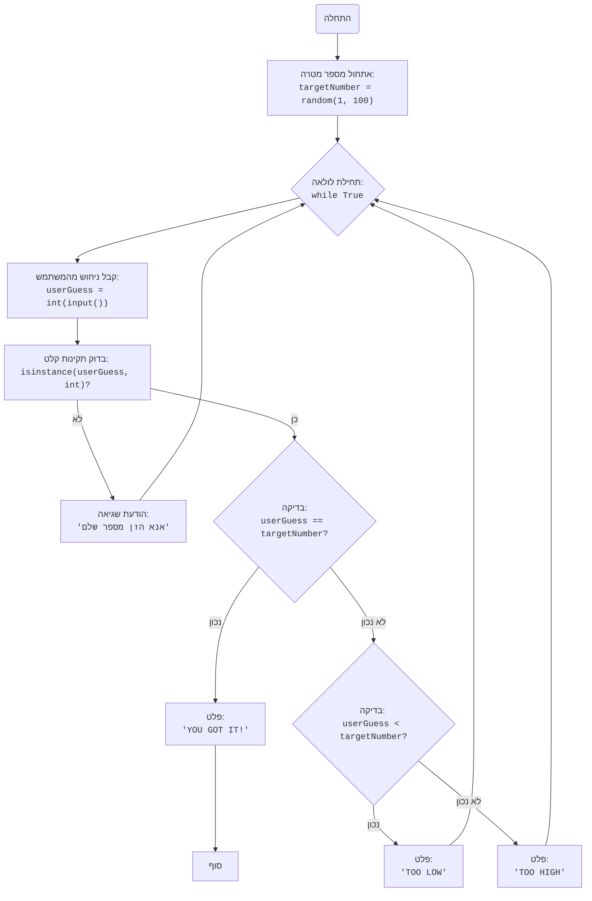

## <algorithm>

1. **התחלה:**
   - התחלת המשחק.
   - דוגמה: המשחק מתחיל כאשר המשתמש מריץ את הסקריפט.

2. **אתחול מספר מטרה:**
   - מחשב יוצר מספר אקראי בין 1 ל-100.
   - שמירת המספר בתוך משתנה `targetNumber`.
   - דוגמה: `targetNumber = 42`.

3. **לולאת ניחושים:**
   - תחילת לולאה אינסופית.
   - דוגמה: הלולאה מתחילה.
   
4. **קבלת ניחוש מהמשתמש:**
   - המשתמש מתבקש להזין מספר.
   - הקלט נשמר בתוך משתנה `userGuess`.
   - דוגמה: משתמש מזין "50" ו-`userGuess = 50`.
    
5.  **בדיקת תקינות קלט:**
    -   אם הקלט אינו מספר שלם, תוצג הודעת שגיאה והלולאה תחזור לשלב 4.
    -   דוגמה: אם המשתמש הזין "abc", תודפס הודעת שגיאה והמשחק יבקש שוב קלט.

6. **בדיקת ניחוש:**
    -   בדיקה האם `userGuess` שווה ל-`targetNumber`.
    -   דוגמה: אם `userGuess = 42` וגם `targetNumber = 42`, התנאי מתקיים.

7. **ניצחון:**
   - אם הניחוש נכון, מוצגת הודעה "YOU GOT IT!".
   - הלולאה נשברת והמשחק נגמר.
   - דוגמה: "YOU GOT IT!" מוצג והמשחק מסתיים.

8. **ניחוש נמוך מדי:**
   - אם הניחוש נמוך מ-`targetNumber`, מוצגת הודעה "TOO LOW".
   - דוגמה: אם `userGuess = 30` ו-`targetNumber = 42`, מוצג "TOO LOW".
   - הלולאה חוזרת לשלב 4.

9. **ניחוש גבוה מדי:**
   - אם הניחוש גבוה מ-`targetNumber`, מוצגת הודעה "TOO HIGH".
   - דוגמה: אם `userGuess = 60` ו-`targetNumber = 42`, מוצג "TOO HIGH".
   - הלולאה חוזרת לשלב 4.

## <mermaid>

## <explanation>

**ייבואים (Imports):**

-   `import random`: מייבא את מודול `random` של פייתון, המשמש ליצירת מספרים אקראיים. השימוש העיקרי כאן הוא ליצירת מספר המטרה שהמשתמש ינסה לנחש. מודול זה הוא חלק מהספרייה הסטנדרטית של פייתון ואינו תלוי בחבילות אחרות בתוך הפרויקט.

**משתנים (Variables):**

-   `targetNumber` (מספר שלם): המשתנה הזה מכיל את המספר האקראי שנוצר על ידי המחשב, אותו המשתמש צריך לנחש. הוא מאותחל על ידי `random.randint(1, 100)` עם מספר שלם אקראי בין 1 ל-100.

-   `userGuess` (מספר שלם): משתנה זה מאחסן את הניחוש של המשתמש. המשתמש מזין מספר והוא נשמר במשתנה זה. הערך נבדק על מנת להשוות אותו למספר האקראי.

**פונקציות (Functions):**

-  אין פונקציות מוגדרות בקוד.

**הסברים מפורטים:**

1.  **אתחול:**
    -   התוכנית מתחילה בייבוא מודול `random` לצורך יצירת מספר אקראי.
    -   משתנה `targetNumber` מאותחל למספר אקראי שלם בין 1 ל-100 באמצעות הפונקציה `random.randint()`.

2.  **לולאת משחק:**
    -   הקוד נכנס ללולאה אינסופית `while True:`, שממשיכה עד שהמשתמש מנחש נכון את המספר.
    -   בתוך הלולאה, המשתמש מתבקש להזין ניחוש באמצעות `input()`, והניחוש מומר למספר שלם באמצעות `int()`.
    -   אם הקלט אינו מספר שלם, קוד השגיאה `ValueError` מופעל ומוצגת הודעה למשתמש.

3.  **בדיקה ומשוב:**
    -   התוכנית בודקת אם הניחוש של המשתמש (`userGuess`) שווה למספר המטרה (`targetNumber`). אם כן, מוצגת ההודעה "YOU GOT IT!" והלולאה נשברת באמצעות `break`, מה שמסיים את המשחק.
    -   אם הניחוש נמוך מהמספר המטרה, מוצגת ההודעה "TOO LOW".
    -   אם הניחוש גבוה מהמספר המטרה, מוצגת ההודעה "TOO HIGH".
    -   הלולאה חוזרת על עצמה, ומאפשרת למשתמש להזין ניחוש נוסף עד שהוא מנחש נכון.

**בעיות אפשריות ושיפורים:**

-   **טיפול בשגיאות:** הקוד מטפל כראוי במקרה של קלט לא תקין (כאשר המשתמש מזין מחרוזת במקום מספר שלם), אך ייתכן שתרחישים נוספים של קלט שגוי צריכים להיות מטופלים.
-   **מגבלת ניחושים:** ניתן להוסיף מגבלה למספר הניחושים שהמשתמש יכול לבצע, מה שיכול להפוך את המשחק למאתגר יותר.
-   **פלט ידידותי למשתמש:** ניתן לשפר את הפלט כך שיהיה יותר ידידותי למשתמש, לדוגמה, על ידי הוספת הודעה בתחילת המשחק המסבירה את החוקים.

**שרשרת קשרים עם חלקים אחרים בפרויקט:**

-   קוד זה הוא משחק עצמאי ואין לו תלות ישירה בחלקים אחרים בפרויקט. הוא יכול להיות חלק מתיקייה רחבה יותר של משחקי AI, אך הוא אינו משתף נתונים או פונקציונליות עם קבצים אחרים כפי שהוא.