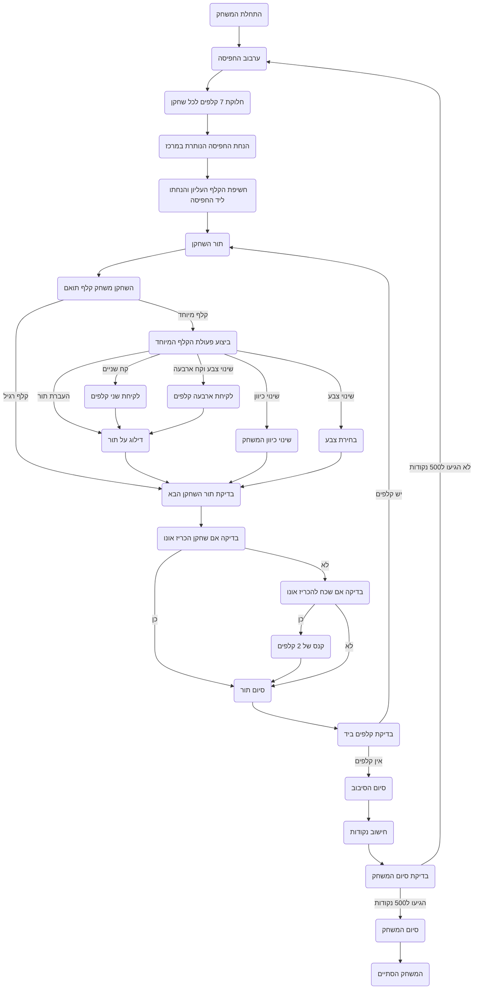

# ניתוח קוד: חוקי המשחק אונו

## 1. <algorithm>

הקוד המסופק מתאר את חוקי משחק הקלפים אונו. להלן פירוט צעד אחר צעד של תהליך המשחק:

1.  **התחלה**:
    *   מערבבים את חפיסת הקלפים.
    *   מחלקים לכל שחקן 7 קלפים.
    *   מניחים את החפיסה הנותרת במרכז השולחן כשהיא הפוכה.
    *   חושפים את הקלף העליון מהחפיסה ומניחים אותו ליד החפיסה הפוך כלפי מעלה, כקלף ההתחלה.
    *   *דוגמה:* אם יש 4 שחקנים, כל אחד מקבל 7 קלפים. נניח שהקלף שנחשף הוא קלף אדום עם המספר 3.

2.  **מהלך השחקן**:
    *   השחקנים משחקים בתורם, בכיוון השעון.
    *   כל שחקן צריך לשחק קלף שמתאים בצבע או במספר לקלף האחרון ששוחק.
    *   *דוגמה:* אם הקלף האחרון ששוחק הוא אדום 3, שחקן יכול לשחק קלף אדום אחר (אדום 5) או קלף עם המספר 3 בצבע אחר (ירוק 3).

3.  **קלפים מיוחדים**:
    *   **העברת תור**: השחקן הבא מדלג על תורו.
    *   **שינוי כיוון**: כיוון המשחק משתנה.
    *   **קח שניים**: השחקן הבא לוקח שני קלפים מהחפיסה ומדלג על תורו.
    *   **שינוי צבע**: השחקן בוחר צבע. השחקן הבא חייב לשחק קלף בצבע הנבחר או לקחת שני קלפים.
    *   **שינוי צבע וקח ארבעה**: השחקן בוחר צבע. השחקן הבא לוקח ארבעה קלפים מהחפיסה וחייב לשחק קלף בצבע הנבחר.
    *   *דוגמה:* אם שחקן משחק קלף "העברת תור", השחקן הבא בתור מפסיד את תורו. אם שחקן משחק קלף "שינוי צבע", הוא יכול לבחור כל צבע (אדום, כחול, ירוק או צהוב).

4.  **קלף "אונו!"**:
    *   כאשר נשאר לשחקן קלף אחד, הוא חייב להכריז "אונו!".
    *   אם שחקן שכח להכריז "אונו!" ומישהו שם לב לפני שהשחקן הבא התחיל את תורו, הוא צריך לקחת 2 קלפים כקנס.
    *   *דוגמה:* שחקן נשאר עם קלף אחד ולא הכריז "אונו!". שחקן אחר שם לב לפני שהשחקן הבא התחיל, והשחקן צריך לקחת 2 קלפים.

5.  **סיום סיבוב**:
    *   השחקן הראשון שמשחק את כל הקלפים שלו מנצח את הסיבוב.
    *   שאר השחקנים מקבלים נקודות על סמך הקלפים שנשארו להם.
    *   כל הקלפים נאספים, מערבבים מחדש ומתחיל סיבוב חדש.
    *   *דוגמה:* שחקן 1 שיחק את כל הקלפים שלו. לשחקן 2 נשארו קלפים בשווי 15 נקודות, שחקן 3 עם 25 ו- שחקן 4 עם 10. שחקן 1 מקבל 0 נקודות, ושאר השחקנים צוברים נקודות בהתאם.

6.  **ניצחון במשחק**:
    *   השחקן הראשון שצובר 500 נקודות מנצח במשחק.

## 2. <mermaid>

**ניתוח תלויות:**
* התרשים אינו כולל תלויות מיובאות, שכן הוא מתאר את תהליך המשחק, ולא קוד תוכנה.

## 3. <explanation>

**הסברים מפורטים:**

*   **ייבואים (Imports):** לא קיימים ייבואים בקוד שסופק, כיוון שזהו תיאור של חוקי משחק, ולא קוד.
*   **מחלקות (Classes):** לא קיימות מחלקות.
*   **פונקציות (Functions):** לא קיימות פונקציות. התרשים מציג תהליך משחק, ולא קוד.
*   **משתנים (Variables):**
    *   **חפיסה:** אוסף קלפי המשחק.
    *   **קלפים:** קלפי המשחק שברשות השחקנים.
    *   **קלף אחרון:** הקלף האחרון ששוחק, המשמש כבסיס להמשך המשחק.
    *   **כיוון המשחק:** כיוון המשחק (עם כיוון השעון או נגד).
    *   **מספר שחקנים:** מספר השחקנים המשתתפים במשחק.
    *   **נקודות:** כמות הנקודות שצבר כל שחקן.
*   **בעיות אפשריות/שיפורים:**
    *   התיאור הנוכחי אינו קוד, ולכן אין בו בעיות קוד.
    *   התיאור הוא מופשט ומתאים ליישום במספר שפות תכנות או לצורך משחק פיזי.
    *   התיאור יכול להיות מפורט יותר אם היה מיועד למטרות תכנות, לדוגמה, פירוט סוגי הקלפים, הקצאת ערכים לנקודות, וכדומה.

**שרשרת קשרים עם חלקים אחרים בפרויקט:**
הקוד הנוכחי מהווה את בסיס חוקי המשחק. אם היה מדובר בקוד תוכנה, היה צורך לקשר אותו לחלקים נוספים כמו ממשק משתמש, לוגיקת משחק, ניהול שחקנים וכו'. התיאור הקיים הוא של חוקי המשחק הבסיסיים.