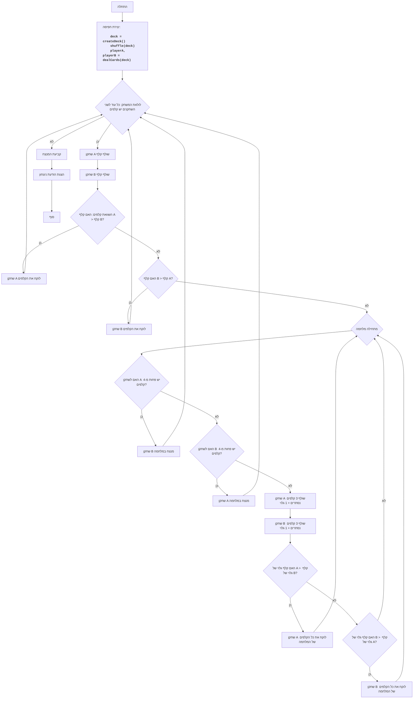

## ניתוח קוד המשחק "מלחמה 2"

### <algorithm>
1. **אתחול המשחק:**
   - יצירת חפיסת קלפים סטנדרטית (52 קלפים).
   - דוגמה: `deck = ['2C', '2D', '2H', '2S', '3C', ..., 'AC', 'AD', 'AH', 'AS']`
   - ערבוב החפיסה.
   - חלוקת החפיסה לשני שחקנים (שחקן A ושחקן B).
   - לדוגמה: `player_a = ['2C', '4H', ..., 'KH'], player_b = ['3S', '5D', ..., 'AS']`

2. **לולאת משחק ראשית:**
   - מתבצעת כל עוד לשני השחקנים יש קלפים.
   - כל סיבוב כולל:
     - שחקן A שולף קלף מהחלק העליון של החפיסה שלו.
       - לדוגמה: `card_a = '2C', player_a = ['4H', ..., 'KH']`
     - שחקן B שולף קלף מהחלק העליון של החפיסה שלו.
       - לדוגמה: `card_b = '3S', player_b = ['5D', ..., 'AS']`
     - השוואת ערכי הקלפים:
       - אם ערך הקלף של שחקן A גדול יותר מערך הקלף של שחקן B:
         - שחקן A לוקח את שני הקלפים ומכניס אותם לסוף החפיסה שלו.
         - לדוגמה: `player_a = ['4H', ..., 'KH', '2C', '3S']`
       - אם ערך הקלף של שחקן B גדול יותר מערך הקלף של שחקן A:
         - שחקן B לוקח את שני הקלפים ומכניס אותם לסוף החפיסה שלו.
         - לדוגמה: `player_b = ['5D', ..., 'AS', '2C', '3S']`
       - אם הערכים שווים, מתבצעת "מלחמה":
         - תהליך "המלחמה" מתואר בהמשך.
     - ערבוב החפיסות של השחקנים בסוף כל סיבוב.

3.  **תהליך "מלחמה":**
     - בודקים שלכל שחקן יש לפחות 4 קלפים.
       - אם לאחד השחקנים יש פחות מ-4 קלפים, השחקן השני מנצח ב"מלחמה" ומקבל את כל הקלפים שהיו על השולחן, והמשחק מסתיים.
     - אם לשני השחקנים יש 4 קלפים או יותר, כל שחקן שולף 4 קלפים:
       - 3 קלפים מונחים עם הפנים כלפי מטה (נסתרים).
       - קלף אחד מונח עם הפנים כלפי מעלה (גלוי).
     - משווים את הערך של הקלפים הגלויים:
       - אם ערך הקלף הגלוי של שחקן A גדול יותר מערך הקלף הגלוי של שחקן B:
         - שחקן A לוקח את כל הקלפים שהונחו (כולל את הקלפים ששימשו למלחמה) ומכניס אותם לסוף החפיסה שלו.
         - המלחמה מסתיימת.
       - אם ערך הקלף הגלוי של שחקן B גדול יותר מערך הקלף הגלוי של שחקן A:
          - שחקן B לוקח את כל הקלפים שהונחו (כולל את הקלפים ששימשו למלחמה) ומכניס אותם לסוף החפיסה שלו.
          - המלחמה מסתיימת.
        - אם ערכי הקלפים הגלויים שווים, חוזרים על תהליך המלחמה.

4.  **הכרזת מנצח:**
   - לאחר שלולאת המשחק הראשית מסתיימת (לאחד השחקנים אין קלפים), השחקן השני מוכרז כמנצח.

### <mermaid>

**הסבר תרשים Mermaid:**

*   **Start:** נקודת ההתחלה של המשחק.
*   **InitializeDeck:** יוצר ומערבב את חפיסת הקלפים, ומחלק אותה בין השחקנים A ו-B.
*   **GameLoopStart:** התחלת הלולאה הראשית של המשחק. הלולאה ממשיכה כל עוד לשני השחקנים יש קלפים.
*  **PlayerA_Draws, PlayerB_Draws**: כל שחקן שולף קלף מחפיסתו.
*   **CompareCards:** השוואה בין הקלפים ששלפו השחקנים.
*   **PlayerA_WinsRound / PlayerB_WinsRound:** השחקן שניצח בסיבוב לוקח את הקלפים ומוסיף אותם לסוף החפיסה שלו.
*   **WarStart:** מתחיל תהליך ה"מלחמה" כאשר הקלפים זהים.
*   **CheckCardsForWarA / CheckCardsForWarB:** בדיקה שלמספר הקלפים של כל שחקן יש לפחות 4 קלפים לפני שמתחילים "מלחמה".
*   **PlayerAWinsWar / PlayerBWinsWar:** אם לאחד השחקנים אין מספיק קלפים, השחקן השני מנצח באופן אוטומטי במלחמה.
*   **PlayerA_DrawsWar / PlayerB_DrawsWar:** כל שחקן שולף 3 קלפים נסתרים וקלף אחד גלוי.
*  **CompareWarCards:** השוואה של הקלפים הגלויים ב"מלחמה".
*   **PlayerA_WinsWarRound / PlayerB_WinsWarRound:** השחקן שמנצח ב"מלחמה" לוקח את כל הקלפים.
*  **DetermineWinner:** קובע את מנצח המשחק.
*   **OutputWinner:** מציג הודעה על המנצח.
*   **End:** סיום המשחק.

אין תלויות מיובאות שאינן חלק מהספריה הסטנדרטית של פייתון, ולכן אין צורך לנתח אותן.

### <explanation>
**ייבוא:**

*   `import random`: מייבא את מודול `random` של פייתון, המשמש ליצירת מספרים אקראיים. מודול זה נחוץ לצורך ערבוב חפיסת הקלפים, דבר החיוני להוגנות המשחק.

**פונקציות:**

*   `create_deck()`:
    *   **מטרה:** יוצרת חפיסה סטנדרטית של 52 קלפים.
    *   **פרמטרים:** אין.
    *   **ערך מוחזר:** רשימה של מחרוזות המייצגות קלפים, לדוגמה: `['2C', '2D', '2H', '2S', ..., 'AS']`.
    *   **שימוש:** משמשת בתחילת המשחק כדי ליצור את חפיסת הקלפים.
    *   **דוגמה:** `deck = create_deck()`
*   `deal_cards(deck)`:
    *   **מטרה:** מחלקת את הקלפים באופן שווה בין שני שחקנים.
    *   **פרמטרים:** `deck` - רשימת הקלפים.
    *   **ערך מוחזר:** טאפל של שתי רשימות, כאשר כל רשימה מייצגת את חפיסת הקלפים של שחקן.
        *   לדוגמה: `(player_a, player_b)`.
    *   **שימוש:** לאחר יצירת החפיסה, פונקציה זו מחלקת את הקלפים בין השחקנים.
    *   **דוגמה:** `player_a, player_b = deal_cards(deck)`
*   `get_card_value(card)`:
    *   **מטרה:** מחזירה את הערך המספרי של קלף.
    *   **פרמטרים:** `card` - מחרוזת המייצגת קלף (למשל, `'10H'` או `'AC'`).
    *   **ערך מוחזר:** מספר שלם המייצג את ערך הקלף (J=11, Q=12, K=13, A=14, שאר המספרים הם הערך שלהם).
        *   לדוגמה: `get_card_value('KH')` תחזיר 13.
    *   **שימוש:** משמשת להשוואה בין קלפים בסיבוב רגיל וב"מלחמה".
    *   **דוגמה:** `value = get_card_value('QH')`
*   `war(player_a, player_b, cards_on_table)`:
    *   **מטרה:** מטפלת בתהליך ה"מלחמה" במשחק.
    *   **פרמטרים:**
        *   `player_a`: רשימת הקלפים של שחקן A.
        *   `player_b`: רשימת הקלפים של שחקן B.
        *   `cards_on_table`: רשימת הקלפים שעל השולחן.
    *   **ערך מוחזר:** טאפל שמכיל:
       * `a_win_war` : האם שחקן A ניצח במלחמה (בגלל חוסר קלפים)
       * `b_win_war` : האם שחקן B ניצח במלחמה (בגלל חוסר קלפים)
        *   `cards_on_table`: רשימת הקלפים שעל השולחן אחרי המלחמה (תמיד ריקה בסוף המלחמה).
        *   `player_a`: רשימת הקלפים המעודכנת של שחקן A.
        *   `player_b`: רשימת הקלפים המעודכנת של שחקן B.
    *   **שימוש:** מופעלת כאשר השחקנים שולפים קלפים בעלי אותו ערך.
    *   **דוגמה:** `a_win_war, b_win_war ,cards, player_a, player_b  = war(player_a, player_b, cards_on_table)`
*   `play_war()`:
    *   **מטרה:** מנהלת את כל מהלך המשחק.
    *   **פרמטרים:** אין.
    *   **ערך מוחזר:** אין.
    *   **שימוש:** מכילה את הלוגיקה הראשית של המשחק, כולל יצירת החפיסה, חלוקת הקלפים, התנהלות סיבובים, וקריאה לפונקציית המלחמה במידת הצורך.
    *   **דוגמה:** `play_war()`

**משתנים:**

*   `suits`: רשימה של מחרוזות המייצגות את סוגי הקלפים (C - תלתן, D - יהלום, H - לב, S - עלה).
*   `ranks`: רשימה של מחרוזות המייצגות את דרגות הקלפים ('2', '3', ..., 'A').
*   `deck`: רשימה של מחרוזות המייצגות את הקלפים בחפיסה.
*   `player_a`, `player_b`: רשימות המכילות את הקלפים של כל שחקן.
*   `card_a`, `card_b`: מחרוזות המייצגות את הקלפים ששולפים השחקנים.
*  `cards_on_table`: רשימה שמכילה את הקלפים שעל השולחן במהלך סיבוב ובתחילת מלחמה.

**בעיות אפשריות ותחומים לשיפור:**

*   **יעילות:** ערבוב החפיסה לאחר כל סיבוב עשוי להיות מיותר, אפשר לבצע זאת בסוף כל כמה סיבובים או פשוט לא לערבב.
*   **מבנה נתונים:** ניתן להשתמש במבני נתונים יעילים יותר (כגון `collections.deque`) לתורים של השחקנים, כך שהקלפים שמוספים לכל שחקן בסוף הסיבוב יהיו יעילים יותר.
*   **קריאות:** כדאי להוסיף הערות מפורטות יותר על השימוש בפונקציות השונות.
*   **בדיקות:** יש להוסיף בדיקות לטעויות (למשל, מה קורה אם חפיסת הקלפים ריקה באופן לא צפוי), ולדאוג לכך שכל הקלפים יחולקו בצורה הוגנת.
*   **עיצוב:** ניתן להוסיף עיצוב טקסטואלי או גרפי כדי לשפר את חווית המשתמש.
*   **אפשרות למשחק נגד המחשב:** כרגע ניתן לשחק בין שני שחקנים אנושיים, ניתן לפתח אפשרות למשחק נגד המחשב.

**שרשרת קשרים:**

*   הקוד הוא משחק עצמאי ואינו תלוי בחלקים אחרים בפרויקט, למעט המודול `random` של פייתון.

**לסיכום:**
הקוד מספק מימוש בסיסי של משחק הקלפים "מלחמה". הוא כתוב בצורה קריאה ופשוטה, אך יש מקום לשיפורים מבחינת יעילות, מבנה נתונים, עיצוב, והוספת אפשרויות נוספות (כמו משחק נגד המחשב).