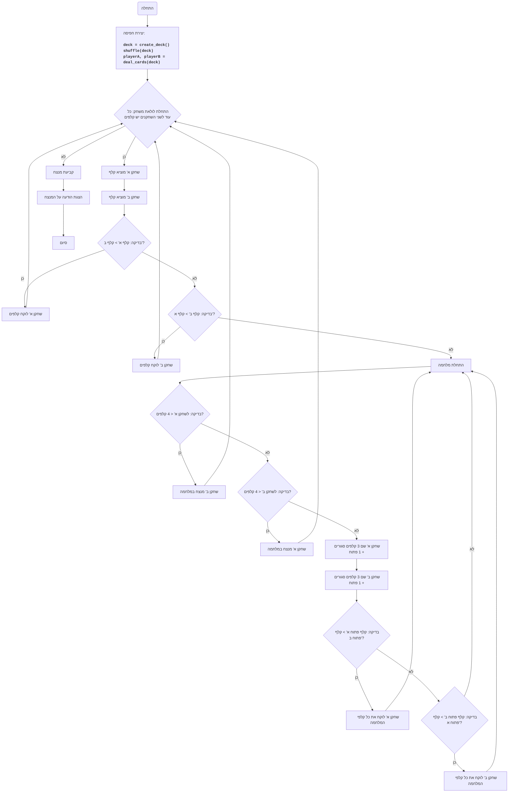

## ניתוח קוד: משחק מלחמה 2

### <algorithm>
1. **יצירת חפיסת קלפים:**
    - הפונקציה `create_deck()` יוצרת חפיסה סטנדרטית של 52 קלפים.
    - דוגמה: `deck = ["2C", "2D", "2H", "2S", "3C", ..., "AC", "AD", "AH", "AS"]`

2. **חלוקת קלפים:**
    - הפונקציה `deal_cards(deck)` מערבבת את החפיסה ומחלקת אותה שווה בשווה בין שני שחקנים.
    - דוגמה: אם `deck` היא `["2C", "2D", ..., "AS"]`, אז `player_a` יהיה `["2C", "2D", ..., "AH"]` ו-`player_b` יהיה `["AD", "AS", ... ]`.

3. **השוואת קלפים:**
    - הפונקציה `get_card_value(card)` מחזירה את הערך המספרי של קלף (ללא התייחסות לצבע).
    - דוגמה: `get_card_value("2C")` מחזיר 2, `get_card_value("JC")` מחזיר 11, `get_card_value("AC")` מחזיר 14.
    
4. **מהלך משחק:**
    - הלולאה `while player_a and player_b` רצה כל עוד לשני השחקנים יש קלפים.
    - כל שחקן מוציא את הקלף הראשון מהחפיסה שלו (`player_a.pop(0)` ו-`player_b.pop(0)`).
    - הערכים של הקלפים מושווים באמצעות `get_card_value()`.
        - אם קלף שחקן א' גבוה יותר, הוא לוקח את שני הקלפים ומחזיר אותם לסוף החפיסה שלו.
        - אם קלף שחקן ב' גבוה יותר, הוא לוקח את שני הקלפים ומחזיר אותם לסוף החפיסה שלו.
    - אם הקלפים שווים, מתחיל "מלחמה" על ידי קריאה לפונקציה `war()`.

5. **מהלך "מלחמה":**
    - הפונקציה `war(player_a, player_b, cards_on_table)` מנהלת את תהליך ה"מלחמה".
    - בודקת האם לשחקנים יש מספיק קלפים (4) למלחמה. אם לא, השחקן השני מנצח
        - אם לשחקן א' יש פחות מ-4 קלפים - שחקן ב' מנצח במלחמה
        - אם לשחקן ב' יש פחות מ-4 קלפים - שחקן א' מנצח במלחמה
    - כל שחקן שם 3 קלפים עם הפנים כלפי מטה וקלף אחד עם הפנים כלפי מעלה.
    - ערכי הקלפים עם הפנים כלפי מעלה מושווים, והשחקן עם הקלף הגבוה יותר לוקח את כל הקלפים.
    - אם הקלפים שווים, "מלחמה" חוזרת על עצמה.
    
6. **סיום משחק:**
    - המשחק מסתיים כאשר לאחד השחקנים נגמרים הקלפים.
    - המנצח מוכרז.

### <mermaid>

**ניתוח תלויות:**

אין תלויות חיצוניות משמעותיות, מלבד `random`, אשר נכללת במודול הסטנדרטי של פייתון, והיא משמשת לערבוב הקלפים.
### <explanation>
**ייבוא מודולים:**
- `import random`: מודול ליצירת מספרים אקראיים, משמש לערבוב חפיסת הקלפים בתחילת המשחק.

**פונקציות:**

1. **`create_deck()`:**
    - **תפקיד:** יוצרת חפיסת קלפים סטנדרטית בת 52 קלפים.
    - **פרמטרים:** אין.
    - **ערך מוחזר:** רשימה של מחרוזות, כאשר כל מחרוזת מייצגת קלף (לדוגמה: "2C", "AH").
    - **דוגמה:** `deck = create_deck()` יוצרת רשימה של קלפים מסודרים.

2. **`deal_cards(deck)`:**
    - **תפקיד:** מערבבת את החפיסה ומחלקת אותה שווה בשווה בין שני שחקנים.
    - **פרמטרים:** `deck` (רשימה של קלפים).
    - **ערך מוחזר:** שני רשימות, הראשונה היא הקלפים של שחקן א' והשנייה היא הקלפים של שחקן ב'.
    - **דוגמה:** `player_a, player_b = deal_cards(deck)` מחלקת את החפיסה בין שני השחקנים.
 
3. **`get_card_value(card)`:**
    - **תפקיד:** מקבלת קלף כמחרוזת ומחזירה את הערך המספרי שלו לצורך השוואה.
    - **פרמטרים:** `card` (מחרוזת שמייצגת קלף).
    - **ערך מוחזר:** מספר שלם שמייצג את ערך הקלף (2 עד 14).
    - **דוגמה:** `get_card_value("10S")` מחזיר 10, `get_card_value("JC")` מחזיר 11.

4.  **`war(player_a, player_b, cards_on_table)`:**
    -   **תפקיד:** מממשת את לוגיקת ה"מלחמה" במשחק.
    -   **פרמטרים:** 
        -   `player_a` (רשימת הקלפים של שחקן א').
        -   `player_b` (רשימת הקלפים של שחקן ב').
        -   `cards_on_table` (רשימת הקלפים שעל השולחן).
    -   **ערך מוחזר:**
        -   `a_win_war` - בוליאני - האם שחקן א' ניצח במלחמה (כי לשחקן ב' לא היו מספיק קלפים)
        -   `b_win_war` - בוליאני - האם שחקן ב' ניצח במלחמה (כי לשחקן א' לא היו מספיק קלפים)
        -   `cards_on_table` - רשימת הקלפים שעל השולחן (אמור להיות ריק בסוף המלחמה)
        -   `player_a` - רשימת הקלפים של שחקן א' לאחר המלחמה
        -    `player_b` - רשימת הקלפים של שחקן ב' לאחר המלחמה
    -   **דוגמה:**
        -   `a_win_war, b_win_war, cards_on_table, player_a, player_b = war(player_a, player_b, cards_on_table)` קוראת למלחמה ומשנה את רשימות השחקנים בהתאם.

5. **`play_war()`:**
   -   **תפקיד:** מנהלת את כל המשחק מלחמה.
   -   **פרמטרים:** אין
   -   **ערך מוחזר:** אין, היא מדפיסה את תוצאת המשחק.
   -   **דוגמה:** `play_war()` מריצה משחק שלם ומדפיסה את המנצח.

**משתנים:**
-   `suits`: רשימה של מחיצות הקלפים: "C", "D", "H", "S".
-   `ranks`: רשימה של ערכי הקלפים: "2", "3", "4", "5", "6", "7", "8", "9", "10", "J", "Q", "K", "A".
-   `deck`: רשימה של כל הקלפים המשמשת כחפיסה.
-   `player_a`, `player_b`: רשימות של קלפים השייכות לשחקנים.
-   `cards_on_table`: רשימת הקלפים שנמצאים על השולחן בזמן משחק רגיל או "מלחמה".
-   `card_a`, `card_b`: קלפים שכל שחקן מוציא בתורו.
-   `card_a_value`, `card_b_value`: הערכים המספריים של הקלפים.

**בעיות אפשריות ותחומים לשיפור:**
-   **טיפול בשגיאות:** הקוד אינו כולל טיפול בשגיאות. לדוגמה, הוא אינו מטפל במקרה של קלף לא חוקי או במקרים של קלט שגוי.
-   **מודולריות:** אפשר לשפר את המודולריות של הקוד על ידי פיצול פונקציות מורכבות לתת פונקציות קטנות ופשוטות יותר.
-   **ממשק משתמש:** ממשק ההדפסה הפשוט ניתן לשיפור על ידי הוספת ממשק משתמש גרפי או טקסטואלי משופר.
-   **אפשרות למשחק רב שחקנים:** הקוד תומך רק בשני שחקנים, ניתן להוסיף אפשרות למשחק רב שחקנים.
- **אופטימיזציה:** ניתן לשפר את הביצועים על ידי מימוש יעיל יותר של המלחמה, במיוחד כאשר מלחמות חוזרות על עצמן.

**שרשרת קשרים עם חלקים אחרים בפרויקט:**
- הקוד הנוכחי הוא משחק עצמאי ואין לו תלות בקבצים אחרים בפרויקט מלבד המודול `random`.