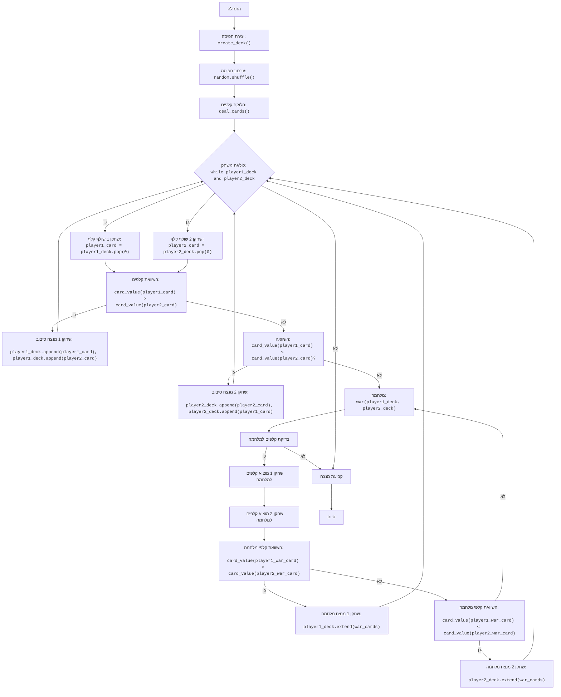

## <algorithm>
1.  **התחלה:** המשחק מתחיל.
2.  **יצירת חפיסת קלפים:** נוצרת חפיסה סטנדרטית של 52 קלפים. לדוגמה, החפיסה יכולה להיות רשימה של מחרוזות: `["2C", "2D", "2H", "2S", "3C", ..., "AH", "AS"]`.
3.  **ערבוב חפיסת הקלפים:** חפיסת הקלפים מעורבבת באופן אקראי. לדוגמה, סדר הקלפים בחפיסה יכול להיות `["KH", "3C", "AS", ..., "2D"]` אחרי ערבוב.
4.  **חלוקת הקלפים:** החפיסה מחולקת שווה בשווה בין שני שחקנים. שחקן 1 מקבל את החצי הראשון, ושחקן 2 מקבל את החצי השני. לדוגמה, אם החפיסה היא `["KH", "3C", "AS", ..., "2D"]`, שחקן 1 יקבל `["KH", "3C", "AS", ...]` ושחקן 2 יקבל את היתר.
5.  **לולאת משחק:** הלולאה ממשיכה כל עוד לשני השחקנים יש קלפים.
    *   **השחקנים חושפים קלף:** כל שחקן חושף את הקלף העליון מהחפיסה שלו. לדוגמה, שחקן 1 חושף "KH" ושחקן 2 חושף "3C".
    *   **השוואת ערך הקלפים:** ערך הקלפים מושווה.
        *   **ניצחון רגיל:** אם ערך הקלף של שחקן 1 גבוה יותר, הוא לוקח את שני הקלפים ומוסיף אותם לסוף החפיסה שלו. אם ערך הקלף של שחקן 2 גבוה יותר, הוא לוקח את שני הקלפים ומוסיף אותם לסוף החפיסה שלו. לדוגמה, אם שחקן 1 חושף "KH" (13) ושחקן 2 חושף "3C" (3), שחקן 1 מנצח.
        *   **מלחמה:** אם ערך הקלפים שווה, מתחילה מלחמה.
            *   **בדיקת קלפים:** נבדק האם לשני השחקנים יש מספיק קלפים למלחמה (לפחות 4). אם לאחד השחקנים אין מספיק קלפים, השחקן השני מנצח.
            *   **הנחת קלפים למלחמה:** כל שחקן מניח 3 קלפים עם הפנים כלפי מטה ואחד עם הפנים כלפי מעלה. לדוגמה, כל שחקן מוסיף 4 קלפים מראש הערימה שלו לערימת המלחמה (3 פנים למטה ו-1 פנים למעלה).
            *   **השוואת קלפי המלחמה:** משווים בין קלפי המלחמה שגולו.
                *   **ניצחון במלחמה:** השחקן עם הקלף הגבוה ביותר במלחמה לוקח את כל הקלפים (10) ומוסיף אותם לסוף החפיסה שלו.
                *   **מלחמה חוזרת:** אם קלפי המלחמה שווים, המלחמה חוזרת על עצמה (רקורסיה).
6.  **סוף המשחק:** הלולאה מסתיימת כאשר לאחד השחקנים אין קלפים.
7.  **הכרזת מנצח:** השחקן שיש לו קלפים מנצח במשחק.

## <mermaid>


**ניתוח תלויות:**

*   אין תלויות חיצוניות מלבד מודול `random` (חלק מהספרייה הסטנדרטית של פייתון), אשר משמש לערבוב חפיסת הקלפים באופן אקראי.

## <explanation>
**ייבוא (Imports):**
*   `import random`: מודול זה מספק פונקציות ליצירת מספרים אקראיים, כולל `random.shuffle` המשמש לערבוב חפיסת הקלפים.

**פונקציות (Functions):**

1.  **`create_deck()`**:
    *   **פרמטרים:** אין.
    *   **ערך מוחזר:** רשימה של מחרוזות המייצגות חפיסת קלפים סטנדרטית בת 52 קלפים.
    *   **מטרה:** יוצרת חפיסת קלפים סטנדרטית.
    *   **דוגמא:**
        ```python
        deck = create_deck()
        print(deck[0])  # פלט לדוגמה: '2C'
        print(len(deck))  # פלט לדוגמה: 52
        ```

2.  **`deal_cards(deck)`**:
    *   **פרמטרים:** `deck` - רשימה של מחרוזות המייצגת חפיסת קלפים.
    *   **ערך מוחזר:** טופל של שתי רשימות: החפיסה של שחקן 1 והחפיסה של שחקן 2.
    *   **מטרה:** מערבבת את החפיסה ומחלקת אותה שווה בשווה בין שני השחקנים.
    *   **דוגמא:**
        ```python
        deck = create_deck()
        player1_deck, player2_deck = deal_cards(deck)
        print(len(player1_deck))  # פלט לדוגמה: 26
        print(len(player2_deck))  # פלט לדוגמה: 26
        ```

3.  **`card_value(card)`**:
    *   **פרמטרים:** `card` - מחרוזת המייצגת קלף (לדוגמה, "2C", "KH", "AS").
    *   **ערך מוחזר:** מספר שלם המייצג את ערך הקלף (2-14).
    *   **מטרה:** מחזירה את הערך המספרי של קלף.
    *   **דוגמא:**
        ```python
        print(card_value("2C"))  # פלט: 2
        print(card_value("T"))  # פלט: 10
        print(card_value("A"))  # פלט: 14
        ```

4.  **`war(player1_deck, player2_deck)`**:
    *   **פרמטרים:** `player1_deck`, `player2_deck` - רשימות המייצגות את הקלפים של כל שחקן.
    *   **ערך מוחזר:** טופל של שלושה ערכים:
        *   1 אם שחקן 1 ניצח במלחמה, 2 אם שחקן 2 ניצח.
        *   רשימה של קלפים שיש להוסיף לקלפים של שחקן 1 אם הוא ניצח.
        *  רשימה של קלפים שיש להוסיף לקלפים של שחקן 2 אם הוא ניצח.
    *   **מטרה:** מיישמת את לוגיקת "המלחמה" במשחק. פונקציה זו יכולה לקרוא לעצמה (רקורסיה) אם מתרחשת מלחמה נוספת.
    *   **דוגמא:**
        ```python
         deck = create_deck()
         player1_deck, player2_deck = deal_cards(deck)
         winner, player1_add_cards, player2_add_cards = war(player1_deck, player2_deck)
         if winner == 1:
            print(f"player 1 wins, added cards: {player1_add_cards}")
        elif winner == 2:
            print(f"player 2 wins, added cards: {player2_add_cards}")
        ```

5.  **`play_war()`**:
    *   **פרמטרים:** אין.
    *   **ערך מוחזר:** אין.
    *   **מטרה:** פונקציית המשחק הראשית, המנהלת את כל המשחק: יצירת החפיסה, חלוקה, סיבובים ומלחמות, וקביעת המנצח.
    *   **דוגמא:** הפעלה ישירה של הפונקציה כאשר הקוד מופעל.

**משתנים (Variables):**

*   `suits`: רשימה של מחרוזות המייצגות את סוגי הקלפים (לב, יהלום, תלתן, עלה).
*   `ranks`: רשימה של מחרוזות המייצגות את ערכי הקלפים (2,3,4,5,6,7,8,9,10,J,Q,K,A).
*   `deck`: רשימה של מחרוזות המייצגות חפיסת קלפים שלמה.
*   `player1_deck`, `player2_deck`: רשימות של קלפים שנמצאים בידי השחקנים.
*   `player1_card`, `player2_card`: משתנים המכילים את הקלפים ששלפו השחקנים במהלך סיבוב.
*   `round_number`: מונה את מספרי הסיבובים.
*   `winner`: משתנה המכיל את המנצח בסיבוב או במלחמה.
*   `war_cards`: רשימת קלפים שהשתתפו במלחמה.

**בעיות אפשריות ושיפורים:**

*   **התמודדות עם מלחמה אינסופית:** במידה ומלחמות חוזרות על עצמן לעיתים קרובות, הדבר עלול להוביל ללולאה אינסופית. אפשר להוסיף הגבלה על כמות המלחמות.
*   **הודעות משתמש**: ניתן לשפר את הודעות המשתמש למשל על ידי הוספת גרפיקה פשוטה.
*   **עקביות בקוד**: ניתן להפוך את הקוד לקריא יותר על ידי שימוש ב-Enums לייצוג סוגי וערכי קלפים.

**שרשרת קשרים עם חלקים אחרים בפרויקט:**
*   לפי הקוד שסופק, הקובץ `war.py` עומד בפני עצמו ואין לו תלות ישירה בקבצים אחרים בפרויקט. עם זאת, ניתן לשלב קובץ זה בתוך פרויקט גדול יותר.