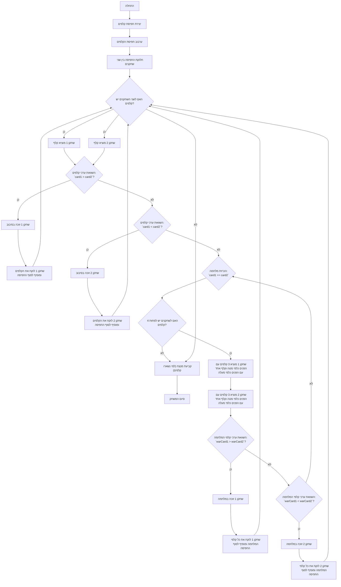

## <algorithm>

1. **התחלה:**
   - המשחק מתחיל עם יצירת חפיסת קלפים סטנדרטית בת 52 קלפים.
   - דוגמה: `deck = ["2C", "2D", "2H", "2S", "3C", ..., "AC", "AD", "AH", "AS"]`

2. **ערבוב החפיסה:**
   - חפיסת הקלפים מעורבבת באופן אקראי.
   - דוגמה: `deck` יכול להפוך ל-`["7H", "2C", "AS", ..., "3D"]`.

3. **חלוקת הקלפים:**
   - החפיסה מחולקת שווה בשווה בין שני השחקנים.
   - דוגמה:
     - `player1_deck = ["7H", "2C", "AS", ...]`
     - `player2_deck = ["3D", "KH", "9S", ...]`

4. **לולאת משחק:**
   - המשחק נמשך כל עוד לשני השחקנים יש קלפים בחפיסה.
   - כל סיבוב מתחיל בכך שכל שחקן מוציא קלף מהחלק העליון של החפיסה שלו.
   - דוגמה:
     - `player1_card = "7H"`
     - `player2_card = "3D"`
   - לאחר מכן, ערכי הקלפים מושווים.

5. **השוואת ערכי קלפים:**
   - ערך הקלפים נקבע באמצעות הפונקציה `card_value`.
   - דוגמה:
     - `card_value("7H")` מחזיר 7
     - `card_value("AD")` מחזיר 14
     - `card_value("KH")` מחזיר 13
   - אם קלף השחקן הראשון גדול יותר, השחקן הראשון זוכה בסיבוב ולוקח את שני הקלפים.
   - דוגמה: אם `card_value("7H") > card_value("3D")` שחקן 1 לוקח את הקלפים.
   - אם קלף השחקן השני גדול יותר, השחקן השני זוכה בסיבוב ולוקח את שני הקלפים.
   - דוגמה: אם `card_value("KH") > card_value("QH")` שחקן 2 לוקח את הקלפים.
   - אם ערכי הקלפים שווים, מתחילה "מלחמה".

6. **מלחמה:**
    - "מלחמה" מתחילה כאשר ערכי הקלפים שווים.
    - בדיקה האם לשני השחקנים יש לפחות 4 קלפים בחפיסה.
       - אם לא, השחקן עם פחות קלפים מפסיד.
    - אם לשניהם יש מספיק קלפים:
       - כל שחקן מוציא 3 קלפים מהחפיסה שלו ומניח אותם עם הפנים כלפי מטה.
       - כל שחקן מוציא קלף רביעי מהחפיסה שלו ומניח אותו עם הפנים כלפי מעלה.
       - משווים את הקלפים הרביעיים של כל שחקן.
       - השחקן עם הקלף הגבוה יותר לוקח את כל הקלפים (10) של הסיבוב.
       - אם הקלפים הרביעיים שווים, מתבצעת מלחמה נוספת בצורה רקורסיבית.

7. **סיום:**
   - המשחק מסתיים כאשר לאחד השחקנים נגמרים הקלפים.
   - השחקן שעדיין מחזיק קלפים מוכרז כמנצח.

## <mermaid>


**ניתוח תלויות (imports):**

*   `import random`: המודול `random` משמש לביצוע פעולות אקראיות, ספציפית לערבוב חפיסת הקלפים בשיטה `random.shuffle()`. המודול הוא חלק מהספרייה הסטנדרטית של פייתון ולכן אין צורך להתקין אותו בנפרד.

## <explanation>

**ייבוא (Imports):**

*   `import random`: מייבא את מודול ה-`random` של פייתון. מודול זה מספק פונקציות ליצירת מספרים אקראיים ופעולות אקראיות אחרות. במקרה זה, הוא משמש לערבוב החפיסה לפני חלוקת הקלפים.

**פונקציות (Functions):**

*   `create_deck()`:
    *   **פרמטרים:** אין.
    *   **ערך מוחזר:** רשימה (list) המכילה מחרוזות המייצגות את 52 הקלפים (לדוגמה, "2C" עבור 2 תלתן, "AH" עבור אס לב).
    *   **מטרה:** ליצור חפיסת קלפים סטנדרטית.
    *   **דוגמה:**
        ```python
        deck = create_deck()
        print(len(deck)) # Output: 52
        print(deck[0]) # Output: 2C
        ```
*   `deal_cards(deck)`:
    *   **פרמטרים:** `deck` - רשימה המייצגת חפיסת קלפים.
    *   **ערך מוחזר:** שני רשימות: `player1_deck`, `player2_deck`, המכילות את הקלפים המחולקים בין שני השחקנים.
    *   **מטרה:** לערבב את החפיסה ולחלק אותה שווה בשווה בין שני שחקנים.
    *   **דוגמה:**
        ```python
        deck = create_deck()
        player1_deck, player2_deck = deal_cards(deck)
        print(len(player1_deck)) # Output: 26
        print(len(player2_deck)) # Output: 26
        ```
*   `card_value(card)`:
    *   **פרמטרים:** `card` - מחרוזת המייצגת קלף (לדוגמה, "2C", "KH", "AS").
    *   **ערך מוחזר:** מספר שלם המייצג את ערך הקלף. ערכי קלפי המספר הם המספר עצמו (2 עד 9), ערכי קלפי התמונה הם: T=10 , J=11 , Q=12 , K=13 , A=14
    *   **מטרה:** לקבוע את הערך המספרי של קלף לצרכי השוואה.
    *   **דוגמה:**
        ```python
        print(card_value("2C")) # Output: 2
        print(card_value("T")) # Output: 10
        print(card_value("J")) # Output: 11
        print(card_value("Q")) # Output: 12
        print(card_value("K")) # Output: 13
        print(card_value("A")) # Output: 14

        ```
*   `war(player1_deck, player2_deck)`:
    *   **פרמטרים:** `player1_deck`, `player2_deck` - רשימות המייצגות את הקלפים של כל שחקן במהלך המלחמה.
    *   **ערך מוחזר:** שלושה ערכים: `winner`, `player1_add_cards`, `player2_add_cards`.
        *   `winner` - מספר שלם שמייצג את המנצח (1 או 2), או 0 אם אין מנצח בסיבוב המלחמה.
        *   `player1_add_cards` - רשימה של קלפים ששחקן 1 יקבל במידה והוא המנצח.
        *   `player2_add_cards` - רשימה של קלפים ששחקן 2 יקבל במידה והוא המנצח.
    *   **מטרה:** ליישם את לוגיקת "המלחמה" במשחק, כאשר הקלפים שווים.
    *    **שימוש:** הפונקציה נקראת באופן רקורסיבי כאשר מתרחשת "מלחמה" נוספת.
*   `play_war()`:
    *   **פרמטרים:** אין.
    *   **ערך מוחזר:** אין (מדפיסה את תוצאת המשחק).
    *   **מטרה:** מנהלת את כל תהליך המשחק, כולל יצירת החפיסה, חלוקה, משחק, הכרזת מנצח.
    *   **דוגמה:**
        ```python
        play_war()
        # Game output will be printed to console
        ```

**משתנים (Variables):**

*   `suits`: רשימה של מחרוזות המייצגות את סוגי הקלפים (תלתן, יהלום, לב, עלה).
*   `ranks`: רשימה של מחרוזות המייצגות את ערכי הקלפים (2 עד אס).
*   `deck`: רשימה של מחרוזות המייצגות את כל הקלפים.
*   `player1_deck`, `player2_deck`: רשימות המייצגות את הקלפים של כל שחקן.
*   `player1_card`, `player2_card`: מחרוזות המייצגות את הקלף שכל שחקן הוציא בסיבוב.
*   `round_number`: מספר שלם המייצג את מספר הסיבוב הנוכחי.
* `player1_war_cards`,`player2_war_cards` - רשימות של קלפים שנשלפים מהקלפים של השחקנים במקרה של מלחמה.
* `war_cards` - רשימת כל הקלפים שנשלפו במלחמה.
* `winner`- מספר שלם המייצג את המנצח במלחמה.
* `player1_add_cards`,`player2_add_cards` - רשימות קלפים להוספה לחפיסה של המנצח במלחמה.
* `middle` - משתנה שמייצג את חצי האורך של חפיסת הקלפים.

**בעיות אפשריות ותחומים לשיפור:**

*   **רקורסיה אינסופית במלחמה:** במצבים נדירים מאוד, אם ערכי הקלפים במלחמה שווים ברצף, הקוד עלול להיכנס לרקורסיה אינסופית. ניתן לשפר זאת על ידי הגבלת מספר הפעמים שמלחמה יכולה להתרחש ברצף.
*   **טיפול שגיאות:** הקוד לא מטפל בשגיאות כמו קלפים לא חוקיים בחפיסה, מה שעלול להוביל לקריסת התוכנית במקרה של שגיאה.
*   **הצגת מידע למשתמש:** ניתן להרחיב את ההודעות למשתמש כדי לכלול מידע נוסף על המשחק, כגון מצב הקלפים בכל סיבוב, או היסטוריית מהלכים.
*   **שימוש במחלקות:** ניתן לשפר את הקוד על ידי שימוש במחלקות עבור שחקן וקלף.

**שרשרת קשרים עם חלקים אחרים בפרויקט:**
   - הקוד `war.py` הוא משחק עצמאי ואינו תלוי בחלקים אחרים בפרויקט מלבד המודול `random` המובנה בפייתון. ניתן לשלב את הקוד הזה או חלקים ממנו בפרויקטים אחרים, כמו למשל שילוב שלו בתור משחק מיני במסגרת פלטפורמת משחקים.