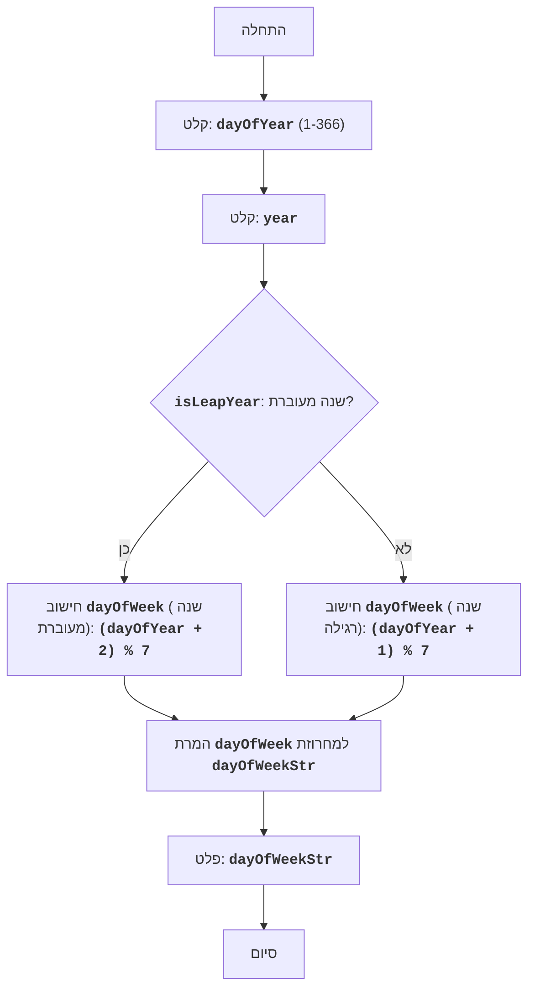

## <algorithm>

1. **התחלה**: תחילת התוכנית.
   *דוגמה*: התוכנית מתחילה את ביצועה.

2. **קלט יום בשנה**: מבקשת מהמשתמש להזין מספר יום בשנה (1-366) ושומרת אותו במשתנה `dayOfYear`.
   *דוגמה*: המשתמש מזין את המספר `100`.

3. **קלט שנה**: מבקשת מהמשתמש להזין שנה ושומרת אותה במשתנה `year`.
   *דוגמה*: המשתמש מזין את השנה `2024`.

4. **בדיקה האם שנה מעוברת**: קובעת האם השנה שהוזנה היא שנה מעוברת.
   *דוגמה*: עבור השנה 2024, התוצאה תהיה `True`.

5. **חישוב יום בשבוע (שנה מעוברת)**: אם השנה מעוברת, מחשבת את היום בשבוע בהתבסס על `dayOfYear`.
   *דוגמה*: עבור `dayOfYear` = 100 בשנת 2024 (שהיא שנה מעוברת), יחושב `dayOfWeek = (100 + 2) % 7`, ונקבל את היום בשבוע.

6. **חישוב יום בשבוע (שנה רגילה)**: אם השנה לא מעוברת, מחשבת את היום בשבוע בהתבסס על `dayOfYear`.
   *דוגמה*: עבור `dayOfYear` = 100 בשנת 2023 (שאינה שנה מעוברת), יחושב `dayOfWeek = (100 + 1) % 7`, ונקבל את היום בשבוע.

7. **המרת יום בשבוע למחרוזת**: ממירה את המספר של היום בשבוע (0-6) לייצוג מילולי (ראשון, שני, וכו').
   *דוגמה*: אם `dayOfWeek` הוא 2, יומר ל-"שלישי".

8. **פלט יום בשבוע**: מציגה למשתמש את היום בשבוע המתאים.
   *דוגמה*: יודפס "זה יום שלישי".

9. **סיום**: סוף התוכנית.

## <mermaid>

## <explanation>

**ייבואים (Imports):**
אין ייבוא מיוחד בקוד זה, הקוד עובד עצמאית.

**מחלקות (Classes):**
אין מחלקות בקוד זה. הקוד מורכב מפונקציות ומשתנים בסיסיים.

**פונקציות (Functions):**
אין פונקציות מוגדרות בקוד זה. הקוד משתמש בפונקציות מובנות של פייתון כמו `input()`, `int()`, ו-`print()`.

**משתנים (Variables):**
- `dayOfYear`: משתנה מסוג `int` המייצג את מספר היום בשנה שהוזן על ידי המשתמש.
  *דוגמה*: `dayOfYear = 100`
- `year`: משתנה מסוג `int` המייצג את השנה שהוזנה על ידי המשתמש.
  *דוגמה*: `year = 2024`
- `isLeapYear`: משתנה מסוג `bool` המייצג האם השנה שהוזנה היא שנה מעוברת (`True`) או לא (`False`).
  *דוגמה*: `isLeapYear = True` עבור שנת 2024.
- `dayOfWeek`: משתנה מסוג `int` המייצג את מספר היום בשבוע (0-6).
  *דוגמה*: `dayOfWeek = 2`
- `days`: משתנה מסוג `list` המכיל את שמות ימי השבוע בעברית.
  *דוגמה*: `days = ["ראשון", "שני", "שלישי", "רביעי", "חמישי", "שישי", "שבת"]`
- `dayOfWeekStr`: משתנה מסוג `str` המייצג את שם היום בשבוע בהתבסס על `dayOfWeek`.
  *דוגמה*: `dayOfWeekStr = "שלישי"`

**הסבר מפורט:**

1.  **קלט משתמש**: הקוד מתחיל בקבלת קלט מהמשתמש - מספר היום בשנה והשנה. הקוד משתמש ב-`try-except` כדי לוודא שהקלט הוא מספר שלם תקין.

2.  **בדיקת שנה מעוברת**: הקוד מחשב אם השנה שהמשתמש הכניס היא שנה מעוברת או לא. ההגדרה של שנה מעוברת היא שהשנה מתחלקת ב-4 וגם לא מתחלקת ב-100, או שהיא מתחלקת ב-400. התוצאה נשמרת במשתנה `isLeapYear`.

3.  **חישוב יום בשבוע**:
    *   אם השנה היא שנה מעוברת, נוסף 2 למספר היום בשנה, ואז מחשבים את השארית מחלוקה ב-7.
    *   אם השנה אינה שנה מעוברת, נוסף 1 למספר היום בשנה, ואז מחשבים את השארית מחלוקה ב-7.
    התוצאה נשמרת במשתנה `dayOfWeek`.
     
4.  **המרה לייצוג מילולי**: הקוד משתמש ברשימה `days` כדי להמיר את מספר היום בשבוע למחרוזת. אם `dayOfWeek` הוא 0,  `dayOfWeekStr` יהיה "שבת" אחרת זה יהיה היום המתאים לפי הרשימה.

5.  **פלט**: הקוד מציג למשתמש את היום בשבוע המתאים.

**בעיות אפשריות או תחומים לשיפור:**

*   **בדיקת תקינות קלט נוספת:**
    *   הקוד בודק שהקלט `dayOfYear` הוא בטווח 1-366, אבל לא בודק אם הוא חוקי עבור השנה הספציפית (למשל, היום ה-366 בשנה לא מעוברת אינו חוקי).
*   **התמודדות עם תאריכים מוקדמים יותר:**
    *   הקוד לא מתחשב בתאריכים מוקדמים יותר, מה שמניח שיום 1 של כל שנה הוא תמיד יום ראשון (או שני בשנה מעוברת) - זה תלוי אם השנה מעוברת או לא.
*   **הודעות שגיאה**: הודעות השגיאה הנוכחיות הן די כלליות. ניתן לשפר אותן כדי לתת למשתמש מידע יותר מדויק לגבי הבעיה.

**שרשרת קשרים עם חלקים אחרים בפרויקט:**
קוד זה הוא משחק עצמאי ואין לו קשר ישיר עם חלקים אחרים בפרויקט.