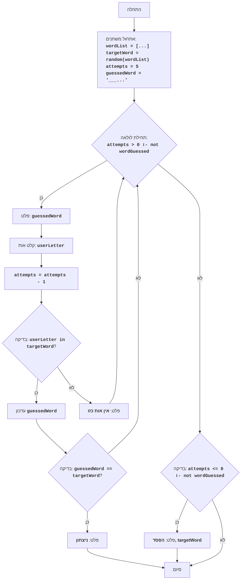

## <algorithm>

1. **אתחול:**
   -   1.1. רשימת מילים (`wordList`) מוגדרת: `["python", "java", "kotlin", "swift", "javascript", "go", "ruby"]`.
   -   1.2. מילה אקראית (`targetWord`) נבחרת מהרשימה, לדוגמה, `python`.
   -   1.3. מספר ניסיונות (`attempts`) מוגדר ל-5.
   -   1.4. מחרוזת ניחוש (`guessedWord`) מאותחלת למחרוזת של קווים תחתונים, באורך המילה, לדוגמה, `______` עבור `python`.
2. **לולאת משחק:**
    -   2.1. מחרוזת הניחוש (`guessedWord`) מודפסת למסך, לדוגמה, `______`.
    -   2.2. המשתמש מתבקש להזין אות (`userLetter`), למשל `p`.
    -   2.3. מספר הניסיונות (`attempts`) קטן ב-1.
    -   2.4. בדיקה האם האות שהוזנה (`userLetter`) קיימת במילה המטרה (`targetWord`):
        -   2.4.1. אם האות קיימת, מעדכנים את `guessedWord`. לדוגמה, עבור האות `p` ו`python`, `guessedWord` יהפוך ל- `p_____`.
        -   2.4.2. אם `guessedWord` שווה ל- `targetWord`, מודפסת הודעה על ניצחון, והלולאה מסתיימת.
    -   2.5. אם האות לא קיימת, מודפסת הודעה שאין אות כזו במילה.
3. **סיום משחק:**
   -   3.1. אם הלולאה הסתיימה ו-`guessedWord` עדיין לא שווה ל-`targetWord`, מודפסת הודעה על הפסד, יחד עם המילה הנכונה.
   -   3.2. המשחק מסתיים.

## <mermaid>

**ניתוח תלויות `mermaid`:**

-   **flowchart TD:** מגדיר תרשים זרימה מלמעלה למטה.
-   **Start, InitializeVariables, LoopStart, ... End:** הצמתים בתרשים, המייצגים את שלבי התוכנית.
-   **-->:** חיצים המציינים את זרימת הפעולות.
-   **-- כן/לא -->:** חיצים מותנים המציינים את זרימת הפעולות בהתאם לתנאי.
-   **<code>...</code>:** תיאור מילולי של פעולה/קוד בתוך הצומת.

## <explanation>

**ייבוא (Imports):**

-   `import random`: מייבא את מודול `random` המאפשר לבחור ערך אקראי מרשימה. השימוש הוא לבחירת מילה אקראית מרשימת המילים.

**משתנים (Variables):**

-   `wordList`: רשימה (list) של מילים אפשריות לניחוש. סוג הנתונים הוא `list[str]`.
-   `targetWord`: מחרוזת (string) המכילה את המילה האקראית שנבחרה מתוך `wordList`. סוג הנתונים הוא `str`.
-   `attempts`: מספר שלם (integer) המייצג את מספר הניסיונות שנותרו לשחקן, מאותחל ל-5. סוג הנתונים הוא `int`.
-   `guessedWord`: מחרוזת (string) המכילה את המילה שהשחקן מנחש, כאשר במקומות בהם האות לא ידועה מופיע קו תחתון. סוג הנתונים הוא `str`.
-   `userLetter`: מחרוזת (string) המכילה את האות שהשחקן הכניס בניסיון הניחוש. סוג הנתונים הוא `str`.

**פונקציות (Functions):**

-   אין פונקציות מוגדרות בנפרד, אך יש שימוש ב:
    -   `random.choice(wordList)`: בוחר מילה אקראית מתוך הרשימה `wordList` ומחזיר אותה.
    -   `len(targetWord)`: מחזיר את אורך המחרוזת `targetWord`.
    -   `input("Enter letter: ")`: קולט קלט מהמשתמש (מחרוזת).
    -   `lower()`: הופך מחרוזת לאותיות קטנות.
    -   `print(...)`: מציג פלט למסך.

**הסברים נוספים:**

-   הקוד מממש משחק ניחוש מילים בסיסי.
-   הקוד מציג את הניחוש של המילה בצורה גרפית באמצעות שימוש בתו "_" עבור אותיות לא מנוחשות.
-   לולאת המשחק ממשיכה עד שהשחקן מנחש את המילה או עד שנגמרים לו הניסיונות.
-   בכל סיבוב, השחקן מזין אות, והקוד בודק אם האות נמצאת במילה ומעדכן את המילה המנוחשת בהתאם.
-   הקוד משתמש במודול `random` כדי לבחור מילה אקראית מהרשימה.
-   אין מנגנון להתמודדות עם קלט לא חוקי (כמו מספרים או תווים מיוחדים), ויש לקחת זאת בחשבון לצורך שיפור אפשרי.
-   ניתן להרחיב את רשימת המילים, להגדיל את מספר הניסיונות, או להוסיף רמות קושי.

**שרשרת קשרים:**
-   הקוד הנוכחי הוא משחק עצמאי שאינו תלוי באופן ישיר בחלקים אחרים של הפרויקט.
-   אפשר ליצור אינטגרציה עם ממשק משתמש או עם מסגרת משחקים כדי להעשיר את חווית המשתמש.
-   אפשר גם להשתמש בקוד כמודול הניתן לשימוש חוזר במשחקים אחרים.

**בעיות אפשריות ותחומים לשיפור:**
-   **טיפול בשגיאות קלט:** לא מוגדר טיפול בקלט לא חוקי.
-   **ממשק משתמש:** המשחק מבוסס טקסט בלבד, אפשר לשפר את הממשק.
-   **רמות קושי:** אפשר להוסיף רמות קושי עם מילים קשות יותר או מספר ניסיונות משתנה.
-   **שיפור הגרפיקה:** אפשר לייצג את התקדמות הניחוש בצורה ויזואלית יותר, לדוגמה על ידי הדפסת אותיות בודדות במקומן.