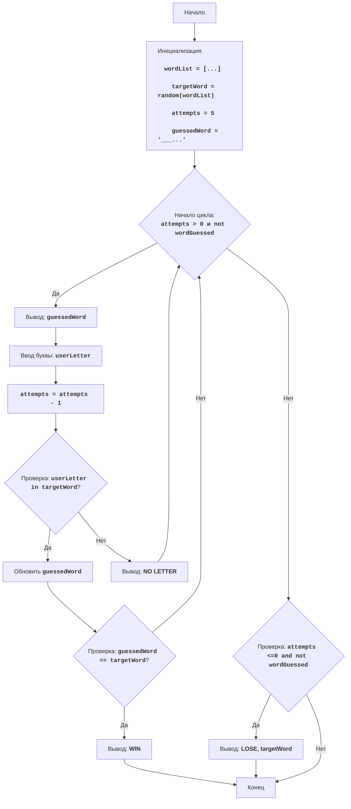

## <algorithm>
1.  **אתחול:**
    *   1.1. הגדר רשימה של מילים אפשריות: `wordList = ["python", "java", "kotlin", "swift", "javascript", "go", "ruby"]`.
    *   דוגמה: `wordList` מכיל שמות של שפות תכנות.
    *   1.2. בחר מילה אקראית מתוך הרשימה: `targetWord = random.choice(wordList)`.
    *   דוגמה: `targetWord` יכול להיות "python".
    *   1.3. הגדר את מספר הניסיונות: `attempts = 5`.
    *   1.4. יצירת מחרוזת לניחוש: `guessedWord = "_" * len(targetWord)`.
    *   דוגמה: אם `targetWord` הוא "python", אז `guessedWord` יהיה "______".
2.  **לולאה ראשית:**
    *   הלולאה תמשיך כל עוד יש ניסיונות וכל עוד המילה לא נוחשה: `while attempts > 0 and guessedWord != targetWord:`.
    *   2.1. הצג את מצב הניחוש הנוכחי: `print("Слово:", guessedWord)`.
    *   דוגמה: אם `guessedWord` הוא "___t__", אז יודפס: "Слово: ___t__".
    *   2.2. קבל אות מהמשתמש: `userLetter = input("Введите букву: ").lower()`.
    *   דוגמה: המשתמש יקליד "a".
    *   2.3. הפחת את מספר הניסיונות: `attempts -= 1`.
    *   2.4. בדוק האם האות קיימת במילה: `if userLetter in targetWord:`.
        *   2.4.1. אם האות קיימת:
            *   עדכן את `guessedWord` עם האות: `guessedWord = guessedWord[:i] + userLetter + guessedWord[i+1:]`.
            *   דוגמה: אם `targetWord` הוא "python", `userLetter` הוא "o" והאינדקס i הוא 4, אז `guessedWord` יהפוך ל"___o__".
            *   2.4.2. בדוק האם המילה נוחשה: `if guessedWord == targetWord:`.
                *   אם כן, הדפס הודעה על ניצחון וצא מהלולאה: `print("ПОЗДРАВЛЯЮ! Вы угадали слово:", targetWord); break`.
        *   2.5. אם האות לא קיימת: `else:`.
            *   הדפס הודעה שהאות לא נמצאת: `print("Такой буквы нет в слове.")`.
3.  **סיום המשחק:**
    *   אם המילה לא נוחשה לאחר הלולאה: `if guessedWord != targetWord:`.
        *   הדפס הודעה על הפסד והצג את המילה: `print("Вы проиграли. Загаданное слово было:", targetWord)`.

## <mermaid>

**הסבר תלויות:**
*   הקוד משתמש במודול `random` כדי לבחור מילה אקראית מרשימה. לא נדרשות תלויות מיוחדות אחרות לצורך תרשים הזרימה.
* כל השמות משתנים בתרשים `mermaid` בעלי משמעות ומתארים את הפונקציה שלהם, לדוגמא:
    * `wordList` - רשימת המילים האפשריות לניחוש.
    * `targetWord` - המילה שנבחרה באופן אקראי לניחוש.
    * `attempts` - מספר הניסיונות שנותרו למשתמש.
    * `guessedWord` - מחרוזת המייצגת את הניחושים שהמשתמש ניחש עד כה.
    * `userLetter` - האות שהמשתמש הזין בניסיון ניחוש.

## <explanation>
**ייבואים (Imports):**
*   `import random`: מייבא את המודול random המאפשר בחירת מילה אקראית מרשימה.

**משתנים (Variables):**
*   `wordList`: רשימה של מילים (מחרוזות) המשמשת כמקור למילים לניחוש. הסוג הוא `list` (רשימה).
*   `targetWord`: מחרוזת המייצגת את המילה שנבחרה באופן אקראי מתוך `wordList`. הסוג הוא `str` (מחרוזת).
*   `attempts`: משתנה מספרי (int) המייצג את מספר הניסיונות שהמשתמש מקבל לניחוש המילה.
*   `guessedWord`: מחרוזת (str) שמתחילה כאוסף של קווים תחתונים, ובהמשך, האותיות שהמשתמש ניחש נכונה יחליפו את הקווים התחתונים בהתאם למיקומם במילה המקורית.

**פונקציות (Functions):**
*   אין פונקציות מוגדרות משתמש, כל הלוגיקה נמצאת בתוך הקוד הראשי, אך ההשתמשות ב `random.choice()` היא פונקציה חיצונית.

**הסבר מפורט:**
1.  **אתחול:**
    *   רשימת המילים `wordList` מוגדרת מראש, והמילה לניחוש נבחרת באופן אקראי מתוכה.
    *   מספר הניסיונות מוגדר ל-5, והמחרוזת `guessedWord` מאותחלת כך שתתאים באורך למילה המקורית (כלומר, מחרוזת של קווים תחתונים באורך המילה).
2.  **לולאת המשחק:**
    *   הלולאה נמשכת כל עוד יש למשתמש ניסיונות ולא ניחש את המילה.
    *   בכל איטרציה, מוצג מצב הניחוש, המשתמש מקליד אות, מספר הניסיונות יורד ב-1.
    *   אם האות קיימת, מחרוזת הניחוש מתעדכנת, ואם המילה נוחשה במלואה, המשחק מסתיים בניצחון.
    *   אם האות לא קיימת, המשתמש מקבל הודעה וחוזר לניסיון נוסף.
3.  **סיום המשחק:**
    *   לאחר סיום הלולאה, אם המילה עדיין לא נוחשה, המשתמש הפסיד והמילה המקורית מוצגת.

**בעיות אפשריות ותחומים לשיפור:**
*   הקוד אינו עמיד בפני קלט לא תקין. לדוגמה, אם המשתמש מזין מחרוזת ארוכה או מספר, הקוד לא יתמודד עם זה באופן תקין.
*   ניתן להוסיף אפשרות לבקש רמז או להציג את האותיות שהמשתמש כבר ניסה.
*   רשימת המילים קבועה בתוך הקוד ויש אפשרות לקרוא מתוך קובץ חיצוני.

**קשרים לחלקים אחרים בפרויקט:**
*  הקוד הזה הוא משחק עצמאי, ולכן אין לו קשרים ישירים לחלקים אחרים בפרויקט מלבד להיות חלק ממערכת משחקים.