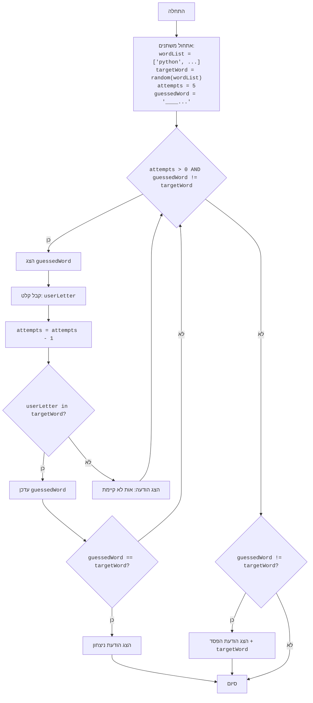

## <algorithm>

1.  **התחלה:**
    *   המשחק מתחיל.
2.  **אתחול משתנים:**
    *   `wordList`: רשימת מילים מוגדרת מראש. לדוגמה: `["python", "java", "kotlin", "swift", "javascript", "go", "ruby"]`.
    *   `targetWord`: מילה אקראית נבחרת מרשימת המילים. לדוגמה: `"python"`.
    *   `attempts`: מספר ניסיונות מוגדר כ-5.
    *   `guessedWord`: מחרוזת המייצגת את ניחוש המילה הנוכחי, כאשר כל תו מוסתר באמצעות "_". לדוגמה: `______`.
3.  **לולאה ראשית (כל עוד יש ניסיונות ועדיין לא ניחשת את המילה):**
    *   **הצגת מצב הניחוש:** הצג את המחרוזת `guessedWord`. לדוגמה: `_ _ _ _ _ _`.
    *   **קבלת קלט מהמשתמש:** קבל אות מהמשתמש והמר אותה לאות קטנה, לדוגמה: `'p'`.
    *   **הפחתת ניסיון:** הפחת את מספר הניסיונות ב-1.
    *   **בדיקה האם האות קיימת במילה המטרה:**
        *   **אם האות קיימת:**
            *   עדכן את `guessedWord` על ידי החלפת המקפים באות שנקלטה במקומות הנכונים. לדוגמה: אם המשתמש הכניס 'p', אז `guessedWord` משתנה ל`p_____`.
            *   בדוק האם `guessedWord` שווה ל`targetWord` (האם המילה נוחשה במלואה).
                *   אם כן, הצג הודעת ניצחון וצא מהלולאה.
        *   **אם האות לא קיימת:**
            *   הודע למשתמש שהאות אינה קיימת.
4.  **בדיקה האם המשתמש הפסיד:**
    *   אם `guessedWord` שונה מ`targetWord` (כלומר, לא נוחשה המילה), הצג הודעת הפסד ואת המילה המקורית.
5.  **סוף המשחק.**

## <mermaid>

## <explanation>

**ייבואים (Imports):**

*   `import random`: מייבא את מודול `random`, המספק פונקציות ליצירת מספרים אקראיים. משמש לבחירת מילה אקראית מרשימת המילים. אין תלות ישירה בקבצים אחרים בתוך הפרויקט.

**משתנים (Variables):**

*   `wordList`: רשימה (`list`) של מחרוזות, המכילה את כל המילים האפשריות שהמשחק יכול לבחור מתוכן.
*   `targetWord`: מחרוזת (`str`) המייצגת את המילה הסודית שנבחרה באופן אקראי מתוך `wordList`.
*   `attempts`: מספר שלם (`int`) המייצג את כמות הניסיונות שנותרו לשחקן. ערכו ההתחלתי הוא 5.
*   `guessedWord`: מחרוזת (`str`) המייצגת את ההתקדמות של השחקן בניחוש המילה. בהתחלה, היא מכילה מקפים תחתונים (`)_`) כמספר האותיות במילה הנבחרת.
*   `userLetter`: מחרוזת (`str`) המייצגת את האות שהזין השחקן, היא מומרת לאות קטנה.
*   `i`: משתנה מסוג מספר שלם (`int`) שמשמש כאינדקס בתוך הלולאה שסורקת את אותיות המילה `targetWord`.

**פונקציות (Functions):**

*   אין פונקציות מוגדרות משל עצמו, אך נעשה שימוש בפונקציות מובנות:
    *   `random.choice(wordList)`: פונקציה של המודול `random` שבוחרת באופן אקראי פריט מרשימת המילים `wordList`.
    *   `input("...")`: פונקציה שמקבלת קלט מהמשתמש ומחזירה אותו כמחרוזת.
    *   `len(targetWord)`: פונקציה שמחזירה את אורך המחרוזת `targetWord`, כלומר את מספר האותיות במילה.
    *   `lower()`: פונקציה של מחרוזת שממירה את כל האותיות למצב קטן.
    *   `print("...")`: פונקציה שמדפיסה פלט למסך.

**הסברים מפורטים:**

*   הקוד מיישם משחק ניחוש מילים בסיסי.
*   המשחק בוחר מילה אקראית מרשימה מוגדרת מראש.
*   השחקן מנסה לנחש את המילה על ידי הזנת אותיות.
*   בכל ניסיון, השחקן מזין אות אחת, והמשחק בודק האם האות קיימת במילה הסודית.
*   אם האות קיימת, המשחק חושף את המיקום שלה במילה.
*   אם השחקן מצליח לנחש את כל המילה, הוא מנצח.
*   לשחקן יש מספר מוגבל של ניסיונות. אם הוא לא מצליח לנחש את המילה בתוך מספר זה, הוא מפסיד.
*   הלולאה `while` ממשיכה את המשחק כל עוד יש לשחקן ניסיונות וכל עוד המילה לא נוחשה במלואה.
*   הקוד כולל טיפול תקין במקרי ניצחון והפסד.
*   הקוד ניתן לשיפור על ידי הוספת תכונות כמו:
    *   אפשרות לבחירת קטגוריית מילים (חיות, מדינות, וכו')
    *   הצגת מספר ניסיונות שנותרו
    *   הצגת אותיות שנוסו כבר
    *   הוספת גרפיקה בסיסית
    *   הוספת רמות קושי שמשפיעות על כמות הניסיונות.

**שרשרת קשרים עם חלקים אחרים בפרויקט:**

*   אין תלות או קשר ישיר לחלקים אחרים בפרויקט, מכיוון שהקוד הוא משחק עצמאי ופשוט.
*   ניתן להרחיב את המשחק בעתיד כך שיהיה חלק ממערכת משחקים רחבה יותר.

**בעיות אפשריות או תחומים לשיפור:**

*   אין טיפול בקלט לא חוקי (למשל, אם השחקן מזין יותר מאות אחת).
*   אין אפשרות לצאת מהמשחק באמצע.
*   המשחק לא מציע קושי משתנה או מספר ניסיונות שניתן להתאמה.
*   אין שום סוג של עיצוב או ממשק משתמש ידידותי, המשחק מבוסס על טקסט בלבד.