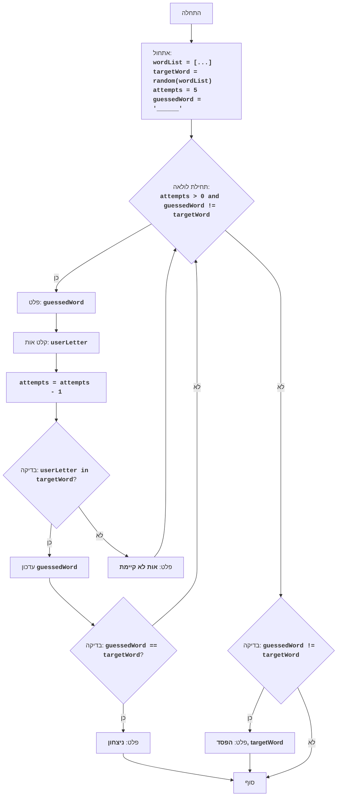

## ניתוח קוד: משחק מילים

### <algorithm>
1.  **אתחול:**
    *   מגדירים רשימה של מילים אפשריות `wordList = ["python", "java", "kotlin", "swift", "javascript", "go", "ruby"]`.
    *   בוחרים באופן אקראי מילה מהרשימה `targetWord = random.choice(wordList)`. למשל, `targetWord = "python"`.
    *   קובעים מספר ניסיונות `attempts = 5`.
    *   יוצרים מחרוזת `guessedWord` המייצגת את ניחוש המילה עם קווים תחתונים בהתחלה. למשל, `"______"`.
2.  **לולאה ראשית:**
    *   הלולאה מתבצעת כל עוד נשארו ניסיונות והמילה לא נוחשה.
    *   מדפיסים את מצב הניחוש הנוכחי של המילה. לדוגמה, `"______"` או `"p_t___"`.
    *   מבקשים מהמשתמש להזין אות. למשל, `userLetter = "t"`.
    *   מקטינים את מספר הניסיונות ב-1 `attempts -= 1`.
    *   **בדיקה האם האות קיימת במילה:**
        *   אם האות קיימת במילה הנבחרת, למשל `if "t" in "python"`:
            *   מעדכנים את המחרוזת `guessedWord` על ידי החלפת הקווים התחתונים במקומות המתאימים באות שהמשתמש הזין. לדוגמה, מ-`"______"` ל-`"_t____"`.
            *   בודקים אם המילה נוחשה במלואה, כלומר `guessedWord == targetWord`.
            *   אם המילה נוחשה, מדפיסים הודעת ניצחון ומסיימים את הלולאה.
        *   אם האות לא קיימת במילה הנבחרת, למשל `if "z" in "python"`, מדפיסים הודעה שהאות לא קיימת.
3.  **בדיקה האם המשחק הסתיים בהפסד:**
    *   אם המשתמש לא ניחש את המילה, מודפסת הודעה שמציגה את המילה הנבחרת ומציינת את ההפסד.
4.  **סיום:** המשחק מסתיים, בין אם בניצחון או בהפסד.

### <mermaid>

התרשים אינו כולל תלויות בייבוא משום שהקוד המקורי אינו כולל את השורה `import header`.

### <explanation>

*   **ייבואים (Imports):**
    *   `import random`: מייבא את מודול `random` המאפשר פעולות רנדומליות כמו בחירת מילה רנדומלית מתוך רשימה.
*   **משתנים (Variables):**
    *   `wordList`: משתנה מסוג רשימה, המכיל את רשימת המילים שהמשחק יכול לבחור מהן.
    *   `targetWord`: משתנה מסוג מחרוזת, המכיל את המילה שנבחרה באופן רנדומלי, אותה השחקן צריך לנחש.
    *   `attempts`: משתנה מסוג מספר שלם, המכיל את מספר הניסיונות שנותרו לשחקן.
    *   `guessedWord`: משתנה מסוג מחרוזת, המכיל את מצב ניחוש המילה הנוכחי, בהתחלה מחרוזת של קווים תחתונים.
    *   `userLetter`: משתנה מסוג מחרוזת, המכיל את האות שהזין המשתמש.
*   **פונקציות (Functions):**
    *   הקוד אינו כולל פונקציות מוגדרות על ידי המשתמש, אלא משתמש בפונקציות מובנות של פייתון, כמו `random.choice()`, `input()`, `print()`, ובפעולות על מחרוזות.
*   **לולאה (while loop):**
    *   הלולאה `while attempts > 0 and guessedWord != targetWord:` ממשיכה כל עוד לשחקן נותרו ניסיונות והוא לא ניחש את המילה הנכונה. בתוך הלולאה מתבצעים שלבים כמו הדפסת מצב המילה, קבלת קלט מהמשתמש, בדיקת הקלט, ועדכון מצב המילה בהתאם.
*   **תנאים (if-else):**
    *   `if userLetter in targetWord:`: בודק אם האות שהזין המשתמש נמצאת במילה הנכונה.
    *   `if guessedWord == targetWord:`: בודק אם השחקן ניחש את המילה כולה, ואם כן, מציג הודעת ניצחון.
    *   `if guessedWord != targetWord`: מחוץ ללולאה, בודק האם השחקן סיים את כל הניסיונות בלי לנחש את המילה, ואם כן, מציג הודעת הפסד.
*   **בעיות אפשריות או תחומים לשיפור:**
    *   **טיפול בקלט שגוי:** הקוד לא מטפל במקרים בהם המשתמש מזין יותר מאות אחת, או קלט שאינו אות.
    *   **ממשק משתמש:** הממשק פשוט ולא ידידותי במיוחד.
    *   **בחירת מילים:** המילים ברשימה קבועות. אפשר לשקול לקרוא מילים מקובץ.
    *   **מספר ניסיונות:** מספר הניסיונות קבוע ואינו ניתן לשינוי על ידי המשתמש. אפשר לאפשר למשתמש לבחור את מספר הניסיונות.

בסך הכל, הקוד מיישם משחק ניחוש מילים בסיסי, עם לוגיקה ברורה ופשוטה, אך ניתן לשפר אותו במספר היבטים.