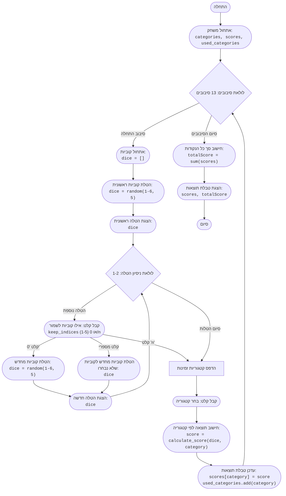

# ניתוח קוד: משחק Yahtzee

## 1. <algorithm>

1. **התחלה:**
   -   משתנים מאותחלים: `categories` (רשימת קטגוריות), `scores` (מילון לתוצאות), `used_categories` (קבוצה לקטגוריות בשימוש).
   -   דוגמה: `categories = ['1', '2', '3', '4', '5', '6', '3 of a kind', ...]` , `scores = {'1': None, '2': None, ...}`, `used_categories = set()`

2. **לולאת סיבובים (13 סיבובים):**
   -   לכל סיבוב:
     -   אתחול קוביות: `dice` (רשימת 5 קוביות).
         -  דוגמה: `dice = [1, 3, 6, 2, 5]`
     -   הדפסת תוצאת הטלת הקוביות הראשונית.
         -  דוגמה: `Первый бросок: [1, 3, 6, 2, 5]`
     -   לולאת ניסיונות הטלה (עד 3 ניסיונות):
        -   בקשת קלט מהמשתמש: איזה קוביות לשמור (מספרים 1-5 מופרדים ברווחים, 0 להטלה מחדש, 'n' ללא הטלה).
           -   דוגמה: קלט משתמש `1 3 5`
        -   אם קלט 'n', שבור את לולאת הניסיונות.
        -   אם קלט '0', הטל את כל הקוביות מחדש.
        -   אחרת, נסה להמיר את הקלט לאינדקסים (הפחת 1 מכל אינדקס שהמשתמש הזין).
            -  דוגמה: `keep_indices = [0, 2, 4]`
        -   יצירת רשימת קוביות חדשה: הטלת קוביות רק לאלו שלא נבחרו לשמירה והוספת הקוביות שנבחרו לשמירה.
            -  דוגמה: אם הקוביות שהתקבלו היו `dice = [1, 3, 6, 2, 5]` ו  `keep_indices = [0, 2, 4]` אז אחרי הטלה מחדש של קוביות 2 ו 4 נקבל `dice = [1, 4, 6, 1, 5]`.
         - הדפסת תוצאת ההטלה.
         - חזרה לראש לולאת הניסיונות.
    -   בסוף לולאת הניסיונות:
       -   יצירת רשימת קטגוריות זמינות (אלו שלא שומשו).
       -   הדפסת רשימת הקטגוריות הזמינות.
           - דוגמה: `Доступные категории: 1. 1  2. 2  3. 3 ...`
       -   קליטת קלט משתמש: בחירת קטגוריה זמינה מהרשימה.
          - דוגמה: קלט משתמש `2`
       -   חישוב תוצאה עבור קטגוריה זו.
           -  דוגמה: `score = calculate_score(dice, '2')`
       -   שמירת התוצאה במילון `scores` לקטגוריה המתאימה.
           -   דוגמה: `scores['2'] = 2`
       -   הוספת הקטגוריה לקבוצה `used_categories`.
           -   דוגמה: `used_categories = {'2', '1'} `
       -  הדפסת התוצאה עבור הקטגוריה שנבחרה.
           - דוגמה: `Очки за категорию 2: 2`
  - חזרה לראש לולאת הסיבובים.

3.  **סיום:**
    - הדפסת טבלת תוצאות סופית (כל קטגוריה ונקודותיה).
        - דוגמה: `1: 10 2: 2  ... chance: 12`
    -   חישוב סך כל הנקודות.
    - הדפסת סך כל הנקודות.
       -   דוגמה: `Общий счет: 120`

## 2. <mermaid>



**הסבר תרשים Mermaid:**

-   **flowchart TD:** מכריז על תרשים זרימה מלמעלה למטה.
-   **Start(["התחלה"]):** נקודת ההתחלה של התוכנית.
-   **InitializeGame:** מאתחל משתנים נחוצים למשחק: רשימת קטגוריות (`categories`), מילון תוצאות (`scores`) וקבוצת קטגוריות בשימוש (`used_categories`).
-   **RoundLoopStart:** תחילת לולאה שעוברת על 13 סיבובי משחק.
-  **InitializeDice:** מאתחל רשימה ריקה שתשמש לאחסון תוצאות ההטלה.
-   **RollDice1:** מדמה הטלה ראשונית של 5 קוביות על ידי יצירת 5 מספרים אקראיים בין 1 ל-6.
- **OutputDice1:** מציג את תוצאת ההטלה הראשונית.
-   **RollAttemptLoop:** תחילת לולאה המאפשרת עד 2 ניסיונות הטלה נוספים.
-  **InputKeepDice:** מקבל מהמשתמש אילו קוביות להשאיר, או הוראה להטיל הכל מחדש או להפסיק הטלות.
-   **InputKeepDice --"קלט 'n'"--> OutputAvailableCategories:** אם המשתמש בחר שלא להטיל מחדש, המשחק ממשיך לחישוב קטגוריות.
-   **InputKeepDice --"קלט '0'"--> RollDice2:** אם המשתמש בחר להטיל הכל מחדש, הקוביות מוטלות מחדש.
-   **OutputDice2:** מציג את תוצאת ההטלה הנוספת.
-    **ReRollDice:**  מדמה הטלת קוביות מחדש רק לאלה שלא נבחרו להישמר, ושילובן עם הקוביות שנבחרו לשמירה.
-  **RollAttemptLoop --"סיום הטלות"-->OutputAvailableCategories:** לאחר סיום כל הניסיונות, המשחק ממשיך לחישוב הקטגוריות הזמינות.
-   **OutputAvailableCategories:** מציג את רשימת הקטגוריות הזמינות לבחירה.
-   **InputCategory:** מקבל את קלט המשתמש לבחירת קטגוריה.
-   **CalculateScore:** מחשב את הניקוד עבור הקטגוריה שנבחרה, לפי תוצאות הקוביות.
-   **UpdateScorecard:** מעדכן את טבלת התוצאות ושומר את הקטגוריה שנבחרה כמשומשת.
-  **RoundLoopStart -- "סיום הסיבובים"--> CalculateTotalScore:** לאחר סיום כל הסיבובים, המשחק עובר לחישוב התוצאה הסופית.
-   **CalculateTotalScore:** מחשב את סך כל הנקודות מכל הקטגוריות.
-   **OutputScorecard:** מציג את טבלת התוצאות הסופית ואת סך כל הנקודות.
-   **End:** נקודת הסיום של התוכנית.

**אין תלות בקובץ `header.py` ולכן אין תרשים זרימה עבורו.**

## 3. <explanation>

**ייבואים (Imports):**

-   `import random`: מייבא את מודול ה-`random` של פייתון, המשמש ליצירת מספרים אקראיים, כמו למשל הטלת קוביות. הוא משמש בפונקציות `roll_dice` ובפונקציה `play_yahtzee`.

**פונקציות (Functions):**

1.  **`roll_dice()`:**
    -   **פרמטרים:** אין.
    -   **ערך מוחזר:** רשימה של 5 מספרים אקראיים בין 1 ל-6 (מדמה הטלה של 5 קוביות).
    -   **מטרה:** מדמה הטלה של 5 קוביות.
    -   **דוגמה לשימוש:**
        ```python
        dice_results = roll_dice()
        print(dice_results) # פלט אפשרי: [2, 5, 1, 6, 3]
        ```

2.  **`calculate_score(dice, category)`:**
    -   **פרמטרים:**
        -   `dice`: רשימה של 5 מספרים (תוצאות הטלת קוביות).
        -   `category`: מחרוזת המייצגת את הקטגוריה הנבחרת (לדוגמה: '1', 'full house', 'chance').
    -   **ערך מוחזר:** מספר שלם המייצג את הניקוד עבור הקטגוריה הנבחרת.
    -   **מטרה:** חישוב הניקוד עבור קטגוריה מסוימת, בהתאם לחוקי המשחק.
    -   **דוגמה לשימוש:**
        ```python
        dice = [1, 1, 2, 2, 2]
        score = calculate_score(dice, 'full house') # score יהיה 25
        score = calculate_score(dice, '1') # score יהיה 2
        score = calculate_score(dice, 'chance') # score יהיה 8
        ```

3.  **`play_yahtzee()`:**
    -   **פרמטרים:** אין.
    -   **ערך מוחזר:** אין.
    -   **מטרה:** המרכזית לניהול משחק Yahtzee.
    -   **תהליך:**
        -   מאתחלת את משתני המשחק (`categories`, `scores`, `used_categories`).
        -   עוברת בלולאה על 13 סיבובים.
        -   בכל סיבוב, מאפשרת עד 3 הטלות קוביות, עם אפשרות לשמור חלק מהקוביות ולהטיל את השאר מחדש.
        -   מציגה למשתמש רשימה של קטגוריות זמינות ומאפשרת לו לבחור קטגוריה.
        -   מחשבת את הניקוד עבור הקטגוריה הנבחרת ושומרת אותו.
        -   בסוף המשחק, מציגה את טבלת התוצאות הסופית ואת סך הנקודות.
        - דוגמה:
        ```python
         play_yahtzee() # תחילת משחק
        ```

**משתנים (Variables):**

-   `categories`: רשימה של מחרוזות המייצגות את כל קטגוריות המשחק.
-   `scores`: מילון המשמש לאחסון הניקוד לכל קטגוריה. המפתחות הם שמות הקטגוריות, והערכים הם הנקודות שהושגו בכל קטגוריה. ערכי ברירת המחדל הם `None`.
-   `used_categories`: קבוצה של קטגוריות שהשתמשו בהן במהלך המשחק.
-   `dice`: רשימה של 5 מספרים שלמים, המייצגים את תוצאות הטלת הקוביות בכל סיבוב.
-   `keep_indices`: רשימה של אינדקסים המייצגים את הקוביות שהשחקן בחר להשאיר.
-   `new_dice`: רשימה של קוביות חדשה שנוצרת לאחר הטלה מחדש.
-   `roll_attempt`: משתנה שמסמל את מספר הניסיון הנוכחי בסיבוב.
-  `round_num`: משתנה שמסמל את מספר הסיבוב הנוכחי במשחק.
-   `available_categories`: רשימה של קטגוריות שעדיין לא נעשה בהן שימוש.
-   `choice_index`: אינדקס הקטגוריה שהשחקן בוחר.
-   `category_choice`: הקטגוריה שהשחקן בוחר.
-  `score`: הניקוד שהושג עבור הקטגוריה שנבחרה.
-  `total_score`: סכום הנקודות של כל הקטגוריות.

**בעיות אפשריות ותחומים לשיפור:**

1.  **בדיקת קלט משתמש:**
    -   הקוד עושה בדיקה בסיסית של קלט משתמש, אך ניתן לשפר את בדיקות תקינות הקלט (לדוגמה, לוודא שהמשתמש לא מזין אותיות במקום מספרים).
    -  לדוגמה, כאשר מבקשים מהמשתמש להזין מספרים בין 1 ל 5, אפשר להוסיף בדיקה שהמספרים אכן בטווח הזה.
2.  **הודעות משתמש:**
    -   הודעות המשחק קצרות. ניתן לשפר אותן ולהוסיף הסברים נוספים למשתמש, כדי לעשות את המשחק יותר ידידותי למשתמש.
    - לדוגמה, להציג הודעה אם לא ניתן לבחור קטגוריה מסויימת כי הקוביות שהתקבלו לא מתאימות לקטגוריה.
3.  **מודולריות:**
    -   ניתן לשקול לפצל חלק מהפונקציות לחלקים יותר קטנים וממוקדים.
4.  **תיעוד:**
    -   ניתן להוסיף עוד תיעוד לקוד כדי להקל על ההבנה שלו.

**שרשרת קשרים עם חלקים אחרים בפרויקט:**

-   הקוד לא תלוי בחלקים אחרים של הפרויקט. הוא מודול עצמאי.

בסך הכל, הקוד מספק יישום מלא של משחק Yahtzee בסיסי, עם פונקציונליות לביצוע הטלות, חישוב תוצאות וניהול סיבובי המשחק.