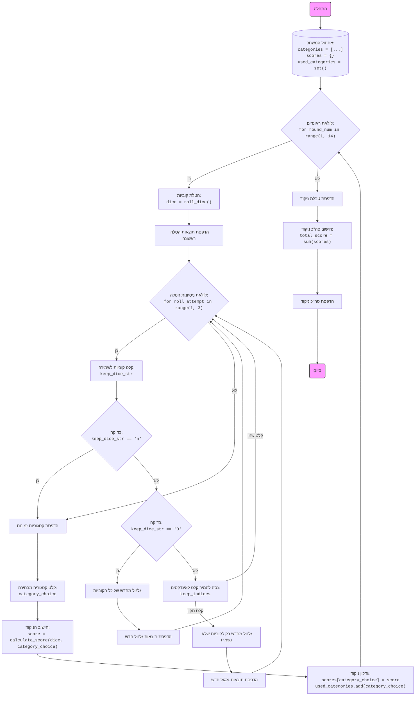

## ניתוח קוד: משחק Yahtzee

### <algorithm>
1. **אתחול המשחק:**
   -   אתחול רשימת קטגוריות: `categories = ['1', '2', '3', '4', '5', '6', '3 of a kind', '4 of a kind', 'full house', 'small straight', 'large straight', 'yahtzee', 'chance']`
   -   אתחול מילון תוצאות עם ערך התחלתי None לכל קטגוריה: `scores = {category: None for category in categories}`
   -   אתחול קבוצה ריקה לקטגוריות בשימוש: `used_categories = set()`

2. **לולאת ראונדים (13 ראונדים):**
   -  עבור כל ראונד (1 עד 13):
      - הדפסת מספר הראונד הנוכחי.
      - יצירת הטלת קוביות חדשה: `dice = roll_dice()` (לדוגמה, `dice = [1, 3, 5, 2, 6]`).
      - הדפסת תוצאת ההטלה הראשונית.
   
   3. **לולאת ניסיונות הטלה (עד 3 ניסיונות):**
      - עבור כל ניסיון (1 עד 2):
         -  שאלת שחקן אילו קוביות לשמור (מספרים 1-5, 0 לגלגל מחדש הכל, n לא לגלגל מחדש).
         - אם השחקן בחר לא לגלגל מחדש, יציאה מהלולאה.
         - אם השחקן בחר לגלגל מחדש הכל:
            - הטלת קוביות חדשות.
            - הדפסת תוצאות הגלגול החדש.
         - אחרת:
            - ניסיון להמיר את הקלט של השחקן לרשימה של אינדקסים (הפחתת 1 כדי לקבל אינדקס אפס) - `keep_indices`.
            - אם הקלט לא תקין, המשך לניסיון הבא.
            - אחרת, בצע הטלת קוביות חדשות רק לאלה שלא נשמרו.
            - הדפסת תוצאות הגלגול החדש.
   
   4. **בחירת קטגוריה:**
      - יצירת רשימה של קטגוריות זמינות: `available_categories`.
      - הדפסת רשימת הקטגוריות הזמינות עם מספור.
      - בקשת קלט מבחירת הקטגוריה על ידי מספר מהשחקן.
         - קבלת קלט עד שהשחקן בוחר קטגוריה תקינה.
      - חישוב הניקוד עבור הקטגוריה הנבחרת: `score = calculate_score(dice, category_choice)`.
      - עדכון הניקוד במילון התוצאות: `scores[category_choice] = score`.
      - הוספת הקטגוריה הנבחרת לקבוצה של קטגוריות בשימוש: `used_categories.add(category_choice)`.
      - הדפסת הניקוד עבור הקטגוריה הנבחרת.
   
   5.  **סיום המשחק:**
      - הדפסת טבלת ניקוד סופית.
      - חישוב הסכום הכולל של הניקוד.
      - הדפסת הניקוד הכולל.

6. **דוגמאות:**
   -   **אתחול:**  `categories`  יהיה מערך של מחרוזות,  `scores`  יהיה מילון בו מפתחות הם קטגוריות וערכים הם `None`,  `used_categories`  יהיה סט ריק.
   -   **הטלת קוביות:**  `dice = roll_dice()`  יכול להחזיר למשל  `[2, 4, 4, 6, 1]`.
   -  **בחירת קטגוריה:** אם השחקן בוחר "4", `calculate_score([2, 4, 4, 6, 1], '4')` יחזיר 8 (4+4).
   -  **עדכון ניקוד:**  `scores['4']` יקבל את הערך 8, `used_categories`  יכלול את `'4'`.

### <mermaid>

**הסבר תלויות:**

-   **`random`**:  המודול משמש לסימולציה של הטלת קוביות, המספק מספרים אקראיים בין 1 ל-6. זה הכרחי ליצירת דינמיות במשחק.

- אין יבוא של מודול `header` ולכן אין צורך בתרשים זרימה נוסף.

### <explanation>

**ייבוא (Imports):**

*   `import random`:  מודול `random` מספק פונקציות ליצירת מספרים אקראיים. הוא הכרחי לצורך הטלת הקוביות במשחק.

**פונקציות (Functions):**

*   **`roll_dice()`:**
    *   **מטרה**: מדמה הטלת 5 קוביות ומחזירה רשימה של תוצאות ההטלה.
    *   **פרמטרים**: אין.
    *   **ערך מוחזר**: רשימה של 5 מספרים שלמים בין 1 ל-6.
    *   **שימוש**: יוצרת את ההטלה הראשונית בכל ראונד וגם כששחקן בוחר לגלגל מחדש חלק מהקוביות.
    *   **דוגמה**: `roll_dice()` יכולה להחזיר `[3, 5, 1, 2, 6]`.
*   **`calculate_score(dice, category)`:**
    *   **מטרה**: מחשבת את הניקוד בהתאם לתוצאות ההטלה ולקטגוריה שנבחרה.
    *   **פרמטרים**:
        *   `dice`: רשימה של תוצאות הטלת הקוביות.
        *   `category`: מחרוזת המייצגת את הקטגוריה שנבחרה (למשל, '1', '3 of a kind', 'full house').
    *   **ערך מוחזר**: הניקוד עבור הקטגוריה הנבחרת (מספר שלם).
    *   **שימוש**: מחשבת את הניקוד על סמך חוקי המשחק, בהתאם לקטגוריה שנבחרה.
    *   **דוגמה**: אם `dice = [2, 2, 3, 3, 3]` ו-`category = 'full house'`, הפונקציה תחזיר 25. אם `category = '4'`, הפונקציה תחזיר 0.
*   **`play_yahtzee()`:**
    *   **מטרה**: מכילה את הלוגיקה הראשית של המשחק.
    *   **פרמטרים**: אין.
    *   **ערך מוחזר**: אין (הפונקציה משחקת את המשחק ומדפיסה את התוצאות).
    *   **שימוש**: מאתחלת את המשחק, מנהלת את הראונדים, מאפשרת לשחקן לבחור קטגוריות ומדפיסה את טבלת הניקוד.

**משתנים (Variables):**

*   `categories`: רשימה של מחרוזות המכילה את שמות כל הקטגוריות האפשריות במשחק.
*   `scores`: מילון המאחסן את הניקוד עבור כל קטגוריה. בתחילה, כל הערכים הם `None`.
*   `used_categories`: קבוצה המכילה את כל הקטגוריות ששימשו בראונדים קודמים.
*   `dice`: רשימה של מספרים שלמים, המכילה את תוצאות הטלת הקוביות בכל ראונד.
*   `keep_dice_str`: מחרוזת הקלט שמקבלת את בחירת השחקן לגבי אילו קוביות לשמור.
*   `keep_indices`: רשימה של אינדקסים של הקוביות שהשחקן בחר לשמור.
*    `available_categories`: רשימה של הקטגוריות הזמינות לבחירה בסיבוב הנוכחי.
*   `category_choice`: מחרוזת המכילה את הקטגוריה שנבחרה על ידי השחקן.
*   `score`: משתנה שלם המכיל את הניקוד המחושב עבור הקטגוריה הנבחרת.
*    `total_score`: משתנה המכיל את סכום הניקוד של כל הקטגוריות בסוף המשחק.
    
**בעיות ושיפורים אפשריים:**

*   **ממשק משתמש:** כרגע, המשחק מבוסס טקסט. שיפור הממשק למשהו גרפי יכול להגביר את חוויית המשתמש.
*   **בדיקות קלט:** ישנם אזורים שבהם ניתן להוסיף בדיקות קלט נוספות (למשל, לבדוק אם הקלט של השחקן הוא מספרים בלבד במקרה שהוא אמור להכניס אינדקסים).
*   **ארגון קוד:** הפונקציה `play_yahtzee` יכולה להיות גדולה מדי, ניתן לפרק אותה לפונקציות קטנות יותר.
*   **הודעות שגיאה**: ניתן להוסיף הסברים ברורים יותר למשתמש במקרה של קלט שגוי.
*   **יצירת אובייקטים:** אפשר ליצור אובייקט משחק וקוביות בכדי לייצג את המשחק בצורה יותר מודולרית ונוחה לשימוש חוזר.

**שרשרת קשרים עם חלקים אחרים בפרויקט:**

אין קשרים ישירים עם חלקים אחרים בפרויקט. הקוד עומד בפני עצמו. עם זאת, ניתן לחבר אותו עם מודולים אחרים אם הוא חלק מהמערכת גדולה יותר.