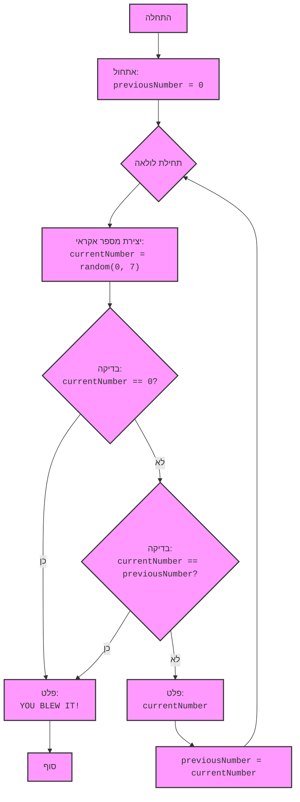

## ניתוח קוד המשחק "ZOOP"

### 1. <algorithm>

**תרשים זרימה של תהליך העבודה:**

1. **התחלה:** המשחק מתחיל עם אתחול של משתנה `previousNumber` ל-0.
   * _דוגמה:_ `previousNumber = 0`.

2. **לולאה ראשית:** מתחילה לולאה אינסופית `while True:`.

3. **יצירת מספר אקראי:** נוצר מספר אקראי שלם בין 0 ל-7 (כולל) ושומרים אותו במשתנה `currentNumber`.
   * _דוגמה:_ `currentNumber = 5`.

4. **בדיקת סיום:** נבדק אם `currentNumber` שווה ל-0. אם כן, המשחק מסתיים ומודפסת הודעה "YOU BLEW IT!".
   * _דוגמה:_ אם `currentNumber = 0` -> "YOU BLEW IT!".

5. **בדיקת כפילות:** אם `currentNumber` אינו 0, נבדק אם הוא שווה ל-`previousNumber`. אם כן, המשחק מסתיים ומודפסת הודעה "YOU BLEW IT!".
   * _דוגמה:_ אם `previousNumber = 5` וגם `currentNumber = 5` -> "YOU BLEW IT!".

6. **הדפסת המספר הנוכחי:** אם שתי הבדיקות לעיל נכשלו, `currentNumber` מודפס למסך.
   * _דוגמה:_ אם `currentNumber = 3` ו- `previousNumber` לא שווה ל- 3-> מודפס `3`.

7. **עדכון מספר קודם:** הערך של `currentNumber` נשמר בתוך `previousNumber` לקראת האיטרציה הבאה.
    * _דוגמה:_ `previousNumber` מקבל את הערך של `currentNumber` (לדוגמה, אם `currentNumber = 3` אז `previousNumber = 3`).

8. **חזרה ללולאה:** חוזרים לשלב 2, ממשיכים ליצור מספר אקראי ולבדוק את התנאים עד שאחד התנאים להפסקת המשחק מתקיים או שהמשתמש בוחר לסיים את המשחק.

**זרימת נתונים:**

-   הערך ההתחלתי של `previousNumber` הוא 0.
-   `random.randint()` יוצר מספר אקראי ומשייך אותו ל-`currentNumber`.
-   הערך של `currentNumber` משמש לבדיקות השוואה ולפלט.
-   הערך של `currentNumber` מושם לתוך `previousNumber` לקראת הסיבוב הבא.

### 2. <mermaid>

**ניתוח תלויות:**

-   הקוד משתמש במודול `random` של פייתון כדי ליצור מספרים אקראיים. לכן, הוא מיובא בתחילת הקוד: `import random`.
-   אין תלויות נוספות שדורשות ייבוא של מודולים אחרים.
-   התרשים מתאר באופן ישיר את זרימת הקוד ואת תהליך קבלת ההחלטות של המשחק, ללא תלויות חיצוניות.

### 3. <explanation>

**ייבוא (Imports):**

-   `import random`: מודול `random` משמש לייצור מספרים אקראיים, חיוני ליצירת המספרים האקראיים במשחק. אין לו קשר לחבילות אחרות בפרויקט `src.`.

**מחלקות (Classes):**
    - בקוד אין שימוש במחלקות, לכן אין ניתוח או הסבר למחלקות.

**פונקציות (Functions):**

-   `random.randint(a, b)`:
    -   **פרמטרים:** `a` ו-`b` הם מספרים שלמים שמגדירים את הטווח (כולל) של המספר האקראי שיכול להיות מיוצר.
    -   **ערך מוחזר:** מחזיר מספר שלם אקראי בטווח שצוין.
    -   **מטרה:** מייצר מספר שלם אקראי המשמש ליצירת המספרים במשחק.
    -   **דוגמה:** `random.randint(0, 7)` יחזיר מספר שלם אקראי בין 0 ל-7.

**משתנים (Variables):**

-   `previousNumber`:
    -   **סוג:** מספר שלם (integer).
    -   **שימוש:** מאחסן את המספר האקראי שנוצר באיטרציה הקודמת. משמש כדי לבדוק אם המספר הנוכחי זהה לקודם.

-   `currentNumber`:
    -   **סוג:** מספר שלם (integer).
    -   **שימוש:** מאחסן את המספר האקראי שנוצר באיטרציה הנוכחית. משמש לבדיקות השוואה ולהדפסה.

**בעיות אפשריות או תחומים לשיפור:**

-   **חוויית משתמש:** המשחק פשוט מאוד ואינו מספק אינטראקציה משמעותית מעבר לייצור מספרים. ניתן לשפר את חוויית המשתמש על ידי הוספת ממשק משתמש ידידותי יותר.
-   **הודעת סיום:** ההודעה "YOU BLEW IT!" אינה מאוד ידידותית. ניתן להציג הודעה יותר נעימה או להוסיף אפשרות להתחיל את המשחק מחדש.
-   **אימות קלט:** הקוד לא בודק קלט משתמש, כך שהתוכנית תפסיק לפעול רק כאשר המספר האקראי שנוצר יהיה 0.
-  **שמות משתנים:** שמות המשתנים יכולים להיות יותר ברורים, כמו `randomNumber` במקום `currentNumber`.

**שרשרת קשרים:**

-   הקוד הנוכחי הוא עצמאי ואינו תלוי בחלקים אחרים של הפרויקט. הוא משתמש רק במודול `random` סטנדרטי של פייתון.

**לסיכום:**

הקוד מממש משחק פשוט בו המטרה היא ליצור רצף של מספרים אקראיים ללא חזרות, עד שהמשתמש יקבל 0 או שיווצרו שני מספרים זהים ברצף. הקוד פשוט להבנה, אך הוא מוגבל בפונקציונליות ובחוויית משתמש.