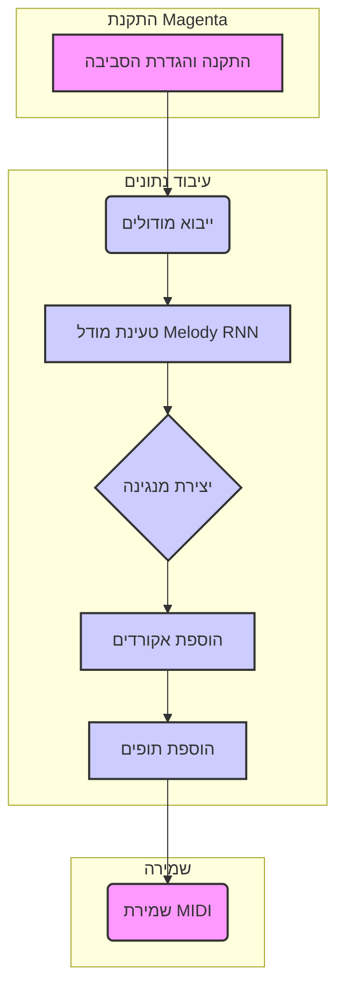

## <algorithm>
הקוד מדגים כיצד להשתמש במודל Melody RNN של Magenta כדי ליצור מנגינות, לשלב אותן עם אקורדים ותיפוף, ולשמור את התוצאה בקובץ MIDI.

1. **התקנה והגדרת הסביבה:**
   - **יצירת סביבה וירטואלית:** `python -m venv venv` ו-`source venv/bin/activate` (או `venv\Scripts\activate` ב-Windows).
      - *דוגמה:* פעולה זו יוצרת סביבה מבודדת שבה התקנת הספריות לא תשפיע על ספריות במערכת ההפעלה.
   - **התקנת Magenta:** `pip install magenta`
      - *דוגמה:* התקנה זו מושכת את כל התלויות הדרושות, כולל TensorFlow.

2. **ייבוא מודולים:**
   - ייבא את המודולים הדרושים מ-Magenta ומ-OS:
     ```python
     import os
     import magenta.music as mm
     from magenta.models.melody_rnn import melody_rnn_sequence_generator
     from magenta.common import sequence_example_lib
     ```
     - *דוגמה:* ייבוא זה מאפשר גישה לפונקציות ליצירת מנגינות, טיפול בקבצי MIDI וניהול סדרות של הערות.

3. **טעינת מודל Melody RNN:**
   - בחר את המודל הרצוי והגדר את ה-`MelodyRnnSequenceGenerator`:
     ```python
     model_name = 'attention_rnn' # או 'basic_rnn'
     melody_rnn = melody_rnn_sequence_generator.MelodyRnnSequenceGenerator(model_name=model_name)
     ```
      - *דוגמה:* טעינת המודל `attention_rnn` שמאומן מראש. מודל זה ישמש ליצירת המנגינה.

4. **יצירת מנגינה:**
   - השתמש בפונקציה `generate` כדי ליצור את המנגינה:
     ```python
     temperature = 1.0 # מידת האקראיות של המנגינה
     num_steps = 128   # אורך המנגינה
     primer_sequence = None # מנגינת התחלה (אפשר להתחיל מהתחלה)
     melody_sequence = melody_rnn.generate(temperature=temperature, steps=num_steps, primer_sequence=primer_sequence)
     ```
      - *דוגמה:* הפונקציה `generate` תיצור מנגינה באורך 128 צעדים עם טמפרטורה של 1.0, ללא מנגינת התחלה.

5. **הוספת אקורדים:**
   - צור רצף אקורדים והוסף אותו למנגינה:
      ```python
      chords = ["C", "G", "Am", "F"] * (num_steps // 4)
      chord_sequence = mm.ChordSequence(chords)
      melody_with_chords_sequence = mm.sequences_lib.concatenate_sequences(melody_sequence, chord_sequence)
      ```
     - *דוגמה:* יצירת רצף אקורדים בן 32 תיבות (128 // 4 = 32) והוספתו למנגינה.

6. **הוספת תופים:**
   - צור רצף תופים והוסף אותו למנגינה:
     ```python
     drum_pattern = mm.DrumTrack([36, 0, 42, 0, 36, 0, 42, 0], start_step=0, steps_per_bar=num_steps//4, steps_per_quarter=4)
     music_sequence = mm.sequences_lib.concatenate_sequences(melody_with_chords_sequence, drum_pattern)
     music_sequence.tempos[0].qpm = 120 # קצב
     ```
     - *דוגמה:* יצירת דפוס תופים עם קצב קבוע (120 BPM) והוספתו למנגינה והאקורדים.

7. **שמירת המנגינה כקובץ MIDI:**
   - שמור את המנגינה כקובץ MIDI:
    ```python
    output_dir = 'generated_music'
    os.makedirs(output_dir, exist_ok=True)
    midi_file_with_chords_and_drums = os.path.join(output_dir, 'full_music.mid')
    mm.sequence_proto_to_midi_file(music_sequence, midi_file_with_chords_and_drums)
    ```
      - *דוגמה:* שמירת המנגינה הסופית עם אקורדים ותופים בקובץ בשם `full_music.mid`.

## <mermaid>

### הסבר על התלויות המיובאות ב-mermaid:
*   **os**: מודול זה משמש לביצוע פעולות הקשורות למערכת ההפעלה, כמו יצירת תיקיות וטיפול בנתיבי קבצים.
*   **magenta.music as mm**: מודול זה מספק כלים לטיפול בנתונים מוזיקליים, כמו יצירת רצפי תווים, אקורדים ותיפוף, וכן שמירתם כקבצי MIDI.
*   **magenta.models.melody_rnn.melody_rnn_sequence_generator**: מודול זה מכיל את המחלקה `MelodyRnnSequenceGenerator`, המשמשת ליצירת מנגינות באמצעות מודל Melody RNN.
*   **magenta.common.sequence_example_lib**: מודול זה מספק כלים לטיפול ברצפים של דוגמאות (Sequence Examples), המשמשים באימון מודלים של Magenta.

## <explanation>
### ייבואים (Imports):
-   `os`: משמש לפעולות מערכת ההפעלה, כמו יצירת תיקיות ושילוב נתיבים.
-   `magenta.music as mm`: מודול ליצירה ועבודה עם נתונים מוזיקליים, כמו רצפי תווים, אקורדים ותופים.
-   `magenta.models.melody_rnn.melody_rnn_sequence_generator`: מחלקה ליצירת מנגינות באמצעות מודל Melody RNN.
-   `magenta.common.sequence_example_lib`: ספריה לטיפול בנתוני רצפים, המשמשת באימון מודלים.

### מחלקות (Classes):
-   `melody_rnn_sequence_generator.MelodyRnnSequenceGenerator`: מחלקה זו אחראית ליצירת מנגינות באמצעות מודל Melody RNN. היא מקבלת את שם המודל כארגומנט בעת יצירת האובייקט.
- `mm.ChordSequence`: מחלקה המאפשרת לייצג רצף של אקורדים.
- `mm.DrumTrack`: מחלקה המאפשרת לייצג רצף של תופים.

### פונקציות (Functions):
-  `melody_rnn.generate(temperature, steps, primer_sequence)`: פונקציה המייצרת מנגינה באמצעות המודל.
    -   `temperature`: שולט על מידת האקראיות של המנגינה (1.0 = ברירת מחדל).
    -   `steps`: אורך המנגינה בצעדים.
    -   `primer_sequence`: מנגינת התחלה (יכול להיות `None`).
- `mm.sequence_proto_to_midi_file(sequence, midi_file)`: פונקציה השומרת רצף מוזיקלי לקובץ MIDI.
    - `sequence`: רצף מוזיקלי (מנגינה, אקורדים, תופים).
    - `midi_file`: הנתיב לקובץ ה-MIDI שייווצר.
- `os.makedirs(output_dir, exist_ok=True)`: יוצר תיקיה אם היא לא קיימת.
-  `os.path.join(output_dir, 'full_music.mid')`: יוצר נתיב לקובץ ה-midi.
- `mm.sequences_lib.concatenate_sequences(seq1, seq2)`: מחברת שני רצפים יחד.

### משתנים (Variables):
-   `model_name`: שם המודל של Melody RNN שבו משתמשים (`'attention_rnn'` או `'basic_rnn'`).
-   `melody_rnn`: אובייקט של המחלקה `MelodyRnnSequenceGenerator`.
-   `temperature`: מידת האקראיות ביצירת המנגינה.
-   `num_steps`: מספר הצעדים במנגינה (אורך המנגינה).
-   `primer_sequence`: מנגינת התחלה (יכול להיות `None`).
-   `melody_sequence`: רצף תווים המייצג את המנגינה שנוצרה.
-   `chords`: רשימה של אקורדים.
-   `chord_sequence`: רצף אקורדים.
- `melody_with_chords_sequence`: רצף תווים עם מנגינה ואקורדים.
-  `drum_pattern`:  רצף תופים.
-  `music_sequence`: רצף תווים עם מנגינה, אקורדים ותופים.
-   `output_dir`: שם תיקיית הפלט.
-   `midi_file_with_chords_and_drums`: נתיב לקובץ ה-MIDI.

### בעיות אפשריות ושיפורים:
-   **התקנה מסובכת:** התקנת Magenta יכולה להיות מסובכת, במיוחד בהגדרת סביבה עם CUDA ל-GPU.
-   **התאמה אישית:** כרגע נעשה שימוש באקורדים קבועים ובדפוס תופים קבוע. יש אפשרות להתאים את הערכים האלו לכל מנגינה שנוצרת.
-   **שגיאות:** הקוד לא מטפל במקרים בהם לא ניתן לטעון את המודל או לשמור את הקובץ.

### שרשרת קשרים עם חלקים אחרים בפרויקט:
-   הקוד משתמש במודל Melody RNN שמאומן מראש של Magenta. הוא לא קשור ישירות לחלקים אחרים בפרויקט הנוכחי.
-  הקוד יכול להשתלב עם קוד אחר ליצירת מוזיקה, אוטומציה או שימוש ביכולות AI שונות.

**סיכום:**
הקוד מציג בצורה ברורה כיצד ליצור מנגינות באמצעות מודל Melody RNN של Magenta, לשלב אותן עם אקורדים ותיפוף ולשמור אותן כקבצי MIDI. עם זאת, יש מקום לשיפור בנושא של התאמה אישית וטיפול בשגיאות.