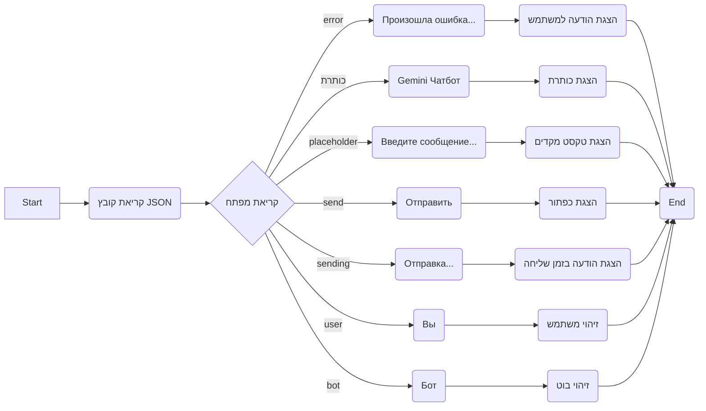

## ניתוח קוד JSON - `locales/ru.json`

### 1. <algorithm>

הקוד שסופק הוא קובץ JSON המכיל תרגומים עבור ממשק משתמש (UI) של צ'אטבוט. אין כאן זרימת נתונים או אלגוריתם מורכב. זהו פשוט מבנה נתונים שמגדיר מחרוזות טקסט המשמשות בתור תוויות, הודעות וכו'.

**דוגמאות:**

- `"title": "Gemini Чатбот"`: הטקסט "Gemini Чатбот" ישמש ככותרת של הצ'אטבוט.
- `"placeholder": "Введите сообщение..."`: הטקסט "Введите сообщение..." יוצג כטקסט מקדים בתיבת הטקסט של הצ'אט.
- `"send": "Отправить"`: הכפתור "Отправить" יוצג לשליחת הודעה.
- `"sending": "Отправка..."`: הודעת "Отправка..." תוצג בזמן שההודעה נשלחת.
- `"user": "Вы"`: הטקסט "Вы" ישמש לזיהוי הודעות של המשתמש.
- `"bot": "Бот"`: הטקסט "Бот" ישמש לזיהוי הודעות של הבוט.
- `"error": "Произошла ошибка при отправке сообщения. Пожалуйста, попробуйте еще раз."`: הודעה זו תוצג אם תהיה שגיאה בעת שליחת הודעה.

אין זרימת נתונים משמעותית כאן; הנתונים מאוחסנים ומוחזרים לפי דרישה על ידי המערכת שמשתמשת בהם.

### 2. <mermaid>

**הסבר:**

- אין תלויות מיובאות בקובץ JSON.
- התרשים ממחיש את התהליך הפשוט של קריאת קובץ JSON והגישה למחרוזות תרגום.
- כל צומת מייצג שלב בתהליך (קריאה, גישה) או את הערך שנקרא.
- השמות בתוך התרשים הם בעלי משמעות ומתארים את הערכים.

### 3. <explanation>

**ייבואים (Imports)**:

אין ייבוא בקובץ JSON זה. זהו קובץ נתונים בלבד.

**מחלקות (Classes)**:

אין מחלקות בקובץ JSON זה.

**פונקציות (Functions)**:

אין פונקציות בקובץ JSON זה.

**משתנים (Variables)**:

- ה"משתנים" כאן הם בעצם מפתחות בתוך אובייקט ה-JSON. כל מפתח (למשל `"title"`, `"placeholder"`) משויך לערך מחרוזתי (למשל `"Gemini Чатбот"`, `"Введите сообщение..."`).
- מפתחות אלה משמשים כשמות לטקסטים שיוצגו בממשק המשתמש של הצ'אטבוט.

**הסברים מפורטים:**

- קובץ JSON זה מכיל טקסטים ברוסית שישמשו את הצ'אטבוט.
- הנתונים מאורגנים במבנה של זוגות מפתח-ערך, שבו המפתח הוא מזהה ייחודי לטקסט, והערך הוא הטקסט עצמו.
- הקובץ נועד לשמש כמקור לתרגומים, כך שהאפליקציה תוכל להציג טקסטים בשפה הרוסית.
- ניתן לשנות את הערכים כאן כדי לעדכן את הטקסטים המוצגים בצ'אטבוט מבלי לשנות את הקוד.

**בעיות אפשריות או תחומים לשיפור:**

- ניתן להוסיף עוד שפות בהמשך, כך שהמערכת תומכת במשתמשים רבים יותר.
- ניתן להוסיף תמיכה בפורמט מסוגים אחרים כמו תגיות HTML (למשל, עיצוב טקסט מודגש).

**שרשרת קשרים עם חלקים אחרים בפרויקט:**

- קובץ זה קשור לכל קוד שצריך להציג טקסט בשפה הרוסית בצ'אטבוט, למשל, רכיבי UI, לוגיקת עיבוד הודעות, וכדומה. הוא יהיה מחובר למנגנון טעינת התרגומים של האפליקציה.