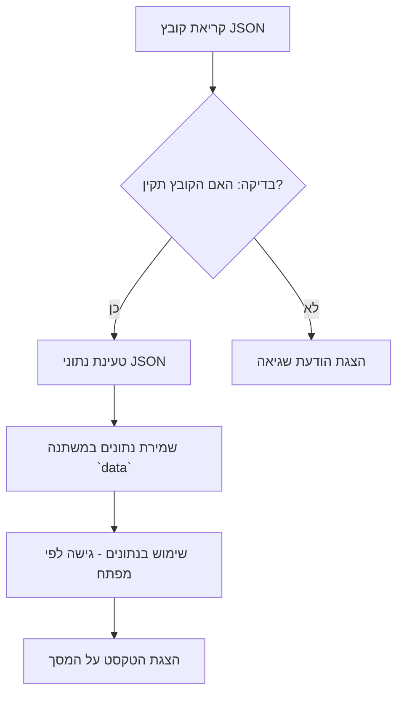

## ניתוח קוד: `ua.json`

### <algorithm>
1. **קריאת קובץ JSON:** הקוד קורא קובץ JSON המכיל מחרוזות טקסט.
2. **מבנה JSON:** הקובץ מוגדר כאובייקט JSON, כאשר כל מפתח מייצג מחרוזת מזהה (title, placeholder, send, sending, user, bot, error), וכל ערך הוא מחרוזת טקסט באוקראינית.
3. **טעינת המידע:** לאחר קריאת הקובץ, המידע (אובייקט JSON) נטען למשתנה מתאים.
4. **שימוש במידע:** המידע הזה נועד לשמש לייצוג מחרוזות טקסט בצ'אטבוט. המפתחות ישמשו כאינדקס לגישה לערכים המתאימים. לדוגמה: אם התוכנה צריכה להציג את הכותרת, היא תפנה אל המפתח "title", ואם היא צריכה להציג כפתור שליחה, היא תפנה למפתח "send".
   - **דוגמאות:**
      - `data["title"]` יחזיר את המחרוזת "Gemini Чатбот".
      - `data["placeholder"]` יחזיר את המחרוזת "Введіть повідомлення...".
      - `data["send"]` יחזיר את המחרוזת "Надіслати".
      - `data["error"]` יחזיר את המחרוזת "Виникла помилка під час надсилання повідомлення. Спробуйте ще раз."

### <mermaid>

### <explanation>
1. **ייבואים (Imports):**
   - אין ייבוא בקוד זה, מאחר ומדובר בקובץ JSON ולא בקוד פייתון.

2. **מחלקות (Classes):**
   - אין הגדרות מחלקות בקוד זה.

3. **פונקציות (Functions):**
   - אין פונקציות בקוד זה, מאחר ומדובר בקובץ JSON.

4. **משתנים (Variables):**
   -  `title`: מחרוזת המייצגת את כותרת הצ'אטבוט (Gemini Чатбот).
   -  `placeholder`: מחרוזת המייצגת את טקסט ברירת המחדל בתיבת הטקסט (Введіть повідомлення...).
   - `send`: מחרוזת המייצגת את טקסט כפתור השליחה (Надіслати).
   - `sending`: מחרוזת המייצגת הודעה על פעולת שליחה (Надсилання...).
   - `user`: מחרוזת המייצגת את כינוי המשתמש (Ви).
   - `bot`: מחרוזת המייצגת את כינוי הבוט (Бот).
   - `error`: מחרוזת המייצגת הודעת שגיאה (Виникла помилка під час надсилання повідомлення. Спробуйте ще раз.).

**בעיות אפשריות או תחומים לשיפור:**
- **תחזוקה:** אם יש צורך בתמיכה במספר שפות, צריך לנהל ולעדכן את קבצי ה-JSON של כל שפה.
- **בדיקות:** יש לוודא שהטקסט תואם את ההקשר שלו, במיוחד אם מתבצע תרגום.
- **שינויים:** כל שינוי בטקסט צריך להתבצע ישירות בקובץ ה-JSON.

**שרשרת קשרים עם חלקים אחרים בפרויקט:**
- קובץ זה משמש כקובץ לוקאליזציה (l10n), וסביר להניח שהוא יהיה בשימוש על ידי רכיבים גרפיים בצד הלקוח (frontend), כמו צ'אטבוט או ממשק משתמש המשתמש במחרוזות הטקסט האלו.
- הקובץ יהיה חלק ממערך של קבצים דומים עבור שפות נוספות.
- ניתן להשתמש בקובץ זה בשילוב עם ספריית i18n או כלי לוקאליזציה אחר.