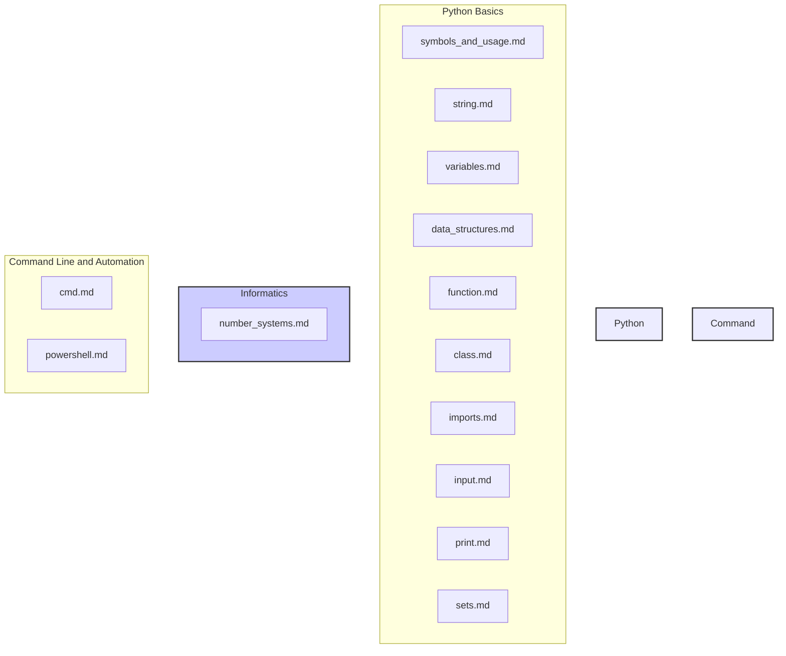

## ניתוח קוד:

קובץ ה-README.md מכיל אוסף של קישורים למסמכים (cheat sheets) בנושאים שונים הקשורים לשפת התכנות פייתון, מדעי המחשב, שורת הפקודה ואוטומציה. הקישורים הם לקבצי markdown הנמצאים ב-GitHub.

### <algorithm>

1.  **התחלה:** הקובץ מתחיל בכותרת "### Основы Python" שמסמנת את תחילת הנושאים הקשורים ליסודות פייתון.

2.  **קישורים ליסודות פייתון:**
    *   מוצגים קישורים למסמכים שונים הקשורים ליסודות פייתון כמו:
        *   `symbols_and_usage.md`: מסביר על הסימנים והשימוש שלהם בפייתון.
            *   **דוגמה:** שימוש בסימן ה-`+` לחיבור מספרים או שרשור מחרוזות.
        *   `string.md`: מסביר על טיפול במחרוזות.
            *   **דוגמה:** שימוש בשיטות כמו `.upper()`, `.lower()`, `.split()` על מחרוזות.
        *   `variables.md`: מסביר על משתנים.
            *   **דוגמה:** יצירת משתנה `x = 10`, או `name = "Alice"`.
        *   `data_structures.md`: מסביר על מבני נתונים כמו רשימות, טפילים ומילונים.
            *   **דוגמה:** יצירת רשימה `my_list = [1, 2, 3]`, או מילון `my_dict = {"name": "Bob", "age": 30}`.
        *   `function.md`: מסביר על פונקציות.
            *   **דוגמה:** הגדרת פונקציה `def add(x, y): return x + y`.
        *   `class.md`: מסביר על מחלקות.
            *   **דוגמה:** הגדרת מחלקה `class Dog: ...`.
        *   `imports.md`: מסביר על ייבוא ספריות ומודולים.
            *   **דוגמה:** ייבוא ספרייה `import math` או מודול `from my_module import my_function`.
        *   `input.md`: מסביר על קבלת קלט מהמשתמש.
            *   **דוגמה:** שימוש בפונקציה `input()` לקבלת קלט.
        *   `print.md`: מסביר על פלט באמצעות הפונקציה `print()`.
            *   **דוגמה:** שימוש ב-`print("Hello, world!")` להדפסת טקסט.
        *   `sets.md`: מסביר על מבנה נתונים מסוג קבוצה.
            *   **דוגמה:** יצירת קבוצה `my_set = {1, 2, 3}`.

3.  **קישורים לאינפורמטיקה:**
    *   מתחיל בכותרת "### Информатика" שמסמנת את הנושאים הקשורים לאינפורמטיקה.
    *   `number_systems.md`: מסביר על מערכות ספירה.
        *   **דוגמה:** המרה בין בסיסים כמו עשרוני, בינארי, הקסדצימלי.

4.  **קישורים לשורת הפקודה ואוטומציה:**
    *   מתחיל בכותרת "### Командная строка и автоматизация" שמסמנת את הנושאים הקשורים לשורת הפקודה ואוטומציה.
    *   `cmd.md`: מסביר על פקודות שורת הפקודה (CMD).
        *   **דוגמה:** פקודות כמו `dir`, `cd`, `mkdir` ב-Windows.
    *   `powershell.md`: מסביר על פקודות PowerShell.
        *   **דוגמה:** פקודות כמו `Get-ChildItem`, `Set-Location` ב-PowerShell.

5.  **סיום:** הקובץ מסתיים לאחר הצגת כל הקישורים.

### <mermaid>

### <explanation>

*   **ייבואים (Imports):**
    *   הקוד עצמו אינו מבצע ייבוא של ספריות. הוא קובץ markdown המכיל קישורים לקבצים אחרים.
    *   הקישורים `imports.md` בתוך קובץ זה מסביר על ייבוא מודולים וספריות בפייתון.

*   **מחלקות (Classes):**
    *   אין מחלקות מוגדרות בקובץ הזה.
    *   הקישור `class.md` בתוך קובץ זה מסביר על מושג המחלקה בפייתון.

*   **פונקציות (Functions):**
    *   אין פונקציות מוגדרות בקובץ הזה.
    *   הקישור `function.md` בתוך קובץ זה מסביר על מושג הפונקציה בפייתון.

*   **משתנים (Variables):**
    *   אין משתנים מוגדרים בקובץ הזה.
    *   הקישור `variables.md` בתוך קובץ זה מסביר על מושג המשתנה בפייתון.

*   **הסברים מפורטים:**
    *   הקובץ README.md הוא קובץ המספק מדריך למידה, הכולל אוסף של קישורים למסמכי עזר.
    *   הוא מאורגן תחת שלושה נושאים עיקריים: יסודות פייתון, אינפורמטיקה ושורת פקודה/אוטומציה.
    *   כל נושא מכיל קישורים למסמכים ספציפיים המכסים את היבטים שונים באותו נושא.
    *   הקישורים מאפשרים ללומד לצלול לעומק הנושאים השונים לפי הצורך, ולספק מידע מפורט וממוקד.
    *   אין כאן שום קוד פייתון לניתוח, אלא מבנה של קובץ readme המפנה למשאבים נוספים.

*   **בעיות אפשריות או תחומים לשיפור:**
    *   קובץ זה אינו קוד לביצוע, לכן אין בעיות לוגיות.
    *   אולי ניתן לשפר את הקובץ על ידי הוספת תיאור קצר של כל נושא לפני הקישור הרלוונטי.
    *   ייתכן ויהיה נוח יותר ליצור אינדקס מקדים לכל הקישורים, במקום רק לחלק אותם לפי נושאים כלליים.

*   **שרשרת קשרים עם חלקים אחרים בפרויקט:**
    *   הקובץ הזה קשור לכל המסמכים שאליהם הוא מפנה. כלומר, זהו דף אינדקס לסדרת מדריכים.
    *   ניתן לראות זאת כקובץ הנמצא בשכבה גבוהה יותר, שמטרתו להפנות את המשתמש למשאבים הרלוונטיים.