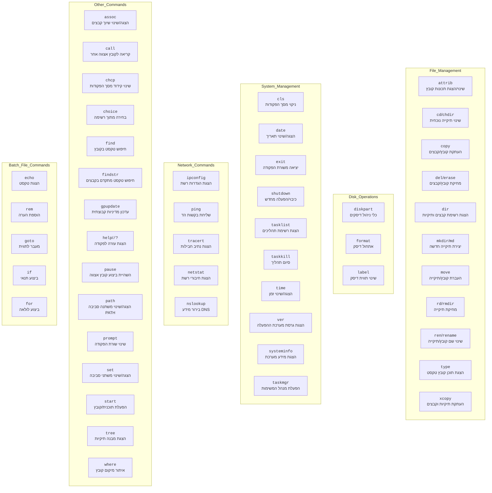

## ניתוח קוד: פקודות שורת הפקודה של Windows

### 1. <algorithm>

הקוד שסופק מתאר אוסף של פקודות שורת הפקודה (cmd) של Windows, המחולקות לפי קטגוריות שונות: ניהול קבצים ותיקיות, עבודה עם דיסקים, ניהול מערכת, רשת ופקודות אחרות. כל פקודה מתוארת באמצעות תחביר, אפשרויות ודוגמאות שימוש. להלן פירוט תהליך העבודה:

1.  **ניתוח הפקודות**: הקוד מתחיל בניתוח מפורט של כל פקודה, כולל השם, התחביר והאפשרויות שלה. לדוגמה, עבור הפקודה `attrib`:
    *   **שם**: `attrib`
    *   **תחביר**: `attrib [+r|-r] [+a|-a] [+s|-s] [+h|-h] [диск:][путь]имя_файла`
    *   **אפשרויות**: `+r`, `-r`, `+a`, `-a`, `+s`, `-s`, `+h`, `-h`
    *   **דוגמאות**: `attrib +h myfile.txt`, `attrib -r myfile.txt`
2.  **חלוקה לקטגוריות**: הפקודות מקובצות לקטגוריות שונות לשיפור הבהירות:
    *   **ניהול קבצים ותיקיות**: כולל פקודות כמו `attrib`, `cd`, `copy`, `del`, `dir`, `mkdir`, `move`, `rd`, `ren`, `type`, `xcopy`. לדוגמה, `copy` מעתיקה קבצים, ו `dir` מציגה את רשימת הקבצים והתיקיות.
    *   **עבודה עם דיסקים**: כולל פקודות כמו `diskpart`, `format`, `label`. לדוגמה, `format` מאתחלת דיסק, ו `diskpart` מנהלת מחיצות.
    *   **ניהול מערכת**: כולל פקודות כמו `cls`, `date`, `exit`, `shutdown`, `tasklist`, `taskkill`, `time`, `ver`, `systeminfo`, `taskmgr`. לדוגמה, `shutdown` מכבה את המחשב, ו `tasklist` מציגה את רשימת התהליכים.
    *   **רשת**: כולל פקודות כמו `ipconfig`, `ping`, `tracert`, `netstat`, `nslookup`. לדוגמה, `ping` שולחת בקשות הד לשרת, ו `ipconfig` מציגה את הגדרות הרשת.
    *   **פקודות אחרות**: כולל פקודות כמו `assoc`, `call`, `chcp`, `choice`, `find`, `findstr`, `gpupdate`, `help`, `pause`, `path`, `prompt`, `set`, `start`, `tree`, `where`. לדוגמה, `find` מחפשת מחרוזת בתוך קובץ, ו `set` מנהלת משתני סביבה.
3.  **פירוט אפשרויות**: לכל פקודה, האפשרויות השונות מוסברות. לדוגמה, הפקודה `dir` כוללת אפשרויות כמו `/a` (הצגת כל הקבצים), `/w` (תצוגה רחבה), `/p` (הצגה לפי דף), `/s` (הצגת קבצים מתיקיות משנה) ו `/b` (הצגת רק שמות הקבצים).
4.  **דוגמאות שימוש**: לכל פקודה מוצגות דוגמאות שימוש מפורטות, המדגימות כיצד להשתמש בהן בתרחישים שונים. לדוגמה, הפקודה `copy` מדגימה העתקה של קובץ בודד, והעתקה של כל קבצי ה- txt לתיקייה אחרת.
5.  **אזהרות**: הקוד כולל אזהרות חשובות לגבי שימוש בפקודות מסוימות, כגון הפקודה `format`, אשר מוחקת את כל הנתונים בדיסק.

**זרימת נתונים:**
אין זרימה מורכבת של נתונים בין פונקציות, מכיוון שהקוד בעיקרו רשימה של פקודות ותיאורים שלהן. עם זאת, ניתן לראות את הזרימה הבאה:
* משתמש מזין פקודה בשורת הפקודה.
* המערכת מנתחת את הפקודה, את האופציות והפרמטרים.
* המערכת מבצעת את הפעולה הרלוונטית.
* המערכת מציגה את התוצאה למשתמש.

### 2. <mermaid>

**הסבר על התלויות והיבוא:**
אין תלויות יבוא בקוד הזה, מכיוון שמדובר בתיאור של פקודות שורת הפקודה של Windows ולא בקוד Python. התרשים מציג את הקבוצות הלוגיות של הפקודות.

### 3. <explanation>

**ייבואים (Imports):**
אין ייבוא קוד במקרה הזה. הקוד מתאר את הפקודות של שורת הפקודה בWindows, אשר מובנות בתוך המערכת ההפעלה ולא דורשות ייבוא של מודולים חיצוניים.

**מחלקות (Classes):**
אין מחלקות (Classes) בקוד זה, מכיוון שהוא מתאר פקודות שורת פקודה ולא קוד מונחה עצמים.

**פונקציות (Functions):**
אין פונקציות בקוד הזה במובן של פונקציות בתכנות, אך כל פקודת cmd מתפקדת כמו פונקציה בפני עצמה.

*   **דוגמאות**:
    *   `attrib`: משנה את התכונות של קבצים או תיקיות, לדוגמא: `attrib +h myfile.txt` תגרום לקובץ `myfile.txt` להיות מוסתר.
    *   `cd`: משנה את התיקייה הנוכחית, לדוגמא: `cd Documents` תעביר לתיקייה Documents הנמצאת בתיקייה הנוכחית.
    *   `copy`: מעתיקה קבצים, לדוגמא: `copy myfile.txt mycopy.txt` תעתיק את הקובץ `myfile.txt` לשם `mycopy.txt`.
    *   `del`: מוחקת קבצים, לדוגמא: `del myfile.txt` תמחק את הקובץ `myfile.txt`.
    *   `dir`: מציגה רשימת קבצים ותיקיות, לדוגמא: `dir` תציג את התוכן של התיקייה הנוכחית.
    *   `mkdir`: יוצרת תיקייה חדשה, לדוגמא: `mkdir NewFolder` תיצור תיקייה חדשה בשם `NewFolder`.
    *   `move`: מעבירה קבצים או תיקיות, לדוגמא: `move myfile.txt C:\Documents` תעביר את הקובץ `myfile.txt` לתיקייה `C:\Documents`.
    *   `rd`: מוחקת תיקייה, לדוגמא: `rd myfolder` תמחק את התיקייה `myfolder`.
    *   `ren`: משנה שם של קובץ או תיקייה, לדוגמא: `ren myfile.txt newfile.txt` תשנה את שם הקובץ `myfile.txt` ל `newfile.txt`.
    *   `type`: מציגה את התוכן של קובץ טקסט, לדוגמא: `type myfile.txt` תציג את התוכן של הקובץ `myfile.txt`.
    *   `xcopy`: מעתיקה תיקיות וקבצים, כולל תיקיות משנה. לדוגמא: `xcopy C:\Source D:\Destination /s` תעתיק את התיקייה `C:\Source` כולל כל תתי התיקיות ל `D:\Destination`.
    *   `diskpart`: מפעילה את כלי ניהול הדיסקים.
    *   `format`: מבצעת אתחול לדיסק, לדוגמא: `format D: /q` תבצע אתחול מהיר לדיסק D.
    *   `label`: מאפשרת שינוי שם לדיסק, לדוגמא: `label D: NewLabel` תקבע את התווית של דיסק D ל `NewLabel`.
    *   `cls`: מנקה את המסך של שורת הפקודה.
    *   `date`: מציגה או משנה את התאריך של המערכת.
    *   `exit`: סוגרת את שורת הפקודה.
    *   `shutdown`: מכבה או מפעילה מחדש את המחשב.
    *   `tasklist`: מציגה רשימה של כל התהליכים שרצים במערכת.
    *   `taskkill`: מאפשרת לסגור תהליך מסוים. לדוגמא: `taskkill /im notepad.exe` תסגור את כל התהליכים שקשורים לאפליקציה notepad.exe
    *   `time`: מציגה או משנה את השעה של המערכת.
    *   `ver`: מציגה את גרסת מערכת ההפעלה.
    *   `systeminfo`: מציגה מידע מפורט על המערכת.
    *   `taskmgr`: פותחת את מנהל המשימות.
    *   `ipconfig`: מציגה את הגדרות הרשת של המחשב.
    *   `ping`: שולחת בקשות ping לכתובת רשת.
    *   `tracert`: מציגה את הנתיב שחבילה עוברת כדי להגיע ליעד.
    *   `netstat`: מציגה רשימה של חיבורי רשת פעילים.
    *   `nslookup`: מאפשרת לבצע שאילתות DNS.
    *   `assoc`: מציגה או משנה את השיוך של סוגי קבצים.
    *   `call`: מאפשרת לקרוא לקובץ batch אחר מתוך קובץ batch.
    *   `chcp`: משנה את הקידוד של שורת הפקודה.
    *   `choice`: מאפשרת להציג רשימת אפשרויות למשתמש.
    *   `find`: מחפשת מחרוזת טקסט בתוך קובץ.
    *   `findstr`: כלי חיפוש מתקדם יותר ממציאה, ומאפשר לחפש מחרוזות טקסט בתוך קבצים.
    *   `gpupdate`: מעדכנת את הגדרות המדיניות הקבוצתית.
    *   `help` / `/?`: מציגה עזרה לשימוש בפקודה מסוימת.
    *   `pause`: עוצרת את הביצוע של קובץ batch ומחכה ללחיצה על מקש.
    *   `path`: מציגה או משנה את משתנה הסביבה PATH.
    *   `prompt`: משנה את עיצוב שורת הפקודה.
    *   `set`: מציגה או משנה משתני סביבה.
    *   `start`: מפעילה תוכנית או פותחת קובץ.
    *   `tree`: מציגה את מבנה התיקיות של מערכת הקבצים בצורה גרפית.
    *   `where`: מציגה את המיקום של קובץ.
    *   `echo`: מציגה טקסט על המסך.
    *   `rem`: מוסיפה הערות לקובץ batch.
    *   `goto`: קופצת לתווית מסוימת בקובץ batch.
    *   `if`: מבצעת פעולה בתנאי מסוים.
    *   `for`: מבצעת לולאה, לדוגמא: `for %%a in (*.txt) do (type %%a)` תציג את התוכן של כל הקבצים מסוג txt.

**משתנים (Variables):**
אין משתנים גלובליים בקוד הזה. משתנים קיימים רק בהקשר של ביצוע הפקודות, לדוגמא:
*   בפקודה `set myvar=myvalue` המשתנה `myvar` מקבל את הערך `myvalue`.
*   בפקודה `for` משתמשים ב `%%a` כדי לאחסן את השם של כל קובץ שמעבדים בלולאה.

**בעיות אפשריות ותחומים לשיפור:**
*   הקוד מספק רק תיאור של פקודות, אבל לא דוגמאות שימוש מעשיות ומורכבות. כדאי להוסיף דוגמאות לתרחישים אמיתיים.
*   חסרים הסברים על השימוש בפקודות במסגרת קבצי אצווה (batch files), דבר שחשוב למי שרוצה לאוטומט פעולות.
*   הקוד לא מציין אילו פקודות דורשות הרשאות מנהל, דבר שיכול להיות קריטי למשתמשים.
*   חסר תיאור על פקודות מתקדמות יותר כמו redirection ו- piping.

**שרשרת קשרים:**
הפקודות מתוארות כאן הן חלק אינטגרלי ממערכת ההפעלה של Windows. ניתן להשתמש בפקודות האלו בשילוב עם פקודות אחרות, וליצור קבצי batch מורכבים לביצוע אוטומציה של משימות שונות.

**לסיכום**: הקוד מספק סקירה מפורטת על פקודות cmd של Windows, תוך חלוקה לקטגוריות והסברים ברורים לכל פקודה. עם זאת, קיימים תחומים לשיפור שיכולים להפוך את המסמך הזה למועיל עוד יותר.