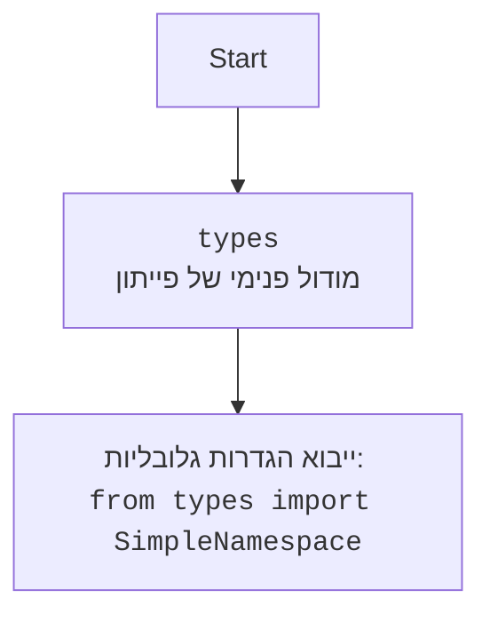

## <algorithm>

הקוד מדגים ארבעה מבני נתונים עיקריים בפייתון: רשימות, מילונים, טאפלים ו-SimpleNamespace. כל מבנה נתונים מוצג עם דוגמאות כיצד ליצור, לגשת, לשנות ולהסיר רכיבים.

**1. רשימות (Lists):**

   - **יצירה:** רשימה נוצרת באמצעות סוגריים מרובעים `[]` כאשר אלמנטים מופרדים באמצעות פסיקים. דוגמה: `boris_list = ["Boris", "Moscow", 30, "engineer"]`.
   - **גישה:** ניתן לגשת לאלמנטים באמצעות אינדקס. לדוגמה: `boris_list[0]` יחזיר "Boris".
   - **שינוי:** אלמנטים ניתנים לשינוי באמצעות האינדקס שלהם. לדוגמה: `boris_list[2] = 31` תשנה את הגיל מ-30 ל-31.
   - **הוספה:** אלמנטים נוספים לסוף הרשימה באמצעות `.append()`. דוגמה: `boris_list.append("married")`.
   - **הוספה באינדקס:** ניתן להוסיף אלמנט באינדקס מסוים באמצעות `.insert()`. לדוגמה: `boris_list.insert(1, "Russia")`.
   - **הסרה:** ניתן להסיר אלמנטים באמצעות `.remove()` לפי הערך או באמצעות `del` לפי אינדקס.
   - **הרחבה:** ניתן להרחיב רשימה באמצעות רשימה אחרת באמצעות `.extend()`.
   - **הסרה מהסוף:** ניתן להסיר אלמנט מסוף הרשימה באמצעות `.pop()`.

**2. מילונים (Dictionaries):**

   - **יצירה:** מילון נוצר באמצעות סוגריים מסולסלים `{}`, כאשר זוגות מפתח-ערך מופרדים באמצעות נקודתיים `:`. דוגמה: `alice_dict = {"name": "Alice", "age": 25, "city": "London", "occupation": "artist"}`.
   - **גישה:** ניתן לגשת לערכים באמצעות המפתח שלהם. לדוגמה: `alice_dict["name"]` יחזיר "Alice".
   - **שינוי:** ניתן לשנות ערכים באמצעות המפתח שלהם. לדוגמה: `alice_dict["age"] = 26` תשנה את הגיל מ-25 ל-26.
   - **הוספה:** ניתן להוסיף זוגות מפתח-ערך חדשים. לדוגמה: `alice_dict["hobby"] = "painting"`.
   - **הסרה:** ניתן להסיר זוגות מפתח-ערך באמצעות `del` לפי המפתח או באמצעות `pop()`, המחזיר את הערך שהוסר.
   - **בדיקת קיום מפתח:** ניתן לבדוק אם מפתח קיים במילון באמצעות `in`.

**3. טאפלים (Tuples):**

   - **יצירה:** טאפל נוצר באמצעות סוגריים עגולים `()` כאשר אלמנטים מופרדים באמצעות פסיקים. דוגמה: `boris_tuple = ("Boris", "Moscow", 30, "engineer")`.
   - **גישה:** ניתן לגשת לאלמנטים באמצעות אינדקס. לדוגמה: `boris_tuple[2]` יחזיר 30.
   - **אי-שינוי:** טאפלים אינם ניתנים לשינוי - לא ניתן לשנות, להוסיף או להסיר אלמנטים לאחר יצירתם.

**4. SimpleNamespace:**

    - **יצירה:**  SimpleNamespace נוצר ע"י ייבואו מהמודול `types` וניתן להעביר לו שמות משתנים וערכים. דוגמה: `alice_namespace = SimpleNamespace(name="Alice", age=25, city="London")`.
    - **גישה:** ניתן לגשת לתכונות באמצעות נקודה. לדוגמה: `alice_namespace.name` יחזיר "Alice".
    - **שינוי:** ניתן לשנות ערכים של תכונות. לדוגמה: `alice_namespace.age = 26` תשנה את הגיל מ-25 ל-26.
    - **הוספה:** לא ניתן להוסיף תכונות חדשות ישירות. אך ניתן להוסיף תכונה חדשה באמצעות `setattr(alice_namespace, "occupation", "artist")`.
    - **הסרה:** ניתן להסיר תכונה באמצעות `delattr(alice_namespace, "city")`.
    
**זרימת נתונים:**

1. רשימות, מילונים וטאפלים נוצרים עם נתונים ראשוניים.
2. הגישה לאלמנטים מתבצעת באמצעות אינדקס (ברשימות ובטאפלים) או מפתח (במילונים).
3. השינויים ברשימות ובמילונים משנים את הנתונים במקום. טאפלים אינם ניתנים לשינוי.
4. פעולות הוספה והסרה משנות את גודל הרשימות והמילונים.
5. SimpleNamespace נוצר עם נתונים, ניתן לגשת אליהם ולשנות אותם באמצעות נקודה.

## <mermaid>

```mermaid
flowchart TD
    Start --> ListCreation[<code>boris_list = ["Борис", "Москва", 30, "инженер"]</code><br> יצירת רשימה]
    ListCreation --> ListAccess[<code>print(boris_list[0])</code><br>גישה לאלמנט לפי אינדקס]
    ListAccess --> ListModification[<code>boris_list[2] = 31</code><br>שינוי אלמנט לפי אינדקס]
    ListModification --> ListAppend[<code>boris_list.append("женат")</code><br>הוספת אלמנט לסוף]
    ListAppend --> ListInsert[<code>boris_list.insert(1, "Россия")</code><br>הוספת אלמנט באינדקס]
    ListInsert --> ListRemoveValue[<code>boris_list.remove("инженер")</code><br>הסרת אלמנט לפי ערך]
     ListRemoveValue --> ListRemoveIndex[<code>del boris_list[2]</code><br>הסרת אלמנט לפי אינדקס]
     ListRemoveIndex --> ListExtend[<code>boris_list.extend(["хобби", "рыбалка"])</code><br>הרחבת רשימה עם רשימה אחרת]
     ListExtend --> ListPop[<code>boris_list.pop()</code><br>הסרת אלמנט מהסוף]
     ListPop --> DictCreation[<code>alice_dict = {"name": "Алиса", "age": 25, "city": "Лондон", "occupation": "художница"}</code><br>יצירת מילון]
    DictCreation --> DictAccess[<code>print(alice_dict["name"])</code><br>גישה לערך לפי מפתח]
    DictAccess --> DictModification[<code>alice_dict["age"] = 26</code><br>שינוי ערך לפי מפתח]
    DictModification --> DictAdd[<code>alice_dict["hobby"] = "рисование"</code><br>הוספת זוג מפתח-ערך]
    DictAdd --> DictDelete[<code>del alice_dict["city"]</code><br>הסרת זוג מפתח-ערך לפי מפתח]
    DictDelete --> DictPop[<code>hobby = alice_dict.pop("hobby")</code><br>הסרת זוג מפתח-ערך עם החזרת הערך]
    DictPop --> DictCheckKey[<code>print("name" in alice_dict)</code><br>בדיקת קיום מפתח]
   DictCheckKey --> TupleCreation[<code>boris_tuple = ("Борис", "Москва", 30, "инженер")</code><br>יצירת טאפל]
    TupleCreation --> TupleAccess[<code>print(boris_tuple[2])</code><br>גישה לאלמנט לפי אינדקס]
   TupleAccess --> SimpleNamespaceCreation[<code>alice_namespace = SimpleNamespace(name="Алиса", age=25, city="Лондон")</code><br>יצירת SimpleNamespace]
    SimpleNamespaceCreation --> SimpleNamespaceAccess[<code>print(alice_namespace.name)</code><br>גישה לתכונה לפי שם]
    SimpleNamespaceAccess --> SimpleNamespaceModification[<code>alice_namespace.age = 26</code><br>שינוי תכונה]
    SimpleNamespaceModification --> SimpleNamespaceSetAttr[<code>setattr(alice_namespace, "occupation", "художница")</code><br>הוספת תכונה חדשה]
     SimpleNamespaceSetAttr --> SimpleNamespaceDelAttr[<code>delattr(alice_namespace, "city")</code><br>הסרת תכונה]
    SimpleNamespaceDelAttr --> End[סוף]
```

**ניתוח תלויות מיובאות:**

- `from types import SimpleNamespace`: ייבוא זה מאפשר להשתמש במחלקה `SimpleNamespace` ליצירת אובייקטים פשוטים עם תכונות שניתן לגשת אליהן ולשנות אותן.



## <explanation>

**ייבואים (Imports):**

- `from types import SimpleNamespace`: ייבוא זה מאפשר להשתמש במחלקה `SimpleNamespace` ליצירת אובייקטים פשוטים עם תכונות שניתן לגשת אליהן ולשנות אותן. המחלקה נמצאת בתוך מודול `types`, שהוא מודול פנימי בפייתון. אין לו קשר ישיר למודולים אחרים בפרויקט `src`, מכיוון שהוא חלק מהספרייה הסטנדרטית של פייתון.

**מחלקות (Classes):**

- אין מחלקות מוגדרות בקוד זה. במקום זאת, הקוד משתמש במבני נתונים מובנים של פייתון (רשימות, מילונים, טאפלים) ובמחלקה `SimpleNamespace` מהספרייה הסטנדרטית.

**פונקציות (Functions):**

- אין פונקציות מוגדרות בקוד זה. הקוד משתמש בשיטות מובנות של מבני הנתונים, כמו:
    - `append()`: מוסיף אלמנט לסוף רשימה.
    - `insert()`: מוסיף אלמנט באינדקס מסוים ברשימה.
    - `remove()`: מסיר אלמנט מרשימה לפי הערך.
    - `pop()`: מסיר ומחזיר אלמנט מרשימה או ממילון.
    - `extend()`: מרחיב רשימה עם רשימה אחרת.
    - `del`: משמש למחיקת אלמנטים מרשימות או מילונים לפי אינדקס או מפתח.
    - `setattr()`: מוסיף או משנה תכונה של אובייקט SimpleNamespace.
    - `delattr()`: מסיר תכונה של אובייקט SimpleNamespace.

**משתנים (Variables):**

- **`boris_list`**: רשימה המאחסנת נתונים שונים על אדם בשם בוריס (שם, עיר, גיל, מקצוע).
- **`alice_dict`**: מילון המאחסן נתונים על אדם בשם אליס (שם, גיל, עיר, מקצוע).
- **`boris_tuple`**: טאפל המאחסן נתונים שונים על אדם בשם בוריס (שם, עיר, גיל, מקצוע).
- **`alice_namespace`**: אובייקט `SimpleNamespace` המאחסן נתונים על אדם בשם אליס (שם, גיל, עיר, מקצוע).
- **`hobby`**: משתנה שמאחסן את הערך המוחזר מפעולת `pop()` על מילון `alice_dict`.

**בעיות אפשריות או תחומים לשיפור:**

- הקוד הוא דוגמה להסבר של מבני נתונים בפייתון, ולא קוד שמיועד לשימוש מעשי.
- לא נעשה שימוש בטיפול בשגיאות, למשל, במקרה של גישה לאינדקס לא קיים ברשימה או במילון.
- לא נעשה שימוש בפונקציות או מחלקות מותאמות אישית - הקוד משתמש רק בתכונות המובנות של מבני הנתונים.
- הקוד לא משתמש באיטרציה על מבני הנתונים, לדוגמא, לולאת for על רשימה או מילון.
- קיימת אפשרות להוסיף דוגמאות מורכבות יותר לשימוש במבני הנתונים.

**שרשרת קשרים:**

לקוד זה אין קשר ישיר לחלקים אחרים בפרויקט `src`. הוא ממוקם בקובץ `data_structures.md` בתוך הנתיב: `hypotez/src/endpoints/ai_games/101_basic_computer_games/ru/cheet_sheets/`. קוד זה נועד להציג ידע בסיסי במבני נתונים בפייתון לצורך משחקי AI, אך אינו תלוי או מתקשר עם חלקים אחרים בפרויקט באופן ישיר.