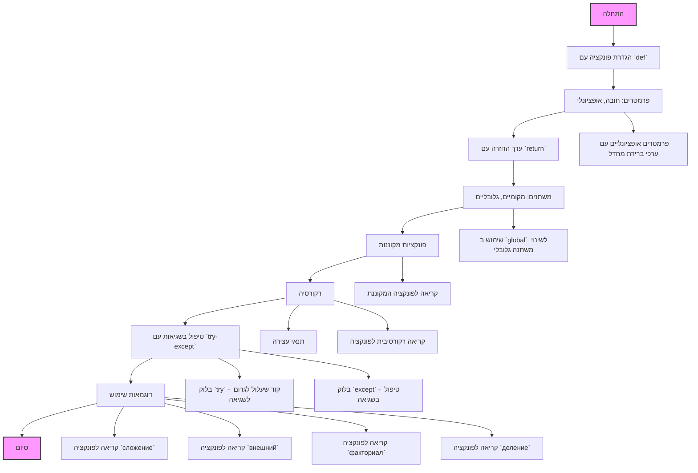

# ניתוח קוד: פונקציות ב-Python

## 1. <algorithm>

הקוד מספק הסבר מקיף על פונקציות ב-Python, הכולל את ההכרזה, הפרמטרים, ערך ההחזרה, משתנים מקומיים וגלובליים, פונקציות מקוננות, רקורסיה וטיפול בשגיאות.

**תרשים זרימה:**

1. **התחלה:**
   - מתחילים בסקירה כללית של פונקציות ב-Python.
2. **הכרזת פונקציה:**
   - שימוש במילת המפתח `def` כדי להגדיר פונקציה.
   - דוגמה: `def сложение(a: int, b: int) -> int:`.
3. **פרמטרים של פונקציה:**
   - הסבר על פרמטרים חובה ולא חובה.
   - דוגמה: `def приветствие(имя: str, возраст: int = 18) -> str:`.
4. **ערך החזרה:**
   - שימוש במילת המפתח `return` כדי להחזיר ערך.
   - דוגמה: `return a * b`.
5. **משתנים מקומיים וגלובליים:**
   - הסבר על ההבדל בין משתנים בתוך פונקציה (מקומיים) ומשתנים מחוץ לפונקציה (גלובליים).
   - שימוש ב-`global` כדי לשנות משתנה גלובלי מתוך פונקציה.
   - דוגמה:
     ```python
     x = 10  # משתנה גלובלי

     def изменить_x() -> None:
         global x
         x = 20
     ```
6. **פונקציות מקוננות:**
   - פונקציה המוגדרת בתוך פונקציה אחרת.
   - דוגמה:
     ```python
     def внешний(a: int, b: int) -> int:
         def вложенный(x: int, y: int) -> int:
             return x - y
         return вложенный(a, b)
     ```
7. **רקורסיה:**
   - פונקציה הקוראת לעצמה.
   - דוגמה לחישוב פקטוריאל:
     ```python
     def факториал(n: int) -> int:
         if n == 0:
             return 1
         return n * факториал(n - 1)
     ```
8. **טיפול בשגיאות:**
   - שימוש ב-`try` ו-`except` כדי לטפל בשגיאות.
   - דוגמה:
     ```python
     def деление(a: int, b: int) -> float:
         try:
             result = a / b
         except ZeroDivisionError:
             return "שגיאה: חלוקה באפס"
         except Exception as e:
             return f"התרחשה שגיאה: {e}"
         return result
     ```
9. **דוגמאות שימוש:**
   - הדגמה של שימוש בפונקציות השונות.
   - קריאות לפונקציות `сложение`, `внешний`, `факториал`, ו-`деление`.
10. **סיום.**

## 2. <mermaid>


**ניתוח תלויות:**

אין תלויות חיצוניות שמיובאות בקוד זה, לכן אין צורך בתרשים זרימה של `header.py`.

## 3. <explanation>

**ייבואים (Imports):**
- אין ייבואים בקוד הזה, מכיוון שהוא מסמך הסברתי על פונקציות ב-Python ולא קוד שמבצע משהו בפועל.

**מחלקות (Classes):**
- אין מחלקות בקוד הזה. הוא מתרכז בפונקציות.

**פונקציות (Functions):**
- הקוד מסביר ומדגים פונקציות שונות:
    - `сложение(a: int, b: int) -> int`: פונקציה שמחזירה את סכום שני מספרים שלמים.
        - פרמטרים: `a` ו-`b` (מספרים שלמים).
        - ערך החזרה: סכום `a` ו-`b` (מספר שלם).
        - מטרה: הדגמה בסיסית של פונקציה.
        - דוגמה: `сложение(5, 3)` מחזיר 8.
    - `приветствие(имя: str) -> str`: פונקציה שמחזירה ברכת "שלום" עם שם.
        - פרמטרים: `имя` (מחרוזת).
        - ערך החזרה: מחרוזת ברכה.
        - מטרה: הדגמת פונקציה עם פרמטר אחד.
        - דוגמה: `приветствие("אלי")` מחזיר "שלום, אלי!".
    - `приветствие(имя: str, возраст: int = 18) -> str`: פונקציה שמחזירה ברכת "שלום" עם שם וגיל (גיל ברירת מחדל 18).
        - פרמטרים: `имя` (מחרוזת), `возраст` (מספר שלם, אופציונלי עם ערך ברירת מחדל 18).
        - ערך החזרה: מחרוזת ברכה.
        - מטרה: הדגמה של פרמטרים אופציונליים.
        - דוגמה: `приветствие("אלי")` מחזיר "שלום, אלי! אתה 18".
        - דוגמה: `приветствие("אלי", 25)` מחזיר "שלום, אלי! אתה 25".
    - `умножение(a: int, b: int) -> int`: פונקציה שמחזירה את מכפלת שני מספרים שלמים.
        - פרמטרים: `a` ו-`b` (מספרים שלמים).
        - ערך החזרה: מכפלת `a` ו-`b` (מספר שלם).
        - מטרה: הדגמה של פונקציה עם פעולת כפל.
        - דוגמה: `умножение(4, 6)` מחזיר 24.
    - `показать_x() -> int`: פונקציה שמחזירה את הערך של משתנה גלובלי `x`.
        - פרמטרים: אין.
        - ערך החזרה: הערך של המשתנה הגלובלי `x`.
        - מטרה: הדגמה של שימוש במשתנה גלובלי.
    - `изменить_x() -> None`: פונקציה שמשנה את הערך של משתנה גלובלי `x`.
        - פרמטרים: אין.
        - ערך החזרה: אין (None).
        - מטרה: הדגמה של שינוי משתנה גלובלי מתוך פונקציה באמצעות `global`.
    - `внешний(a: int, b: int) -> int`: פונקציה המגדירה ומשתמשת בפונקציה מקוננת.
        - פרמטרים: `a` ו-`b` (מספרים שלמים).
        - ערך החזרה: ההפרש בין `a` ל-`b`.
        - מטרה: הדגמת פונקציה מקוננת.
        - דוגמה: `внешний(10, 4)` מחזיר 6.
    - `факториал(n: int) -> int`: פונקציה רקורסיבית שמחשבת פקטוריאל של מספר.
        - פרמטרים: `n` (מספר שלם).
        - ערך החזרה: פקטוריאל של `n`.
        - מטרה: הדגמת רקורסיה.
        - דוגמה: `факториал(5)` מחזיר 120.
    - `деление(a: int, b: int) -> float`: פונקציה שמבצעת חלוקה עם טיפול בשגיאות.
        - פרמטרים: `a` ו-`b` (מספרים שלמים).
        - ערך החזרה: תוצאת חלוקה או הודעת שגיאה.
        - מטרה: הדגמת טיפול בשגיאות באמצעות `try` ו-`except`.
        - דוגמה: `деление(10, 2)` מחזיר 5.0.
        - דוגמה: `деление(10, 0)` מחזיר "שגיאה: חלוקה באפס".

**משתנים (Variables):**
- `x` - משתנה גלובלי המשמש להדגמה של משתנים גלובליים ומקומיים.
- `a`, `b`, `x`, `y`, `n` - משתנים מקומיים שמשמשים כפרמטרים או משתנים בתוך פונקציות שונות.
- `result` - משתנה מקומי המשמש בתוך פונקצית `деление` לאחסון תוצאת החלוקה.

**בעיות אפשריות ותחומים לשיפור:**

- הקוד הוא הסבר תיאורטי ולא דוגמאות קוד מורכבות.
- אין התייחסות לסוגי פרמטרים נוספים (כמו `*args` ו-`**kwargs`).
- אין התייחסות לשימוש ב-`lambda` expressions.

**שרשרת קשרים עם חלקים אחרים בפרויקט:**

- קובץ זה הוא חלק מהסברים על יסודות שפת Python. אין לו קשרים ישירים לקבצים ספציפיים אחרים בפרויקט, אלא לקבצי ההסברים האחרים.