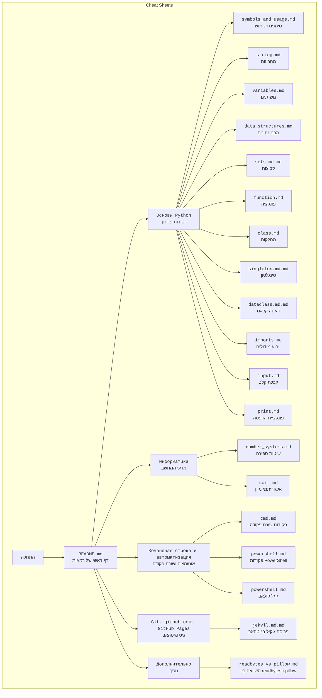

## <algorithm>

הקוד שסופק הוא קובץ Markdown (MD) המשמש כדף רמאות (cheat sheet) עבור לימוד פייתון, מדעי המחשב, כלי שורת פקודה, אוטומציה ועוד. הקובץ אינו מכיל קוד פייתון לביצוע. לכן, תהליך העבודה שלו הוא בעיקר מבני, ולא אלגוריתמי:

1. **אתחול**:
   - הקובץ מתחיל כקובץ טקסט פשוט בפורמט Markdown.
   - אין אתחול נתונים או משתנים, מכיוון שזהו מסמך.

2. **מבנה**:
   - הקובץ מחולק למספר סעיפים:
     - `Основы Python` (יסודות פייתון)
     - `Информатика` (מדעי המחשב)
     - `Командная строка и автоматизация. Работа с файлами. Работа с файлвой системой Google Colab` (שורת הפקודה, אוטומציה, עבודה עם קבצים וגוגל קולאב)
     - `Git, github.com, GitHub Pages (Jekyll)` (גיט, גיטהאב, דפי גיטהאב)
     - `Дополнительно` (נוסף)
   - כל סעיף מכיל קישורים לקבצי Markdown אחרים, המכילים מידע ספציפי יותר.

3. **קישורים**:
   - כל קישור מצביע לקובץ MD אחר במאגר GitHub.
   - הקישורים מאפשרים ניווט נוח למשתמשים למידע נוסף.

4. **תצוגה**:
   - הקובץ מיועד לתצוגה באמצעות מפרש Markdown, כמו GitHub או עורך Markdown מקומי.
   - כאשר מוצג, הקישורים הופכים ללחיצים, ומאפשרים למשתמש לעבור בין הדפים השונים.

5. **דוגמאות לבלוקים לוגיים**:
   - לדוגמה, בלוק הקישורים תחת `Основы Python`:
     - `[symbols_and_usage.md](https://github.com/hypo69/101_python_computer_games_ru/blob/master/cheat_sheets/symbols_and_usage.md)`
     - `[string.md](https://github.com/hypo69/101_python_computer_games_ru/blob/master/cheat_sheets/string.md)`
     - כל קישור כזה הוא בלוק לוגי המייצג נושא ספציפי בפייתון.

6. **זרימה**:
   - אין זרימה של נתונים בין פונקציות או מחלקות, מכיוון שאין כאלה בקוד.
   - הזרימה היא בעיקר של ניווט: הקורא עובר בין הקישורים השונים כדי ללמוד.

## <mermaid>

*   **`Cheat Sheets` (מרחב התרשים)**: מסמן את תחום התרשים.
*   **`Start` (התחלה)**: מסמן את נקודת ההתחלה של השימוש במסמך.
*   **`Main` (דף ראשי)**: מצביע על הקובץ `README.md`, דף הראשי של דפי הרמאות.
*   **`Python`, `ComputerScience`, `Automation`, `Git`, `Extra` (סעיפים)**: מציינים את הסעיפים השונים במסמך.
*   **`Symbols`, `String`, `Variables` וכו' (קישורים)**: מציינים את הקישורים השונים לקבצי MD אחרים, המייצגים נושאים ספציפיים.
*  כל שם משתנה בתרשים הוא בעל משמעות ותיאורי.

## <explanation>

**ייבואים (Imports)**:

*   אין ייבוא של מודולים או חבילות, מכיוון שהקוד אינו קוד פייתון אלא מסמך Markdown.
*   אין קשר עם חבילות `src.`, מכיוון שזה אינו קוד פייתון שדורש חבילות חיצוניות.

**מחלקות (Classes)**:

*   אין מחלקות בקוד מכיוון שזהו מסמך Markdown ולא קוד פייתון.

**פונקציות (Functions)**:

*   אין פונקציות בקוד מכיוון שזהו מסמך Markdown ולא קוד פייתון.

**משתנים (Variables)**:

*   אין משתנים בקוד מכיוון שזהו מסמך Markdown ולא קוד פייתון.
*   הקישורים (המשתנים בתוך תבניות ה-markdown) מכילים את הנתיבים לקבצים אחרים.

**בעיות אפשריות או תחומים לשיפור:**

*   הקובץ תלוי לחלוטין במבנה הקיים במאגר GitHub.
*   ייתכן שחלק מהקישורים אינם מעודכנים או מובילים לקבצים שאינם קיימים, אם המבנה במאגר משתנה.
*   הקובץ לא מציג מידע ישירות אלא רק קישורים, כך שהמשתמש צריך לעבור בין מספר קבצים כדי להבין את הנושא.
*   אין חיפוש או סינון מידע בתוך הקובץ.

**שרשרת קשרים עם חלקים אחרים בפרויקט:**

*   הקובץ הוא חלק ממערך גדול יותר של דפי רמאות, והוא משמש כנקודת כניסה למערך זה.
*   כל קישור מוביל לקובץ אחר במאגר, כך שהקובץ הזה משמש כאינדקס או מפת דרכים לכל דפי הרמאות האחרים.
*   קובץ זה הוא חלק מתוך הפרויקט `hypotez/101_python_computer_games_ru`.