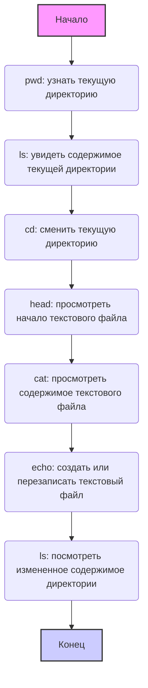

## <algorithm>

הקוד מסביר את השימוש ב-Google Colab, סביבת פיתוח בענן המבוססת על מחברות Jupyter. להלן תיאור של תהליך העבודה, צעד אחר צעד:

1.  **הסבר על Google Colab**:
    *   הקוד מתחיל בהסבר על מהות Google Colab, שהיא פלטפורמה עננית ליצירת והרצת קוד Python, ניתוח נתונים ולמידת מכונה.
    *   **דוגמה**: "Google Colab — это облачная платформа, созданная Google, для работы с интерактивными блокнотами Jupyter Notebook."

2.  **אופן הפעולה של Google Colab**:
    *   הסבר על אופן הפעולה של Colab, הכולל הרצת מחברות Jupyter בדפדפן, הרצת קוד על שרתי גוגל וגישה למשאבים כמו GPU ו-TPU.
    *   **דוגמה**: "Код выполняется на удаленных серверах Google, а результаты отображаются в вашем блокноте."

3.  **ממשק המשתמש של Google Colab**:
    *   תיאור של ממשק המשתמש, המורכב משורות קוד, תאי טקסט, תפריטים ומנהל קבצים.
    *   **דוגמה**: "Интерфейс Colab состоит из нескольких основных частей: Строки кода, Текстовые ячейки, Меню, Файловый менеджер."

4.  **עבודה עם מערכת הקבצים**:
    *   הסבר על השימוש בפקודות קסם Jupyter (`%`) ופקודות Bash (`!`) לעבודה עם מערכת הקבצים של Colab.
    *   **דוגמאות**:
        *   `%pwd`: הצגת התיקייה הנוכחית.
        *   `%ls`: הצגת רשימת קבצים ותיקיות בתיקייה הנוכחית.
        *   `%cd <path>`: מעבר לתיקייה אחרת.
        *   `!head -<number> <filename>`: הצגת השורות הראשונות של קובץ טקסט.
        *   `!cat <filename>`: הצגת כל תוכן הקובץ.
        *   `!echo "<text>" > <filename>`: יצירת או שינוי קובץ טקסט.

5.  **תרשים זרימה של פקודות בסיסיות**:
    *   תרשים זרימה בפורמט Mermaid הממחיש את השימוש בפקודות בסיסיות במערכת הקבצים.
        *   התרשים מתאר רצף של פקודות: `pwd`, `ls`, `cd`, `head`, `cat`, `echo`, ו-`ls`.

6.  **דרכים להעלאת קבצים ל-Google Colab**:
    *   הקוד מפרט מספר דרכים להעלאת קבצים ל-Colab:
        *   **מנהל קבצים (GUI)**: שימוש בממשק הגרפי להעלאת קבצים.
        *   **קוד Python** (`google.colab.files.upload()`): העלאת קבצים באמצעות קוד Python.
        *   **שכפול ריפוזיטורי GitHub** (`git clone`): העלאת קבצים מריפוזיטורי GitHub.
        *   **הורדת קבצים בודדים מ-GitHub** (`wget` או `curl`): הורדת קבצים ישירות מקישורים ב-GitHub.
    *   **דוגמאות**:
        *   `from google.colab import files; uploaded = files.upload()`: העלאת קבצים באמצעות קוד Python.
        *   `!git clone <repository_url>`: שכפול ריפוזיטורי GitHub.
        *   `!wget <file_url>`: הורדת קובץ באמצעות `wget`.
        *   `!curl <file_url> -o <file_name>`: הורדת קובץ באמצעות `curl`.

7.  **בחירת שיטת העלאה**:
    *   הסבר על איזה שיטת העלאה מתאימה לאיזה מקרה.

## <mermaid>



### הסבר על התלויות ב Mermaid:

התרשים נוצר בפורמט Mermaid, שאינו תלוי בספריות חיצוניות. הוא משתמש בתחביר פשוט להגדרת צמתים (Nodes) וחיצים (Arrows) ליצירת תרשים זרימה. אין ייבוא של ספריות נוספות למימוש התרשים עצמו.

*   `flowchart TD` - מגדיר את סוג התרשים כתרשים זרימה מלמעלה למטה (Top-Down).
*   `A`, `B`, `C`... `I` - מייצגים את הצמתים בתרשים הזרימה.
*   `-->` - מציין את החיצים המקשרים בין הצמתים ומייצגים את זרימת הפעולות.
*   התיאור בסוגריים () מתאר את הפעולה המבוצעת בכל צומת.
*   `style` משמש לעיצוב הצמתים.

## <explanation>

### ייבואים (Imports):

*   `from google.colab import files`: ייבוא המודול `files` מהספרייה `google.colab`. מודול זה מאפשר להעלות קבצים ל-Google Colab באמצעות קוד Python.
    *   המודול `files` מספק פונקציות לניהול קבצים בתוך סביבת Colab, כולל העלאת קבצים מהמחשב המקומי למכונת Colab הווירטואלית.
    *   **קשר עם `src.`**: אין קשר ישיר לחבילות `src.` אחרות בפרויקט זה, מכיוון שקוד זה ספציפי לסביבת Google Colab.

### מחלקות (Classes):

*   אין מחלקות מוגדרות בקוד זה. הקוד בעיקר מציג הוראות ופקודות לשימוש בסביבת Google Colab.

### פונקציות (Functions):

*   `files.upload()`: פונקציה מהמודול `google.colab.files`.
    *   **פרמטרים**: אין פרמטרים נדרשים.
    *   **ערך מוחזר**: מחזירה מילון שבו המפתחות הם שמות הקבצים המועלים, והערכים הם תוכנם בפורמט של בייט-סטרינג.
    *   **מטרה**: לאפשר למשתמש להעלות קבצים מסביבתו המקומית לסביבת Colab באמצעות קוד Python.
    *   **דוגמה לשימוש**:
        ```python
        from google.colab import files
        uploaded = files.upload()
        for filename, file_data in uploaded.items():
            print(f"Uploaded {filename}")
        ```

### משתנים (Variables):

*   `uploaded`: משתנה המקבל את הערך המוחזר מהפונקציה `files.upload()`.
    *   **סוג**: מילון (dictionary).
    *   **שימוש**: מכיל את הקבצים שהועלו, כאשר המפתחות הם שמות הקבצים והערכים הם תוכן הקבצים בפורמט של בייט-סטרינג.
    *   **דוגמה**: `uploaded = {'my_file.txt': b'Hello World'}`

### הסברים נוספים:

*   **פקודות קסם Jupyter (Magic Commands)**: פקודות שמתחילות בסימן `%` ומאפשרות לבצע פעולות ספציפיות בסביבת Jupyter/Colab, כגון הצגת התיקייה הנוכחית (`%pwd`), רשימת קבצים (`%ls`) ומעבר בין תיקיות (`%cd`).

*   **פקודות Bash**: פקודות שמתחילות בסימן `!` ומאפשרות לבצע פקודות במערכת ההפעלה Linux שבבסיס Colab, כגון הצגת השורות הראשונות של קובץ (`!head`), הצגת תוכן של קובץ (`!cat`) ויצירת קובץ חדש (`!echo`).

*   **בעיות אפשריות**:
    *   **גודל קבצים**: העלאת קבצים גדולים דרך מנהל הקבצים או `files.upload()` עלולה להיות איטית.
    *   **ריפוזיטורי GitHub**:  שימוש ב-`git clone` עשוי להיות בעייתי אם הריפוזיטורי גדול מדי.

*   **תחומים לשיפור**:
    *   הוספת פונקציות נוספות לטיפול בקבצים, כגון מחיקה או שינוי שם.
    *   הסבר מפורט יותר על אופן העבודה עם קבצים שהועלו דרך `files.upload()` (למשל, שימוש ב-pandas לקריאת קבצי CSV).

### שרשרת קשרים עם חלקים אחרים בפרויקט:

אין שרשרת קשרים ישירה לקודים אחרים בפרויקט, מכיוון שהקוד ממוקד בהסבר על השימוש ב-Google Colab ואין בו תלות ישירה במודולים ספציפיים של פרויקט אחר.
עם זאת, הקוד משמש כחלק מההבנה הכוללת של שימוש בכלי הפיתוח הענני.