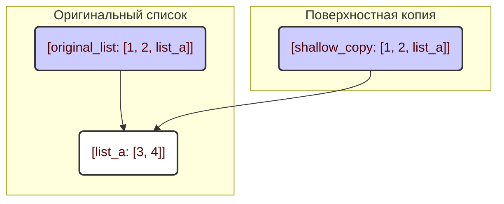
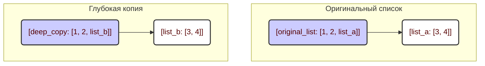

## <algorithm>

1. **הסבר כללי**: הקוד מציג את ההבדל בין שני סוגי העתקה של אובייקטים ב-Python: העתקה רדודה (shallow copy) והעתקה עמוקה (deep copy). מטרת ההסבר היא להדגים מדוע יש צורך בהעתקה עמוקה כאשר מדובר באובייקטים מקוננים (כגון רשימות בתוך רשימות).

2. **העתקה רדודה (`copy.copy()`)**:
   - **שלב 1:** נוצרת רשימה מקורית `original_list` המכילה מספרים ורשימה מקוננת.
      - *דוגמה:* `original_list = [1, 2, [3, 4]]`
   - **שלב 2:** נוצרת העתקה רדודה `shallow_copy` של `original_list` באמצעות `copy.copy()`.
      - *דוגמה:* `shallow_copy = copy.copy(original_list)`
      - בשלב זה, `shallow_copy` ו-`original_list` מצביעות על אותה הרשימה הפנימית `[3, 4]`.
   - **שלב 3:** משנים את הרשימה הפנימית בתוך `original_list`.
      - *דוגמה:* `original_list[2][0] = 5`
      - שינוי זה משתקף גם ב-`shallow_copy`, מכיוון ששניהם מצביעים על אותו אובייקט פנימי.
   - **זרימת נתונים**: נתונים זורמים מהרשימה המקורית אל ההעתקה הרדודה, אך ההעתקה הרדודה שומרת על קישור ישיר לאובייקטים הפנימיים של הרשימה המקורית.
      -  `original_list` --> `shallow_copy` (קישור לאובייקטים הפנימיים).

3. **העתקה עמוקה (`copy.deepcopy()`)**:
   - **שלב 1:** נוצרת רשימה מקורית `original_list` המכילה מספרים ורשימה מקוננת.
      - *דוגמה:* `original_list = [1, 2, [3, 4]]`
   - **שלב 2:** נוצרת העתקה עמוקה `deep_copy` של `original_list` באמצעות `copy.deepcopy()`.
      - *דוגמה:* `deep_copy = copy.deepcopy(original_list)`
      - בשלב זה, `deep_copy` היא העתק עצמאי לחלוטין של `original_list`, כולל כל האובייקטים הפנימיים.
   - **שלב 3:** משנים את הרשימה הפנימית בתוך `original_list`.
      - *דוגמה:* `original_list[2][0] = 5`
      - שינוי זה אינו משפיע על `deep_copy`, מכיוון ששניהם מצביעים על אובייקטים פנימיים שונים.
   - **זרימת נתונים**: נתונים זורמים מהרשימה המקורית אל ההעתקה העמוקה, אך ההעתקה העמוקה יוצרת אובייקטים עצמאיים לחלוטין לכל הרמות.
      -  `original_list` --> `deep_copy` (יצירת אובייקטים חדשים ועצמאיים).

## <mermaid>

**ניתוח התלויות:**
- לא קיימות תלויות חיצוניות מלבד מודול `copy` הסטנדרטי של Python, המשמש לייצור ההעתקות.
- אין קשר ל-`header.py`.
- `copy` - משמש לפונקציות `copy.copy()` ו-`copy.deepcopy()`.

## <explanation>

**ייבואים (Imports):**
- `import copy`: מודול `copy` מספק פונקציות להעתקה של אובייקטים ב-Python. הוא לא קשור ל-`src.` או לחבילות אחרות בפרויקט. מדובר במודול סטנדרטי של Python.

**מחלקות (Classes):**
- אין מחלקות בקוד זה.

**פונקציות (Functions):**
- `copy.copy(object)`: יוצר העתקה רדודה של האובייקט.
    - *פרמטרים:* `object` - האובייקט שיש להעתיק.
    - *ערך מוחזר:* העתקה רדודה של האובייקט.
    - *מטרה:* ליצור אובייקט חדש, שבו אם האובייקט המקורי מכיל רשימות או אובייקטים אחרים, הם לא מועתקים, אלא רק המצביעים (reference) אליהם.
    - *דוגמה:* `shallow_copy = copy.copy(original_list)`.
- `copy.deepcopy(object)`: יוצר העתקה עמוקה של האובייקט.
    - *פרמטרים:* `object` - האובייקט שיש להעתיק.
    - *ערך מוחזר:* העתקה עמוקה של האובייקט.
    - *מטרה:* ליצור אובייקט חדש לגמרי, שבו אם האובייקט המקורי מכיל רשימות או אובייקטים אחרים, הם מועתקים באופן רקורסיבי כך שהם הופכים לאובייקטים נפרדים.
    - *דוגמה:* `deep_copy = copy.deepcopy(original_list)`.

**משתנים (Variables):**
- `original_list`: רשימה מקורית המכילה מספרים ורשימה מקוננת.
- `shallow_copy`: העתקה רדודה של `original_list`.
- `deep_copy`: העתקה עמוקה של `original_list`.
- `list_a`, `list_b`: הרשימות הפנימיות המקוננות, כאשר `list_a` משותפת בין הרשימה המקורית להעתקה הרדודה, ואילו `list_b` היא העתק נפרד בהעתקה העמוקה.

**הערות נוספות:**
- **בעיות אפשריות או תחומים לשיפור:**
   - אין בעיות קוד קונקרטיות בקטע הקוד הזה. הקוד נועד להדגים את ההבדל בין העתקה רדודה לעומת העתקה עמוקה בצורה ברורה.
   - תחום לשיפור: ניתן היה להרחיב את הדוגמה כדי לכלול מקרים מורכבים יותר עם יותר רמות של קינון.
- **שרשרת קשרים עם חלקים אחרים בפרויקט:**
    - הקוד הזה, כשהוא לעצמו, לא קשור ישירות לשאר חלקי הפרויקט. הוא מספק דוגמאות שימושיות להבנת התנהגות ההעתקה ב-Python, שניתן להשתמש בהן בכל מקום בו מתבצעת פעולת העתקה של אובייקטים.

בסיכום, הקוד מדגים בצורה ברורה את ההבדלים המהותיים בין העתקה רדודה לעומת עמוקה באמצעות דוגמאות קונקרטיות, ונותן רקע חזק להבנת נושא זה ב-Python.