## <algorithm>
1. **רשימות (Lists)**:
    - יצירת רשימה `boris_list` עם הערכים "בוריס", "מוסקבה", 30, "מהנדס".
    - הדפסת הרשימה.
    - הדפסת הערך באינדקס 0.
    - שינוי הערך באינדקס 2 ל-31.
    - הוספת הערך "נשוי" לסוף הרשימה.
    - הוספת הערך "רוסיה" באינדקס 1.
    - הסרת הערך "מהנדס" מהרשימה.
    - הסרת הערך באינדקס 2.
    - הרחבת הרשימה עם הרשימה ["תחביב", "דיג"].
    - הסרת הערך האחרון מהרשימה.
    - הדפסת הרשימה בכל שלב.

2. **מילונים (Dictionaries)**:
    - יצירת מילון `alice_dict` עם מפתחות "name", "age", "city", "occupation" וערכים מתאימים.
    - הדפסת המילון.
    - הדפסת הערך של המפתח "name".
    - שינוי הערך של המפתח "age" ל-26.
    - הוספת זוג מפתח-ערך "hobby": "ציור".
    - הסרת זוג המפתח-ערך עם מפתח "city".
    - הסרת זוג המפתח-ערך עם מפתח "hobby" והחזרת הערך.
    - בדיקת קיום מפתח "name" במילון.
    - הדפסת המילון בכל שלב.

3. **טופלים (Tuples)**:
    - יצירת טופל `boris_tuple` עם הערכים "בוריס", "מוסקבה", 30, "מהנדס".
    - הדפסת הטופל.
    - הדפסת הערך באינדקס 2.
    - הערה שהטופל אינו ניתן לשינוי, הוספה או מחיקה של איברים (קוד לדוגמה שגורם לשגיאות).

4. **SimpleNamespace**:
    - ייבוא `SimpleNamespace` מהמודול `types`.
    - יצירת `alice_namespace` עם תכונות `name`, `age`, `city`.
    - הדפסת האובייקט.
    - הדפסת הערך של התכונה `name`.
    - שינוי הערך של התכונה `age` ל-26.
    - הערה שלא ניתן להוסיף תכונה חדשה ישירות (קוד לדוגמה שגורם לשגיאה).
     -הוספת תכונה 'occupation' באמצעות  setattr
     -מחיקת התכונה 'city' באמצעות delattr
    - הדפסת האובייקט בכל שלב.

```mermaid
flowchart TD
    subgraph Lists [רשימות]
        A[יצירת רשימה boris_list] --> B[הדפסת רשימה]
        B --> C[גישה לאינדקס 0]
        C --> D[שינוי אינדקס 2]
        D --> E[הוספה לסוף]
        E --> F[הוספה באינדקס 1]
        F --> G[הסרה לפי ערך]
        G --> H[הסרה לפי אינדקס]
        H --> I[הרחבה עם רשימה]
         I --> J[הסרה מהסוף]
        J --> K[הדפסת רשימה]
    end

    subgraph Dictionaries [מילונים]
       L[יצירת מילון alice_dict] --> M[הדפסת מילון]
       M --> N[גישה לפי מפתח 'name']
       N --> O[שינוי ערך 'age']
       O --> P[הוספת זוג מפתח-ערך]
       P --> Q[הסרת זוג לפי מפתח]
       Q --> R[הסרה והחזרה לפי מפתח 'hobby']
       R --> S[בדיקת מפתח 'name']
       S --> T[הדפסת מילון]
    end

    subgraph Tuples [טופלים]
        U[יצירת טופל boris_tuple] --> V[הדפסת טופל]
        V --> W[גישה לאינדקס 2]
        W --> X[הערה: טופל אינו ניתן לשינוי]
    end

    subgraph SimpleNamespace [מרחב שמות פשוט]
       Y[ייבוא SimpleNamespace] --> Z[יצירת אובייקט alice_namespace]
       Z --> AA[הדפסת אובייקט]
       AA --> AB[גישה לתכונה 'name']
       AB --> AC[שינוי תכונה 'age']
       AC --> AD[הערה: לא ניתן להוסיף תכונה ישירות]
       AD --> AE[הוספת תכונה דרך setattr]
       AE --> AF[מחיקת תכונה דרך delattr]
       AF --> AG[הדפסת אובייקט]
    end
```

## <mermaid>

## <explanation>

**ייבואים (Imports):**
- `from types import SimpleNamespace`: ייבוא המחלקה `SimpleNamespace` מהמודול `types`. זה משמש ליצירת אובייקטים פשוטים עם תכונות שאפשר לגשת אליהן דרך נקודה (כמו `alice_namespace.name`). המודול `types` הוא חלק מהספרייה הסטנדרטית של פייתון ומספק כלים לעבודה עם טיפוסים.

**רשימות (Lists):**
- רשימות הן מבני נתונים מובנים בפייתון המאפשרים לאחסן אוסף של איברים בסדר מסוים.
- הן ניתנות לשינוי, כלומר אפשר להוסיף, להסיר ולשנות איברים אחרי שהרשימה נוצרה.
- שימושיות לאחסון נתונים שצריכים להיות מסודרים וניתנים לשינוי.
- הדוגמאות מציגות:
    - יצירת רשימה.
    - גישה לאיבר לפי אינדקס.
    - שינוי איבר.
    - הוספה לסוף הרשימה.
    - הוספה לאינדקס מסוים.
    - הסרה לפי ערך.
    - הסרה לפי אינדקס.
    - הרחבת הרשימה עם רשימה אחרת.
    - הסרת האיבר האחרון.

**מילונים (Dictionaries):**
- מילונים הם מבני נתונים מובנים בפייתון המאחסנים זוגות של מפתח וערך.
- המפתחות חייבים להיות ייחודיים, והערכים יכולים להיות כל סוג נתונים.
- הם אינם מסודרים, כלומר הסדר שבו האיברים נוספו לא משמעותי.
- שימושיים לאחסון נתונים שבהם כל איבר מזוהה על ידי מפתח.
- הדוגמאות מציגות:
    - יצירת מילון.
    - גישה לערך לפי מפתח.
    - שינוי ערך.
    - הוספת זוג מפתח-ערך.
    - הסרת זוג לפי מפתח.
    - הסרת זוג והחזרת הערך.
    - בדיקת קיום מפתח.

**טופלים (Tuples):**
- טופלים הם מבני נתונים מובנים בפייתון הדומים לרשימות, אך הם אינם ניתנים לשינוי.
- הם מוגדרים עם סוגריים עגולים `()`.
- שימושיים לאחסון נתונים שצריכים להיות קבועים ולא ניתנים לשינוי.
- הדוגמאות מציגות:
    - יצירת טופל.
    - גישה לאיבר לפי אינדקס.
    - הערה שאי אפשר לשנות, להוסיף או למחוק איברים בטופל (מנסים ורואים שזה גורם לשגיאה).

**SimpleNamespace:**
- SimpleNamespace הוא כלי נוח ליצירת אובייקטים פשוטים עם תכונות שניתן לגשת אליהן ולשנות אותן.
- הוא שימושי כאשר רוצים ליצור אובייקטים רק לאחסון נתונים באופן קל וברור.
- הדוגמאות מציגות:
    - יצירת SimpleNamespace עם תכונות.
    - גישה לתכונה.
    - שינוי תכונה.
     -הערה שלא ניתן להוסיף תכונה חדשה ישירות.
     - הוספת תכונה באמצעות setattr
     -מחיקת תכונה באמצעות delattr

**בעיות אפשריות ותחומים לשיפור:**
- הקוד מציג בעיקר דוגמאות שימוש בסיסיות ולא מציג בעיות או שיפורים אפשריים.
- אפשר היה להוסיף דוגמאות שימוש יותר מתקדמות כמו איטרציה על רשימות ומילונים, או שימוש בפונקציות מסננות/מיפוי ברשימות.
- הקוד אינו מחובר לחלקים אחרים בפרויקט, הוא בעיקר דוגמאות מבודדות.

בסה"כ, הקוד הוא סקירה בסיסית של מבני הנתונים הנפוצים בפייתון.