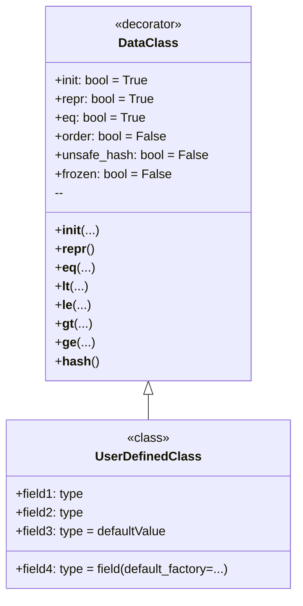

## <algorithm>

1. **הגדרת `dataclass`:**
   - מתחילים בייבוא הדקורטור `dataclass` מהמודול `dataclasses`.
   - משתמשים בדקורטור `@dataclass` כדי לסמן מחלקה כ-`dataclass`.

2. **הגדרת שדות:**
   - מגדירים את שדות המחלקה כמשתנים רגילים של המחלקה, עם אנוטציות טיפוס.
   - **דוגמא:** `x: int`, `y: str`, `items: List[int]`.
   - שדות אלה יהפכו לאטריבוטים של המופע.

3. **יצירת `__init__` (אוטומטית):**
   - הדקורטור `dataclass` מייצר אוטומטית מתודת `__init__` שמקבלת ארגומנטים לפי השדות שהוגדרו.
   - **דוגמא:** עבור `class Point: x: int; y: int`, המתודה `__init__` תהיה שקולה ל- `def __init__(self, x: int, y: int): self.x = x; self.y = y`.

4. **יצירת `__repr__` (אוטומטית):**
   - הדקורטור `dataclass` מייצר אוטומטית מתודת `__repr__` שמחזירה ייצוג מחרוזתי של המופע.
   - **דוגמא:** עבור מופע `Point(x=1, y=2)`, הפלט יהיה `Point(x=1, y=2)`.

5. **יצירת `__eq__` (אוטומטית):**
   - הדקורטור `dataclass` מייצר אוטומטית מתודת `__eq__` להשוואה בין שני מופעים.
   - **דוגמא:** עבור מופעים `Point(1, 2)` ו-`Point(1, 2)`, ההשוואה תחזיר `True`. עבור `Point(1, 2)` ו-`Point(3, 4)` ההשוואה תחזיר `False`.

6. **אפשרויות נוספות של `dataclass`:**
   - `init=False`: לא יוצר את `__init__`.
   - `repr=False`: לא יוצר את `__repr__`.
   - `eq=False`: לא יוצר את `__eq__`.
   - `order=True`: יוצר מתודות השוואה (`__lt__`, `__le__`, `__gt__`, `__ge__`).
   - `unsafe_hash=True`: יוצר את `__hash__` (להפוך את המופע ל-hashable).
   - `frozen=True`: הופך את המופע לבלתי משתנה.

7. **ערכי ברירת מחדל:**
   - ניתן להגדיר ערכי ברירת מחדל לשדות.
   - **דוגמא:** `x: int = 0`, `y: str = "default"`.

8. **שימוש ב-`field`:**
   - כשמשתמשים בטיפוסים משתנים כברירת מחדל, יש להשתמש ב-`dataclasses.field` ו-`default_factory` כדי למנוע בעיות משותפות בין מופעים שונים.
   - **דוגמא:** `items: List[int] = field(default_factory=list)`.

9. **שימוש:**
   - יוצרים מופעים של ה-`dataclass` כרגיל, מעבירים ארגומנטים לבנאי (אלא אם `init=False`).
   - משתמשים באופרטורים `==`, `<` וכו' (בהתאם לאפשרויות) להשוואה.
   - מדפיסים מופעים (ייצוג מחרוזתי לפי `__repr__`).

10. **זרימת נתונים:**
    - הנתונים מועברים בעת יצירת מופע לתוך המופע.
    - המופע שומר נתונים כאטריבוטים.
    - נתונים משמשים בהשוואות, ייצוג מחרוזתי וכו'.

## <mermaid>

הסבר התלויות:
- `classDiagram`: מגדיר תרשים מחלקות בפורמט Mermaid.
- `DataClass`: מייצג את הדקורטור `dataclass`.
  - התכונות שלו `init`, `repr`, `eq`, `order`, `unsafe_hash`, `frozen` מייצגות את הפרמטרים של הדקורטור.
  - השיטות שלו מייצגות את השיטות שנוצרות באופן אוטומטי.
- `UserDefinedClass`: מייצג מחלקה שהוגדרה על ידי המשתמש באמצעות הדקורטור `dataclass`.
  -  השדות שלו מייצגים שדות נתונים עם טיפוס, ערכי ברירת מחדל או `default_factory`.
- `DataClass <|-- UserDefinedClass`: מציין שהדקורטור `DataClass` משמש על `UserDefinedClass`.

## <explanation>

**ייבוא (Imports):**
   - `from dataclasses import dataclass, field`: מייבא את הדקורטור `dataclass` ואת הפונקציה `field` מהספרייה `dataclasses`.
    - הדקורטור `dataclass` משמש כדי להפוך מחלקה ל-`dataclass`, ולייצר באופן אוטומטי שיטות כמו `__init__`, `__repr__` וכו'.
    - הפונקציה `field` משמשת להגדיר שדות עם אפשרויות מותאמות אישית (כגון `default_factory`).
   - `from typing import List`: מייבא את הטיפוס `List` מהספרייה `typing` עבור תיאור טיפוס של רשימות.

**מחלקות (Classes):**
   - `dataclass` משמש ליצירת מחלקות שנועדו בעיקר לשמירת נתונים.
   - הדקורטור מייצר אוטומטית שיטות נפוצות, חוסך בכתיבת קוד.
   - דוגמאות למחלקות:
     - `Point`: מחלקה שמייצגת נקודה עם קואורדינטות `x` ו-`y`.
     - `BadExample`: מדגימה בעיה עם רשימות כברירת מחדל (משותפת בין מופעים).
     - `GoodExample`: מדגימה שימוש נכון ב-`default_factory` כדי ליצור רשימה חדשה לכל מופע.

**פונקציות (Functions):**
   - הדקורטור `@dataclass` מייצר אוטומטית פונקציות (שיטות) עבור המחלקה:
     - `__init__(self, ...)`: יוצר מופע של המחלקה, מקבל את ערכי השדות.
     - `__repr__(self)`: מחזיר ייצוג מחרוזתי של המופע.
     - `__eq__(self, other)`: בודק אם שני מופעים שווים.
     - `__lt__(self, other)`, `__le__(self, other)`, `__gt__(self, other)`, `__ge__(self, other)`: מתודות השוואה, נוצרות אם `order=True`.
     - `__hash__(self)`: מתודת hash, נוצרת אם `unsafe_hash=True`.
   - הפונקציה `field` מספקת אפשרויות נוספות לשדות כמו `default_factory` (ליצירת ברירות מחדל עבור סוגים משתנים).

**משתנים (Variables):**
   - שדות המוגדרים ב-`dataclass` הופכים לאטריבוטים של המופע.
   - **דוגמא:**
     - `x: int` ו-`y: int` ב-`Point` הופכים ל- `point.x` ו-`point.y`.
     - `items: List[int]` ב-`BadExample` או `GoodExample` הופך ל- `bad1.items` ו- `good1.items` .
     - ניתן להגדיר ערכי ברירת מחדל (למשל `x: int = 0`).
   - מופעים של ה-`dataclass` הם משתנים המאחסנים את הנתונים.
   - מופעים יכולים להיות בלתי משתנים אם `frozen=True`.

**בעיות אפשריות ותחומים לשיפור:**
   - **ברירות מחדל משתנות:** שימוש בטיפוסים משתנים (כגון רשימות או מילונים) כערכי ברירת מחדל עלול ליצור בעיות שיתוף בין מופעים שונים. כדי לפתור את הבעיה יש להשתמש ב-`default_factory`.
   - **התאמה אישית של __init__:** אם צריך לוגיקה מורכבת בבנאי, ייתכן ש `dataclass` לא יתאים, ויהיה צורך ליישם את `__init__` באופן ידני.
   - **ביצועים:** במקרים מסוימים,  שימוש ב- `dataclass` עלול להיות פחות יעיל בהשוואה למחלקות רגילות עם מימוש ספציפי. עם זאת, השימוש נועד בעיקר לשמירת נתונים, ולרוב הבעיות האלו לא רלוונטיות.
   - **מורכבות:** עם הרבה פרמטרים מורכבים ב-`dataclass`, הקריאות של הקוד יכולה להיות מושפעת.
   - **שילוב עם כלים אחרים:** לא כל הכלים תומכים באופן מלא ב-`dataclass`.

**שרשרת קשרים עם חלקים אחרים בפרויקט:**
   - הקוד לא תלוי בחלקים אחרים בפרויקט מעבר ל-`dataclasses` ו-`typing` שהם חלק מהספרייה הסטנדרטית.
   - `dataclass` מיועד לשמש ככלי ליצירת מחלקות נתונים וניתן להשתמש בו בכל מקום בו יש צורך לייצג נתונים בצורה מובנית.