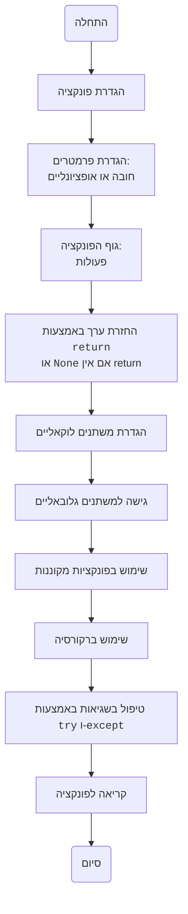

# ניתוח קוד

## <algorithm>
הקוד מספק הסבר מפורט על פונקציות בשפת Python, כולל איך להגדיר אותן, להשתמש בפרמטרים, להחזיר ערכים, לעבוד עם משתנים גלובליים ולוקאליים, להשתמש בפונקציות מקוננות, ברקורסיה, ובטיפול בשגיאות.

1. **הגדרת פונקציה:**
   - מתחיל במילת המפתח `def` ולאחר מכן שם הפונקציה.
     - דוגמא: `def сложение(a: int, b: int) -> int:`
   - פרמטרים מוגדרים בסוגריים אחרי שם הפונקציה.
     - דוגמא: `a: int, b: int`
   - הערך המוחזר של הפונקציה מוגדר לאחר סימן `->`.
     - דוגמא: `-> int`
   - גוף הפונקציה, הכולל את הפעולות שיש לבצע, נכתב בתוך בלוק מוזח.
     - דוגמא: `return a + b`
2. **שימוש בפרמטרים:**
   - פרמטרים יכולים להיות חובה או אופציונליים.
     - דוגמא: `def приветствие(имя: str, возраст: int = 18)`
   - פרמטרים אופציונליים מוגדרים עם ערך ברירת מחדל.
3. **החזרת ערך:**
   - הפונקציה יכולה להחזיר ערך באמצעות מילת המפתח `return`.
     - דוגמא: `return a * b`
   - אם לא משתמשים ב-`return`, הפונקציה תחזיר `None`.
4. **משתנים לוקאליים וגלובאליים:**
   - משתנים לוקאליים מוגדרים בתוך הפונקציה וזמינים רק בתוכה.
     - דוגמא: `result = a / b`
   - משתנים גלובאליים מוגדרים מחוץ לפונקציות וזמינים בכל הקוד.
     - דוגמא: `x = 10`
   - כדי לשנות משתנה גלובאלי בתוך פונקציה יש להשתמש במילת המפתח `global`.
     - דוגמא: `global x`
5. **פונקציות מקוננות:**
   - ניתן להגדיר פונקציה בתוך פונקציה אחרת.
     - דוגמא: `def внешний(a: int, b: int): def вложенный(x: int, y: int)`
   - הפונקציה הפנימית יכולה לגשת למשתנים של הפונקציה החיצונית.
6. **רקורסיה:**
   - פונקציה קוראת לעצמה.
     - דוגמא: `return n * факториал(n - 1)`
   - יש צורך בתנאי עצירה כדי למנוע לולאה אינסופית.
     - דוגמא: `if n == 0: return 1`
7. **טיפול בשגיאות:**
   - ניתן להשתמש בבלוק `try` ו-`except` כדי לטפל בשגיאות שעלולות להתרחש.
     - דוגמא: `try: result = a / b; except ZeroDivisionError: return "..."`
   - בלוק `try` מכיל את הקוד שעלול לגרום לשגיאה, ובלוק `except` מטפל בשגיאה.

## <mermaid>

* **הסבר:**
    - **Start:** נקודת ההתחלה של זרימת הקוד
    - **FunctionDefinition:** הגדרה של פונקציה, הכוללת את המילת המפתח `def`, שם הפונקציה וסוגריים.
    - **Parameters:** הגדרת הפרמטרים של הפונקציה, כולל פרמטרים חובה ואופציונליים.
    - **FunctionBody:** גוף הפונקציה, המכיל את הקוד שצריך להתבצע.
    - **ReturnValue:** החזרת הערך מהפונקציה באמצעות המילה השמורה `return`.
    - **LocalVariables:** הגדרה ושימוש במשתנים לוקאליים, שקיימים רק בתוך הפונקציה.
    - **GlobalVariables:** גישה למשתנים גלובאליים, שקיימים מחוץ לפונקציה.
    - **NestedFunction:** שימוש בפונקציה המוגדרת בתוך פונקציה אחרת.
    - **Recursion:** קריאה לפונקציה מתוך עצמה (רקורסיה).
    - **TryExceptBlock:** טיפול בשגיאות אפשריות באמצעות `try` ו-`except`.
    - **FunctionCall:** קריאה לפונקציה כדי לבצע את הקוד שבתוכה.
    - **End:** נקודת הסיום של זרימת הקוד.

## <explanation>

**ייבואים (Imports):**
הקוד אינו משתמש בפקודות ייבוא (`import`). לכן, אין תלות בחבילות חיצוניות או חבילות מהתיקייה `src.`.

**מחלקות (Classes):**
הקוד אינו מגדיר או משתמש במחלקות. הוא מתמקד בהסבר ושימוש בפונקציות בלבד.

**פונקציות (Functions):**
הקוד מדגים כיצד להגדיר ולהשתמש בפונקציות ב-Python, כולל:
- **הגדרה:** שימוש במילת המפתח `def`, שם הפונקציה, וסוגריים להגדרת פרמטרים.
  - לדוגמה: `def сложение(a: int, b: int) -> int:` מגדיר פונקציה בשם `сложение` שלוקחת שני מספרים שלמים ומחזירה מספר שלם.
- **פרמטרים:** הסבר על פרמטרים חובה ואופציונליים, כולל ערכי ברירת מחדל.
  - לדוגמה: `def приветствие(имя: str, возраст: int = 18) -> str:` מגדיר פונקציה שלוקחת שם (חובה) וגיל (אופציונלי, ברירת מחדל 18) ומחזירה מחרוזת.
- **ערך מוחזר:** שימוש במילת המפתח `return` להחזרת ערך מפונקציה.
   - לדוגמה: `return a + b` מחזיר את סכום שני הפרמטרים `a` ו-`b`.
- **משתנים לוקאליים וגלובאליים:** הסבר על טווח הפעולה של משתנים (local, global) ושימוש במילת המפתח `global` לשינוי משתנה גלובאלי בתוך פונקציה.
   - לדוגמה:  `x = 10; def изменить_x(): global x; x = 20` משנה את הערך של משתנה גלובאלי `x`.
- **פונקציות מקוננות:** הסבר על האפשרות להגדיר פונקציה בתוך פונקציה אחרת ועל גישה למשתנים של הפונקציה החיצונית.
  - לדוגמה: `def внешний(a: int, b: int): def вложенный(x: int, y: int): return x - y` מגדיר פונקציה פנימית `вложенный` שמשמשת בתוך `внешний`.
- **רקורסיה:** הסבר על פונקציות שקוראות לעצמן ועל הצורך בתנאי עצירה.
  - לדוגמה: `def факториал(n: int): if n == 0: return 1; return n * факториал(n - 1)` מחשבת פקטוריאל באמצעות רקורסיה.
- **טיפול בשגיאות:** שימוש בבלוק `try` ו-`except` לטיפול בשגיאות שעלולות להתרחש במהלך ביצוע קוד.
  - לדוגמה: `try: result = a / b; except ZeroDivisionError: return "Ошибка: деление на ноль"` מונע קריסה במקרה של חלוקה באפס.

**משתנים (Variables):**
הקוד משתמש במשתנים מסוגים שונים (שלמים, מחרוזות), לרוב בתוך הפונקציות כפרמטרים או כמשתנים לוקאליים. הוא גם משתמש במשתנים גלובאליים ומדגים איך לגשת ולשנות אותם בתוך פונקציה.

**בעיות אפשריות או תחומים לשיפור:**
- **התמקדות בהסבר:** הקוד הוא בעיקר הסבר תיאורטי על פונקציות, כך שאין בעיות ספציפיות בקוד עצמו.
- **מגוון רחב של דוגמאות:** הקוד מכסה מגוון רחב של נושאים, אך ניתן להוסיף דוגמאות נוספות לתרגול.
- **חוסר בקישוריות:** הקוד הוא עצמאי ואינו קשור לחלקים אחרים בפרויקט (כמו קבצי קוד נוספים), לכן אין מקום לשיפור בקישוריות.

**שרשרת קשרים עם חלקים אחרים בפרויקט:**
הקוד הוא עצמאי ואין לו קשר ישיר עם חלקים אחרים בפרויקט. הוא משמש כחומר עזר ללימוד פונקציות ב-Python וניתן להשתמש בו במסגרת כל פרויקט Python.