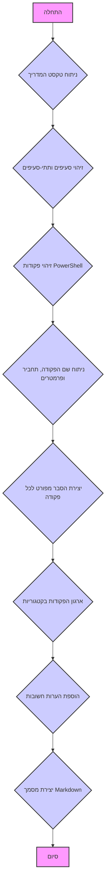

## <algorithm>

1.  **קבלת קלט**: הקלט הוא טקסט המהווה מדריך לפקודות PowerShell.
2.  **ניתוח הטקסט**: הטקסט מחולק לסעיפים ופסקאות, כאשר כל סעיף מתאר תחום מסוים בפקודות PowerShell (לדוגמה, ניווט בין קבצים, ניהול תהליכים וכו').
3.  **זיהוי פקודות**: כל פקודה מנותחת בנפרד ומזוהה כשם הפקודה (`Get-ChildItem`), התחביר שלה, הפרמטרים העיקריים והדוגמאות לשימוש.
4.  **הצגת פקודות**: כל פקודה מוצגת עם הסבר מפורט על התחביר והשימוש שלה, בפורמט ידידותי לקריאה.
5.  **ארגון הפקודות**: הפקודות מאורגנות בקטגוריות לוגיות, מה שמאפשר ניווט נוח ומהיר במדריך.
    *   דוגמה: הפקודה `Get-ChildItem` מנותחת כך:
        *   **שם**: `Get-ChildItem` (או `gci`, `ls`, `dir`)
        *   **תחביר**: `Get-ChildItem [путь] [параметры]`
        *   **פרמטרים עיקריים**:
            *   `-Path`: נתיב לקובץ או תיקייה.
            *   `-Include`: סינון שמות קבצים.
            *   `-Recurse`: סריקה רקורסיבית.
        *   **דוגמאות**:
            *   `Get-ChildItem`: הצגת קבצים בתיקייה הנוכחית.
            *   `Get-ChildItem -Path C:\\Users\\User\\Documents`: הצגת קבצים בתיקייה מסוימת.
    *   דוגמה נוספת: הפקודה `Set-Location` מנותחת כך:
        *   **שם**: `Set-Location` (או `sl`, `cd`)
        *   **תחביר**: `Set-Location [путь]`
        *   **דוגמאות**:
            *   `Set-Location C:\\Windows`: מעבר לתיקייה `C:\\Windows`.
            *   `Set-Location ..`: מעבר לתיקייה האב.
6.  **הערות**: כל סעיף מסתיים בהערות חשובות לשימוש בפקודות, כמו קונבנציות שמות, רגישות רישיות, שימוש בצינורות (pipes) ועוד.
7.  **פלט**: הפלט הוא מסמך markdown המכיל את המדריך לפקודות PowerShell, מאורגן ומובנה.

## <mermaid>

**הסבר התלויות:**
אין תלויות מיובאות. קוד ה-mermaid מתאר את תהליך העבודה של הקוד, וכל בלוק בו מייצג שלב בתהליך הניתוח וההסברה של הקוד.

## <explanation>

**ייבואים (Imports):**

*   אין ייבוא חבילות חיצוניות או פנימיות. הקוד אינו תוכנית בשפה כמו Python, אלא הוא מסמך טקסטואלי המכיל מדריך לפקודות PowerShell.

**מחלקות (Classes):**

*   אין מחלקות. הקוד הוא מסמך הדרכה ולא תוכנית מונחית עצמים.

**פונקציות (Functions):**

*   אין פונקציות. הקוד הוא מסמך הדרכה ולא תוכנית עם פונקציות מוגדרות.

**משתנים (Variables):**

*   אין משתנים. הקוד הוא מסמך הדרכה ולא תוכנית עם משתנים מוגדרים.

**הסברים מפורטים:**

1.  **מבנה המסמך:**
    *   המסמך בנוי מפסקה כללית המציגה את הכותרת הראשית: "Руководство по командам PowerShell".
    *   המסמך מחולק למספר סעיפים, כל אחד עם כותרת משלו, כמו "1. Основы навигации и работы с файлами и каталогами", "2. Управление процессами", וכו'.
    *   כל סעיף מחולק לתתי סעיפים המתארים פקודה ספציפית, כולל שם הפקודה, תחביר, פרמטרים עיקריים ודוגמאות שימוש.
2.  **תחביר הפקודות:**
    *   התחביר של כל פקודה מוצג בפורמט `שם-הפקודה [פרמטרים]`
    *   פרמטרים אופציונליים מוקפים בסוגריים מרובעות `[]`.
    *   פרמטרים עיקריים של הפקודה מוצגים תחת כותרת "Основные параметры" או תחת פרמטר מסוים.
    *   דוגמאות לשימוש בפקודות מוצגות תחת הכותרת "Примеры:" או תחת פרמטר מסוים.
3.  **דוגמאות שימוש:**
    *   הדוגמאות מספקות הבנה מעשית של אופן השימוש בפקודות. לדוגמה, עבור `Get-ChildItem`:
        *   `Get-ChildItem` - מציג קבצים ותיקיות בתיקייה הנוכחית.
        *   `Get-ChildItem -Path C:\\Users\\User\\Documents` - מציג קבצים ותיקיות בנתיב ספציפי.
    *   כל דוגמה מסבירה את הפעולה שהיא מבצעת ומדגימה את השימוש בפקודה.
4.  **הערות:**
    *   בסוף המסמך מופיעות הערות המסכמות את העקרונות החשובים בשימוש בפקודות PowerShell.
    *   ההערות כוללות מידע על מבנה שמות הפקודות, חוסר רגישות רישיות, שימוש בצינורות, wildcards ועוד.
5.  **קשר לפרויקט**:
    *   קובץ זה מהווה חלק ממדריכי העזר של הפרויקט, ומטרתו לספק למשתמשים מידע מקיף על שימוש בפקודות PowerShell.
    *   המדריך יכול להיות קשור לחלקים נוספים בפרויקט, כגון כלים או תסריטים המשתמשים בפקודות אלו.

**בעיות אפשריות או תחומים לשיפור:**

1.  **עומק הפירוט**: המדריך מספק סקירה טובה של הפקודות, אבל יכול להוסיף פירוט נוסף על פרמטרים מתקדמים יותר של הפקודות.
2.  **עדכון**: המדריך צריך להיות מעודכן על בסיס קבוע בהתאם לגרסאות החדשות של PowerShell.
3.  **חיפוש**: כדאי לשקול להוסיף אפשרות חיפוש בתוך המדריך, כדי להקל על משתמשים למצוא מידע רלוונטי במהירות.
4.  **דוגמאות נוספות**: יכולות להיות דוגמאות נוספות המציגות שימוש מעשי ומורכב יותר בפקודות השונות.

**שרשרת קשרים עם חלקים אחרים בפרויקט:**

*   קובץ זה יכול להיות חלק מתיקיית עזרה או תיקיית מדריכים.
*   ייתכן שיש קבצים אחרים בפרויקט המכילים דוגמאות ספציפיות לשימוש בפקודות אלו.
*   ייתכן שיש קבצים אחרים בפרויקט המסבירים כיצד להשתמש במדריך או בתוכנה עצמה.