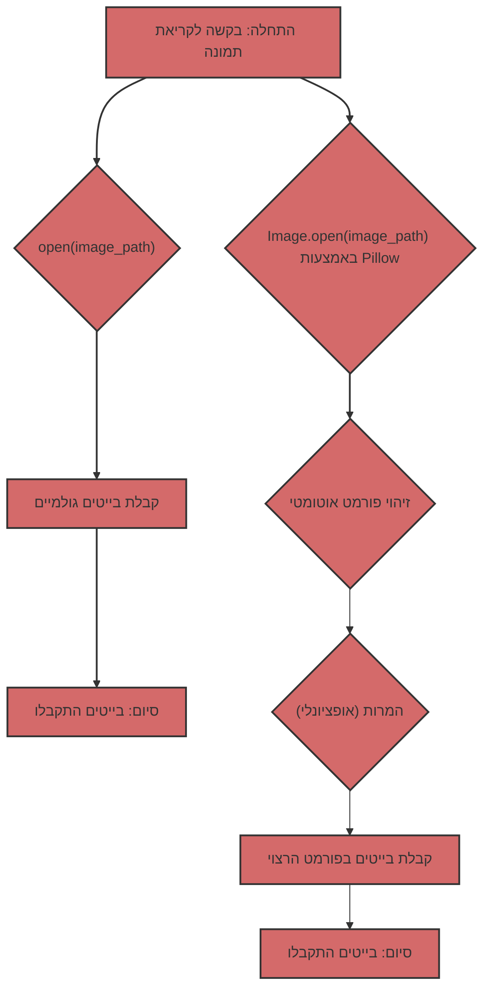

## ניתוח קוד: קריאת תמונות - בייט גולמי לעומת Pillow

הקוד שסופק משווה בין שתי גישות לקריאת קבצי תמונה ב-Python: קריאת בייט גולמי באמצעות `open()` ושימוש בספריית Pillow. הקוד מסביר את היתרונות, החסרונות והמקרים בהם כל גישה מומלצת.

### 1. <algorithm>
1. **קריאת תמונה באמצעות `open()`:**
   - מתחילים בפונקציה `read_image_bytes_direct` עם נתיב קובץ תמונה כקלט.
   - פותחים את קובץ התמונה במצב קריאה בינארי (`"rb"`) באמצעות `open()`.
   - קוראים את כל תוכן הקובץ כבייטים באמצעות `file.read()`.
   - אם הקריאה מצליחה, מחזירים את הבייטים שנקראו.
   - אם מתרחשת שגיאה, מדפיסים הודעת שגיאה ומחזירים `None`.
   - הקריאה מתבצעת ישירות, ללא עיבוד או פרשנות של פורמט התמונה.

   *דוגמה:* אם נתיב התמונה הוא `test.jpg`, הקוד קורא את כל הבייטים של הקובץ כרצף.

2.  **קריאת תמונה באמצעות Pillow:**
    - מתחילים בפונקציה `read_image_pillow` עם נתיב קובץ תמונה כקלט.
    - פותחים את קובץ התמונה באמצעות `Image.open(image_path)` מהספרייה Pillow.
    - יוצרים אובייקט `BytesIO` לשמירת הבייטים של התמונה.
    - שומרים את התמונה בפורמט JPEG לתוך `BytesIO` באמצעות `img.save()`.
    - מחזירים את הבייטים מה `BytesIO` באמצעות `img_byte_arr.getvalue()`.
    - אם מתרחשת שגיאה, מדפיסים הודעת שגיאה ומחזירים `None`.
    - Pillow מטפל בפענוח פורמט התמונה ומאפשר המרה לפורמטים אחרים, כאן JPEG.

    *דוגמה:* אם נתיב התמונה הוא `test.jpg`, Pillow מפענחת את הקובץ כ-JPEG, ממירה אותו לייצוג פנימי, ושומרת אותו כבייטים של JPEG.

3.  **קוד ראשי:**
    - בודקים אם קובץ התמונה קיים בנתיב שצוין (`test.jpg`).
    - אם הקובץ קיים, קוראים אותו באמצעות שתי הגישות.
    - מדפיסים את גודל הבייטים שנקראו בהצלחה.
    - אם הקריאה נכשלה, מדפיסים הודעת שגיאה.

    *דוגמה:* אם קובץ בשם `test.jpg` קיים, הקוד יקרא אותו פעמיים: פעם אחת כבייטים גולמיים, ופעם שנייה באמצעות Pillow.

### 2. <mermaid>

**ניתוח תלויות (imports) בתרשים:**
*   אין תלויות מיובאות שמשפיעות ישירות על התרשים. התרשים מתאר את זרימת הנתונים בין הגישות השונות.

   **הסבר על התלויות בתוך הקוד:**
*  **`pathlib`**: משמש לטיפול בנתיבי קבצים בצורה נוחה.
*  **`PIL (Pillow)`**: ספריית עיבוד תמונה, שמאפשרת פתיחת תמונות, זיהוי פורמט, המרה וגישה למטא-דאטה.
* **`io.BytesIO`**: משמש ליצירת אובייקט שמחזיק בייטים בזיכרון, שמשמש להמרה וקריאת תמונות.

### 3. <explanation>
* **ייבוא (Imports):**
    *   `from pathlib import Path`: מייבאת את המחלקה `Path` מודול `pathlib`, שמאפשר עבודה קלה עם נתיבי קבצים.
    *   `from PIL import Image`: מייבאת את המחלקה `Image` מתוך ספריית Pillow לטיפול בתמונות.
    *   `from io import BytesIO`: מייבאת את המחלקה `BytesIO` מתוך מודול `io`, שמשמשת לטיפול בבייטים בזיכרון.

* **פונקציות (Functions):**
    *   **`read_image_bytes_direct(image_path: Path) -> bytes | None`**:
        *   **פרמטר:** `image_path` מסוג `Path`, נתיב לקובץ התמונה.
        *   **ערך מוחזר:** `bytes` - בייטים של התמונה, או `None` אם יש שגיאה.
        *   **מטרה:** קריאת קובץ התמונה כבייטים גולמיים באמצעות `open()` במצב "rb".
        *   **דוגמה לשימוש:** `image_bytes = read_image_bytes_direct(Path("test.jpg"))`
    *   **`read_image_pillow(image_path: Path) -> bytes | None`**:
        *   **פרמטר:** `image_path` מסוג `Path`, נתיב לקובץ התמונה.
        *   **ערך מוחזר:** `bytes` - בייטים של התמונה בפורמט JPEG, או `None` אם יש שגיאה.
        *   **מטרה:** קריאת קובץ התמונה באמצעות Pillow, והמרת התוכן לבייטים בפורמט JPEG.
        *   **דוגמה לשימוש:** `image_bytes = read_image_pillow(Path("test.jpg"))`

*   **משתנים (Variables):**
    *   `image_path`: משתנה מסוג `Path` שמכיל את הנתיב של קובץ התמונה.
    *   `image_file`: אובייקט קובץ שנוצר באמצעות `open()` ומאפשר קריאה מהקובץ.
    *   `image_data`: משתנה מסוג `bytes` שמכיל את הבייטים הגולמיים שנקראו מקובץ התמונה.
    *   `img`: אובייקט תמונה שנוצר באמצעות Pillow.
    *   `img_byte_arr`: אובייקט `BytesIO` שבו נשמרים הבייטים של התמונה לאחר המרה.
    *   `image_bytes_direct`: משתנה מסוג `bytes` המכיל את הבייטים הגולמיים שנקראו ישירות מהקובץ.
    *   `image_bytes_pillow`: משתנה מסוג `bytes` המכיל את הבייטים שנקראו באמצעות Pillow.

*   **בעיות אפשריות או תחומים לשיפור:**
    *   **קריאה ישירה:**  אין בדיקה אם הקובץ הוא באמת קובץ תמונה. שימוש ב-`open()` לבד לא מספק אימות פורמט או מטא-דאטה.
    *   **קריאת Pillow:**  במקרה זה, הקוד ממיר תמיד ל-JPEG, זה עלול לגרום לאיבוד מידע בתמונות אחרות (כגון PNG). מומלץ לשקול שמירה בפורמט המקורי או לתת למשתמש לבחור את הפורמט.

*   **שרשרת קשרים עם חלקים אחרים בפרויקט:**
     *   הקוד יכול להיות חלק משרשרת עיבוד תמונה מורכבת יותר.
     *   הוא יכול לשמש כשלב ראשוני לפני עיבוד נתונים נוסף כמו מודלים של AI (כמו Gemini).

**סיכום:**
הקוד משווה בצורה ברורה בין שתי גישות לקריאת תמונות ומסביר מתי כל אחת מומלצת. הגישה של קריאת בייט גולמי מתאימה למקרים בהם צריך רק את הבייטים ללא עיבוד, בעוד שספריית Pillow מומלצת לכל מקרה שכולל עיבוד תמונה, זיהוי פורמט והמרה.