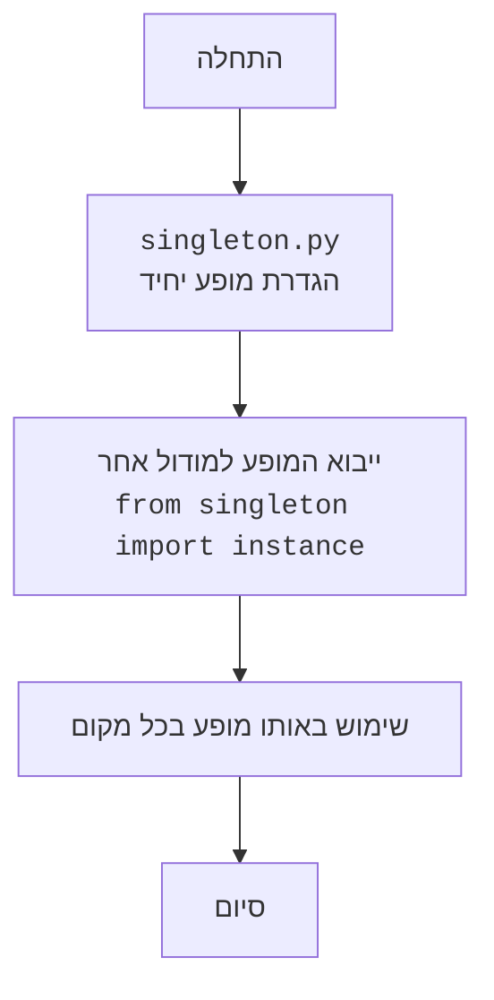

## ניתוח קוד הסינגלטון (Singleton) בפייתון

קוד זה מסביר את תבנית העיצוב סינגלטון (Singleton) בפייתון, המבטיחה שיהיה רק מופע אחד של מחלקה מסוימת בכל זמן נתון. הוא מספק דוגמאות שונות ליישום התבנית באמצעות שיטות שונות:

1.  שימוש בשיטת `__new__`.
2.  שימוש בדקורטור.
3.  שימוש במטא-מחלקה.
4.  שימוש במודול.

### 1. <algorithm>

**1. סינגלטון באמצעות `__new__`**

   1.  **התחלה**: יצירת מחלקה בשם `Singleton` עם מאפיין מחלקה `_instance` שמאותחל ל-`None`.
   2.  **שיטת `__new__`**:
      *   פונקציה זו נקראת לפני יצירת מופע חדש.
      *   בדיקה: אם `_instance` הוא `None` (האם קיים כבר מופע).
         *   **אם לא**: יצירת מופע חדש של המחלקה באמצעות `super().__new__(cls, *args, **kwargs)`, ושמירת המופע ב-`_instance`.
         *   **אם כן**: דילוג על יצירת מופע חדש.
      *   החזרת המופע השמור ב-`_instance`.
   3.  **שימוש**: יצירת שני מופעים של המחלקה, `s1` ו-`s2`.
   4.  **בדיקה**: השוואת הזהות של `s1` ו-`s2`. בגלל תכונת הסינגלטון, הם יהיו זהים.

**דוגמה:**

```
  class Singleton:
        _instance = None

        def __new__(cls, *args, **kwargs):
            if not cls._instance:
                cls._instance = super().__new__(cls, *args, **kwargs)
            return cls._instance

  s1 = Singleton()
  s2 = Singleton()
  print(s1 is s2) # הפלט יהיה True
```

**2. סינגלטון באמצעות דקורטור**

   1.  **התחלה**: הגדרת פונקציה דקורטור בשם `singleton`.
   2.  **דקורטור `singleton`**:
      *   יצירת מילון ריק בשם `instances` לאחסון מופעים של מחלקות.
      *   הגדרת פונקציה פנימית בשם `wrapper` (עטיפה).
      *   בתוך `wrapper`:
          *   בדיקה: האם המחלקה `cls` נמצאת במילון `instances`.
            *   **אם לא**: יצירת מופע חדש של המחלקה ושמירה במילון `instances` עם המפתח `cls`.
            *   **אם כן**: דילוג על יצירת מופע חדש.
          *   החזרת המופע השמור במילון `instances` עבור `cls`.
      *   החזרת הפונקציה `wrapper`.
   3.  **שימוש**: שימוש בדקורטור `@singleton` על מחלקה בשם `MyClass`.
   4.  **יצירת מופעים**: יצירת שני מופעים של המחלקה, `obj1` ו-`obj2`.
   5.  **בדיקה**: השוואת הזהות של `obj1` ו-`obj2`. בגלל תכונת הסינגלטון, הם יהיו זהים.

**דוגמה:**

```
def singleton(cls):
    instances = {}
    def wrapper(*args, **kwargs):
        if cls not in instances:
            instances[cls] = cls(*args, **kwargs)
        return instances[cls]
    return wrapper

@singleton
class MyClass:
    pass

obj1 = MyClass()
obj2 = MyClass()
print(obj1 is obj2)  # הפלט יהיה True
```

**3. סינגלטון באמצעות מטא-מחלקה**

   1.  **התחלה**: יצירת מטא-מחלקה בשם `SingletonMeta` היורשת מ-`type`.
   2.  **במטא-מחלקה `SingletonMeta`**:
      *   יצירת מאפיין מחלקה בשם `_instances` שהוא מילון ריק.
      *   הגדרת שיטת `__call__`, שנקראת כאשר מנסים ליצור מופע חדש של המחלקה.
          *   בדיקה: האם המחלקה `cls` נמצאת במילון `_instances`.
              *   **אם לא**: יצירת מופע חדש של המחלקה ושמירה במילון `_instances` עם המפתח `cls`.
              *   **אם כן**: דילוג על יצירת מופע חדש.
          *   החזרת המופע השמור במילון `_instances` עבור `cls`.
   3.  **שימוש**: יצירת מחלקה בשם `Singleton` עם הגדרת המטא-מחלקה שלה ל-`SingletonMeta`.
   4.  **יצירת מופעים**: יצירת שני מופעים של המחלקה, `s1` ו-`s2`.
   5.  **בדיקה**: השוואת הזהות של `s1` ו-`s2`. בגלל תכונת הסינגלטון, הם יהיו זהים.

**דוגמה:**

```
class SingletonMeta(type):
    _instances = {}
    def __call__(cls, *args, **kwargs):
        if cls not in cls._instances:
            cls._instances[cls] = super().__call__(*args, **kwargs)
        return cls._instances[cls]

class Singleton(metaclass=SingletonMeta):
    pass

s1 = Singleton()
s2 = Singleton()
print(s1 is s2)  # הפלט יהיה True
```

**4. סינגלטון באמצעות מודול**

   1.  **הגדרה**: יצירת מודול (קובץ `singleton.py`) עם מחלקה בשם `Singleton` ומופע יחיד שלה בשם `instance`.
   2.  **שימוש**: ייבוא המופע `instance` במודול אחר.
   3.  **יצירת משתנים**: יצירת שני משתנים `obj1` ו-`obj2`, שניהם מצביעים לאותו מופע `instance`.
   4.  **בדיקה**: השוואת הזהות של `obj1` ו-`obj2`. בגלל תכונת הסינגלטון (מכיוון ששניהם מצביעים על אותו מופע), הם יהיו זהים.

**דוגמה:**

```
# file singleton.py
class Singleton:
    pass
instance = Singleton()
```
```
# in another file
from singleton import instance
obj1 = instance
obj2 = instance
print(obj1 is obj2)  # הפלט יהיה True
```

### 2. <mermaid>

**תרשים זרימה למימוש סינגלטון באמצעות `__new__`:**

```mermaid
flowchart TD
    Start1[התחלה] --> CheckInstance1{האם קיים מופע?}
    CheckInstance1 -- לא --> CreateInstance1[יצירת מופע חדש<br><code>cls._instance = super().__new__(cls, *args, **kwargs)</code>]
    CheckInstance1 -- כן --> ReturnInstance1[החזרת המופע הקיים<br><code>return cls._instance</code>]
    CreateInstance1 --> ReturnInstance1
    ReturnInstance1 --> End1[סיום]
```

**תרשים זרימה למימוש סינגלטון באמצעות דקורטור:**

```mermaid
flowchart TD
    Start2[התחלה] --> CheckInstance2{האם קיים מופע?<br><code>cls not in instances</code>}
    CheckInstance2 -- לא --> CreateInstance2[יצירת מופע חדש<br><code>instances[cls] = cls(*args, **kwargs)</code>]
    CheckInstance2 -- כן --> ReturnInstance2[החזרת המופע הקיים<br><code>return instances[cls]</code>]
    CreateInstance2 --> ReturnInstance2
    ReturnInstance2 --> End2[סיום]
```

**תרשים זרימה למימוש סינגלטון באמצעות מטא-מחלקה:**

```mermaid
flowchart TD
    Start3[התחלה] --> CheckInstance3{האם קיים מופע?<br><code>cls not in cls._instances</code>}
    CheckInstance3 -- לא --> CreateInstance3[יצירת מופע חדש<br><code>cls._instances[cls] = super().__call__(*args, **kwargs)</code>]
     CheckInstance3 -- כן --> ReturnInstance3[החזרת המופע הקיים<br><code>return cls._instances[cls]</code>]
    CreateInstance3 --> ReturnInstance3
    ReturnInstance3 --> End3[סיום]
```

**תרשים זרימה למימוש סינגלטון באמצעות מודול:**



**ניתוח תלויות:**

*   **`__new__`**: אין תלויות חיצוניות, משתמש במנגנון מובנה של פייתון.
*   **דקורטור**: אין תלויות חיצוניות, משתמש ביכולות הדקורטור של פייתון.
*   **מטא-מחלקה**: אין תלויות חיצוניות, משתמש ביכולות המטא-מחלקה של פייתון.
*   **מודול**: אין תלויות חיצוניות, משתמש במנגנון ייבוא מובנה של פייתון.

### 3. <explanation>

**1. ייבואים (Imports):**

*   אין ייבוא ספציפי בקוד זה, הקוד משתמש בפונקציות וביכולות מובנות של פייתון.

**2. מחלקות (Classes):**

*   **`Singleton` (בגישת `__new__`)**:
    *   **תפקיד**: מימוש של תבנית הסינגלטון באמצעות שיטה מיוחדת של פייתון (`__new__`).
    *   **מאפיינים**:
        *   `_instance`: מאפיין מחלקה סטטי המשמש לאחסון המופע היחיד של המחלקה.
    *   **שיטות**:
        *   `__new__(cls, *args, **kwargs)`: שיטה שנקראת לפני יצירת מופע חדש. היא בודקת אם כבר קיים מופע ויוצרת אותו אם לא.
    *   **אינטראקציה**: משתמשים במחלקה זו על ידי יצירת "מופע", אך תמיד יוחזר אותו מופע.
*   **`MyClass` (בגישת דקורטור)**:
    *   **תפקיד**: מחלקה שמשמשת דוגמה לשימוש בדקורטור הסינגלטון.
    *   **מאפיינים**: אין מאפיינים ספציפיים (ניתן להוסיף בהמשך).
    *   **שיטות**: אין שיטות ספציפיות.
    *   **אינטראקציה**: המחלקה הזו מיושמת באמצעות דקורטור הסינגלטון `singleton` והופכת לסינגלטון.
*    **`SingletonMeta` (בגישת מטא-מחלקה)**:
    *   **תפקיד**: מימוש תבנית סינגלטון באמצעות מטא-מחלקה, השולטת ביצירת המחלקות.
    *   **מאפיינים**:
        *   `_instances`: מאפיין מחלקה סטטי המשמש לאחסון המופעים של מחלקות הסינגלטון.
    *   **שיטות**:
        *   `__call__(cls, *args, **kwargs)`: שיטה שנקראת כאשר מנסים ליצור מופע של המחלקה שהמטא-מחלקה שלה היא `SingletonMeta`. בודקת אם כבר קיים מופע ויוצרת אותו אם לא.
    *   **אינטראקציה**: המטא-מחלקה משפיעה על אופן יצירת המחלקה `Singleton`.
*   **`Singleton` (בגישת מטא-מחלקה)**:
    *   **תפקיד**: מחלקה שהופכת לסינגלטון באמצעות המטא-מחלקה `SingletonMeta`.
    *   **מאפיינים**: אין מאפיינים ספציפיים (ניתן להוסיף בהמשך).
    *   **שיטות**: אין שיטות ספציפיות.
    *   **אינטראקציה**: יצירת מופעים של מחלקה זו תמיד תחזיר את אותו מופע.

**3. פונקציות (Functions):**

*   **`singleton(cls)` (דקורטור)**:
    *   **פרמטרים**: `cls` - המחלקה שאותה יש להפוך לסינגלטון.
    *   **ערך מוחזר**: פונקציה `wrapper` שהיא "עטיפה" של המחלקה.
    *   **מטרה**: דקורטור שהופך כל מחלקה שמקבלת אותו לסינגלטון.
    *   **דוגמאות שימוש**: `@singleton` מעל מחלקה כמו `MyClass`.
*   **`wrapper(*args, **kwargs)` (פונקציה פנימית בדקורטור)**:
    *   **פרמטרים**: `*args` ו-`**kwargs` - הפרמטרים המועברים לקונסטרוקטור של המחלקה.
    *   **ערך מוחזר**: מופע של המחלקה, או המופע הקיים אם הוא כבר נוצר.
    *   **מטרה**: לוודא שיש רק מופע אחד של המחלקה.
    *   **דוגמאות שימוש**: קריאה לקונסטרוקטור של המחלקה.

**4. משתנים (Variables):**

*   **`_instance` (בגישת `__new__` ובמטא-מחלקה):** משתנה מחלקה סטטי, המכיל את המופע היחיד של המחלקה, תחילה מאותחל ל-`None`.
*   **`instances` (בדקורטור)**: מילון שמאחסן את המופעים של המחלקות השונות שעושות שימוש בדקורטור `singleton`.
*   **`obj1`, `obj2`, `s1`, `s2`:** משתנים המשמשים לבדיקה, מאחסנים מופעים של מחלקות הסינגלטון.

**בעיות אפשריות או תחומים לשיפור:**

*   **גמישות**: השימוש בסינגלטון יכול לפגוע בגמישות של הקוד, מאחר והוא יוצר תלות גלובלית.
*   **בדיקות**: סינגלטונים יכולים להקשות על בדיקות יחידה, מאחר וקשה להחליף אותם ב-mock.
*   **ריבוי תהליכים**: הקוד שהוצג אינו עמיד במצבים של ריבוי תהליכים (multiprocessing) מאחר והמילונים והמשתנים הסטטים משותפים רק בין threads ולא בין processes.
*   **אי תלות**: במקרים מסוימים סינגלטון גורם להפרה של עיקרון האחריות היחידה.

**שרשרת קשרים עם חלקים אחרים בפרויקט (אם רלוונטי):**

*   לרוב, סינגלטון משמש עבור ניהול משאבים גלובליים כמו הגדרות תצורה, חיבור למסד נתונים, מנגנון לוגינג וכדומה.
*   סינגלטון משמש כשכבה נמוכה, ולכן בדרך כלל לא תהיה תלות בו מחלקות אחרות. אלא תלות של מחלקות אחרות בו.

בסה"כ, הקוד מספק הסבר מפורט על תבנית העיצוב סינגלטון ודוגמאות יישומיות שונות שלה בפייתון, עם יתרונות וחסרונות שיש לקחת בחשבון בבחירה ביישום זה.